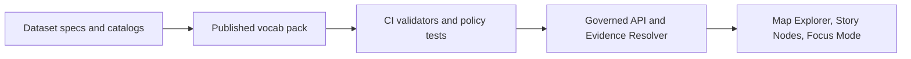

<!-- [KFM_META_BLOCK_V2]
doc_id: kfm://doc/1e1c9d0e-9a9a-4e6c-9a0c-6b9f2a4a7f5e
title: Published Controlled Vocabularies
type: standard
version: v1
status: draft
owners: TBD
created: 2026-03-02
updated: 2026-03-02
policy_label: public
related:
  - data/specs/vocab/
  - data/specs/vocab/published/
tags: [kfm, vocab, governance, specs]
notes:
  - This README documents the contract for the published vocabulary pack used by CI + runtime.
  - Replace TBD owners with CODEOWNERS-aligned team once known.
[/KFM_META_BLOCK_V2] -->

# Published Controlled Vocabularies
Authoritative, versioned vocabulary lists used across KFM **CI gates** and **governed runtime** (API, Evidence Resolver, UI).


> [!WARNING]
> This folder is intended to be **stable and referenced by validators**. Treat edits as governance changes:
> review + tests + version notes. If you’re unsure, fail closed and route through governance review.

---

## Quick nav
- [Purpose](#purpose)
- [Where this fits](#where-this-fits)
- [What belongs here](#what-belongs-here)
- [What must NOT go here](#what-must-not-go-here)
- [Vocab registry](#vocab-registry)
- [Change process](#change-process)
- [Compatibility rules](#compatibility-rules)
- [Minimum verification steps](#minimum-verification-steps)
- [Appendix: recommended file shapes](#appendix-recommended-file-shapes)

---

## Purpose
KFM uses controlled vocabularies to make:
- validation strict (schemas + CI)
- policy behavior explicit and testable
- UI trust surfaces consistent (badges/labels)
- evidence resolution deterministic (kinds/zones)

This directory is the **published pack**: the set of vocab values that downstream tooling should treat as canonical.

[Back to top](#published-controlled-vocabularies)

---

## Where this fits
This is a **data-side contract surface** in the repository:

- `data/specs/...` is where pipeline-facing specs and registries live.
- `data/specs/vocab/published/...` is the **promoted** (stable) vocabulary pack.



> [!NOTE]
> Sibling staging folders (e.g., `draft/`, `work/`) may exist in your repo, but are not assumed by this README.
> If they do exist, only **promoted** vocabulary sets should land in `published/`.

[Back to top](#published-controlled-vocabularies)

---

## What belongs here
**Machine-readable** controlled vocabularies that are:
- referenced by schemas and/or validators
- used by CI promotion gates
- used by runtime policy checks and evidence bundling
- stable enough to be relied on by UI rendering and audit/receipts

Typical contents (illustrative — adjust to actual repo files):

```text
data/specs/vocab/published/
  README.md
  policy_label.(json|yaml)
  artifact.zone.(json|yaml)
  citation.kind.(json|yaml)
  vocab.index.(json|yaml)        # optional registry/manifest for tooling
```

[Back to top](#published-controlled-vocabularies)

---

## What must NOT go here
- free-form taxonomies that aren’t enforced anywhere (put those in `draft/` or a domain-specific workspace)
- dataset-specific categorical values (those belong in the dataset’s own spec or dictionary)
- anything containing credentials, private keys, or sensitive location coordinates
- ad-hoc enums that bypass governance (if it affects policy or validation, it must be reviewed + tested)

[Back to top](#published-controlled-vocabularies)

---

## Vocab registry
> The minimal set below is the current baseline vocabulary surface KFM expects to be versioned and maintained.

| Vocab ID | Purpose | Example values | Notes |
|---|---|---|---|
| `policy_label` | Primary access/sensitivity classification used for policy decisions and UI badges | `public`, `public_generalized`, `restricted`, `restricted_sensitive_location`, `internal`, `embargoed`, `quarantine` | Treat additions as **policy changes**. New labels should default-deny until policy fixtures are updated. |
| `artifact.zone` | Lifecycle zone label for artifacts and provenance | `raw`, `work`, `processed`, `catalog`, `published` | Used to make truth-path stage explicit in receipts/provenance. |
| `citation.kind` | Evidence reference types used by evidence resolution | `dcat`, `stac`, `prov`, `doc`, `graph`, `url` | Prefer resolvable refs; `url` is discouraged. |

[Back to top](#published-controlled-vocabularies)

---

## Change process
Changes to published vocabularies are governance-sensitive because they can affect:
- CI outcomes (validation and promotion gates)
- runtime allow/deny behavior
- what the UI displays (labels/badges)
- evidence resolver “kind” behavior and auditability

### Required PR checklist
- [ ] Update the relevant vocab file(s)
- [ ] Update any schema enums or validator fixtures that consume the vocab
- [ ] Update policy fixtures/tests if `policy_label` changes
- [ ] Add/adjust “golden” tests so CI fails if vocab drift occurs
- [ ] Add release notes / changelog entry (at least: what changed + why + compatibility impact)

> [!TIP]
> If you’re adding a new `policy_label`, treat it as a **default-deny** label until an explicit allow rule + obligations
> are defined and tested.

[Back to top](#published-controlled-vocabularies)

---

## Compatibility rules
### Breaking vs non-breaking
**Breaking (avoid, requires explicit migration plan):**
- removing a value that is already present in published specs, catalogs, or receipts
- renaming a value (same as remove+add)
- changing meaning of a value used by policy

**Non-breaking (preferred):**
- adding a new value (with default-deny posture where applicable)
- deprecating a value while keeping it accepted for a period

### Deprecation pattern (recommended)
Instead of removing values immediately, mark them deprecated with metadata (example fields):
- `deprecated: true`
- `deprecated_since: YYYY-MM-DD`
- `replacement: <new_value>`
- `notes: <why>`

[Back to top](#published-controlled-vocabularies)

---

## Minimum verification steps
Because repo reality can differ, do these checks before wiring tooling to this folder:

1. Confirm the **actual file names and formats** present in this directory.
2. Confirm which CI jobs consume these vocabularies (schema validation, policy tests, catalog validators).
3. Confirm how runtime loads vocab (bundled at build time vs loaded from repo vs embedded in schemas).
4. Confirm CODEOWNERS / ownership for governance review routing.

If any of the above is unclear, treat changes as **restricted** and route through governance review.

[Back to top](#published-controlled-vocabularies)

---

## Appendix: recommended file shapes
These are **recommended** shapes to keep vocabularies both human- and machine-friendly.

### Option A: simple list (YAML)
- best when you only need enums

Example:
- `values: [public, restricted, ...]`

### Option B: annotated entries (JSON/YAML)
- best when you need `since`, `deprecated`, or richer docs

Example entry fields:
- `value`
- `description`
- `since`
- `deprecated`
- `replacement`

> [!NOTE]
> Choose one shape and keep it consistent across vocab files so validators can be generic.

[Back to top](#published-controlled-vocabularies)
