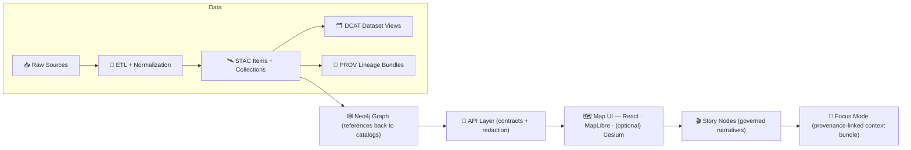

<div align="center">

# 🛰️ STAC Catalog — `data/stac/`


**KFM’s canonical asset metadata boundary** ✨  
STAC makes **renderable + time-filterable + citeable** geospatial assets discoverable—**without** shipping the raw/processed bytes in this folder.

</div>

---

## 🚀 Quick links

- 🧺 **Collections (dataset/layer-level)** → [`./collections/`](./collections/)
- 📦 **Items (granule/asset-level)** → [`./items/`](./items/)
- 🧭 *(Optional)* Root STAC Catalog → `./catalog.json` *(if adopted; recommended for external tooling)*

Neighbor boundaries:
- 🗂️ **DCAT (dataset discovery)** → [`../catalog/dcat/`](../catalog/dcat/)
- 🧬 **PROV (lineage bundles)** → [`../prov/`](../prov/)
- 📦 **Processed outputs (real files)** → [`../processed/`](../processed/)
- 🕸️ **Graph exports (if present)** → [`../graph/`](../graph/)
- 🧷 **Catalog stage overview (if present)** → [`../catalog/README.md`](../catalog/README.md)

> [!TIP]
> **STAC** = “asset index for maps + time” (items/assets/geometry/time).  
> **DCAT** = “dataset landing metadata for portals/harvesters” (title/license/access).  
> **PROV** = “why we trust it” (inputs → activity → outputs → agents).  
> These are required **boundary artifacts** before data is considered “published.”:contentReference[oaicite:0]{index=0}

---

<details>
<summary><b>🧭 Table of contents</b></summary>

- [🎯 What this folder is (and is not)](#-what-this-folder-is-and-is-not)
- [🧱 Where STAC fits in the KFM pipeline](#-where-stac-fits-in-the-kfm-pipeline)
- [🧨 Non-negotiables (KFM invariants)](#-non-negotiables-kfm-invariants)
- [🗂️ Folder layout](#️-folder-layout)
- [🏷️ IDs & determinism](#️-ids--determinism)
- [🧺 Collections](#-collections)
- [📦 Items](#-items)
- [🧰 Assets](#-assets)
- [🔗 Cross-layer linkage](#-cross-layer-linkage-stac--dcat--prov--graph)
- [⏱️ Time + timeline readiness](#️-time--timeline-readiness)
- [🧊 High-performance tile packages](#-high-performance-tile-packages)
- [✅ Add or update a dataset](#-add-or-update-a-dataset-checklist)
- [🧪 Validation & CI expectations](#-validation--ci-expectations)
- [🛡️ Governance & safety](#️-governance--safety)
- [📚 Reference shelf](#-reference-shelf)
- [🕰️ Version history](#️-version-history)

</details>

---

## 🎯 What this folder is (and is not)

### ✅ `data/stac/` **IS**
- 🛰️ The canonical location for **STAC Collections + Items** generated at publication time.:contentReference[oaicite:1]{index=1}
- 🧭 The machine-readable “what exists + where it is + when it applies” index the map/timeline depend on.:contentReference[oaicite:2]{index=2}
- 🧾 A governance surface: metadata includes **license/providers/coverage** and can be validated in CI.:contentReference[oaicite:3]{index=3}

### ❌ `data/stac/` is **NOT**
- 📦 The place where actual rasters/vectors/tables live → those belong in `data/processed/**` (or governed external storage).:contentReference[oaicite:4]{index=4}
- 🗂️ A replacement for DCAT (dataset discovery + distributions) or PROV (lineage + reproducibility).:contentReference[oaicite:5]{index=5}
- 🧨 A place for ad‑hoc “just this once” metadata fields → extend profiles + schemas instead.:contentReference[oaicite:6]{index=6}

> [!IMPORTANT]
> KFM treats STAC/DCAT/PROV as **boundary artifacts** consumed downstream (Graph → API → UI → Story → Focus).  
> If metadata is missing, the dataset is not “shippable.”:contentReference[oaicite:7]{index=7}

---

## 🧱 Where STAC fits in the KFM pipeline

KFM order is strict (no shortcuts): **Raw → ETL → Catalogs → Graph → API → UI → Story Nodes → Focus Mode**.:contentReference[oaicite:8]{index=8}


:contentReference[oaicite:9]{index=9}:contentReference[oaicite:10]{index=10}

---

## 🧨 Non-negotiables (KFM invariants)

1) **Boundary artifacts first**  
   STAC + DCAT + PROV must exist before Graph/API/UI consume a dataset.:contentReference[oaicite:11]{index=11}

2) **Deterministic + idempotent catalog builds**  
   Reruns with unchanged inputs should produce stable IDs and diff-stable JSON (ordering, formatting, IDs).

3) **API boundary rule**  
   The UI consumes data via the API layer (contracts + redaction), not by “reaching into” Neo4j or file paths.:contentReference[oaicite:12]{index=12}:contentReference[oaicite:13]{index=13}

4) **Metadata completeness is a ship-stopper**  
   CI should fail if STAC JSON is missing license/providers or has broken links.:contentReference[oaicite:14]{index=14}

5) **Profile-governed extensions only**  
   If you need custom fields, extend the KFM STAC profile and schemas—don’t invent one-offs.:contentReference[oaicite:15]{index=15}

6) **Classification never downgrades**  
   Derived outputs can still leak sensitive information. Treat classification as propagating.

---

## 🗂️ Folder layout

Canonical STAC output paths in KFM:

```text
📁 data/
└── 📁 stac/
    ├── 📄 README.md
    ├── 📄 catalog.json                     # optional: root catalog (recommended)
    ├── 📁 collections/                     # 🧺 STAC Collections (dataset/layer level)
    │   └── 📄 <collection-id>.json
    └── 📁 items/                           # 📦 STAC Items (asset/granule level)
        └── 📁 <collection-id>/
            └── 📄 <item-id>.json
```

> [!NOTE]
> KFM’s publication step writes STAC records to **`data/stac/collections/`** and **`data/stac/items/`**.:contentReference[oaicite:16]{index=16}

---

## 🏷️ IDs & determinism

### ✅ Dataset IDs (canonical join key)
KFM uses dataset IDs that encode region, theme, time range, and version:

```text
kfm.<state|region>.<theme>.<year_range>.v<version>
# example:
kfm.ks.landcover.2000_2020.v1
```

This ID is commonly used in file names, STAC IDs, and database keys for traceability.:contentReference[oaicite:17]{index=17}

### ✅ Collection IDs (recommended)
Prefer a stable mapping from dataset_id:

```text
<dataset_id>  (or a hyphenated variant if required by tooling)
# example (hyphenated):
kfm-ks-landcover-2000-2020-v1
```

### ✅ Item IDs (recommended)
Derive from stable dimensions:

- `<collection-id>__<YYYY>`  
- `<collection-id>__<YYYY-MM>`  
- `<collection-id>__<tile>__<YYYY-MM-DD>`  
- `<collection-id>__run-<run-id>` *(for run-scoped artifacts)*

> [!TIP]
> “Boring IDs” are a feature. They make Graph joins stable, cache keys stable, and story evidence stable.

---

## 🧺 Collections

A Collection is the **layer/dataset-level** entry a UI layer registry can point at.

### Practical must-haves (baseline)
- `stac_version`
- `type: "Collection"`
- `id`, `title`, `description`
- `license` (be explicit and compatible)
- `extent` (spatial + temporal)
- `providers` (recommended; often required by profile)
- `links` (at least `self`; add `root` if you use `catalog.json`)

> [!IMPORTANT]
> Licensing clarity is a trust requirement—metadata should make “what can I do with this?” answerable.:contentReference[oaicite:18]{index=18}

<details>
<summary><strong>📄 Minimal Collection skeleton (example)</strong></summary>

```json
{
  "stac_version": "1.0.0",
  "type": "Collection",
  "id": "kfm-ks-landcover-2000-2020-v1",
  "title": "Kansas Landcover (2000–2020) — v1",
  "description": "Landcover layer for Kansas with year coverage 2000–2020.",
  "license": "CC-BY-4.0",
  "extent": {
    "spatial": { "bbox": [[-102.051, 36.993, -94.588, 40.003]] },
    "temporal": { "interval": [["2000-01-01T00:00:00Z", "2020-12-31T23:59:59Z"]] }
  },
  "providers": [
    { "name": "Kansas Frontier Matrix", "roles": ["processor"] }
  ],
  "links": [
    { "rel": "self", "href": "./collections/kfm-ks-landcover-2000-2020-v1.json", "type": "application/json" }
  ]
}
```

</details>

---

## 📦 Items

An Item is a **specific instance** (time slice, tile, AOI, or artifact) that points to assets.

### Practical must-haves (baseline)
- `stac_version`
- `type: "Feature"`
- `id`
- `collection`
- `geometry` + `bbox` *(WGS84 lon/lat for web integration)*:contentReference[oaicite:19]{index=19}
- `properties.datetime` **or** `start_datetime` + `end_datetime`
- `assets` (hrefs must resolve)
- `links` (`self`, `collection`, plus docs/prov hooks as adopted)

<details>
<summary><strong>📄 Minimal Item skeleton (example)</strong></summary>

```json
{
  "stac_version": "1.0.0",
  "type": "Feature",
  "id": "kfm-ks-landcover-2000-2020-v1__2010",
  "collection": "kfm-ks-landcover-2000-2020-v1",
  "geometry": {
    "type": "Polygon",
    "coordinates": [[[ -102.051, 36.993 ], [ -94.588, 36.993 ], [ -94.588, 40.003 ], [ -102.051, 40.003 ], [ -102.051, 36.993 ]]]
  },
  "bbox": [-102.051, 36.993, -94.588, 40.003],
  "properties": {
    "datetime": "2010-01-01T00:00:00Z"
  },
  "assets": {
    "cog": {
      "href": "../processed/landcover/v1/2010_landcover.cog.tif",
      "type": "image/tiff; application=geotiff",
      "roles": ["data"]
    },
    "thumbnail": {
      "href": "../processed/landcover/v1/preview_2010.png",
      "type": "image/png",
      "roles": ["thumbnail"]
    }
  },
  "links": [
    { "rel": "self", "href": "./items/kfm-ks-landcover-2000-2020-v1/kfm-ks-landcover-2000-2020-v1__2010.json", "type": "application/json" },
    { "rel": "collection", "href": "../../collections/kfm-ks-landcover-2000-2020-v1.json", "type": "application/json" }
  ]
}
```

</details>

---

## 🧰 Assets

### “Boringly reliable” formats (KFM preference)
KFM’s data format standards favor web- and GIS-friendly, durable formats (examples include GeoJSON, Cloud‑Optimized GeoTIFF (COG), and Parquet).:contentReference[oaicite:20]{index=20}

Common STAC asset types you’ll see in KFM:
- 🗺️ **COG**: `image/tiff; application=geotiff`
- 🧭 **GeoJSON**: `application/geo+json`
- 🧱 **GeoParquet/Parquet**: `application/x-parquet` *(profile/tooling dependent)*
- 🧩 **PMTiles** (vector tiles): `application/x-protomaps-pmtiles` *(if adopted)*
- 🧾 **TileJSON**: `application/json`
- 🖼️ **Previews/thumbnails**: `image/png` / `image/jpeg`
- 🧷 **Legend / style**: `application/json` *(style spec), `image/png` *(legend image)*

### Web-grade vs analysis-grade (recommended)
When you produce both:
- **analysis-grade** → high fidelity (GeoParquet, full-res COG, full schema)
- **web-grade** → optimized for UI (PMTiles, downsampled COG overview, thumbnails)

Use STAC `roles` and `title/description` to make this obvious.

### Integrity hints (recommended)
If your profile supports it:
- add checksums (sha256) and byte sizes
- keep assets immutable once published

> [!TIP]
> Deterministic assets + checksums turn STAC into a tamper-evident index (and make debugging CI much faster).

---

## 🔗 Cross-layer linkage (STAC ↔ DCAT ↔ PROV ↔ Graph)

KFM expects catalogs to **cross-reference cleanly** so nothing downstream “drifts.”

### Cross-reference matrix

| Layer | Lives in | Must reference | Why |
|---|---|---|---|
| 🛰️ STAC | `data/stac/**` | real assets (files/endpoints), license/providers, time/space | map + timeline discovery |
| 🗂️ DCAT | `data/catalog/dcat/**` | dataset landing + access/distribution URLs | harvesting + dataset inventory |
| 🧬 PROV | `data/prov/**` | inputs → activity → outputs → agents | reproducibility + trust |
| 🕸️ Graph | Neo4j / exports | stable IDs back to catalogs | relationships without payload duplication |

Graph must reference catalogs; it’s not the catalog.:contentReference[oaicite:21]{index=21}

### Recommended “KFM hooks” (only if your profile allows)
Prefer a small, consistent namespace (example: `kfm:*`) and validate via schemas:
- `kfm:dataset_id` (canonical join key)
- `kfm:dcat_ref` (DCAT dataset identifier/path)
- `kfm:prov_ref` (PROV bundle/activity id/path)
- `kfm:run_id` (ETL run identifier)
- `kfm:classification` / `kfm:sensitivity`
- `kfm:quality` / `kfm:uncertainty` *(especially for AI/derived artifacts)*

> [!CAUTION]
> If you need custom metadata beyond base profiles, **extend KFM STAC/DCAT profiles** (review + schemas) instead of creating one-off fields.:contentReference[oaicite:22]{index=22}

---

## ⏱️ Time + timeline readiness

KFM’s UI and API patterns assume **temporal fields are correct**. Timeline behavior depends on STAC item dates.

- The API layer can use STAC date fields to filter datasets by date range.:contentReference[oaicite:23]{index=23}
- If a dataset is meant to appear in a timeline, each Item must have valid `datetime` (or `start/end`) and the Collection’s temporal extent must match.

### Timeline checklist ✅
- [ ] All timeline Items have valid ISO timestamps
- [ ] No silent timezone ambiguity (use Z / UTC)
- [ ] Collection temporal extent covers all items
- [ ] UI-friendly: include a thumbnail/preview for fast scrubbing

---

## 🧊 High-performance tile packages

KFM proposals include a “two-path publish” pattern for large spatial datasets:
- **GeoParquet** for analytics + server-side processing
- **PMTiles** for fast, offline-ish web streaming
- plus **STAC Collection + DCAT record**, with hashes for traceability:contentReference[oaicite:24]{index=24}

If adopted, reflect this clearly in STAC assets:
- `assets.parquet` → GeoParquet
- `assets.pmtiles` → PMTiles
- `assets.tilejson` → TileJSON endpoint (optional)
- `assets.thumbnail` → quick UI preview

---

## ✅ Add or update a dataset (checklist)

### 0) Confirm the “real data” location
- [ ] Outputs are in `data/processed/<domain>/...` (or governed external storage).:contentReference[oaicite:25]{index=25}

### 1) Create/update the Collection
- [ ] `data/stac/collections/<collection-id>.json`
- [ ] Includes: `license`, `extent`, `providers`, required extensions

### 2) Create/update Item(s)
- [ ] `data/stac/items/<collection-id>/<item-id>.json`
- [ ] Assets `href` resolve (no broken links)
- [ ] Temporal metadata is correct (timeline readiness)
- [ ] Geometry/bbox are valid *(or intentionally generalized/withheld per governance)*

### 3) Create/update boundary siblings
- [ ] DCAT dataset entry exists (`data/catalog/dcat/…`).:contentReference[oaicite:26]{index=26}
- [ ] PROV bundle exists (`data/prov/…`).:contentReference[oaicite:27]{index=27}
- [ ] Cross-refs (`kfm:dcat_ref`, `kfm:prov_ref`) resolve if used

### 4) Downstream (only after boundary artifacts exist)
- [ ] Graph references catalog IDs (no heavy payload duplication).:contentReference[oaicite:28]{index=28}
- [ ] UI uses API responses (contracts + redaction).:contentReference[oaicite:29]{index=29}

---

## 🧪 Validation & CI expectations

### Local sanity checks
```bash
python -m json.tool data/stac/collections/<collection-id>.json > /dev/null
python -m json.tool data/stac/items/<collection-id>/<item-id>.json > /dev/null
```

### STAC validation (preferred)
If you use `pystac`:

```bash
pystac validate data/stac/collections/<collection-id>.json
pystac validate data/stac/items/<collection-id>/<item-id>.json
```

### CI must treat catalog failures as contract failures
KFM QA guidance explicitly calls out Catalog QA checks (e.g., fail a PR if STAC JSON is missing license or has broken links).:contentReference[oaicite:30]{index=30}

> [!TIP]
> Add a lightweight **policy pack** (OPA/Conftest-style) to enforce governance rules like “no precise coords for restricted layers.”:contentReference[oaicite:31]{index=31}

---

## 🛡️ Governance & safety

### Sensitive locations & sovereignty
STAC is discoverability metadata—treat it as potentially public.

Safe patterns:
- use generalized extent (state/county) when required
- consider `geometry: null` with coarse bbox or withheld bbox when policy demands
- ensure access is mediated by API boundary (redaction + contracts)

> [!IMPORTANT]
> AI/derived outputs count as evidence datasets and must be treated like any other processed dataset (cataloged + provenance).:contentReference[oaicite:32]{index=32}

### Provenance in the UI (recommended)
A proposed UX pattern is a “Layer Provenance panel” showing sources/license/provenance summary for active layers, pulling from DCAT + PROV metadata.:contentReference[oaicite:33]{index=33}

---

## 📚 Reference shelf

### 🧭 Core KFM docs (normative-ish)
- MARKDOWN guide v13 (pipeline ordering, canonical paths, citations, doc front-matter) :contentReference[oaicite:34]{index=34}:contentReference[oaicite:35]{index=35}
- KFM comprehensive technical documentation (formats, IDs, QA gates, UI structure) :contentReference[oaicite:36]{index=36}:contentReference[oaicite:37]{index=37}
- KFM latest ideas & future proposals (PMTiles/GeoParquet patterns, provenance panels, policy pack ideas) :contentReference[oaicite:38]{index=38}:contentReference[oaicite:39]{index=39}

### 🗺️ GIS, cartography, and web mapping (supporting library)
- `python-geospatial-analysis-cookbook.pdf`
- `making-maps-a-visual-guide-to-map-design-for-gis.pdf`
- `Cloud-Based Remote Sensing with Google Earth Engine-Fundamentals and Applications.pdf`
- `Mobile Mapping_ Space, Cartography and the Digital - 9789048535217.pdf` :contentReference[oaicite:40]{index=40}
- `responsive-web-design-with-html5-and-css3.pdf`
- `webgl-programming-guide-interactive-3d-graphics-programming-with-webgl.pdf`

### ⚙️ Scale, interoperability, rigor (supporting library)
- `Scalable Data Management for Future Hardware.pdf`
- `Data Spaces.pdf`
- `Scientific Modeling and Simulation_ A Comprehensive NASA-Grade Guide.pdf`

### 🛡️ Defensive security references (for controls, not offensive tooling)
- `ethical-hacking-and-countermeasures-secure-network-infrastructures.pdf`
- `Gray Hat Python - Python Programming for Hackers and Reverse Engineers (2009).pdf`

---

## 🕰️ Version history

| Version | Date | Summary |
|---|---|---|
| v1.0.0 | 2025-12-24 | Initial STAC README baseline (pre-v13 alignment). |
| v1.1.0 | 2026-01-11 | Aligned with v13 pipeline/canonical paths, clarified deterministic IDs, timeline readiness, PMTiles/GeoParquet asset patterns, and CI/governance expectations. ✅ |

---

<p align="right"><a href="#-stac-catalog--datastac">⬆️ Back to top</a></p>
