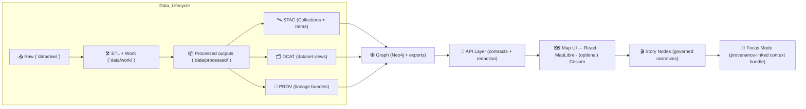

<div align="center">

# 🛰️ STAC Catalog — `data/stac/`


**KFM’s canonical asset metadata boundary** ✨  
STAC makes **renderable + time-filterable + citeable** geospatial assets discoverable—**without** shipping the raw/processed bytes in this folder.

</div>

---

## 🚀 Quick links

- 🧺 **Collections (dataset/layer-level)** → [`./collections/`](./collections/)
- 📦 **Items (granule/asset-level)** → [`./items/`](./items/)
- 🧭 *(Recommended)* Root STAC Catalog → `./catalog.json` (makes the directory usable by off-the-shelf STAC tooling)

### 🔁 Neighbor boundaries (KFM “triplet”)

- 🗂️ **DCAT (dataset discovery)** → [`../catalog/dcat/`](../catalog/dcat/)
- 🧬 **PROV (lineage bundles)** → [`../prov/`](../prov/)
- 📦 **Processed outputs (real files)** → [`../processed/`](../processed/)
- 🧰 **Raw + work stages (inputs + scratch)** → [`../raw/`](../raw/) · [`../work/`](../work/)
- 🕸️ **Graph exports (if present)** → [`../graph/`](../graph/)
- 🧷 **Catalog stage overview (if present)** → [`../catalog/README.md`](../catalog/README.md)

### 📚 System docs (handy while editing catalogs)

- 🧭 **Master pipeline + repo contracts (v13)** → [`../../docs/MASTER_GUIDE_v13.md`](../../docs/MASTER_GUIDE_v13.md)
- 🧩 **Architecture blueprint (v13)** → [`../../docs/architecture/KFM_REDESIGN_BLUEPRINT_v13.md`](../../docs/architecture/KFM_REDESIGN_BLUEPRINT_v13.md)

> [!TIP]
> **STAC** = “asset index for map + time” (items/assets/geometry/time).  
> **DCAT** = “dataset landing metadata for portals/harvesters” (title/license/access).  
> **PROV** = “why we trust it” (inputs → activity → outputs → agents).  
> In KFM, these are required **boundary artifacts** before data is considered “published”.

---

## 📌 At a glance

| 🧩 Topic | ✅ Canonical answer |
|---|---|
| Where do the *real bytes* live? | `data/processed/**` (or governed external storage) |
| Where does discoverability metadata live? | `data/stac/**` (Collections + Items) |
| Where does dataset-portal metadata live? | `data/catalog/dcat/**` |
| Where does lineage live? | `data/prov/**` |
| What key joins everything? | `kfm:dataset_id` (stable across STAC/DCAT/PROV/Graph/API) |
| Can the UI read from files/Neo4j directly? | 🚫 No — UI must go through the API boundary (contracts + redaction) |

---

<details>
<summary><b>🧭 Table of contents</b></summary>

- [📘 Overview](#-overview)
- [✅ Definition of done](#-definition-of-done)
- [🎯 What this folder is (and is not)](#-what-this-folder-is-and-is-not)
- [🧱 Where STAC fits in the KFM pipeline](#-where-stac-fits-in-the-kfm-pipeline)
- [🗺️ Data lifecycle & staging](#-data-lifecycle--staging)
- [🧨 Non-negotiables (KFM invariants)](#-non-negotiables-kfm-invariants)
- [🗂️ Folder layout](#-folder-layout)
- [🧾 JSON determinism & diff hygiene](#-json-determinism--diff-hygiene)
- [🏷️ IDs & determinism](#-ids--determinism)
- [🧬 Profile requirements & KFM extensions](#-profile-requirements--kfm-extensions)
- [🧺 Collections](#-collections)
- [📦 Items](#-items)
- [🧰 Assets](#-assets)
- [🔗 Cross-layer linkage](#-cross-layer-linkage-stac--dcat--prov--graph)
- [⏱️ Time + timeline readiness](#-time--timeline-readiness)
- [🧊 High-performance tile packages](#-high-performance-tile-packages)
- [🧱 3D, terrain, and “virtual world” assets](#-3d-terrain-and-virtual-world-assets)
- [🧠 Evidence artifacts (AI, analysis, simulations)](#-evidence-artifacts-ai-analysis-simulations)
- [✅ Add or update a dataset](#-add-or-update-a-dataset-checklist)
- [🧪 Validation & CI expectations](#-validation--ci-expectations)
- [🛡️ Governance & safety](#-governance--safety)
- [🧭 Legacy & migration notes](#-legacy--migration-notes)
- [📚 Reference shelf](#-reference-shelf)
- [🕰️ Version history](#-version-history)

</details>

---

## 📘 Overview

### Purpose 🎯
`data/stac/` is KFM’s **canonical STAC publication surface**. It is where we store **STAC Collections + Items** that describe what geospatial assets exist, where they apply (space), and when they apply (time).

### Scope ✅ / 🚫

| In scope ✅ | Out of scope 🚫 |
|---|---|
| Folder layout for STAC output (`collections/`, `items/`, optional `catalog.json`) | Storing the raw/processed bytes (that belongs in `data/processed/**` or governed external storage) |
| ID conventions (`kfm:dataset_id`, deterministic Collection/Item IDs) | Replacing DCAT or PROV (those are sibling boundary artifacts) |
| Minimal required metadata for KFM publication (license/providers/classification/time/space) | One-off fields or ad-hoc metadata keys (extend profiles/schemas instead) |
| Validation + CI expectations (schema/link/policy gates) | “Just this once” manual edits without updating provenance |

### Audience 👥
- **Pipeline engineers** generating STAC from ETL jobs
- **Data stewards/reviewers** approving publication
- **API + UI developers** consuming catalogs as contracts

### Definitions 📎
- **Collection**: dataset/layer-level STAC record (what the UI registers as a layer).
- **Item**: a concrete instance of the dataset (time slice, tile, AOI, run output).
- **Asset**: a file or endpoint (COG/PMTiles/GeoJSON/API URL) referenced by an Item.
- **`kfm:dataset_id`**: KFM’s stable join key across STAC ↔ DCAT ↔ PROV ↔ Graph ↔ API.
- **Classification**: sensitivity label that propagates; never “downgrade” derived outputs.

---

## ✅ Definition of done

When editing `data/stac/**`, the change is “done” when:

- [ ] STAC JSON parses cleanly (no broken JSON)
- [ ] **STAC schema validation** passes (e.g., `pystac validate …`)
- [ ] **KFM profile requirements** pass (required fields present, extensions declared where needed)
- [ ] **All `href` links resolve** (or are allowed external URLs) and there are no orphan assets
- [ ] **DCAT + PROV siblings exist** (or the change is explicitly scoped to drafts only)
- [ ] **Policy pack gates** pass (classification rules, license presence, provenance-first, API boundary)
- [ ] `doc_integrity_checksum` is updated by CI (or by an approved maintainer workflow)

---

## 🎯 What this folder is (and is not)

### ✅ `data/stac/` **IS**
- 🛰️ The canonical location for **STAC Collections + Items** generated at publication time.
- 🧭 The machine-readable “what exists + where it is + when it applies” index the **map + timeline** depend on.
- 🧾 A governance surface: metadata includes **license/providers/classification/coverage** and is validated in CI.

### ❌ `data/stac/` is **NOT**
- 📦 The place where actual rasters/vectors/tables live → those belong in `data/processed/**` (or governed external storage).
- 🗂️ A replacement for **DCAT** (dataset discovery + distributions) or **PROV** (lineage + reproducibility).
- 🧨 A place for ad‑hoc “just this once” metadata fields → extend profiles + schemas instead.

> [!IMPORTANT]
> KFM treats STAC/DCAT/PROV as **boundary artifacts** consumed downstream (Graph → API → UI → Story → Focus).  
> If boundary metadata is missing, the dataset is not “shippable.”

---

## 🧱 Where STAC fits in the KFM pipeline

KFM order is strict (no shortcuts):

**Raw → ETL → Catalogs → Graph → API → UI → Story Nodes → Focus Mode**



---

## 🗺️ Data lifecycle & staging

KFM uses a “domain expansion” pattern so every dataset has a predictable home:

```text
📁 data/
├── 📁 raw/         # 📥 source snapshots + checksums (immutability matters)
├── 📁 work/        # 🛠️ scratch, transforms, intermediate QA artifacts (not published)
├── 📁 processed/   # 📦 publishable outputs (COG/GeoJSON/Parquet/PMTiles/etc.)
├── 📁 stac/        # 🛰️ STAC Collections + Items (this folder)
├── 📁 catalog/
│   └── 📁 dcat/    # 🗂️ dataset landing metadata + distributions
└── 📁 prov/        # 🧬 provenance bundles (inputs → activity → outputs → agents)
```

> [!NOTE]
> `data/work/**` is allowed to be messy. `data/processed/**` must be “publish-ready” (stable formats, schema, naming, provenance).

---

## 🧨 Non-negotiables (KFM invariants)

1) **Boundary artifacts first**  
   STAC + DCAT + PROV must exist before Graph/API/UI consume a dataset.

2) **Provenance-first publishing (fail closed)**  
   If the pipeline cannot prove lineage or enforce classification, the publish step must stop — no “best effort” releases.

3) **Deterministic + idempotent catalog builds**  
   Reruns with unchanged inputs should produce stable IDs and diff-stable JSON (ordering, formatting, links).

4) **API boundary rule**  
   The UI consumes datasets via the API layer (contracts + redaction), not by “reaching into” Neo4j or file paths.

5) **Metadata completeness is a ship-stopper**  
   CI should fail if STAC JSON is missing license/providers/classification or has broken links.

6) **Profile-governed extensions only**  
   If you need custom fields, extend the KFM STAC profile + schemas—don’t invent one-offs.

7) **Classification never downgrades**  
   Derived outputs can leak sensitive information. Treat classification as propagating to all descendants.

---

## 🗂️ Folder layout

Canonical STAC output paths in KFM:

```text
📁 data/
└── 📁 stac/
    ├── 📄 README.md
    ├── 📄 catalog.json                     # optional: root catalog (recommended)
    ├── 📁 collections/                     # 🧺 STAC Collections (dataset/layer level)
    │   └── 📄 <collection-id>.json
    └── 📁 items/                           # 📦 STAC Items (asset/granule level)
        └── 📁 <collection-id>/
            └── 📄 <item-id>.json
```

> [!TIP]
> Prefer **one Collection per “layer the UI can toggle”**. Use Items for time slices, tiles, AOIs, or run outputs.

### 🔗 Relative `href` rules (don’t get bitten)

STAC `href` values are **URLs**, and *relative* URLs resolve relative to **the JSON file they appear in**.

Practical implications:
- In an **Item** at `data/stac/items/<collection-id>/<item-id>.json`, referencing `data/processed/**` usually starts with `../../../processed/...`
- In a **Collection** at `data/stac/collections/<collection-id>.json`, referencing `data/prov/**` usually starts with `../../prov/...`

> [!TIP]
> If you serve catalogs via the API, you can use absolute URLs (`https://…`) to avoid repo-relative path math.

---

## 🧾 JSON determinism & diff hygiene

Catalog JSON is both **machine contract** and **human review surface**. Make diffs boring.

### Recommended rules ✅
- Stable IDs (see next section) ✅
- Stable key ordering (sort keys in output) ✅
- Stable whitespace (2-space indent, newline at EOF) ✅
- Avoid floating-point noise (round at a defined precision if the pipeline emits floats) ✅
- Don’t auto-rewrite existing published records in-place unless the dataset version changes ✅

### Practical tooling ideas 🧰
- Build STAC with a single library path (e.g., `pystac`) rather than scattered JSON string templates.
- Add a “normalize JSON” step in CI that:
  - sorts keys
  - removes trailing whitespace
  - rejects invalid UTF-8

> [!CAUTION]
> “Pretty JSON” is not enough. Determinism is about **reproducible diffs** and stable joins across Graph/API/UI.

---

## 🏷️ IDs & determinism

### ✅ Dataset IDs (canonical join key)
KFM uses dataset IDs that encode region, theme, time range, and version:

```text
kfm.<state|region>.<theme>.<year_range>.v<version>
# example:
kfm.ks.landcover.2000_2020.v1
```

This ID is the stable join key across catalogs and the graph.

### ✅ Collection IDs (recommended)
Prefer a stable mapping from `kfm:dataset_id`:

```text
<dataset_id>  (or a hyphenated variant if required by tooling)
# example (hyphenated):
kfm-ks-landcover-2000-2020-v1
```

### ✅ Item IDs (recommended)
Derive from stable dimensions (time/tile/run):

- `<collection-id>__<YYYY>`
- `<collection-id>__<YYYY-MM>`
- `<collection-id>__<tile>__<YYYY-MM-DD>`
- `<collection-id>__run-<run-id>`

> [!TIP]
> “Boring IDs” are a feature. They make Graph joins stable, cache keys stable, and story evidence stable.

### ♻️ Versioning & rollback (KFM rule of thumb)

- **New meaning = new version**: if you change semantics, schema, or processing logic in a way that changes interpretation, bump the dataset version (`…v2`, `…v3`, …).
- **Rollback is explicit**: if a publish run is reverted, restore the previous STAC/DCAT/PROV records and mark the reverted release as **deprecated** (don’t silently delete history).
- **Prefer additive evolution**: keep older versions readable and traceable for story evidence and auditability.

> [!NOTE]
> “Overwrite without trace” breaks provenance. If you must correct an error, record the correction in PROV and keep a clear deprecation trail.

---

## 🧬 Profile requirements & KFM extensions

KFM publishes STAC under a profile (`KFM-STAC v11.0.0`) that adds **minimum governance + join-key guarantees**.

### Required fields (practical baseline)

**STAC baseline (ship-stoppers in KFM):**
- `license` ✅
- `providers` ✅ (who made it / who hosts it)
- `extent` ✅ (Collection) + valid `datetime`/intervals (Items)

**KFM join + governance fields (on both Collections and Items):**
- `kfm:dataset_id` ✅ (canonical join key)
- `kfm:classification` ✅ (e.g., `open`, `restricted`, …)
- `kfm:sensitivity` ✅ (e.g., `public`, `internal`, …)

**Strongly recommended cross-refs:**
- `kfm:dcat_ref` (path or identifier of sibling DCAT record)
- `kfm:prov_ref` (path or identifier of sibling PROV bundle / activity)

**Recommended for traceability + reproducibility:**
- `kfm:run_id` (ETL run identifier)
- `kfm:source_ref` (raw manifest / source record pointer)
- `kfm:quality` / `kfm:uncertainty` (especially for AI/derived artifacts)

> [!IMPORTANT]
> If you add `kfm:*` fields, make sure the corresponding **schema/profile** is updated so validators and downstream code agree on meaning.

---

## 🧺 Collections

A Collection is the **layer/dataset-level** entry a UI layer registry can point at.

### Practical must-haves (baseline)
- `stac_version`
- `type: "Collection"`
- `id`, `title`, `description`
- `license` (explicit and compatible)
- `extent` (spatial + temporal)
- `providers` (recommended; often required by profile)
- `links` (at least `self`; add `root` if you use `catalog.json`)

### KFM must-haves (profile baseline)
- `kfm:dataset_id`
- `kfm:classification` + `kfm:sensitivity`

> [!IMPORTANT]
> Licensing clarity is a trust requirement—metadata should make “what can I do with this?” answerable.

<details>
<summary><strong>📄 Minimal Collection skeleton (example)</strong></summary>

```json
{
  "stac_version": "1.0.0",
  "type": "Collection",
  "id": "kfm-ks-landcover-2000-2020-v1",
  "title": "Kansas Landcover (2000–2020) — v1",
  "description": "Landcover layer for Kansas with year coverage 2000–2020.",
  "license": "CC-BY-4.0",
  "extent": {
    "spatial": { "bbox": [[-102.051, 36.993, -94.588, 40.003]] },
    "temporal": { "interval": [["2000-01-01T00:00:00Z", "2020-12-31T23:59:59Z"]] }
  },
  "providers": [
    { "name": "Kansas Frontier Matrix", "roles": ["processor"] }
  ],
  "kfm:dataset_id": "kfm.ks.landcover.2000_2020.v1",
  "kfm:classification": "open",
  "kfm:sensitivity": "public",
  "links": [
    { "rel": "self", "href": "./kfm-ks-landcover-2000-2020-v1.json", "type": "application/json" }
  ]
}
```

</details>

---

## 📦 Items

An Item is a **specific instance** (time slice, tile, AOI, run artifact) that points to assets.

### Practical must-haves (baseline)
- `stac_version`
- `type: "Feature"`
- `id`
- `collection`
- `geometry` + `bbox` *(WGS84 lon/lat for web integration, unless withheld)*  
- `properties.datetime` **or** `start_datetime` + `end_datetime`
- `assets` (hrefs must resolve)
- `links` (`self`, `collection`, plus DCAT/PROV hooks as adopted)

### KFM must-haves (profile baseline)
- `kfm:dataset_id`
- `kfm:classification` + `kfm:sensitivity`

<details>
<summary><strong>📄 Minimal Item skeleton (example)</strong></summary>

```json
{
  "stac_version": "1.0.0",
  "type": "Feature",
  "id": "kfm-ks-landcover-2000-2020-v1__2010",
  "collection": "kfm-ks-landcover-2000-2020-v1",
  "geometry": {
    "type": "Polygon",
    "coordinates": [[[ -102.051, 36.993 ], [ -94.588, 36.993 ], [ -94.588, 40.003 ], [ -102.051, 40.003 ], [ -102.051, 36.993 ]]]
  },
  "bbox": [-102.051, 36.993, -94.588, 40.003],
  "properties": {
    "datetime": "2010-01-01T00:00:00Z"
  },
  "kfm:dataset_id": "kfm.ks.landcover.2000_2020.v1",
  "kfm:classification": "open",
  "kfm:sensitivity": "public",
  "kfm:prov_ref": "../../../prov/kfm.ks.landcover.2000_2020.v1__run-20260119.json",
  "kfm:dcat_ref": "../../../catalog/dcat/kfm.ks.landcover.2000_2020.v1.json",
  "assets": {
    "cog": {
      "href": "../../../processed/landcover/v1/2010_landcover.cog.tif",
      "type": "image/tiff; application=geotiff",
      "roles": ["data"]
    },
    "thumbnail": {
      "href": "../../../processed/landcover/v1/preview_2010.png",
      "type": "image/png",
      "roles": ["thumbnail"]
    }
  },
  "links": [
    { "rel": "self", "href": "./kfm-ks-landcover-2000-2020-v1__2010.json", "type": "application/json" },
    { "rel": "collection", "href": "../../collections/kfm-ks-landcover-2000-2020-v1.json", "type": "application/json" }
  ]
}
```

</details>

> [!CAUTION]
> If a layer is restricted, **do not publish precise geometry**. Use a generalized geometry, coarse bbox, or explicitly withheld geometry per governance policy.

---

## 🧰 Assets

### “Boringly reliable” formats (KFM preference)
KFM’s data format standards favor web- and GIS-friendly, durable formats.

Common STAC asset types you’ll see in KFM:
- 🗺️ **COG**: `image/tiff; application=geotiff`
- 🧭 **GeoJSON**: `application/geo+json`
- 🧱 **GeoParquet/Parquet**: `application/x-parquet` *(tooling dependent)*
- 🧩 **PMTiles** (vector tiles): `application/x-protomaps-pmtiles`
- 🧾 **TileJSON**: `application/json`
- 🖼️ **Previews/thumbnails**: `image/png` / `image/jpeg`
- 🧷 **Legend / style**: `application/json` (style spec) · `image/png` (legend image)
- 📄 **Documents** (PDFs, reports, scanned maps): `application/pdf`

### Web-grade vs analysis-grade (recommended)
When you produce both:
- **analysis-grade** → high fidelity (GeoParquet, full-res COG, full schema)
- **web-grade** → optimized for UI (PMTiles, downsampled COG overview, thumbnails)

Use STAC `roles` + `title/description` to make this obvious.

### Integrity hints (recommended)
If your profile supports it:
- add checksums (sha256 / multihash) and byte sizes
- keep assets immutable once published

> [!TIP]
> Deterministic assets + checksums turn STAC into a tamper-evident index (and make debugging CI much faster).

---

## 🔗 Cross-layer linkage (STAC ↔ DCAT ↔ PROV ↔ Graph)

KFM expects catalogs to **cross-reference cleanly** so nothing downstream “drifts.”

### Cross-reference matrix

| Layer | Lives in | Must reference | Why |
|---|---|---|---|
| 🛰️ STAC | `data/stac/**` | real assets (files/endpoints), license/providers, time/space | map + timeline discovery |
| 🗂️ DCAT | `data/catalog/dcat/**` | dataset landing + access/distribution URLs | harvesting + dataset inventory |
| 🧬 PROV | `data/prov/**` | inputs → activity → outputs → agents | reproducibility + trust |
| 🕸️ Graph | Neo4j / exports | stable IDs back to catalogs | relationships without payload duplication |

> [!IMPORTANT]
> The **graph references catalogs**; it’s not the catalog. Avoid duplicating heavy payloads into Neo4j.

### Recommended link conventions (pragmatic)
- Put `kfm:dcat_ref` + `kfm:prov_ref` on Collections **and** Items when possible.
- In `links`, prefer standard rels where they fit:
  - `rel: "describedby"` for DCAT dataset view
  - `rel: "via"` (or a documented custom rel) for PROV bundle/activity

---

## ⏱️ Time + timeline readiness

KFM’s UI and API patterns assume **temporal fields are correct**. Timeline behavior depends on STAC item dates.

### Timeline checklist ✅
- [ ] All timeline Items have valid ISO timestamps
- [ ] No silent timezone ambiguity (use Z / UTC)
- [ ] Collection temporal extent covers all items
- [ ] UI-friendly: include a thumbnail/preview for fast scrubbing

### Real-time / streaming layers (pattern)
For sensors and feeds (river gauges, weather, etc.), choose a strategy and be consistent:
- **station-as-item**: one Item per station, assets point to “latest” endpoints + time windows
- **reading-as-item**: Items represent readings in micro-batches (hour/day) for temporal replay

> [!NOTE]
> Streaming does *not* mean “skip provenance.” Micro-batches should still emit PROV activities and stable catalog entries.

---

## 🧊 High-performance tile packages

KFM supports (and proposes expanding) a “two-path publish” pattern for large spatial datasets:
- **GeoParquet** for analytics + server-side processing
- **PMTiles** for fast, offline-ish web streaming
- plus **STAC Collection + DCAT record + PROV lineage**, with hashes for traceability

If adopted, reflect this clearly in STAC assets:
- `assets.parquet` → GeoParquet
- `assets.pmtiles` → PMTiles
- `assets.tilejson` → TileJSON endpoint (optional)
- `assets.thumbnail` → quick UI preview

> [!TIP]
> Offline packs can bundle: **PMTiles + thumbnails + a filtered STAC subset** for “field mode” use.
>
> Optional citation upgrade: for major releases, add a stable `cite-as` link (DOI/ARK/URL) in Collection `links` so story nodes can cite an immutable snapshot.

---

## 🧱 3D, terrain, and “virtual world” assets

KFM’s UI roadmap includes optional **3D/terrain** (e.g., Cesium) and immersive modes (AR/field packs).

If/when you publish 3D assets, keep the same rule: **STAC describes it; the bytes live elsewhere**.

Practical patterns:
- `assets.3dtiles` → Cesium 3D Tiles tileset (tileset.json) or endpoint
- `assets.gltf` / `assets.glb` → 3D models
- `assets.dem` → terrain raster (COG DEM), plus derived hillshade thumbnails

> [!CAUTION]
> 3D content can amplify sensitive-location risk (high-fidelity models). Apply classification rules *before* publishing geometry-heavy assets.

---

## 🧠 Evidence artifacts (AI, analysis, simulations)

KFM treats AI/derived outputs as **first-class evidence datasets**:
- they must be stored in `data/processed/**`
- they must be cataloged (STAC/DCAT) and have lineage (PROV)
- they must carry uncertainty/quality metadata (where applicable)
- they must respect classification propagation

Examples:
- AI landcover predictions (raster COG + PMTiles)
- OCR-derived place-name indexes (GeoParquet + API endpoint)
- Simulation outputs (time-stepped rasters/vectors)

Recommended extra fields for AI outputs:
- `kfm:model_id` / `kfm:model_version`
- `kfm:uncertainty` (map-level or tile-level summaries)
- `kfm:training_data_ref` (if publishable)
- `kfm:human_review` (approval marker)

---

## ✅ Add or update a dataset (checklist)

### 0) Confirm the “real data” location
- [ ] Raw snapshots are in `data/raw/<domain>/...` (+ checksums/manifests)
- [ ] Work/intermediate artifacts are in `data/work/<domain>/...`
- [ ] Publishable outputs are in `data/processed/<domain>/...` (or governed external storage)

### 1) Create/update the Collection
- [ ] `data/stac/collections/<collection-id>.json`
- [ ] Includes: `license`, `extent`, `providers`, `kfm:dataset_id`, `kfm:classification`, `kfm:sensitivity`

### 2) Create/update Item(s)
- [ ] `data/stac/items/<collection-id>/<item-id>.json`
- [ ] Assets `href` resolve (no broken links)
- [ ] Temporal metadata is correct (timeline readiness)
- [ ] Geometry/bbox are valid *(or intentionally generalized/withheld per governance)*

### 3) Create/update boundary siblings
- [ ] DCAT dataset entry exists (`data/catalog/dcat/…`)
- [ ] PROV bundle exists (`data/prov/…`)
- [ ] Cross-refs (`kfm:dcat_ref`, `kfm:prov_ref`) resolve if used

### 4) Downstream (only after boundary artifacts exist)
- [ ] Graph references catalog IDs (no heavy payload duplication)
- [ ] UI uses API responses (contracts + redaction)

---

## 🧪 Validation & CI expectations

### Local sanity checks
```bash
python -m json.tool data/stac/collections/<collection-id>.json > /dev/null
python -m json.tool data/stac/items/<collection-id>/<item-id>.json > /dev/null
```

### STAC validation (preferred)
If you use `pystac`:

```bash
pystac validate data/stac/collections/<collection-id>.json
pystac validate data/stac/items/<collection-id>/<item-id>.json
```

### CI gates (minimum)
KFM’s v13 philosophy is **detect → validate → promote** with policy-as-code:

- ✅ JSON parse + schema validation
- ✅ STAC/DCAT/PROV completeness checks
- ✅ License presence + provider attribution checks
- ✅ Classification/sensitivity checks (fail closed)
- ✅ Provenance completeness (inputs/steps declared)
- ✅ Link checks (no broken `href`)
- ✅ Ledger/audit event emitted for the publish step (dataset_id, run_id, checksums, commit_sha)
- ✅ Optional: supply-chain attestations (SBOM/SLSA/Sigstore) for promoted artifacts

> [!TIP]
> A lightweight **policy pack** (OPA/Conftest-style) is ideal for rules like “no precise coords for restricted layers” and “no publish without PROV.”
>
> Automation note 🤖: A Watcher→Planner→Executor pattern can detect missing/invalid metadata and open a PR with the minimal patch, but merges still require human review.

---

## 🛡️ Governance & safety

### Classification & sensitivity (controlled vocabulary)

- `kfm:classification` is the **data risk label** (controls *what can be published*).  
- `kfm:sensitivity` is the **distribution scope** (controls *who can access it*).

Both are governed by KFM policy (see `docs/governance/**`). When in doubt, **classify higher** and let governance review the downgrade — never the other way around.

> [!CAUTION]
> Even “open” datasets can become sensitive when combined. Treat classification as **context-aware** and propagation-safe.

### Sensitive locations & sovereignty
STAC is discoverability metadata—treat it as potentially public.

Safe patterns:
- use generalized extents (state/county) when required
- consider `geometry: null` with coarse bbox or withheld bbox when policy demands
- ensure access is mediated by the API boundary (redaction + contracts)
- adopt “geo-obfuscation” patterns where appropriate (e.g., rounding or gridding sensitive coordinates)

> [!IMPORTANT]
> AI/derived outputs count as evidence datasets and must be treated like any other processed dataset (cataloged + provenance).

### Provenance in the UI (recommended)
A strong UX pattern is a **Layer Provenance / Attribution panel** showing:
- source + license (DCAT)
- processing lineage summary (PROV)
- dataset_id + version (STAC/DCAT)
- confidence/uncertainty (for AI layers)

---

## 🧭 Legacy & migration notes

Some pre-v13 drafts and external notes refer to alternate catalog paths (e.g., `data/catalogs/`).

**Canonical v13 paths are:**
- STAC → `data/stac/**`
- DCAT → `data/catalog/dcat/**`
- PROV → `data/prov/**`

If you must support legacy tooling:
- add a **symlink/redirect** layer in tooling (not duplicate metadata by hand)
- prefer one canonical source of truth to avoid drift

---

## 📚 Reference shelf

### 🧭 Core KFM docs (most normative)
- `docs/MASTER_GUIDE_v13.md` (repo + pipeline contracts)
- `docs/architecture/KFM_REDESIGN_BLUEPRINT_v13.md` (system architecture blueprint)
- Kansas Frontier Matrix (KFM) – Comprehensive Technical Documentation (PDF)
- Kansas Frontier Matrix (KFM) – Comprehensive Architecture, Features, and Design (PDF)
- Kansas Frontier Matrix – Comprehensive UI System Overview (PDF)
- Kansas Frontier Matrix (KFM) – AI System Overview 🧭🤖 (PDF)
- 📚 Kansas Frontier Matrix (KFM) Data Intake – Technical & Design Guide (PDF)

### 📦 PDF portfolios (multi-document bundles)
- AI Concepts & more (PDF portfolio)
- Maps-GoogleMaps-VirtualWorlds-Archaeological-Computer Graphics-Geospatial-webgl (PDF portfolio)
- Data Managment-Theories-Architures-Data Science-Baysian Methods-Some Programming Ideas (PDF portfolio)
- Various programming langurages & resources 1 (PDF portfolio)

### 💡 Concepts & proposals
- 🌟 Kansas Frontier Matrix – Latest Ideas & Future Proposals (PDF)
- Innovative Concepts to Evolve the Kansas Frontier Matrix (KFM) (PDF)

### 🗺️ GIS, cartography, and web mapping (supporting library)
- `making-maps-a-visual-guide-to-map-design-for-gis.pdf`
- `Cloud-Based Remote Sensing with Google Earth Engine-Fundamentals and Applications.pdf`
- `webgl-programming-guide-interactive-3d-graphics-programming-with-webgl.pdf`
- `Mobile Mapping_ Space, Cartography and the Digital - 9789048535217.pdf`

### ⚙️ Scale, interoperability, rigor (supporting library)
- `Data Engineering Cookbook.pdf`
- `Comprehensive CI_CD Guide for Software and Data Projects.pdf`
- `Scalable Data Management for Future Hardware.pdf`
- `Data Spaces.pdf`
- `Scientific Modeling and Simulation_ A Comprehensive NASA-Grade Guide.pdf`

### ✍️ Markdown + documentation rigor
- Comprehensive Markdown Guide_ Syntax, Extensions, and Best Practices (DOCX/PDF)

---

## 🕰️ Version history

| Version | Date | Summary |
|---|---|---|
| v1.0.0 | 2025-12-24 | Initial STAC README baseline (pre-v13 alignment). |
| v1.1.0 | 2026-01-11 | Aligned with v13 pipeline/canonical paths, clarified deterministic IDs, timeline readiness, PMTiles/GeoParquet asset patterns, and CI/governance expectations. |
| v1.2.0 | 2026-01-19 | Added v13 staging context (`raw/work/processed`), made KFM profile fields explicit (`kfm:dataset_id`, classification), expanded CI policy gates, and added patterns for streaming, 3D, and AI evidence artifacts. ✅ |

---

<p align="right"><a href="#-stac-catalog--datastac">⬆️ Back to top</a></p>