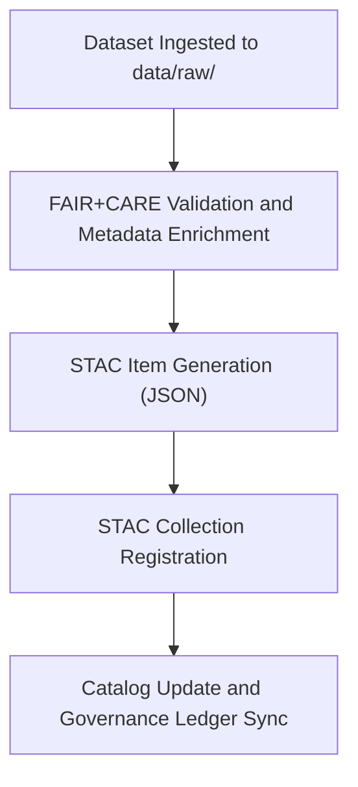

<div align="center">

# 🧭 Kansas Frontier Matrix — **SpatioTemporal Asset Catalog (STAC)**
`data/stac/README.md`

**Purpose:** Provides an open-standard, FAIR+CARE-aligned **SpatioTemporal Asset Catalog (STAC)** implementation for all Kansas Frontier Matrix (KFM) datasets.  
This catalog serves as the unified spatial index for discovery, lineage tracking, and provenance governance across climate, hazards, and archival datasets.

[](https://stacspec.org/)
[](../../docs/standards/faircare-validation.md)
[](../../LICENSE)
[](../../docs/architecture/repo-focus.md)

</div>

---

## 📚 Overview

The `data/stac/` directory contains all **STAC-compliant catalog and item files** representing datasets published within the Kansas Frontier Matrix (KFM).  
Each STAC `item` and `collection` documents metadata for datasets across environmental, geological, and historical domains — including their spatial extent, temporal range, licensing, and governance lineage.

**Key Features:**
- STAC 1.0.0-compliant catalog for all KFM datasets.  
- Integrates with FAIR+CARE metadata, provenance, and governance ledgers.  
- Supports JSON-based discovery via web, API, or command-line tools.  
- Linked to `data/archive/` and `data/raw/` directories for full lineage traceability.

---

## 🗂️ Directory Layout

```plaintext
data/stac/
├── README.md                            # This file — overview of STAC implementation
│
├── catalog.json                         # Root STAC catalog referencing all collections
├── collections/                         # Thematic dataset groups
│   ├── hazards_collection.json
│   ├── climate_collection.json
│   ├── treaties_collection.json
│   └── geology_collection.json
│
└── items/                               # Individual dataset STAC items
    ├── hazards_v9.3.2.json
    ├── climate_v9.3.2.json
    ├── treaties_v9.3.2.json
    ├── usgs_groundwater_levels_2025.json
    ├── noaa_storm_events_2025.json
    └── fema_flood_zones_2025.json
```

---

## ⚙️ STAC Governance Workflow



### Workflow Steps:
1. **Ingestion:** Raw datasets acquired and validated under FAIR+CARE compliance.  
2. **Enrichment:** Metadata enhanced with schema, spatial extent, and temporal coverage.  
3. **STAC Item Creation:** Automated generation via KFM’s STAC builder script (`src/pipelines/stac_builder.py`).  
4. **Collection Linking:** Datasets grouped thematically under `collections/`.  
5. **Governance Integration:** Provenance and version control synced to `data/reports/audit/`.

---

## 🧩 Example STAC Item — `hazards_v9.3.2.json`

```json
{
  "stac_version": "1.0.0",
  "type": "Feature",
  "id": "hazards_v9.3.2",
  "collection": "hazards_collection",
  "properties": {
    "title": "Kansas Multi-Hazard Dataset (v9.3.2)",
    "description": "FAIR+CARE-validated hazard archive including floods, tornadoes, drought, and seismic data.",
    "start_datetime": "1900-01-01T00:00:00Z",
    "end_datetime": "2025-12-31T00:00:00Z",
    "license": "CC-BY 4.0",
    "governance:faircare": "certified",
    "governance:ledger_ref": "data/reports/audit/data_provenance_ledger.json",
    "created": "2025-10-28T16:45:00Z",
    "updated": "2025-10-28T17:00:00Z"
  },
  "geometry": {
    "type": "Polygon",
    "coordinates": [[[-102.05, 36.99], [-102.05, 40.00], [-94.61, 40.00], [-94.61, 36.99], [-102.05, 36.99]]]
  },
  "assets": {
    "data": {
      "href": "https://github.com/bartytime4life/Kansas-Frontier-Matrix/blob/main/data/archive/hazards/hazards_v9.3.2/",
      "type": "application/geo+json",
      "title": "Hazard Dataset GeoJSON Files"
    },
    "metadata": {
      "href": "data/archive/hazards/hazards_v9.3.2/metadata.json",
      "type": "application/json",
      "title": "Hazard Dataset Metadata"
    }
  },
  "links": [
    {"rel": "collection", "href": "../collections/hazards_collection.json"},
    {"rel": "root", "href": "../catalog.json"},
    {"rel": "license", "href": "../../LICENSE"}
  ]
}
```

---

## ⚖️ FAIR+CARE Integration in STAC Metadata

| Field | Description | Example |
|--------|-------------|----------|
| `governance:faircare` | Indicates FAIR+CARE certification status | `certified` |
| `governance:ledger_ref` | Path to provenance ledger | `data/reports/audit/data_provenance_ledger.json` |
| `data_license` | Dataset-level license | `CC-BY 4.0` |
| `data_owner` | Primary institution or custodian | `Kansas Frontier Matrix FAIR+CARE Council` |
| `governance:ethics_reviewed` | Boolean flag for ethical clearance | `true` |

Each STAC item embeds FAIR+CARE governance fields to ensure transparent data lineage.

---

## 🧠 FAIR+CARE Compliance Alignment

| Principle | STAC Implementation |
|------------|--------------------|
| **Findable** | Each dataset has a globally unique STAC ID. |
| **Accessible** | URLs reference open repositories and public archives. |
| **Interoperable** | Adheres to STAC 1.0 and DCAT 3.0 standards. |
| **Reusable** | Metadata includes license, checksum, and governance fields. |
| **Collective Benefit** | Open-access metadata promotes research and policy transparency. |
| **Authority to Control** | Governance council ensures ethical dataset representation. |
| **Responsibility** | Continuous FAIR+CARE validation across all STAC items. |
| **Ethics** | Ethical review fields embedded at item level. |

Audit and compliance reports stored under:
- `data/reports/audit/data_provenance_ledger.json`  
- `data/reports/fair/data_care_assessment.json`  
- `data/reports/validation/stac_validation_report.json`

---

## 🔍 Governance Integration

| Record | Description |
|---------|-------------|
| `catalog.json` | Root catalog referencing all collections and items. |
| `data/reports/audit/data_provenance_ledger.json` | Links each STAC item to its provenance record. |
| `data/reports/validation/stac_validation_report.json` | Documents schema compliance and metadata validation. |
| `releases/v9.3.2/manifest.zip` | Contains all STAC file checksums and lineage hashes. |

---

## 🧾 Citation Example

```text
Kansas Frontier Matrix (2025). SpatioTemporal Asset Catalog (STAC) — Version v9.3.2.
Comprehensive FAIR+CARE-aligned catalog indexing all spatial and temporal datasets for Kansas.
Available at: https://github.com/bartytime4life/Kansas-Frontier-Matrix/tree/main/data/stac
License: Open Data / CC-BY 4.0
```

---

## 🧾 Version Notes

| Version | Date | Notes |
|----------|------|--------|
| v9.3.2 | 2025-10-28 | STAC metadata fully aligned with FAIR+CARE fields; new treaty and hazard items added. |
| v9.2.0 | 2024-07-15 | Added new collections for climate and hydrology datasets. |
| v9.0.0 | 2023-01-10 | Established base STAC catalog and governance linkages. |

---

<div align="center">

**Kansas Frontier Matrix** · *STAC Metadata × FAIR+CARE Governance × Provenance Transparency*  
[🔗 Repository](https://github.com/bartytime4life/Kansas-Frontier-Matrix) • [🧭 Docs Portal](../../docs/) • [⚖️ Governance Ledger](../../docs/standards/governance/)

</div>