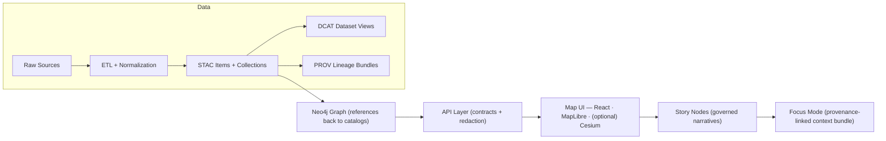

# 📦 data/stac — STAC Catalog (Kansas Frontier Matrix)

[](#)
[](#-non-negotiables-contract-first--evidence-first)
[](#-non-negotiables-contract-first--evidence-first)
[](#-how-stac-fits-in-kfm)

This folder is **KFM’s canonical SpatioTemporal Asset Catalog (STAC)** 🛰️—the machine-readable metadata “boundary” between **processed data outputs** and everything downstream (**graph → API → UI → Story Nodes**).

If it can show up on a map 🗺️, on a timeline ⏱️, or as evidence in a narrative 🧾, it should be discoverable here.

---

## 🔗 Related (neighbor) folders

From `data/stac/README.md`:

- 📁 `../catalog/dcat/` — DCAT discovery entries (dataset-level, JSON-LD)
- 📁 `../prov/` — provenance bundles (run + lineage)
- 📁 `../<domain>/processed/` — where the **actual data assets** live (COGs, GeoJSON, CSV, etc.)

---

## 🗂️ Folder layout

```text
data/
└── 📁 stac/
    ├── 📄 README.md
    ├── 📁 collections/          # ✅ STAC Collections (dataset / layer level)
    │   └── 📄 <collection-id>.json
    └── 📁 items/                # ✅ STAC Items (asset / granule level)
        └── 📁 <collection-id>/
            └── 📄 <item-id>.json
```

> [!TIP]
> Keep the catalog **boring** and **predictable**: stable IDs, stable paths, stable semantics. The UI and graph depend on it.

---

## 🧭 How STAC fits in KFM

KFM’s pipeline is **ordered** and **contracted**. The catalogs are not “nice-to-have docs”—they are **required artifacts** that connect data to the graph and UI.



---

## 🚧 Non-negotiables (contract-first + evidence-first)

> [!IMPORTANT]
> **Nothing is “published” in KFM until the boundary artifacts exist:**  
> ✅ **STAC** (assets) + ✅ **DCAT** (discovery) + ✅ **PROV** (lineage)

### ✅ What every dataset/evidence artifact must have

- **STAC Collection + Item(s)**  
  For spatial/temporal discovery and indexing (even “mostly non-spatial” data may still carry a Collection for consistency).
- **DCAT Dataset entry**  
  For catalog-wide discovery (title, description, license, distributions/links).
- **PROV bundle**  
  For reproducibility (inputs → transforms → outputs), including run/config identifiers.

### 🔁 Cross-layer linkage expectations

- **STAC Items → Data assets**  
  Items must point to the actual outputs (files or stable endpoints), with attribution + license info.
- **DCAT → STAC / Distributions**  
  DCAT should link to STAC entries and/or direct download resources.
- **PROV end-to-end**  
  PROV should capture the full chain and include a run ID / config / commit hash.
- **Graph references catalogs (no duplication)**  
  Neo4j should store references (STAC IDs / catalog links), not full payloads.

### 🤖 Evidence artifacts (AI/analysis outputs are first-class)

If you generate a raster layer, feature set, OCR corpus, model output, etc., it must be treated like any other dataset:

- stored in `data/<domain>/processed/...`
- cataloged in **STAC/DCAT**
- traced in **PROV** with method + params + confidence metrics
- exposed only via the API boundary (so classification/redaction is enforceable)

---

## 🧱 Conventions (IDs, filenames, and determinism)

### 🆔 IDs and filenames

- Use **lower-kebab-case** for `collection.id` and `item.id`  
  ✅ `air-quality-epa-pm25`  
  ❌ `AirQuality_PM2.5_Final`
- Use **file = id** whenever possible:
  - `collections/<collection-id>.json`
  - `items/<collection-id>/<item-id>.json`

### ♻️ Deterministic item IDs

Item IDs should be derivable from stable inputs, such as:

- dataset/collection ID
- time slice (date or interval)
- area-of-interest (AOI) or tile index
- processing level / pipeline stage

Example patterns:

- `<collection>__<YYYY-MM-DD>`
- `<collection>__<YYYY-MM-DD>__<aoi-slug>`
- `<collection>__<tile>__<YYYY-MM>__v<dataset-version>`

> [!NOTE]
> “Deterministic pipeline” here means: same inputs + same config ⇒ same outputs (including catalog IDs).

---

## 🧾 What goes into a KFM STAC record

### ✅ Always include (core STAC expectations)

For a **Collection**:

- `stac_version`
- `type: "Collection"`
- `id`, `title`, `description`
- `license`
- `extent` (spatial + temporal)
- `links` (self/root/parent + docs)

For an **Item**:

- `stac_version`
- `type: "Feature"`
- `id`
- `geometry` + `bbox` (usually WGS84 lon/lat)
- `properties.datetime` **or** `start_datetime` + `end_datetime`
- `assets` (each with `href`, `type`, and optional `roles`)
- `links` (self + collection + parent)

### 🧩 Recommended STAC extensions (use what fits)

Common extension families you may use (if applicable):

- `proj:*` (projection + transform)
- `raster:*` / `eo:*` (bands, nodata, dtype)
- `file:*` (file metadata)
- `processing:*` (processing lineage hints)
- `version:*` (dataset/item versioning)

> [!TIP]
> Don’t invent ad-hoc fields if an extension exists—prefer standard extensions first, then KFM namespaced fields.

### 🏷️ KFM namespaced fields (project-specific)

KFM profiles may require/encourage project-specific metadata fields to support governance, provenance, and uncertainty. Use a `kfm:` namespace (example keys below):

- `kfm:domain` — owning domain slug (e.g., `historical`, `air-quality`)
- `kfm:source` — canonical “where did this come from?” reference
- `kfm:dcat_ref` — pointer to the DCAT dataset entry
- `kfm:prov_ref` — pointer to the PROV bundle (or activity ID)
- `kfm:classification` — governance classification / redaction tier
- `kfm:quality` / `kfm:uncertainty` — confidence metrics + caveats

> [!WARNING]
> The authoritative definition of required/allowed custom fields belongs in:
> - `../../docs/standards/KFM_STAC_PROFILE.md`
> - `../../schemas/stac/`
>
> If the profile is still “placeholder” in this stage of the repo, keep `kfm:*` minimal, consistent, and documented.

---

## 🧰 Asset guidance (what to point to)

### 🗺️ Rasters (recommended)

- Prefer **COGs** (`.tif`) for large rasters (fast map access, overviews).
- For web display, optionally include:
  - an `xyz`/tile endpoint (if hosted)
  - a `tilejson` asset
  - a downsampled `preview` PNG

### 🧭 Vectors

- GeoJSON for web-friendly assets
- GeoPackage for “heavy” GIS assets (if used)
- Include simplified “web” versions when needed for fast UI rendering

### 🔗 HREFs

- Prefer **relative paths** when assets live in-repo under `data/<domain>/processed/...`
- Use absolute URLs only when assets are hosted externally and stable

---

## 🧪 Adding a new dataset or layer (checklist)

> [!TIP]
> If you follow this checklist, you will almost always pass governance + CI without drama 😄

### 1) Produce final outputs

- [ ] Put raw data under `data/<domain>/raw/`
- [ ] Work/intermediate outputs under `data/<domain>/work/`
- [ ] Final outputs under `data/<domain>/processed/`

### 2) Create STAC Collection

- [ ] Add `data/stac/collections/<collection-id>.json`
- [ ] Fill: `title`, `description`, `license`, `extent`, `links`, and any required extensions

### 3) Create STAC Items

- [ ] Add items under `data/stac/items/<collection-id>/...`
- [ ] Ensure each Item references the actual assets (COG/GeoJSON/etc.)
- [ ] Include `datetime` or `start/end` temporal fields
- [ ] Add `kfm:prov_ref` / `kfm:dcat_ref` once those exist

### 4) Create DCAT + PROV boundary artifacts

- [ ] Add `data/catalog/dcat/<dataset>.jsonld` (or project convention)
- [ ] Add `data/prov/<run-or-dataset>.json` (or project convention)

### 5) Only then: downstream integration

- [ ] Graph ingestion references STAC IDs/links (does not embed big data)
- [ ] UI reads from the API boundary (no hard-coded “secret layers”)

---

## ✅ Validation & CI expectations

You should be able to re-run validation locally (same commands CI uses) and get the same result.

### Local sanity checks (portable)

```bash
# 1) JSON validity
python -m json.tool data/stac/collections/<collection-id>.json > /dev/null
python -m json.tool data/stac/items/<collection-id>/<item-id>.json > /dev/null

# 2) (Optional) quick grep for required keys
grep -R "\"stac_version\"" -n data/stac/collections data/stac/items
```

### STAC schema validation (preferred)

If your environment includes STAC validators (recommended in `tools/` or via `pystac`):

```bash
# Example (choose the tool your repo standardizes on):
# pystac validate data/stac/collections/<collection-id>.json
# stac-validator data/stac/items/<collection-id>/<item-id>.json
```

> [!NOTE]
> KFM CI is expected to validate catalogs against project profiles/schemas and fail PRs that break invariants (missing boundary artifacts, invalid schema, broken links, etc.).

---

## 🧩 How the UI uses STAC (practical implications)

STAC isn’t just “metadata”—it drives user experience:

- ✅ Layer lists (what’s available)
- ✅ Spatial extents (zoom to layer, bounding boxes)
- ✅ Timeline controls (what changes over time)
- ✅ Evidence linking (items referenced from stories/graph)

If the UI offers a **timeline slider**, it can dynamically swap layers or filter features by time slice—your Item `datetime` and Collection `extent.temporal` must be correct and consistent.

---

## 🧠 Ethics, governance, and “don’t be creepy” rules

KFM emphasizes governance, sovereignty, and human-centered design:

- **Be explicit** about provenance and uncertainty (don’t bury caveats)
- Use classification fields to enable **redaction** and **safe UI exposure**
- Prefer “evidence-first” linking over “trust me” narratives

> [!IMPORTANT]
> If a layer is sensitive, the catalog should reflect that (classification, usage constraints), and **access must be mediated by the API boundary**.

---

## 📚 Appendix: Project reference shelf (used to inform STAC practices)

<details>
<summary>📚 Click to expand the full project library list (PDFs & core docs)</summary>

### 🧭 Core KFM governance & architecture
- Kansas Frontier Matrix — Master Guide v13 (Draft) *(repo doc)*
- Kansas-Frontier-Matrix_ Open-Source Geospatial Historical Mapping Hub Design.pdf
- Kansas Frontier Matrix (KFM) – Comprehensive Technical Documentation.pdf
- Scientific Method _ Research _ Master Coder Protocol Documentation.pdf
- Comprehensive Markdown Guide_ Syntax, Extensions, and Best Practices.docx

### 🛰️ Geospatial, remote sensing, mapping, and web maps
- Geographic Information System Basics - geographic-information-system-basics.pdf
- making-maps-a-visual-guide-to-map-design-for-gis.pdf
- geoprocessing-with-python.pdf
- python-geospatial-analysis-cookbook.pdf
- Cloud-Based Remote Sensing with Google Earth Engine-Fundamentals and Applications.pdf
- Google Earth Engine Applications.pdf
- Google Maps API Succinctly - google_maps_api_succinctly.pdf
- google-maps-javascript-api-cookbook.pdf
- webgl-programming-guide-interactive-3d-graphics-programming-with-webgl.pdf
- responsive-web-design-with-html5-and-css3.pdf

### 📈 Statistics, experimental design, and uncertainty (for `kfm:quality` / `kfm:uncertainty`)
- Understanding Statistics & Experimental Design.pdf
- Statistics Done Wrong - Alex_Reinhart-Statistics_Done_Wrong-EN.pdf
- regression-analysis-with-python.pdf
- Bayesian computational methods.pdf
- graphical-data-analysis-with-r.pdf
- Data Science &-  Machine Learning (Mathematical & Statistical Methods).pdf

### 🤖 ML / AI evidence artifacts
- deep-learning-in-python-prerequisites.pdf
- Artificial-neural-networks-an-introduction.pdf
- AI Foundations of Computational Agents 3rd Ed.pdf
- applied-data-science-with-python-and-jupyter.pdf
- Data Mining Concepts & applictions.pdf

### 🧱 Engineering, architecture, compute, and reproducibility
- clean-architectures-in-python.pdf
- Introduction-to-Docker.pdf
- Command Line Kung Fu_ Bash Scripting Tricks, Linux Shell Programming Tips, and Bash One-liners - Command_Line_Kung_Fu_Bash_Scripting_Tricks,_Linux_Shell_Program.pdf
- Scalable Data Management for Future Hardware.pdf

### 🧩 Systems, databases, and languages
- PostgreSQL Notes for Professionals - PostgreSQLNotesForProfessionals.pdf
- MySQL Notes for Professionals - MySQLNotesForProfessionals.pdf
- Node.js Notes for Professionals - NodeJSNotesForProfessionals.pdf
- implementing-programming-languages-an-introduction-to-compilers-and-interpreters.pdf
- MATLAB Programming for Engineers Stephen J. Chapman.pdf

### 🧠 Broader theory / foundations (optional but helpful)
- Scientific Modeling and Simulation_ A Comprehensive NASA-Grade Guide.pdf
- Spectral Geometry of Graphs.pdf
- Generalized Topology Optimization for Structural Design.pdf
- Principles of Biological Autonomy - book_9780262381833.pdf
- Introduction to Digital Humanism.pdf
- Computer Graphics using JAVA 2D & 3D.pdf

</details>

---

<!--
Internal grounding references (project docs excerpts):
- Boundary artifacts + canonical pipeline + STAC record locations (collections/items) + “required before published” concept:
   [oai_citation:0‡MARKDOWN_GUIDE_v13.md.gdoc](file-service://file-UYVruFXfueR8veHMUKeugU),  [oai_citation:1‡MARKDOWN_GUIDE_v13.md.gdoc](file-service://file-UYVruFXfueR8veHMUKeugU)
- STAC/DCAT/PROV alignment policy + cross-layer linkage expectations:
   [oai_citation:2‡MARKDOWN_GUIDE_v13.md.gdoc](file-service://file-UYVruFXfueR8veHMUKeugU)
- Evidence artifact (AI outputs) must be stored/ cataloged / traced / API-mediated:
   [oai_citation:3‡MARKDOWN_GUIDE_v13.md.gdoc](file-service://file-UYVruFXfueR8veHMUKeugU)
- “Contract-first” + “Deterministic pipeline” definitions:
   [oai_citation:4‡MARKDOWN_GUIDE_v13.md.gdoc](file-service://file-UYVruFXfueR8veHMUKeugU)
- STAC-like JSON catalog intent (enumerate sources, CRS, resolution, temporal coverage, processing):
   [oai_citation:5‡Kansas-Frontier-Matrix_ Open-Source Geospatial Historical Mapping Hub Design.pdf](file-service://file-ShqHKgjxCS9UT9vbcxDNzA)
- DVC usage for large artifacts (data-version linkage to code):
   [oai_citation:6‡Kansas-Frontier-Matrix_ Open-Source Geospatial Historical Mapping Hub Design.pdf](file-service://file-64djFYQUCmxN1h6L6X7KUw)
- Timeline controls + time-based layer filtering motivation (UI implications):
   [oai_citation:7‡Kansas Frontier Matrix (KFM) – Comprehensive Technical Documentation.pdf](file-service://file-Bro83fTiCi9UUVVno1fL6L)
- Digital humanism / human-centered constraints context:
   [oai_citation:8‡Kansas Frontier Matrix (KFM) – Comprehensive Technical Documentation.pdf](file-service://file-Bro83fTiCi9UUVVno1fL6L)
- CI/testing and deterministic outputs best practices:
   [oai_citation:9‡Scientific Method _ Research _ Master Coder Protocol Documentation.pdf](file-service://file-HTpax4QbDgguDwxwwyiS32)
-->