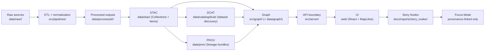

# 🛰️ `data/stac/` — STAC Catalog (Kansas Frontier Matrix)

[](#-what-this-folder-is)
[](#-boundary-artifacts-publishing-gate)
[](#-where-stac-fits-in-the-kfm-pipeline)
[](#-governance-and-safety)
[](#-non-negotiables-kfm-invariants)

KFM’s STAC catalog is the **canonical asset metadata boundary** between **final data products** (in `data/processed/`) and everything downstream (**Graph → API → UI → Story Nodes → Focus Mode**).

If an artifact can be:
- rendered on a map 🗺️,
- filtered on a timeline ⏱️,
- referenced as evidence 🧾,

…it should be **discoverable in STAC** (and aligned with **DCAT + PROV**).

---

## 🚀 Quick links

- ✅ STAC Collections → [`./collections/`](./collections/)
- ✅ STAC Items → [`./items/`](./items/)

Neighbor boundaries:
- 🗂️ DCAT (dataset discovery) → [`../catalog/dcat/`](../catalog/dcat/)
- 🧬 PROV (lineage bundles) → [`../prov/`](../prov/)
- 📦 Processed outputs (the actual files) → [`../processed/`](../processed/)
- 🕸️ Graph import artifacts (if used) → [`../graph/`](../graph/)
- 🗺️ Back to data root → [`../README.md`](../README.md)

---

<details>
<summary><b>🧭 Table of contents</b></summary>

- [What this folder is](#-what-this-folder-is)
- [Where STAC fits in the KFM pipeline](#-where-stac-fits-in-the-kfm-pipeline)
- [Non-negotiables (KFM invariants)](#-non-negotiables-kfm-invariants)
- [Folder layout](#-folder-layout)
- [STAC responsibilities in KFM](#-stac-responsibilities-in-kfm)
- [KFM STAC profile overlay](#-kfm-stac-profile-overlay)
- [Collections](#-collections-datasetlayer-level)
- [Items](#-items-assetgranule-level)
- [Assets](#-assets-what-items-point-to)
- [Cross-layer linkage](#-cross-layer-linkage-stac--dcat--prov--graph)
- [Add or update a dataset](#-add-or-update-a-dataset-checklist)
- [Validation](#-validation-and-ci-expectations)
- [Common pitfalls](#-common-pitfalls)
- [Governance and safety](#-governance-and-safety)
- [Reference shelf](#-reference-shelf)

</details>

---

## 🧾 What this folder is

### ✅ `data/stac/` **IS**
- The machine-readable registry of **what assets exist** and **how to find them**.
- The place where KFM expresses **spatial + temporal** discovery metadata.
- A required publishing interface: STAC is one of the **boundary artifacts** that downstream systems trust.

### ❌ `data/stac/` is **NOT**
- A storage location for the actual raster/vector/table outputs (those belong in `data/processed/`).
- A substitute for DCAT (DCAT is the dataset discovery layer across *all* dataset types).
- A substitute for PROV (PROV is the lineage chain for reproducibility and governance).

---

## 🧱 Where STAC fits in the KFM pipeline

KFM’s pipeline order is **absolute** (no shortcuts):

**ETL → Catalogs (STAC/DCAT/PROV) → Graph → API → UI → Story Nodes → Focus Mode**



> [!IMPORTANT]
> In KFM, **nothing is “published”** until the boundary artifacts exist:
> **STAC** (assets) + **DCAT** (discovery) + **PROV** (lineage).

---

## 🚧 Non-negotiables (KFM invariants)

These rules are what keep the catalog trustworthy and the UI safe:

1) **Pipeline ordering is inviolable**  
   No stage consumes outputs that haven’t passed the previous stage’s formal outputs + checks.

2) **Provenance-first publishing**  
   Every dataset/evidence artifact must be registered via **STAC/DCAT** and traced via **PROV** *before* graph/UI/story use.

3) **API boundary rule**  
   The UI must **never** query Neo4j directly. All access is mediated through the governed API boundary (`src/server/`).

4) **STAC Items must point to real assets**  
   Items must reference the actual output files (in `data/processed/**`) or stable external storage/endpoints.

5) **Graph references catalogs**  
   Neo4j stores **references/IDs** to catalog entries, not bulky payloads.

6) **Classification propagation**  
   Outputs must not be less restricted than inputs (no “classification downgrade” through processing).

7) **Evidence artifacts are first-class**  
   AI/analysis outputs (rasters, OCR corpora, predictions, reports) must follow the same rules: processed storage + STAC/DCAT + PROV + API mediation.

---

## 🗂️ Folder layout

KFM’s canonical STAC record locations:

```text
data/
└── stac/
    ├── README.md
    ├── collections/                  # STAC Collections (dataset/layer level)
    │   └── <collection-id>.json
    └── items/                        # STAC Items (granule/asset level)
        └── <collection-id>/
            └── <item-id>.json
```

> [!TIP]
> Keep **file = id** whenever possible. Stable IDs + stable paths are what make catalogs “boring” (and boring is good).

### Optional compatibility enhancement (recommended if you want external STAC tooling to “just work”)
You *may* add a root STAC Catalog (not required by KFM’s internal layout, but helpful for external validators/harvesters):

- `data/stac/catalog.json` (root catalog linking to collections)

If you add it, keep it deterministic and keep links relative.

---

## 🧠 STAC responsibilities in KFM

STAC exists so we can answer questions like:

- “What layers exist for drought risk in 1934 vs 1956?” 🌵
- “What does this layer cover spatially and temporally?” 🧭
- “Where are the actual files, and what format are they?” 📦
- “What license and attribution apply to this asset?” 📜
- “What run produced this, and what were the inputs?” 🧬

---

## 🧩 KFM STAC profile overlay

KFM uses base STAC, then extends/constraints it with project profiles:

- `docs/standards/KFM_STAC_PROFILE.md` *(expected home for the KFM STAC profile)*
- `schemas/stac/` *(expected home for JSON Schemas / profile schemas)*

> [!NOTE]
> If you need metadata that is not covered by STAC core or a standard extension, KFM’s rule is:
> **extend the KFM profile** (with review) rather than inventing ad-hoc fields.

### Recommended KFM namespaced keys (use only what your profile permits)

If your KFM STAC profile supports custom fields, prefer a single namespace (example: `kfm:`). Common needs:

- `kfm:domain` — domain slug (`air-quality`, `historical`, `soils`, etc.)
- `kfm:dcat_ref` — pointer to DCAT Dataset identifier/path
- `kfm:prov_ref` — pointer to PROV activity/bundle identifier/path
- `kfm:run_id` / `kfm:commit` — reproducibility hooks
- `kfm:classification` / `kfm:sensitivity` — governance tier
- `kfm:uncertainty` / `kfm:quality` — quality/confidence notes (especially for AI outputs)
- `kfm:derived_from` — stable pointers to upstream dataset IDs (when applicable)

> [!CAUTION]
> Don’t treat `kfm:*` as a free-for-all. Keep it minimal and schema-governed.

---

## 🧺 Collections (dataset/layer level)

A Collection represents a dataset/layer family (the “thing” the UI will list as a layer, with shared extent and defaults).

### Collection must-have fields (practical checklist)

- `stac_version`
- `type: "Collection"`
- `id`, `title`, `description`
- `license`
- `extent` (spatial + temporal)
- `links` (at minimum: `self`, `root` *(if you have a root)*, and any internal docs)
- `providers` *(recommended, and often required by profile)*
- `stac_extensions` *(include only what you actually use)*

<details>
<summary><strong>📄 Minimal Collection skeleton (example)</strong></summary>

```json
{
  "stac_version": "1.0.0",
  "type": "Collection",
  "id": "example-collection-id",
  "title": "Example Layer Title",
  "description": "What this dataset/layer is and why it exists.",
  "license": "CC-BY-4.0",
  "extent": {
    "spatial": { "bbox": [[-102.051, 36.993, -94.588, 40.003]] },
    "temporal": { "interval": [["1850-01-01T00:00:00Z", null]] }
  },
  "links": [
    { "rel": "self", "href": "./collections/example-collection-id.json", "type": "application/json" }
  ],
  "stac_extensions": [],
  "providers": [
    { "name": "Kansas Frontier Matrix", "roles": ["processor"] }
  ]
}
```

</details>

---

## 📦 Items (asset/granule level)

An Item represents a specific time slice, tile, AOI, or artifact instance that the UI can render or query.

### Item must-have fields (practical checklist)

- `stac_version`
- `type: "Feature"`
- `id`
- `collection` (must match the parent Collection `id`)
- `geometry` + `bbox` (WGS84 lon/lat)
- `properties.datetime` **or** `start_datetime` + `end_datetime`
- `assets` (each asset with `href` + `type` + optional `roles`)
- `links` (at minimum: `self`, `collection`, and any provenance/docs hooks)

<details>
<summary><strong>📄 Minimal Item skeleton (example)</strong></summary>

```json
{
  "stac_version": "1.0.0",
  "type": "Feature",
  "id": "example-collection-id__1934-06",
  "collection": "example-collection-id",
  "geometry": {
    "type": "Polygon",
    "coordinates": [[[ -102.051, 36.993 ], [ -94.588, 36.993 ], [ -94.588, 40.003 ], [ -102.051, 40.003 ], [ -102.051, 36.993 ]]]
  },
  "bbox": [-102.051, 36.993, -94.588, 40.003],
  "properties": {
    "datetime": "1934-06-01T00:00:00Z"
  },
  "assets": {
    "data": {
      "href": "../processed/<domain>/<dataset>/<version>/raster.tif",
      "type": "image/tiff; application=geotiff",
      "roles": ["data"]
    },
    "thumbnail": {
      "href": "../processed/<domain>/<dataset>/<version>/preview.png",
      "type": "image/png",
      "roles": ["thumbnail"]
    }
  },
  "links": [
    { "rel": "self", "href": "./items/example-collection-id/example-collection-id__1934-06.json", "type": "application/json" },
    { "rel": "collection", "href": "../../collections/example-collection-id.json", "type": "application/json" }
  ]
}
```

</details>

### Deterministic item IDs (recommended)

Item IDs should be derivable from stable inputs:

- Collection ID
- Time slice (`YYYY`, `YYYY-MM`, or `YYYY-MM-DD`)
- AOI/tile index (if applicable)
- Dataset version/run ID (when relevant)

Suggested patterns:

- `<collection>__<YYYY-MM-DD>`
- `<collection>__<YYYY-MM>__<aoi>`
- `<collection>__<tile>__<YYYY>__v<dataset-version>`

---

## 🧰 Assets (what Items point to)

### The golden rule
Items must point to **real outputs** (files or stable endpoints). Prefer stable, relative links when assets live in-repo.

### Recommended asset types (common in KFM)

**Rasters**
- COG GeoTIFFs: `image/tiff; application=geotiff`
- TileJSON: `application/json`
- Previews/thumbnails: `image/png` or `image/jpeg`

**Vectors**
- GeoJSON: `application/geo+json`
- GeoPackage: `application/geopackage+sqlite3`
- Parquet (tabular/geo): `application/x-parquet` *(check your profile/tooling)*

**Tables**
- CSV: `text/csv`
- JSON: `application/json`

> [!TIP]
> If you ship both “analysis-grade” and “web-grade” assets, reflect that with `roles` (e.g., `data` vs `overview`) and clear asset titles/descriptions.

### Checksums and integrity (recommended)

If your profile supports it, include checksums (sha256) and/or file size metadata in assets. This improves:
- reproducibility,
- tamper-evidence,
- debugging in CI.

---

## 🔗 Cross-layer linkage (STAC ↔ DCAT ↔ PROV ↔ Graph)

KFM relies on explicit cross-references so the graph and UI never drift from evidence.

### Cross-reference matrix

| Artifact | Lives in | Must link to | Why it matters |
|---|---|---|---|
| 🛰️ STAC Collection/Items | `data/stac/**` | the **actual assets** (files/endpoints) + attribution/license | drives map discovery + indexing |
| 🗂️ DCAT Dataset | `data/catalog/dcat/**` | STAC entry **and/or** access/download endpoint | discovery + harvestability |
| 🧬 PROV bundle | `data/prov/**` | raw → work → processed chain + run/config identifiers | reproducibility + trust |
| 🕸️ Graph nodes/edges | Neo4j / `src/graph/**` (+ `data/graph/**`) | STAC/DCAT/PROV identifiers | relationships without data duplication |

> [!CAUTION]
> Anything shown in UI must be served through the **API boundary** so governance rules (classification/redaction) are enforceable.

---

## ➕ Add or update a dataset (checklist)

### 0) Confirm where the real data lives
- [ ] Processed outputs are in `data/processed/<domain>/...` (not in `data/stac/`).

### 1) Create/Update the Collection
- [ ] `data/stac/collections/<collection-id>.json`
- [ ] Fill: `license`, `extent`, `providers`, and any required extensions/profile fields.

### 2) Create/Update Item(s)
- [ ] `data/stac/items/<collection-id>/<item-id>.json`
- [ ] Every item points to real assets (hrefs resolve).
- [ ] Temporal fields are correct (`datetime` or `start/end`).
- [ ] Geometries/bboxes are valid and match asset coverage.

### 3) Add boundary siblings
- [ ] DCAT Dataset entry exists under `data/catalog/dcat/`
- [ ] PROV lineage bundle exists under `data/prov/`
- [ ] If you add `kfm:dcat_ref` / `kfm:prov_ref`, make sure they resolve (stable IDs and/or stable paths).

### 4) Downstream integration (only after boundary artifacts exist)
- [ ] Graph ingest references STAC/DCAT/PROV IDs (no heavy payloads inside Neo4j).
- [ ] API endpoints expose layers/assets with redaction + classification.
- [ ] UI consumes only API responses.

---

## ✅ Validation and CI expectations

KFM expects catalogs to be machine-validatable and to fail fast when contracts break.

### Local sanity checks (portable)

```bash
# JSON validity
python -m json.tool data/stac/collections/<collection-id>.json > /dev/null
python -m json.tool data/stac/items/<collection-id>/<item-id>.json > /dev/null
```

### STAC validation (preferred)

If your repo/tooling includes `pystac`:

```bash
# Validate a collection and an item
pystac validate data/stac/collections/<collection-id>.json
pystac validate data/stac/items/<collection-id>/<item-id>.json
```

### Catalog QA (repo-dependent)

If the repo includes a catalog QA tool (often under `tools/validation/`), run it before opening a PR:

```bash
# Example (only if present in this repo):
python tools/validation/catalog_qa/run_catalog_qa.py --fail-on-broken-links
```

> [!NOTE]
> CI typically enforces: schema validity, broken link checks, provenance completeness, and security/governance scans.
> If the build fails, treat it as a contract violation—not “CI being picky.”

---

## 🙃 Common pitfalls

- **Broken asset hrefs** (item points to a file that doesn’t exist, or a hosted URL that’s unstable).
- **Missing license or providers** (makes downstream publication legally ambiguous).
- **Non-deterministic IDs** (IDs that change run-to-run break graph joins and UI caching).
- **Silent time drift** (items without correct `datetime` or inconsistent temporal extents).
- **Geometry lies** (bbox/geometry doesn’t match what the asset actually covers).
- **Ad-hoc fields** (`foo_bar_baz` shows up in one item) — extend the profile instead.
- **Publishing sensitive coordinates** (STAC is discoverability; treat it as potentially public).

---

## 🛡️ Governance and safety

### Classification & sensitivity
- If a dataset is sensitive, ensure STAC reflects that (classification fields per profile).
- Remember: **derived outputs can still leak** sensitive information. Classification must propagate.

### Sovereignty / culturally sensitive locations
- Avoid high-precision coordinates for protected places.
- Prefer generalized extents or withheld geometry where policy requires.
- Make sure any access is mediated by the API boundary so redaction rules apply.

### Evidence-first narrative
- Story Nodes and Focus Mode must only reference provenance-linked evidence.
- If you add an evidence artifact (AI output, OCR corpus, prediction layer), it must have:
  - STAC/DCAT records,
  - PROV lineage,
  - and explicit uncertainty/quality notes where applicable.

---

## 📚 Reference shelf

### Core KFM repo standards (expected canonical homes)
- `docs/MASTER_GUIDE_v13.md` *(canonical pipeline + invariants; supersedes v12)*
- `docs/standards/KFM_STAC_PROFILE.md`
- `docs/standards/KFM_DCAT_PROFILE.md`
- `docs/standards/KFM_PROV_PROFILE.md`
- `docs/templates/TEMPLATE__KFM_UNIVERSAL_DOC.md`
- `docs/templates/TEMPLATE__STORY_NODE_V3.md`

### System neighbors (where STAC connects)
- `data/processed/` (real assets)
- `data/catalog/dcat/` (discovery)
- `data/prov/` (lineage)
- `src/graph/` (+ `data/graph/` if used)
- `src/server/` (governed API boundary)
- `web/` (UI client)
- `docs/reports/story_nodes/` (narratives)

<details>
<summary><strong>📚 Project library (optional deep dives)</strong></summary>

These are not required to edit STAC, but they inform the broader KFM approach to:
- geospatial asset handling,
- validation discipline,
- provenance/reproducibility,
- UI/visualization constraints.

- KFM system documentation and design notes (internal project library)
- GIS fundamentals / map design references
- Remote sensing + Earth Engine workflow references
- Statistics/uncertainty and ML evidence references
- Engineering/reproducibility references (data versioning, CI, containers)

</details>

---

<p align="right"><a href="#-data-stac--stac-catalog-kansas-frontier-matrix">⬆️ Back to top</a></p>