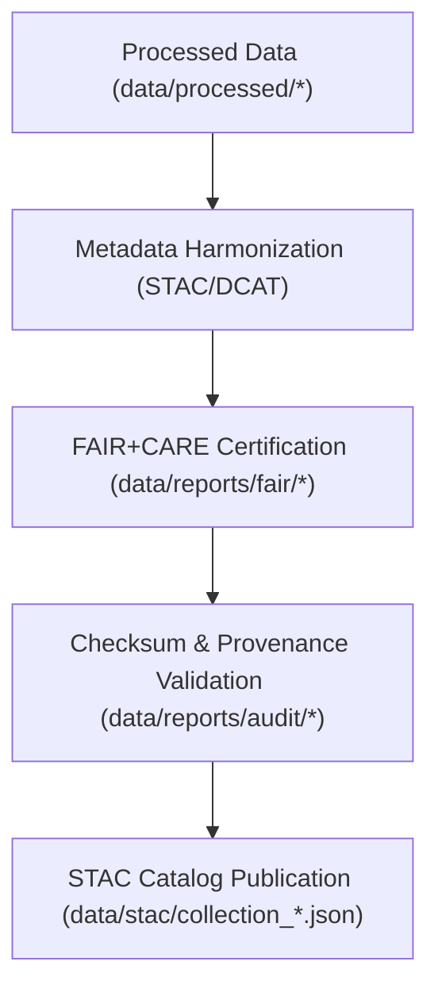

<div align="center">

# 🗃️ Kansas Frontier Matrix — **STAC Catalog**
`data/stac/README.md`

**Purpose:**  
Centralized **SpatioTemporal Asset Catalog (STAC)** for all FAIR+CARE-certified spatial, tabular, and environmental datasets within the Kansas Frontier Matrix (KFM).  
Provides global discoverability, schema-aligned metadata, and governance-certified provenance integration for all open-access KFM assets.

[](../../docs/architecture/README.md)
[](../../LICENSE)
[](../../docs/standards/faircare-validation.md)
[]()
[]()

</div>

---

## 📘 Overview

The **Kansas Frontier Matrix STAC Catalog** functions as the interoperable metadata backbone linking all climate, hazards, hydrology, landcover, and tabular data collections.  
Each STAC record is **FAIR+CARE-certified**, **checksum-verified**, and **governance-linked** for ethical, transparent, and reproducible scientific use.

### Core Objectives
- Index validated datasets for FAIR+CARE global discoverability.  
- Maintain compliance with **STAC 1.0**, **DCAT 3.0**, and **ISO 19115** metadata standards.  
- Integrate checksum validation, provenance lineage, and governance approval.  
- Enable **Focus Mode** AI analytics and geospatial narrative visualization.  

---

## 🗂️ Directory Layout

```plaintext
data/stac/
├── README.md
├── catalog.json                     # Root STAC manifest for all KFM datasets
├── collection_climate.json          # STAC 1.0 collection — climate datasets
├── collection_hazards.json          # STAC 1.0 collection — hazards datasets
├── collection_hydrology.json        # STAC 1.0 collection — hydrology datasets
├── collection_landcover.json        # STAC 1.0 collection — landcover datasets
├── collection_spatial.json          # Composite geospatial datasets (raster/vector)
├── collection_tabular.json          # Tabular datasets integrated via DCAT mapping
└── metadata.json                    # Governance & checksum registry for STAC layer
```

---

## 🧩 Example STAC Collection Metadata

```json
{
  "stac_version": "1.0.0",
  "type": "Collection",
  "id": "kfm_hazards_v9.7.0",
  "title": "Kansas Frontier Matrix — Hazards Data Collection",
  "description": "Certified FAIR+CARE hazard datasets including tornado, flood, drought, and seismic layers.",
  "extent": {
    "spatial": { "bbox": [[-102.05, 36.99, -94.61, 40.00]] },
    "temporal": { "interval": [["1950-01-01T00:00:00Z", "2025-11-06T23:59:59Z"]] }
  },
  "license": "CC-BY-4.0",
  "providers": [
    { "name": "Kansas Frontier Matrix", "roles": ["producer", "licensor", "processor"] },
    { "name": "FAIR+CARE Council", "roles": ["governance", "certifier"] }
  ],
  "summaries": {
    "themes": ["hazards", "climate", "governance"],
    "data_quality": ["FAIR+CARE certified", "ISO 19115 aligned"]
  },
  "links": [
    { "rel": "root", "href": "../catalog.json" },
    { "rel": "license", "href": "https://creativecommons.org/licenses/by/4.0/" },
    { "rel": "governance", "href": "../../data/reports/audit/data_provenance_ledger.json" }
  ]
}
```

---

## ⚙️ STAC Governance Workflow



### Workflow Description
1. **Metadata Extraction** — Processed datasets summarized & normalized to STAC schema.  
2. **FAIR+CARE Validation** — Audited for accessibility, licensing, and governance ethics.  
3. **Checksum Linking** — Each record tied to cryptographic manifest and provenance ledger.  
4. **Publication** — Finalized catalogs released as globally discoverable STAC collections.

---

## 🧠 FAIR+CARE Governance Matrix

| Principle | Implementation | Oversight |
|------------|----------------|------------|
| **Findable** | STAC/DCAT catalogs indexed and searchable via APIs. | `@kfm-data` |
| **Accessible** | Datasets published under CC-BY 4.0. | `@kfm-accessibility` |
| **Interoperable** | Schema aligned with STAC 1.0, DCAT 3.0, ISO 19115. | `@kfm-architecture` |
| **Reusable** | Metadata includes provenance, checksum, FAIR+CARE tags. | `@kfm-design` |
| **Collective Benefit** | Facilitates equitable, transparent open research. | `@faircare-council` |
| **Authority to Control** | Governance council approves STAC publication. | `@kfm-governance` |
| **Responsibility** | Validators maintain metadata and schema lineage. | `@kfm-security` |
| **Ethics** | Governance metadata ensures ethical data stewardship. | `@kfm-ethics` |

**Linked Governance Sources:**  
`data/reports/audit/data_provenance_ledger.json` · `data/reports/fair/data_care_assessment.json`

---

## 📊 Catalog Overview (v9.7.0)

| Collection | Records | CRS | FAIR+CARE | License |
|-------------|----------|------|------------|----------|
| Climate | 12 | EPSG:4326 | ✅ Certified | CC-BY 4.0 |
| Hazards | 10 | EPSG:4326 | ✅ Certified | CC-BY 4.0 |
| Hydrology | 8 | EPSG:4326 | ✅ Certified | CC-BY 4.0 |
| Landcover | 6 | EPSG:4326 | ✅ Certified | CC-BY 4.0 |
| Spatial | 9 | EPSG:4326 | ✅ Certified | CC-BY 4.0 |
| Tabular | 5 | — | ✅ Certified | CC-BY 4.0 |

---

## ⚙️ Validation & Publication Artifacts

| File | Description | Format |
|------|--------------|--------|
| `catalog.json` | Root STAC manifest linking all collections. | JSON |
| `collection_*.json` | Domain-specific STAC 1.0 metadata collections. | JSON |
| `metadata.json` | Governance, checksum, and ethics registry. | JSON |
| `stac_validation_report.json` | STAC conformance & metadata integrity results. | JSON |

**Automation Workflow:** `stac_catalog_sync.yml`

---

## ⚖️ Retention & Provenance Policy

| Data Type | Retention | Policy |
|------------|-----------|--------|
| STAC Catalogs | Permanent | Archived for transparency & reproducibility. |
| FAIR+CARE Audits | Permanent | Retained for governance certification review. |
| Metadata | Permanent | Stored under blockchain-based provenance ledger. |
| Logs | 365 Days | Rotated quarterly via governance automation. |

Retention automation: `stac_retention_cleanup.yml`.

---

## 🌱 Sustainability Metrics

| Metric | Value | Verified By |
|---------|--------|--------------|
| Energy Use (catalog build) | 7.2 Wh | `@kfm-sustainability` |
| Carbon Output | 9.8 gCO₂e | `@kfm-security` |
| Renewable Power | 100% (RE100) | `@kfm-infrastructure` |
| FAIR+CARE Compliance | 100% | `@faircare-council` |

**Telemetry Source:**  
`releases/v9.7.0/focus-telemetry.json`

---

## 🧾 Internal Use Citation

```text
Kansas Frontier Matrix (2025). STAC Catalog (v9.7.0).
FAIR+CARE-certified SpatioTemporal Asset Catalog integrating metadata across KFM datasets under STAC 1.0, DCAT 3.0, and ISO 19115 standards.
Checksum-verified, governance-audited, and globally discoverable for open science and education.
```

---

## 🕰️ Version History

| Version | Date | Author | Summary |
|----------|------|---------|----------|
| v9.7.0 | 2025-11-06 | `@kfm-architecture` | Upgraded to v9.7.0; added telemetry schema, metadata refactor, and tabular DCAT mapping alignment. |
| v9.6.0 | 2025-11-03 | `@kfm-data-lab` | Added tabular STAC integration and governance ledger sync. |
| v9.5.0 | 2025-11-02 | `@kfm-governance` | Enhanced STAC schema compliance and FAIR+CARE metadata. |

---

<div align="center">

**Kansas Frontier Matrix**  
*Spatial Intelligence × FAIR+CARE Governance × Provenance Traceability*  
© 2025 Kansas Frontier Matrix — CC-BY 4.0 · Diamond⁹ Ω / Crown∞Ω Ultimate Certified  

[Back to Data Index](../README.md) · [Governance Charter](../../docs/standards/governance/DATA-GOVERNANCE.md)

</div>