```mermaid
flowchart TD
  A["External Text Archives\nLOC · KSHS · Yale Avalon"] --> B["Source Manifests\n`data/sources/text/*.json`"]
  B --> C["ETL Pipeline\n`src/pipelines/text_pipeline.py`"]
  C --> D["Processed Text Corpora\n`data/processed/text/`"]
  D --> E["Derivatives\nTokenized · Parsed · Linked Text"]
  D --> F["STAC Collections\n`data/stac/collections/text.json`"]
  F --> G["Knowledge Graph\nPeople ↔ Places ↔ Events ↔ Documents"]
  E --> H["Web UI\nSearch · Timeline · Document Viewer"]
%%END OF MERMAID%%
```

```mermaid
flowchart TD
  A["External Text Archives\nLOC · KSHS · Yale Avalon"] --> B["Source Manifests\n`data/sources/text/*.json`"]
  B --> C["ETL Pipeline\n`src/pipelines/text_pipeline.py`"]
  C --> D["Processed Text Corpora\n`data/processed/text/`"]
  D --> E["Derivatives\nTokenized · Parsed · Linked Text"]
  D --> F["STAC Collections\n`data/stac/collections/text.json`"]
  F --> G["Knowledge Graph\nPeople ↔ Places ↔ Events ↔ Documents"]
%%END OF MERMAID%%
```

<div align="center">

# 📜 Kansas Frontier Matrix — Text Source Manifests

`data/sources/text/`

**Mission:** Curate, document, and validate all **external text-based datasets**—including digitized documents, OCR archives, oral histories, and treaty transcripts—
that serve as the linguistic and narrative foundation for the Kansas Frontier Matrix (KFM).

[](../../../.github/workflows/site.yml)
[](../../../.github/workflows/stac-validate.yml)
[](../schema/source.schema.json)
[](../../../.github/workflows/codeql.yml)
[](../../../docs/)
[](../../../LICENSE)

</div>

---

## 📚 Overview

The `data/sources/text/` directory houses **JSON manifests** describing every external text-based source integrated into KFM—
ranging from historical treaties and scanned documents to oral history transcripts and OCR corpora.

These sources provide the **linguistic, historical, and cultural backbone** of the Kansas knowledge system.

They support:

* Historical document digitization and transcription
* Named Entity Recognition (NER) and NLP enrichment
* Treaty and land-cession tracking
* Oral history integration within the knowledge graph
* STAC-linked provenance for textual archives

Each manifest adheres to `data/sources/schema/source.schema.json`, enabling transparent provenance, licensing,
and automated validation through CI/CD workflows.

---

## 🗂️ Directory Layout

```bash
data/sources/text/
├── README.md
├── loc_chronicling_america.json      # Library of Congress historical newspaper corpus
├── kshs_oral_histories.json          # Kansas Historical Society oral history transcripts
└── yale_avalon_treaties.json         # Yale Avalon Project — historical treaties & legal texts
```

> **Note:**
> Every manifest records dataset identifiers, licensing, provenance, and verification timestamps
> to ensure archival integrity and scholarly reproducibility.

---

## 🗞️ Example: `loc_chronicling_america.json`

```json
{
  "id": "loc_chronicling_america",
  "title": "Library of Congress — Chronicling America Historical Newspaper Corpus",
  "provider": "Library of Congress (LOC)",
  "description": "Digitized and OCR-processed newspaper archives spanning 1789–1963.",
  "endpoint": "https://chroniclingamerica.loc.gov/",
  "access_method": "HTTP API",
  "license": "Public Domain (US Government)",
  "data_type": "text",
  "format": "JSONL",
  "spatial_coverage": "Kansas, USA",
  "temporal_coverage": "1854–1963",
  "update_frequency": "Monthly",
  "last_verified": "2025-10-12",
  "linked_pipeline": "text_pipeline.py",
  "notes": "Used for NLP entity extraction, OCR correction, and timeline construction."
}
```

---

## 🧭 System Context (GitHub-safe Mermaid)



---

## 🧾 Text Source Summary

| Manifest File                  | Provider    | Description                                   | Coverage          | Format   | Verified     |
| :----------------------------- | :---------- | :-------------------------------------------- | :---------------- | :------- | :----------- |
| `loc_chronicling_america.json` | LOC         | OCR-based historical newspapers               | Kansas            | JSONL    | ✅ 2025-10-12 |
| `kshs_oral_histories.json`     | KSHS        | Transcribed oral histories and interviews     | Kansas            | TXT      | ✅ 2025-10-12 |
| `yale_avalon_treaties.json`    | Yale Avalon | Historical treaty and legal document archives | National / Global | HTML/TXT | ✅ 2025-10-12 |

---

## 🧾 ETL Integration

**Pipeline:** `src/pipelines/text_pipeline.py`
**Target Directory:** `data/processed/text/`

### Workflow

1. **Validate** manifests against schema (`make sources-validate`)
2. **Ingest** text sources via HTTP/API or download
3. **Normalize** (UTF-8 encoding, OCR cleanup, metadata tagging)
4. **Tokenize** and extract entities via NLP pipeline
5. **Link** documents to STAC items and knowledge graph entities
6. **Publish** checksums and metadata to GitHub

---

## 🧪 Validation Commands

**Manual Validation**

```bash
python src/utils/validate_sources.py data/sources/text/ --schema data/sources/schema/source.schema.json
```

**Make Targets**

```bash
make text-sources
make text-validate
```

**CI/CD Checks**

* Schema structure validation
* Endpoint and access check
* License and attribution validation
* Encoding consistency verification
* Changelog generation on manifest update

---

## 🧩 Provenance Integration

| Component                         | Function                                              |
| :-------------------------------- | :---------------------------------------------------- |
| `data/raw/text/`                  | Original OCR or transcript data                       |
| `data/processed/text/`            | Cleaned and NLP-enriched textual datasets             |
| `data/stac/collections/text.json` | STAC metadata linking back to manifests               |
| `data/checksums/text/`            | SHA-256 integrity verification for processed corpora  |
| `src/pipelines/text_pipeline.py`  | ETL process linking text sources to downstream assets |

---

## 🧠 MCP Compliance Summary

| MCP Principle           | Implementation                                                  |
| :---------------------- | :-------------------------------------------------------------- |
| **Documentation-first** | Each text dataset captured in a JSON manifest before ingestion. |
| **Reproducibility**     | ETL steps controlled via manifest-driven pipelines.             |
| **Open Standards**      | JSON Schema · UTF-8 · STAC 1.0 · NLP Metadata JSON.             |
| **Provenance**          | Traceable lineage: manifest → processed → knowledge graph.      |
| **Auditability**        | CI-validated manifests and checksum enforcement.                |

---

## 🧾 Changelog

| Version  | Date       | Summary                                                                   |
| :------- | :--------- | :------------------------------------------------------------------------ |
| **v1.1** | 2025-10-12 | Added workflow diagram, validation workflow, and LOC/KSHS/Yale manifests. |
| v1.0     | 2025-10-04 | Initial creation of text source manifest documentation.                   |

---

## 🏷️ Version Block

```text
Component: data/sources/text/README.md
SemVer: 1.1.0
Spec Dependencies: MCP v1.0 · STAC 1.0
Last Updated: 2025-10-12
Maintainer: @bartytime4life
```

---

<div align="center">

**Kansas Frontier Matrix** — *“Voices of the past become data for the future.”*
📍 [`data/sources/text/`](.) · Canonical registry of historical and linguistic sources powering KFM’s narrative and document intelligence.

</div>


<div align="center">

# 📜 Kansas Frontier Matrix — Text Source Manifests

`data/sources/text/`

**Mission:** Curate, document, and validate all **external text-based data sources** that provide the historical and linguistic backbone for the Kansas Frontier Matrix (KFM).
These include digitized newspapers, OCR archives, oral histories, and treaty collections that together form the state’s narrative record.

[](../../../.github/workflows/site.yml)
[](../../../.github/workflows/stac-validate.yml)
[](../schema/source.schema.json)
[](../../../docs/)
[](../../../LICENSE)

</div>

---

## 📚 Overview

`data/sources/text/` contains **JSON manifests** for every text source used in KFM.
Each manifest captures provenance, licensing, endpoints, and temporal coverage so that
narrative materials—newspapers, oral histories, treaties—can be ingested, parsed, and linked to the Knowledge Graph.

---

## 🗂️ Directory Layout

```bash
data/sources/text/
├── README.md
├── loc_chronicling_america.json      # Library of Congress newspaper corpus
├── kshs_oral_histories.json          # Kansas Historical Society transcripts
└── yale_avalon_treaties.json         # Yale Avalon Project treaties & legal docs
```

---

## 🗞️ Example Manifest

```json
{
  "id": "loc_chronicling_america",
  "title": "Library of Congress – Chronicling America",
  "provider": "Library of Congress",
  "description": "OCR-processed historical newspaper pages (1789–1963).",
  "endpoint": "https://chroniclingamerica.loc.gov/",
  "access_method": "HTTP API",
  "license": "Public Domain (US Government)",
  "data_type": "text",
  "format": "JSONL",
  "spatial_coverage": "Kansas, USA",
  "temporal_coverage": "1854–1963",
  "update_frequency": "Monthly",
  "last_verified": "2025-10-12",
  "linked_pipeline": "text_pipeline.py",
  "notes": "Used for OCR cleanup, entity extraction, and temporal indexing."
}
```

---

## 🧭 System Context (GitHub-safe Mermaid)



---

## ⚙️ ETL Integration

**Pipeline:** `src/pipelines/text_pipeline.py`
**Output:** `data/processed/text/`

### Steps

1. Validate manifests (`make sources-validate`)
2. Fetch text data via API or HTTP
3. Normalize encodings and metadata
4. Tokenize & extract named entities (NER)
5. Link results to STAC and Knowledge Graph
6. Publish checksums & provenance logs

---

## 🧩 Provenance Integration

| Component                         | Function                            |
| --------------------------------- | ----------------------------------- |
| `data/raw/text/`                  | Original OCR or transcript files    |
| `data/processed/text/`            | Cleaned & NLP-ready corpora         |
| `data/stac/collections/text.json` | STAC metadata links                 |
| `data/checksums/text/`            | SHA-256 verification                |
| `src/pipelines/text_pipeline.py`  | Orchestrates ingestion & enrichment |

---

## 🧠 MCP Compliance Summary

| MCP Principle           | Implementation                               |
| ----------------------- | -------------------------------------------- |
| **Documentation-first** | Every corpus defined by a JSON manifest.     |
| **Reproducibility**     | Deterministic ETL using manifest parameters. |
| **Open Standards**      | JSON Schema · UTF-8 · STAC 1.0.              |
| **Provenance**          | Manifest → Processed → STAC → Graph.         |
| **Auditability**        | CI validation and checksum enforcement.      |

---

## 🧾 Changelog

| Version  | Date       | Summary                                                    |
| -------- | ---------- | ---------------------------------------------------------- |
| **v1.1** | 2025-10-12 | Added diagram, validation workflow, and manifest examples. |
| v1.0     | 2025-10-04 | Initial creation of text source documentation.             |

---

## 🏷️ Version Block

```text
Component: data/sources/text/README.md
SemVer: 1.1.0
Spec Dependencies: MCP v1.0 · STAC 1.0
Last Updated: 2025-10-12
Maintainer: @bartytime4life
```

---

<div align="center">

**Kansas Frontier Matrix** — *“Voices of the past become data for the future.”*
📍 [`data/sources/text/`](.) · Canonical registry of historical and linguistic sources powering KFM’s narrative intelligence.

</div>
