<div align="center">

# 🧺 STAC Collections — `data/stac/collections/`


**Collection-level metadata** for KFM’s STAC boundary artifacts.  
One JSON per dataset/layer. Boring on purpose. ✅

</div>

---

## 🚀 Quick links

- 🛰️ STAC root → [`../README.md`](../README.md)
- 📦 STAC Items (granules/assets) → [`../items/`](../items/)
- 🗂️ DCAT (dataset discovery) → [`../../catalog/dcat/`](../../catalog/dcat/)
- 🧬 PROV (lineage bundles) → [`../../prov/`](../../prov/)
- 📦 Processed outputs (real files) → [`../../processed/`](../../processed/)
- 🔐 Security policy → [`../../../SECURITY.md`](../../../SECURITY.md) *(or `.github/SECURITY.md` depending on repo convention)*

> [!IMPORTANT]
> In KFM, **Collections are part of the publishing gate**.  
> If it ships downstream (Graph/API/UI/Story/Focus), it must have **STAC + DCAT + PROV**.

---

<details>
<summary><strong>📌 Table of contents</strong></summary>

- [🎯 What this folder is (and is not)](#-what-this-folder-is-and-is-not)
- [🧱 Where Collections fit in the KFM pipeline](#-where-collections-fit-in-the-kfm-pipeline)
- [🗂️ Directory contract](#️-directory-contract)
- [🏷️ IDs & naming conventions](#️-ids--naming-conventions)
- [🧺 What a Collection represents in KFM](#-what-a-collection-represents-in-kfm)
- [✅ Required fields (practical checklist)](#-required-fields-practical-checklist)
- [🔗 Linkage rules: Collection ↔ Items ↔ DCAT ↔ PROV](#-linkage-rules-collection--items--dcat--prov)
- [🔐 Governance & sensitive metadata rules](#-governance--sensitive-metadata-rules)
- [✅ Add a new Collection (checklist)](#-add-a-new-collection-checklist)
- [🧪 Validation & CI expectations](#-validation--ci-expectations)
- [🧩 Minimal Collection template (starter)](#-minimal-collection-template-starter)
- [📚 Reference shelf](#-reference-shelf)

</details>

---

## 🎯 What this folder is (and is not)

### ✅ This folder **IS**
- A canonical location for **STAC Collection JSON** (dataset/layer-level metadata).
- A stable join key surface for **Graph**, **API**, **UI**, and **Story Nodes**.
- A contract boundary: Collections must be **machine-validatable**, **deterministic**, and **governed**.

### ❌ This folder is **NOT**
- A place for actual data files (those belong in `data/processed/**`).
- A place for STAC Items (those live in `data/stac/items/<collection-id>/`).
- A place for ad-hoc, unvalidated metadata (“schemas > vibes” 🧠).

---

## 🧱 Where Collections fit in the KFM pipeline

KFM’s pipeline order is strict:

**ETL → Catalogs (STAC/DCAT/PROV) → Graph → API → UI → Story Nodes → Focus Mode**

```mermaid
flowchart LR
  RAW["📥 data/raw/<domain>/"] --> WORK["🧰 data/work/<domain>/"]
  WORK --> PROC["📦 data/processed/<domain>/"]
  PROC --> COLL["🧺 STAC Collections\n(data/stac/collections/)"]
  PROC --> ITEMS["📦 STAC Items\n(data/stac/items/)"]
  COLL --> DCAT["🗂️ DCAT\n(data/catalog/dcat/)"]
  COLL --> PROV["🧬 PROV\n(data/prov/)"]
  ITEMS --> DCAT
  ITEMS --> PROV

  COLL --> GRAPH["🕸️ Graph (Neo4j)\nreferences IDs"]
  DCAT --> GRAPH
  PROV --> GRAPH
  GRAPH --> API["🔌 API boundary\n(contracts + redaction)"]
  API --> UI["🗺️ UI\n(map/timeline/downloads)"]
  UI --> STORY["🎬 Story Nodes"]
  STORY --> FOCUS["🧠 Focus Mode\n(provenance-linked only)"]
```



> [!TIP]
> Think of Collections as the **“layer directory”** the UI expects to browse.  
> Items are the **“instances/granules/assets”** the UI expects to render or fetch.

---

## 🗂️ Directory contract

### Expected layout

```text
data/stac/
├─ 📄 README.md                     # 📘 STAC overview: root layout, link rules, and how the UI/API discover assets
├─ 🗂️ collections/
│  ├─ 📄 README.md                  # 👈 you are here 📌 Collection naming, required fields, and cross-links to items/assets
│  ├─ ✅🧾 <collection-id>.json       # ✅ One file per STAC Collection (dataset-level metadata: extent/license/providers/links)
│  └─ ➕ …                           # Additional collections
└─ 🧷 items/
   └─ 🗂️ <collection-id>/           # Items grouped under their parent collection id
      ├─ 🧾 <item-id>.json           # STAC Item (time/run snapshot referencing assets with hrefs + roles + mediaTypes)
      └─ ➕ …                         # Additional items for the collection (new timestamps/versions)
```

### What belongs here
- `Collection` JSON only:
  - metadata that applies to the **layer family** (extent, license, providers, summaries)
  - stable IDs and links that help downstream stages connect evidence

### What must never land here
- data assets (COGs/GeoJSON/Parquet/PDFs)
- per-granule STAC Items
- secrets/tokens/credentials (ever)
- enormous autogenerated dumps that can’t be reviewed in PRs

---

## 🏷️ IDs & naming conventions

KFM lives on stable identifiers. Pick an ID once, then never regret it. ✅

### Recommended **Collection ID** pattern
Use KFM-style dataset IDs as the Collection `id`:

```text
kfm.<state|region>.<theme>.<time_or_range>.v<version>
# example:
kfm.ks.landcover.2000_2020.v1
```

### File naming recommendation
Prefer **file = id**:

```text
data/stac/collections/kfm.ks.landcover.2000_2020.v1.json
```

> [!NOTE]
> If your repo standard prefers kebab-case file names, enforce it consistently and provide a mapping in DCAT/PROV (but keep the Collection `id` stable).

### Determinism rules (don’t break joins)
- Do **not** include timestamps in IDs.
- Do **not** derive IDs from file hashes that can change due to metadata reorders.
- If you must change an ID, treat it as a **breaking change** and provide explicit predecessor/successor links (and bump contract versions).

---

## 🧺 What a Collection represents in KFM

A Collection represents a **dataset/layer family** that:
- can be discovered (search, browse),
- can be referenced as evidence (Story/Focus),
- may have one or many Items (time slices, tiles, AOIs, versions).

### Non-spatial datasets
KFM may still create a Collection for consistency even when the dataset is not inherently geospatial. Common strategies:
- Use a coarse Kansas-level bbox in `extent.spatial` *(or omit geometry at Item level if your profile allows)*
- Publish a single Item that carries temporal metadata and links to the artifact (CSV/PDF/etc.)

---

## ✅ Required fields (practical checklist)

Collections should be valid STAC Collections and meet KFM profile requirements.

### Must-have (practical)
- `stac_version`
- `type: "Collection"`
- `id` *(stable)*
- `title`, `description`
- `license`
- `extent` *(spatial bbox + temporal interval)*
- `links` *(at least `self`; and ideally link to Items)*
- `providers` *(recommended; often required by profile)*

### Strongly recommended (KFM-friendly)
- `summaries` *(for UI filters: years, categories, bands, etc.)*
- `keywords` *(if supported; otherwise store in DCAT)*
- `stac_extensions` *(only what you actually use)*

> [!IMPORTANT]
> Missing license/providers/extent breaks downstream publishing. Treat it as a contract violation. 🧾

---

## 🔗 Linkage rules: Collection ↔ Items ↔ DCAT ↔ PROV

KFM survives on link integrity.

### Minimum linkage expectations
- Every Collection should have Items under:
  - `data/stac/items/<collection-id>/`
- Every published dataset should have sibling boundary artifacts:
  - DCAT entry under `data/catalog/dcat/`
  - PROV bundle under `data/prov/`

### Recommended links inside `links[]`
*(Choose what your profile supports; keep it consistent.)*

- `self` → `./<collection-id>.json`
- `items` → `../items/<collection-id>/` *(directory or catalog endpoint)*
- `describedby` → matching DCAT dataset record
- `via` *(or `related`)* → PROV lineage bundle or run report

> [!CAUTION]
> Don’t hardcode storage URLs that bypass governance.  
> Prefer links that resolve via governed API endpoints (or repo-relative assets that are safe).

---

## 🔐 Governance & sensitive metadata rules

STAC is discoverability metadata — treat it as **potentially public**.

### Classification propagation
- Outputs must not be **less restricted** than inputs.
- Derived layers can still leak sensitive info (inference risk is real).

### Safe patterns for sensitive datasets
- Use coarse extents (county-level / Kansas-level bounding boxes).
- Avoid embedding precise sensitive locations in titles/descriptions.
- Keep distribution links gated via API boundary when needed.

> [!IMPORTANT]
> If a dataset implicates sovereignty, protected resources, or culturally sensitive locations:
> - generalize extents,
> - avoid precise coordinate disclosure,
> - follow governance docs and `SECURITY.md`.

---

## ✅ Add a new Collection (checklist)

### 0) Decide the ID (join key) 🏷️
- [ ] Choose stable `collection-id` (prefer KFM dataset ID convention).
- [ ] Confirm it matches DCAT `dct:identifier` *(recommended)*.

### 1) Create the Collection JSON 🧺
- [ ] `data/stac/collections/<collection-id>.json`
- [ ] Include license, providers, extent, and links.

### 2) Add Item folder 📦
- [ ] `data/stac/items/<collection-id>/`
- [ ] Add at least one `<item-id>.json` that points to real assets.

### 3) Add sibling boundary artifacts 🧬
- [ ] `data/catalog/dcat/<dataset-id>.jsonld`
- [ ] `data/prov/<run-id>/prov.jsonld` *(or your repo’s PROV bundle convention)*

### 4) Validate + open PR ✅
- [ ] JSON validity + STAC validation + link checks
- [ ] Ensure no secrets/sensitive details slipped in
- [ ] Update `CHANGELOG.md` under `[Unreleased]` if governance/contracts changed

---

## 🧪 Validation & CI expectations

### Local sanity checks
```bash
python -m json.tool data/stac/collections/<collection-id>.json > /dev/null
```

### STAC validation (recommended)
If `pystac` is part of your toolchain:

```bash
pystac validate data/stac/collections/<collection-id>.json
```

### Catalog QA (repo tool, if present)
```bash
python tools/validation/catalog_qa/run_catalog_qa.py --root data/ --fail-on-warn
```

> [!TIP]
> CI should fail on missing required fields, broken links, provenance gaps, and secrets/sensitive leaks.  
> Keep the “catalog QA” gate fast so PRs stay safe and boring. ✅

---

## 🧩 Minimal Collection template (starter)

> [!NOTE]
> This is a starter shape. Your KFM STAC profile may require additional fields or extensions.

```json
{
  "stac_version": "1.0.0",
  "type": "Collection",
  "id": "kfm.ks.landcover.2000_2020.v1",
  "title": "Kansas Landcover (2000–2020) — v1",
  "description": "Short, human-readable description. Include caveats and intended use.",
  "license": "CC-BY-4.0",
  "extent": {
    "spatial": { "bbox": [[-102.051, 36.993, -94.588, 40.003]] },
    "temporal": { "interval": [["2000-01-01T00:00:00Z", "2020-12-31T23:59:59Z"]] }
  },
  "providers": [
    { "name": "Kansas Frontier Matrix", "roles": ["processor"] }
  ],
  "links": [
    { "rel": "self", "href": "./kfm.ks.landcover.2000_2020.v1.json", "type": "application/json" },
    { "rel": "items", "href": "../items/kfm.ks.landcover.2000_2020.v1/", "type": "application/json" }
  ],
  "stac_extensions": [],
  "summaries": {},

  "kfm:domain": "landcover",
  "kfm:classification": "open",
  "kfm:sensitivity": "public",
  "kfm:dcat_ref": "../../catalog/dcat/kfm.ks.landcover.2000_2020.v1.jsonld",
  "kfm:prov_ref": "../../prov/<run-id>/prov.jsonld"
}
```

---

## 📚 Reference shelf

> [!NOTE]
> The files below are the project’s **reference library / governance bundle**.  
> They may have licenses different from the repo’s code/data. Respect upstream terms.

### 🧭 Core KFM docs (normative / governance)
- `MARKDOWN_GUIDE_v13.md` *(or your repo’s canonical Markdown protocol doc)*
- `Kansas Frontier Matrix (KFM) – Comprehensive Technical Documentation.docx`
- `🌟 Kansas Frontier Matrix – Latest Ideas & Future Proposals.docx`
- `Kansas-Frontier-Matrix_ Open-Source Geospatial Historical Mapping Hub Design.pdf`

### 🛰️ GIS + remote sensing + cartography (supports STAC asset thinking)
- `python-geospatial-analysis-cookbook.pdf`
- `PostgreSQL Notes for Professionals - PostgreSQLNotesForProfessionals.pdf`
- `making-maps-a-visual-guide-to-map-design-for-gis.pdf`
- `Mobile Mapping_ Space, Cartography and the Digital - 9789048535217.pdf`
- `Cloud-Based Remote Sensing with Google Earth Engine-Fundamentals and Applications.pdf`
- `compressed-image-file-formats-jpeg-png-gif-xbm-bmp.pdf`

### 🌐 Web + 3D visualization (UI consumers of STAC)
- `responsive-web-design-with-html5-and-css3.pdf`
- `webgl-programming-guide-interactive-3d-graphics-programming-with-webgl.pdf`

### 📈 Stats / ML / modeling rigor (evidence discipline)
- `Understanding Statistics & Experimental Design.pdf`
- `regression-analysis-with-python.pdf`
- `Regression analysis using Python - slides-linear-regression.pdf`
- `graphical-data-analysis-with-r.pdf`
- `think-bayes-bayesian-statistics-in-python.pdf`
- `Scientific Modeling and Simulation_ A Comprehensive NASA-Grade Guide.pdf`
- `Deep Learning for Coders with fastai and PyTorch - Deep.Learning.for.Coders.with.fastai.and.PyTorchpdf`

### ⚙️ Systems + scale + interoperability
- `Scalable Data Management for Future Hardware.pdf`
- `concurrent-real-time-and-distributed-programming-in-java-threads-rtsj-and-rmi.pdf`
- `Data Spaces.pdf`

### ❤️ Ethics + autonomy + governance context
- `Introduction to Digital Humanism.pdf`
- `Principles of Biological Autonomy - book_9780262381833.pdf`
- `On the path to AI Law’s prophecies and the conceptual foundations of the machine learning age.pdf`

### 🧰 General programming shelf (bundles)
- `A programming Books.pdf`
- `B-C programming Books.pdf`
- `D-E programming Books.pdf`
- `F-H programming Books.pdf`
- `I-L programming Books.pdf`
- `M-N programming Books.pdf`
- `O-R programming Books.pdf`
- `S-T programming Books.pdf`
- `U-X programming Books.pdf`

---

<p align="right"><a href="#-stac-collections--datastaccollections">⬆️ Back to top</a></p>

