<div align="center">

# 🗺️ Kansas Frontier Matrix — Map Tiles Directory

`data/tiles/`

**Mission:** Serve as the **central registry and storage** for pre-rendered raster and vector tiles used in the
Kansas Frontier Matrix (KFM) web viewer — enabling reproducible, high-performance visualization of geospatial data
across space, time, and thematic domains.

[](../../.github/workflows/site.yml)
[](../../.github/workflows/stac-validate.yml)
[](../../.github/workflows/codeql.yml)
[](../../docs/)
[](../../LICENSE)

</div>

---

## 📚 Overview

The `data/tiles/` directory contains **pre-rendered raster and vector tiles** derived from validated datasets
in `data/processed/`. These tiles provide optimized, multi-resolution visual layers for
MapLibre, Leaflet, Cesium, and other web-mapping frameworks.

**Tile types include:**

* 🗻 **Raster tiles** — Hillshade, elevation, precipitation, drought, and temperature rasters.
* 🧭 **Vector tiles** — Stream networks, floodplains, political boundaries, and historical features.

Each tileset is **linked via STAC metadata**, ensuring provenance, auditability, and reproducibility.

---

## 🗂️ Directory Layout

```bash
data/tiles/
├── README.md
├── terrain/                 # Elevation, hillshade, slope
├── hydrology/               # Rivers, basins, floodplains
├── landcover/               # NLCD, vegetation, land use
├── climate/                 # Temperature, precipitation, drought indices
├── hazards/                 # Tornado, wildfire, and flood hazards
├── tabular/                 # Population density, economic surfaces
└── text/                    # OCR overlays, historical annotations
```

> **Note:** Each subfolder mirrors the `data/processed/` structure — ensuring consistency
> across ETL, rendering, and visualization pipelines.

---

## 🧭 System Context (GitHub-safe Mermaid)

```mermaid
flowchart TD
  A["Processed Datasets\n`data/processed/*`"] --> B["Tile Generation\n`make tiles` · `generate_tiles.py`"]
  B --> C["Raster Tiles\nCOG · PNG · JPG"]
  B --> D["Vector Tiles\nPBF · GeoJSON"]
  C --> E["Web Map Viewer\nMapLibre · Leaflet · Cesium"]
  D --> E
  B --> F["STAC Metadata\n`data/stac/tiles/*.json`"]
  F --> G["Knowledge Graph\nTile ↔ Layer ↔ Dataset Links"]
%%END OF MERMAID%%
```



---

## ⚙️ Tile Generation Workflow

Tiles are generated via deterministic scripts using GDAL, Tippecanoe, or MapTiler.

**Makefile targets:**

```bash
make tiles
make clean-tiles
```

**Python example:**

```bash
python src/utils/generate_tiles.py \
  --input data/processed/terrain/ks_1m_dem_2018_2020.tif \
  --output data/tiles/terrain/ks_dem_1m/
```

**Workflow Steps**

1. Load validated processed datasets (COG, GeoJSON, or Parquet).
2. Set schema: `EPSG:3857` (Web Mercator).
3. Render raster or vector tiles at defined zoom levels.
4. Export to domain directory under `data/tiles/`.
5. Validate structure via GitHub CI and STAC validation.

---

## 🧰 Tile Standards & Metadata

| Type         | Format                        | Description                                              |
| ------------ | ----------------------------- | -------------------------------------------------------- |
| **Raster**   | `.png`, `.jpg`, `.tif` (COG)  | Map imagery: elevation, hillshade, or precipitation.     |
| **Vector**   | `.pbf`                        | Encoded features such as rivers, parcels, or hazards.    |
| **Schema**   | EPSG:3857                     | Standard Web Mercator projection.                        |
| **Metadata** | `metadata.json`, `tiles.json` | Bounding boxes, zoom levels, attribution, and endpoints. |

> All vector tiles comply with the [Mapbox Vector Tile Specification v2.1](https://docs.mapbox.com/data/tilesets/reference/).

---

## 🧩 Integration with the KFM Web Viewer

| Component                  | Function                                            |
| -------------------------- | --------------------------------------------------- |
| `web/config/layers.json`   | Layer definitions, styling, and endpoints.          |
| `web/app.js`               | Dynamically loads tiles via STAC or REST endpoints. |
| `data/processed/metadata/` | Links tile assets to dataset metadata.              |
| `data/stac/tiles/`         | Central STAC catalog of available tile collections. |

**Example Layer Definition**

```json
{
  "id": "terrain-hillshade",
  "type": "raster",
  "source": {
    "type": "raster",
    "tiles": ["data/tiles/terrain/ks_hillshade/{z}/{x}/{y}.png"],
    "tileSize": 256
  },
  "paint": {"raster-opacity": 0.85}
}
```

---

## 🧪 Validation & CI/CD Integration

**Local validation**

```bash
python src/utils/validate_tiles.py data/tiles/
```

**GitHub Actions**

* `stac-validate.yml` — Confirms tile STAC metadata validity
* `site.yml` — Builds demo maps for PR previews
* `codeql.yml` — Audits code and scripts for security
* `trivy.yml` — Scans Docker tile-building environment

---

## 🧹 Cleanup & Regeneration

**Makefile targets**

```bash
make clean-tiles      # Delete all generated tiles
make tiles-refresh    # Rebuild updated tilesets
```

**Manual Cleanup**

```bash
rm -rf data/tiles/*/
```

> 🧭 *Regenerate tiles whenever base datasets or styles are updated.*

---

## 🧠 MCP Compliance Summary

| MCP Principle           | Implementation                                                   |
| ----------------------- | ---------------------------------------------------------------- |
| **Documentation-first** | README and schema-driven workflows define reproducibility.       |
| **Reproducibility**     | Tiles generated deterministically via Makefile + Python scripts. |
| **Open Standards**      | Mapbox Vector Tile Spec, COG, EPSG:3857, STAC 1.0.               |
| **Provenance**          | Linked to validated datasets and STAC entries.                   |
| **Auditability**        | Continuous validation in CI/CD pipelines ensures integrity.      |

---

## 🧾 Changelog

| Version  | Date       | Summary                                                                       |
| -------- | ---------- | ----------------------------------------------------------------------------- |
| **v1.1** | 2025-10-12 | Expanded CI validation, added Mermaid diagram, enhanced integration examples. |
| v1.0     | 2025-10-04 | Initial creation of map tile documentation.                                   |

---

## 🏷️ Version Block

```text
Component: data/tiles/README.md
SemVer: 1.1.0
Spec Dependencies: MCP v1.0 · STAC 1.0
Last Updated: 2025-10-12
Maintainer: @bartytime4life
```

---

<div align="center">

**Kansas Frontier Matrix** — *“Rendering the Past and Present — One Tile at a Time.”*
📍 [`data/tiles/`](.) · Reproducible registry of raster and vector map tiles powering the KFM visualization engine.

</div>
