<div align="center">

# 💧 Kansas Frontier Matrix — Hydrology Tiles  
`data/tiles/hydrology/`

**Mission:** Host **pre-rendered raster and vector map tiles** that represent Kansas’s hydrological features —  
rivers, watersheds, basins, floodplains, aquifers, and flow networks — optimized for high-performance visualization  
in the **Kansas Frontier Matrix (KFM)** web mapping interface and Google Earth integrations.

[](../../../.github/workflows/site.yml)
[](../../../.github/workflows/stac-validate.yml)
[](../../../.github/workflows/codeql.yml)
[](../../../.github/workflows/trivy.yml)
[](../../../docs/)
[](../../../LICENSE)

</div>

---

## 📚 Overview

The `data/tiles/hydrology/` directory contains **map tile pyramids** (both raster and vector) used to visualize  
Kansas’s hydrological systems efficiently across zoom levels. These tiles power the **Hydrology Layer** in the  
KFM web interface and time-aware map explorer.

**Types of hydrology tiles:**
- 🌊 **Rivers and Streams:** Derived from USGS NHD and KGS Hydrography layers  
- 💧 **Watersheds:** HUC2–HUC12 boundaries and flow accumulation zones  
- 🧭 **Flow Networks:** AI-enhanced tracing of stream connectivity using DEM flow direction grids  
- 🪣 **Basins & Flood Zones:** FEMA and historical hydrological event overlays  
- 💦 **Aquifer Boundaries:** Kansas Geological Survey (KGS) groundwater layers  

---

## 🧱 Directory Layout

```bash
data/
└── tiles/
    ├── hydrology/
    │   ├── rivers/            # Vector tiles (rivers, streams)
    │   ├── basins/            # Watershed & basin boundaries
    │   ├── flow/              # Flow accumulation, direction overlays
    │   ├── aquifers/          # Subsurface hydrology boundaries
    │   ├── floodplains/       # FEMA flood zones
    │   ├── thumbnails/        # PNG overviews for documentation & UI
    │   └── metadata/          # Tile source configs & JSON descriptors
````

Each subdirectory follows the **STAC + MCP** structure with metadata JSONs, provenance, and integrity hashes.

---

## 🧩 Data Provenance

| Dataset                 | Source                   | License       | Format                             | Notes                  |
| ----------------------- | ------------------------ | ------------- | ---------------------------------- | ---------------------- |
| USGS NHD                | U.S. Geological Survey   | Public Domain | GeoPackage → MVT                   | Stream networks        |
| KGS Hydrology           | Kansas Geological Survey | CC-BY 4.0     | GeoTIFF → COG                      | Aquifer layers         |
| FEMA Flood Zones        | FEMA                     | Public Domain | Shapefile → GeoJSON → Vector Tiles | Flood hazard polygons  |
| AI-Derived Flow Network | KFM ML Pipeline          | MIT           | GeoTIFF                            | DEM-based flow tracing |

Each tile pyramid has a **STAC item** in `data/stac/items/hydrology/` for reproducibility and traceability.

---

## ⚙️ Processing Pipeline

```mermaid
flowchart TD
  A["Raw Hydrology Data<br/>USGS · KGS · FEMA · AI Models"] --> B["ETL Pipeline<br/>Python · GDAL · Tippecanoe"]
  B --> C["COGs & GeoJSON Layers<br/>validated & georeferenced"]
  C --> D["Tile Generation<br/>Raster/Vector Tilesets (z3–z14)"]
  D --> E["STAC Catalog<br/>Metadata, checksums, provenance"]
  E --> F["Web Map Integration<br/>MapLibre · Google Earth KML"]
%%END OF MERMAID%%
```



Tiles are generated during the automated ETL using the `make hydrology-tiles` target and validated by the STAC workflow.

---

## 🌐 Integration Points

| System                        | Role                      | Connection                                                              |
| ----------------------------- | ------------------------- | ----------------------------------------------------------------------- |
| **MapLibre GL (Web App)**     | Interactive visualization | Loads hydrology tile layers from `/tiles/hydrology/{layer}/{z}/{x}/{y}` |
| **Google Earth (KMZ export)** | Global visualization      | Linked to tile URLs or static overlays                                  |
| **STAC Catalog**              | Provenance tracking       | `data/stac/items/hydrology/*.json`                                      |
| **Knowledge Graph (Neo4j)**   | Semantic linking          | Entities: `HydrologyFeature`, `Watershed`, `River`                      |
| **API Layer (FastAPI)**       | Query + metadata          | `/layers/hydrology` endpoint provides tileset manifests                 |

---

## 🔒 Reproducibility & Checksums

All tile datasets are accompanied by:

* `.sha256` integrity files (in `data/tiles/hydrology/checksums/`)
* `metadata.json` for each layer
* Source commit IDs and environment manifests in STAC records

---

## 🧾 Versioning

**Semantic Version:** `v1.0.0`
**STAC Spec:** `1.0.0`
**MCP Schema:** `v1.2`
**Last Updated:** `2025-10-12`

---

## 🪶 Changelog

| Version    | Date       | Changes                                                                                                     |
| ---------- | ---------- | ----------------------------------------------------------------------------------------------------------- |
| **v1.0.0** | 2025-10-12 | Initial hydrology tiles documentation; added badges, provenance tables, CI integration, and Mermaid diagram |
| **v0.9.0** | 2025-10-10 | Drafted structure and directory layout                                                                      |
| **v0.8.0** | 2025-10-08 | Added sample river and basin vector tiles                                                                   |

---

## 🧠 AI Enrichment

AI-generated flow accumulation and basin boundaries are derived from **NASA SRTM 1m DEMs** using the
*KFM Hydrology ML Model v2.1*. The AI enrichment process applies:

* CNN-based flow path recognition
* Watershed segmentation via DEM curvature clustering
* Validation against NHD reference flow lines

Outputs are annotated in STAC metadata with confidence intervals (0.91–0.97).

---

## 🔗 Related Documentation

* [Hydrology Data (Processed)](../../../data/processed/hydrology/README.md)
* [Hydrology Metadata (STAC)](../../../data/processed/metadata/hydrology/README.md)
* [Web Hydrology Layer Configuration](../../../web/config/layers/hydrology.json)
* [KFM Architecture Overview](../../../docs/architecture.md)

---

## 🧩 Example Tile Endpoint

```
/tiles/hydrology/rivers/{z}/{x}/{y}.pbf
/tiles/hydrology/floodplains/{z}/{x}/{y}.png
```

Use in MapLibre:

```js
map.addSource('rivers', {
  type: 'vector',
  tiles: ['https://kfm.example.org/tiles/hydrology/rivers/{z}/{x}/{y}.pbf'],
  minzoom: 3,
  maxzoom: 14
});
```

---

<div align="center">

**Kansas Frontier Matrix** · *Time · Terrain · History*
[🌐 Repository](https://github.com/bartytime4life/Kansas-Frontier-Matrix) | [📘 Docs](../../../docs/) | [🧭 STAC](../../../data/stac/)

</div>
```

