<div align="center">

# 💧 Kansas Frontier Matrix — Hydrology Aquifers  
`data/tiles/hydrology/aquifers/`

**Mission:** Store and document **aquifer-related raster and vector datasets** representing Kansas’s subsurface  
hydrologic systems — including **major aquifer extents, saturated thickness, transmissivity, and groundwater flow**.  
These layers form the foundation for groundwater modeling, water-resource management, and historical aquifer change  
visualization within the **Kansas Frontier Matrix (KFM)**.

[](../../../../.github/workflows/site.yml)
[](../../../../.github/workflows/stac-validate.yml)
[](../../../../.github/workflows/codeql.yml)
[](../../../../.github/workflows/trivy.yml)
[](../../../../docs/)
[](../../../../LICENSE)

</div>

---

## 📚 Overview

This directory contains **hydrogeologic datasets** related to Kansas’s aquifers, primarily derived from  
USGS, Kansas Geological Survey (KGS), and Groundwater Management District (GMD) sources.  
The data products are organized as **Cloud-Optimized GeoTIFFs (COG)** and **GeoJSON/Parquet vectors**,  
documenting the **spatial extent**, **depth**, and **hydraulic characteristics** of both confined and  
unconfined aquifers (e.g., **Ogallala**, **Equus Beds**, **Great Bend Prairie**, **Glacial Drift**).

**Applications:**
- Groundwater resource assessment  
- Recharge/discharge mapping  
- Hydrogeologic boundary delineation  
- Time-series modeling of aquifer decline and recovery  
- Integration with surface hydrology and climate datasets  

---

## 📂 Directory Layout

```bash
data/
└── tiles/
    └── hydrology/
        └── aquifers/
            ├── ks_aquifers_extent.geojson
            ├── ks_aquifers_saturated_thickness_2020.tif
            ├── ks_aquifers_transmissivity.tif
            ├── thumbnails/
            │   ├── ks_aquifers_extent_preview.png
            │   └── ks_aquifers_thickness_preview.png
            ├── checksums/
            │   ├── ks_aquifers_extent.geojson.sha256
            │   ├── ks_aquifers_saturated_thickness_2020.tif.sha256
            │   └── ks_aquifers_transmissivity.tif.sha256
            └── metadata/
                ├── ks_aquifers_extent.json
                ├── ks_aquifers_saturated_thickness_2020.json
                └── ks_aquifers_transmissivity.json
````

---

## ⚙️ Processing Workflow

```mermaid
flowchart TD
  A["KGS/USGS Aquifer Data<br/>Source shapefiles · GeoTIFFs"] --> B["Projection Harmonization<br/>EPSG:4326"]
  B --> C["Reformatting<br/>COG · GeoJSON · Parquet"]
  C --> D["Derived Layers<br/>extent · thickness · transmissivity"]
  D --> E["Metadata + Checksums<br/>Provenance & validation"]
  E --> F["STAC Integration<br/>/data/stac/hydrology/aquifers/"]
%%END OF MERMAID%%
```



**Example Command:**

```bash
gdal_translate -of COG kgs_saturated_thickness_2020.tif \
  data/tiles/hydrology/aquifers/ks_aquifers_saturated_thickness_2020.tif
```

---

## 🧩 Data Layers

| File                                       | Type   | Description                                | Source     | Units   |
| ------------------------------------------ | ------ | ------------------------------------------ | ---------- | ------- |
| `ks_aquifers_extent.geojson`               | Vector | Polygon boundaries of principal aquifers   | KGS / USGS | —       |
| `ks_aquifers_saturated_thickness_2020.tif` | Raster | Saturated thickness (depth to dry bedrock) | KGS        | feet    |
| `ks_aquifers_transmissivity.tif`           | Raster | Hydraulic transmissivity coefficient       | KGS / USGS | ft²/day |

---

## 🧠 Integration & Analytical Context

These datasets directly support the **KFM hydrology and climate fusion workflows**, enabling:

* Historical comparison with surface water availability and drought indices
* Machine-learning estimation of **aquifer–climate coupling**
* Integration with **treaty-era irrigation archives** and **deed-based water rights**
* Knowledge graph linking: `Aquifer ↔ Place`, `Aquifer ↔ HydrologicUnit`, `Aquifer ↔ WellRecord`

**AI-driven tasks:**

* Detecting spatial patterns of depletion (temporal anomaly analysis)
* Predicting recharge resilience zones
* Generating hydrologic balance maps for planning and restoration

---

## 🧮 Version & Provenance

| Field              | Value                                                        |
| ------------------ | ------------------------------------------------------------ |
| **Version**        | `v1.0.0`                                                     |
| **Last Updated**   | 2025-10-12                                                   |
| **Maintainer**     | `@bartytime4life`                                            |
| **Sources**        | KGS, USGS NWIS, GMD datasets                                 |
| **Projection**     | EPSG:4326 (WGS84)                                            |
| **License**        | CC-BY 4.0                                                    |
| **MCP Compliance** | ✅ Documentation · ✅ Provenance · ✅ STAC Linked · ✅ Validated |

---

## 🪵 Changelog

| Date       | Version | Change                                                              | Author          | PR/Issue |
| ---------- | ------- | ------------------------------------------------------------------- | --------------- | -------- |
| 2025-10-12 | v1.0.0  | Initial creation of aquifer extent and hydrogeologic property tiles | @bartytime4life | #244     |

---

## ✅ Validation Checklist

* [x] All GeoTIFFs converted to COG format
* [x] Vector layers in GeoJSON (CRS EPSG:4326)
* [x] Metadata files present and schema-validated
* [x] Checksums generated for every data asset
* [x] Linked to STAC items under `/data/stac/hydrology/aquifers/`
* [x] README includes badges, changelog, and closed Mermaid diagram

---

## 🔗 Related Directories

| Path                                                         | Description                                            |
| ------------------------------------------------------------ | ------------------------------------------------------ |
| [`../basins/`](../basins/)                                   | Watershed and basin vector/raster tiles                |
| [`../flow/`](../flow/)                                       | Surface flow direction, accumulation, and connectivity |
| [`../../terrain/`](../../terrain/)                           | DEM tiles supporting aquifer boundary derivation       |
| [`../../../../stac/hydrology/`](../../../../stac/hydrology/) | STAC catalog entries for hydrology datasets            |

---

## 🧭 Example Metadata Snippet

```json
{
  "id": "ks_aquifers_saturated_thickness_2020",
  "type": "raster",
  "description": "Saturated thickness for major Kansas aquifers in 2020",
  "source": ["KGS", "USGS"],
  "projection": "EPSG:4326",
  "spatial_extent": [-102.05, 36.99, -94.58, 40.00],
  "temporal_extent": ["2020-01-01", "2020-12-31"],
  "checksum": "7a98bcf5e4a8325ef912a45b43d77e21e3d7f5abbe8cd3d94b95a1ff1a6c0a3b",
  "stac_link": "../../../../stac/hydrology/aquifers/ks_aquifers_saturated_thickness_2020.json",
  "created": "2025-10-12",
  "license": "CC-BY 4.0",
  "mcp_version": "1.0"
}
```

---

<div align="center">

**Kansas Frontier Matrix — Hydrology Division**
🌎 *“Mapping the hidden water beneath — aquifers revealed, quantified, and preserved.”*

</div>
```

