<div align="center">

# 🔐 Kansas Frontier Matrix — Hydrology Aquifer Checksums  
`data/tiles/hydrology/aquifers/checksums/`

**Mission:** Maintain **SHA-256 checksum manifests** verifying the integrity and provenance  
of all aquifer-related raster and vector datasets — including **extent**, **saturated thickness**,  
and **transmissivity** layers — ensuring reproducibility, authenticity, and long-term traceability  
across the Kansas Frontier Matrix (KFM) hydrologic archives.

[](../../../../../../.github/workflows/site.yml)
[](../../../../../../.github/workflows/stac-validate.yml)
[](../../../../../../.github/workflows/codeql.yml)
[](../../../../../../.github/workflows/trivy.yml)
[](../../../../../../docs/)
[](../../../../../../LICENSE)

</div>

---

## 📚 Overview

This directory contains **checksum files (`.sha256`)** for all hydrology aquifer datasets  
stored in `data/tiles/hydrology/aquifers/`.  
Each checksum file records a **SHA-256 hash** that validates the corresponding data asset’s  
authenticity, ensuring no corruption or tampering occurred during processing, transfer,  
or archival.

**Purpose:**
- Guarantee **file integrity** for reproducibility  
- Enable **cross-verification** with STAC metadata  
- Support **automated validation pipelines** in CI/CD  
- Anchor data in the **MCP provenance chain**  

---

## 📂 Directory Layout

```bash
data/
└── tiles/
    └── hydrology/
        └── aquifers/
            └── checksums/
                ├── ks_aquifers_extent.geojson.sha256
                ├── ks_aquifers_saturated_thickness_2020.tif.sha256
                └── ks_aquifers_transmissivity.tif.sha256
````

---

## ⚙️ Workflow — Generation & Validation

```mermaid
flowchart TD
  A["Aquifer Datasets<br/>COG · GeoJSON"] --> B["Compute Checksums<br/>sha256sum utility"]
  B --> C["Store in /checksums/<file>.sha256"]
  C --> D["Embed in STAC Item<br/>checksum:sha256 field"]
  D --> E["Automated Validation<br/>CI pipeline: make verify-aquifers"]
%%END OF MERMAID%%
```



**Generate checksums:**

```bash
sha256sum data/tiles/hydrology/aquifers/ks_aquifers_extent.geojson \
  > data/tiles/hydrology/aquifers/checksums/ks_aquifers_extent.geojson.sha256
```

**Validate checksums:**

```bash
sha256sum --check data/tiles/hydrology/aquifers/checksums/ks_aquifers_extent.geojson.sha256
```

---

## 🧾 Checksum File Format

Each file contains a single line in the format:

```
<hash>  <relative_path_to_file>
```

**Example:**

```
cb419c52e7a17a71b5b3c3e5376adf9511dfbcbf03d0b2dc62e92e0fdf37b481  ks_aquifers_transmissivity.tif
```

---

## 🧩 Integration with STAC Metadata

Checksums are linked within **STAC Item JSON** files (`/data/stac/hydrology/aquifers/`)
under the asset definitions:

```json
"assets": {
  "data": {
    "href": "data/tiles/hydrology/aquifers/ks_aquifers_transmissivity.tif",
    "type": "image/tiff; application=geotiff; profile=cloud-optimized",
    "roles": ["data"],
    "checksum:sha256": "cb419c52e7a17a71b5b3c3e5376adf9511dfbcbf03d0b2dc62e92e0fdf37b481"
  }
}
```

**Verification Pathways:**

* Local `.sha256` → STAC JSON consistency
* CI automation: `make validate-stac` + `make verify-aquifers`
* GitHub Actions: integrity workflow using checksum diffs

---

## 🧠 Analytical & AI Context

Checksum metadata enables:

* **Automated drift detection** for AI data pipelines
* **Immutable fingerprinting** of historical aquifer layers
* Cross-dataset lineage validation (`DEM → Aquifer Boundary → STAC → Graph Node`)
* Integration with **Knowledge Graph Provenance Nodes** (`Dataset → hasChecksum → HashValue`)

---

## 🧮 Version & Provenance

| Field                | Value                                                             |
| -------------------- | ----------------------------------------------------------------- |
| **Version**          | `v1.0.0`                                                          |
| **Last Updated**     | 2025-10-12                                                        |
| **Maintainer**       | `@bartytime4life`                                                 |
| **Algorithm**        | SHA-256                                                           |
| **Parent Directory** | `data/tiles/hydrology/aquifers/`                                  |
| **License**          | CC-BY 4.0                                                         |
| **MCP Compliance**   | ✅ Provenance · ✅ Validation · ✅ STAC Linked · ✅ Integrity Assured |

---

## 🪵 Changelog

| Date       | Version | Change                                        | Author          | PR/Issue |
| ---------- | ------- | --------------------------------------------- | --------------- | -------- |
| 2025-10-12 | v1.0.0  | Initial release of aquifer checksum manifests | @bartytime4life | #246     |

---

## ✅ Validation Checklist

* [x] `.sha256` files exist for all aquifer datasets
* [x] Verified checksums match actual file hashes
* [x] Embedded `checksum:sha256` fields in STAC metadata
* [x] Checks integrated into CI validation pipeline
* [x] README includes badges, changelog, and closed Mermaid diagram

---

## 🔗 Related Directories

| Path                                                         | Description                                   |
| ------------------------------------------------------------ | --------------------------------------------- |
| [`../`](../)                                                 | Main aquifer datasets (GeoJSON / COG rasters) |
| [`../metadata/`](../metadata/)                               | Dataset metadata and provenance records       |
| [`../thumbnails/`](../thumbnails/)                           | Thumbnail previews for aquifer layers         |
| [`../../basins/`](../../basins/)                             | Surface basin hydrology tiles                 |
| [`../../../../stac/hydrology/`](../../../../stac/hydrology/) | STAC catalog for hydrologic datasets          |

---

<div align="center">

**Kansas Frontier Matrix — Hydrology Division**
🧮 *“Verifying the unseen — aquifers sealed by hashes, secured by science.”*

</div>
```

