<div align="center">

# 🧾 Kansas Frontier Matrix — Hydrology Aquifer Metadata  
`data/tiles/hydrology/aquifers/metadata/`

**Mission:** Curate, validate, and maintain detailed **metadata records** describing Kansas’s  
aquifer datasets — including **extent**, **saturated thickness**, and **transmissivity** layers —  
ensuring scientific transparency, reproducibility, and integration within the  
**Kansas Frontier Matrix (KFM)** knowledge and STAC ecosystems.

[](../../../../../../.github/workflows/site.yml)
[](../../../../../../.github/workflows/stac-validate.yml)
[](../../../../../../.github/workflows/codeql.yml)
[](../../../../../../.github/workflows/trivy.yml)
[](../../../../../../docs/)
[](../../../../../../LICENSE)

</div>

---

## 📚 Overview

This directory stores **JSON metadata files** describing each aquifer dataset within the  
`data/tiles/hydrology/aquifers/` directory.  
These metadata files follow the **Master Coder Protocol (MCP)** and **STAC 1.0.0 hybrid schema**,  
allowing both human-readable documentation and machine-readable integration  
across KFM’s hydrologic, geologic, and temporal systems.

Each metadata record provides:
- Dataset-level **provenance** and **lineage**  
- Source and processing details (DEM, borehole models, surveys)  
- **Spatial** and **temporal extents**  
- **Validation fields**, **checksums**, and **STAC links**  
- Schema alignment with the KFM **Knowledge Graph (Neo4j)** and **API endpoints**

---

## 📂 Directory Layout

```bash
data/
└── tiles/
    └── hydrology/
        └── aquifers/
            └── metadata/
                ├── ks_aquifers_extent.json
                ├── ks_aquifers_saturated_thickness_2020.json
                └── ks_aquifers_transmissivity.json
````

---

## ⚙️ Metadata Schema

Each JSON file conforms to the `hydrology_aquifers_metadata.schema.json`
defined under `/src/kansas_geo_timeline/schemas/`.

| Field             | Description                | Example                                                                              |
| ----------------- | -------------------------- | ------------------------------------------------------------------------------------ |
| `id`              | Unique dataset identifier  | `"ks_aquifers_saturated_thickness_2020"`                                             |
| `type`            | Data type                  | `"raster"`                                                                           |
| `description`     | Dataset purpose            | `"2020 Kansas saturated thickness raster for principal aquifers"`                    |
| `source`          | Data origin                | `["KGS", "USGS"]`                                                                    |
| `algorithm`       | Processing workflow        | `"GDAL + KFM RasterETL v1.2"`                                                        |
| `spatial_extent`  | Bounding box               | `[-102.05, 36.99, -94.58, 40.00]`                                                    |
| `projection`      | Coordinate system          | `"EPSG:4326"`                                                                        |
| `temporal_extent` | Time coverage              | `["2020-01-01", "2020-12-31"]`                                                       |
| `checksum`        | SHA-256 hash               | `"7a98bcf5e4a8325ef912a45b43d77e21..."`                                              |
| `stac_link`       | Relative path to STAC item | `"../../../../../stac/hydrology/aquifers/ks_aquifers_saturated_thickness_2020.json"` |
| `license`         | Dataset license            | `"CC-BY 4.0"`                                                                        |
| `created`         | Creation date              | `"2025-10-12"`                                                                       |
| `mcp_version`     | MCP version                | `"1.0"`                                                                              |

---

## 🧩 Processing Workflow

```mermaid
flowchart TD
  A["Source Data<br/>KGS · USGS · GMD"] --> B["Preprocessing<br/>projection, smoothing, interpolation"]
  B --> C["Derived Products<br/>extent · thickness · transmissivity"]
  C --> D["Metadata Generation<br/>automated JSON schema + provenance"]
  D --> E["Validation<br/>MCP + STAC schema checks"]
  E --> F["Integration<br/>Knowledge Graph · STAC Catalog"]
%%END OF MERMAID%%
```



---

## 🧠 Integration & Knowledge Graph Mapping

Metadata entries link aquifer datasets into the **KFM Knowledge Graph**,
connecting them to **spatial**, **temporal**, and **hydrologic** entities.

| Graph Node                   | Relation               | Connected Entity |
| ---------------------------- | ---------------------- | ---------------- |
| `Dataset:AquiferExtent`      | `HAS_SPATIAL_BOUNDARY` | `Place:Kansas`   |
| `Dataset:SaturatedThickness` | `DERIVED_FROM`         | `DEM:ks_dem_1m`  |
| `Dataset:Transmissivity`     | `MEASURED_USING`       | `HydraulicTest`  |
| `Dataset`                    | `HAS_CHECKSUM`         | `SHA256 Hash`    |
| `Dataset`                    | `LINKED_TO`            | `STAC Item`      |

**AI & ML Integration:**

* Used to train models estimating aquifer recharge potential
* Enables visual explainability for groundwater–surface coupling
* Allows temporal evolution tracking in KFM’s time-aware viewer

---

## 🧮 Version & Provenance

| Field              | Value                                                        |
| ------------------ | ------------------------------------------------------------ |
| **Version**        | `v1.0.0`                                                     |
| **Last Updated**   | 2025-10-12                                                   |
| **Maintainer**     | `@bartytime4life`                                            |
| **Schema**         | `hydrology_aquifers_metadata.schema.json`                    |
| **License**        | CC-BY 4.0                                                    |
| **MCP Compliance** | ✅ Documentation · ✅ Provenance · ✅ STAC Linked · ✅ Validated |

---

## 🪵 Changelog

| Date       | Version | Change                                                | Author          | PR/Issue |
| ---------- | ------- | ----------------------------------------------------- | --------------- | -------- |
| 2025-10-12 | v1.0.0  | Initial release of hydrology aquifer metadata records | @bartytime4life | #247     |

---

## ✅ Validation Checklist

* [x] JSON conforms to schema `hydrology_aquifers_metadata.schema.json`
* [x] Each metadata file linked to STAC item
* [x] Provenance fields populated (`source`, `algorithm`, `checksum`)
* [x] Projection and extent verified
* [x] README includes badges, changelog, and closed Mermaid diagram

---

## 🔗 Related Directories

| Path                                                         | Description                                  |
| ------------------------------------------------------------ | -------------------------------------------- |
| [`../`](../)                                                 | Aquifer raster/vector datasets               |
| [`../thumbnails/`](../thumbnails/)                           | Visual preview images                        |
| [`../checksums/`](../checksums/)                             | SHA-256 verification manifests               |
| [`../../basins/`](../../basins/)                             | Surface hydrologic basins and boundaries     |
| [`../../../../stac/hydrology/`](../../../../stac/hydrology/) | STAC metadata catalog for hydrology datasets |

---

## 🧭 Example Metadata File

```json
{
  "id": "ks_aquifers_transmissivity",
  "type": "raster",
  "description": "Hydraulic transmissivity values for principal Kansas aquifers (ft²/day)",
  "source": ["KGS", "USGS"],
  "algorithm": "Raster interpolation from well transmissivity points",
  "projection": "EPSG:4326",
  "spatial_extent": [-102.05, 36.99, -94.58, 40.00],
  "temporal_extent": ["2000-01-01", "2020-12-31"],
  "checksum": "cb419c52e7a17a71b5b3c3e5376adf9511dfbcbf03d0b2dc62e92e0fdf37b481",
  "stac_link": "../../../../stac/hydrology/aquifers/ks_aquifers_transmissivity.json",
  "created": "2025-10-12",
  "license": "CC-BY 4.0",
  "mcp_version": "1.0"
}
```

---

<div align="center">

**Kansas Frontier Matrix — Hydrology Division**
🌊 *“Documenting the groundwater beneath — scientifically, semantically, and reproducibly.”*

</div>
```

