<div align="center">

# 🖼️ Kansas Frontier Matrix — Hydrology Aquifer Thumbnails  
`data/tiles/hydrology/aquifers/thumbnails/`

**Mission:** Store and document **thumbnail preview images** for all Kansas aquifer datasets —  
including **extent**, **saturated thickness**, and **transmissivity** — providing visual summaries  
for STAC integration, documentation, and web-based map previews within the  
**Kansas Frontier Matrix (KFM)** hydrology subsystem.

[](../../../../../../.github/workflows/site.yml)
[](../../../../../../.github/workflows/stac-validate.yml)
[](../../../../../../.github/workflows/codeql.yml)
[](../../../../../../.github/workflows/trivy.yml)
[](../../../../../../docs/)
[](../../../../../../LICENSE)

</div>

---

## 📚 Overview

This directory contains **thumbnail images (PNG & WebP)** that summarize Kansas’s **aquifer systems** —  
the **Ogallala**, **Equus Beds**, **Great Bend Prairie**, and others — for use in  
metadata documentation, STAC asset previews, and KFM’s MapLibre-based web viewer.

Each thumbnail provides a simplified visual representation of subsurface hydrology,  
highlighting the geographic extent, depth, and properties of aquifers across Kansas.

**Use Cases:**
- Lightweight map previews in the KFM web UI  
- Thumbnail embedding in STAC and MCP documentation  
- AI training data for hydrogeologic feature recognition  
- Rapid visual QA/QC for geospatial datasets  

---

## 📂 Directory Layout

```bash
data/
└── tiles/
    └── hydrology/
        └── aquifers/
            └── thumbnails/
                ├── ks_aquifers_extent_preview.png
                ├── ks_aquifers_extent_preview.webp
                ├── ks_aquifers_saturated_thickness_2020_preview.png
                ├── ks_aquifers_saturated_thickness_2020_preview.webp
                ├── ks_aquifers_transmissivity_preview.png
                └── ks_aquifers_transmissivity_preview.webp
````

---

## ⚙️ Thumbnail Generation Workflow

```mermaid
flowchart TD
  A["Aquifer Datasets<br/>extent · thickness · transmissivity"] --> B["Color Mapping & Styling<br/>depth gradation · extent outlines"]
  B --> C["Thumbnail Rendering<br/>512×512 px PNG/WebP"]
  C --> D["Storage in /thumbnails/"]
  D --> E["Linked to STAC Items<br/>assets.thumbnail fields"]
  E --> F["Displayed in Web UI<br/>MapLibre preview cards & documentation panels"]
%%END OF MERMAID%%
```



**Example Command (GDAL + Matplotlib):**

```bash
gdal_translate -of PNG -outsize 512 512 \
  -scale 0 400 0 255 \
  data/tiles/hydrology/aquifers/ks_aquifers_saturated_thickness_2020.tif \
  data/tiles/hydrology/aquifers/thumbnails/ks_aquifers_saturated_thickness_2020_preview.png
```

---

## 🎨 Visualization Standards

| Layer               | Color Scheme             | Format     | Resolution | Description                    |
| ------------------- | ------------------------ | ---------- | ---------- | ------------------------------ |
| Aquifer Extent      | Tan / Light Blue outline | PNG / WebP | 512×512    | Generalized aquifer polygons   |
| Saturated Thickness | Bluescale gradient       | PNG / WebP | 512×512    | Depth of water-bearing strata  |
| Transmissivity      | Viridis colormap         | PNG / WebP | 512×512    | Groundwater conductivity zones |

**Style Conventions:**

* No labels or legends (visual summary only)
* CRS: EPSG:4326
* Background: transparent or white
* DPI: 200–300 for crisp rendering

---

## 🧩 Integration with STAC

Each thumbnail image is linked within its **STAC Item JSON** under the `assets.thumbnail` field:

```json
"assets": {
  "thumbnail": {
    "href": "data/tiles/hydrology/aquifers/thumbnails/ks_aquifers_saturated_thickness_2020_preview.png",
    "type": "image/png",
    "roles": ["thumbnail"],
    "title": "Aquifer Saturated Thickness (2020) Thumbnail"
  }
}
```

This ensures direct discoverability of thumbnail images in STAC catalog browsers
and through the KFM Knowledge Graph API.

---

## 🧠 AI & Knowledge Integration

These thumbnails serve as input for:

* **AI-driven hydrogeologic classification** (aquifer vs. non-aquifer regions)
* **Time-series visualization** for aquifer depletion or recharge events
* **Knowledge Graph visual nodes**, linking `Aquifer` → `ThumbnailAsset` entities

In AI contexts, thumbnails function as **2D hydro-visual embeddings**, enabling faster
pattern recognition in training pipelines for environmental modeling.

---

## 🧮 Version & Provenance

| Field                    | Value                                                                   |
| ------------------------ | ----------------------------------------------------------------------- |
| **Version**              | `v1.0.0`                                                                |
| **Last Updated**         | 2025-10-12                                                              |
| **Maintainer**           | `@bartytime4life`                                                       |
| **Source Data**          | KGS / USGS aquifer models                                               |
| **License**              | CC-BY 4.0                                                               |
| **Thumbnail Resolution** | 512×512 px                                                              |
| **MCP Compliance**       | ✅ Documentation · ✅ Provenance · ✅ STAC Linked · ✅ Reproducible Visuals |

---

## 🪵 Changelog

| Date       | Version | Change                                                             | Author          | PR/Issue |
| ---------- | ------- | ------------------------------------------------------------------ | --------------- | -------- |
| 2025-10-12 | v1.0.0  | Initial release of aquifer thumbnail directory and visual previews | @bartytime4life | #245     |

---

## ✅ Validation Checklist

* [x] PNG and WebP thumbnails exist for each aquifer dataset
* [x] Linked in STAC metadata (`assets.thumbnail`)
* [x] Resolution ≤ 512×512 px
* [x] Transparent or white background
* [x] README includes badges, changelog, and closed Mermaid diagram

---

## 🔗 Related Directories

| Path                                                         | Description                                     |
| ------------------------------------------------------------ | ----------------------------------------------- |
| [`../`](../)                                                 | Main aquifer data directory (raster/vector)     |
| [`../metadata/`](../metadata/)                               | Metadata JSON files describing aquifer datasets |
| [`../checksums/`](../checksums/)                             | SHA-256 checksum manifests for aquifer data     |
| [`../../basins/`](../../basins/)                             | Surface watershed datasets                      |
| [`../../../../stac/hydrology/`](../../../../stac/hydrology/) | STAC metadata for hydrology products            |

---

<div align="center">

**Kansas Frontier Matrix — Hydrology Division**
🌊 *“Visualizing the hidden aquifers — depth, flow, and life beneath the prairie.”*

</div>
```

