<div align="center">

# 🪣 Kansas Frontier Matrix — Hydrology Basins Tiles  
`data/tiles/hydrology/basins/`

**Mission:** Deliver **vector and raster tile pyramids** that represent Kansas’s **hydrological basins, watersheds,  
and subbasin boundaries** (HUC2–HUC12 scale). These tiles enable high-performance, interactive watershed visualization,  
spatial analysis, and AI-assisted modeling within the **Kansas Frontier Matrix (KFM)** hydrology domain.

[](../../../../.github/workflows/site.yml)
[](../../../../.github/workflows/stac-validate.yml)
[](../../../../.github/workflows/codeql.yml)
[](../../../../.github/workflows/trivy.yml)
[](../../../../docs/)
[](../../../../LICENSE)

</div>

---

## 📚 Overview

The `data/tiles/hydrology/basins/` directory hosts **vector (MVT) and raster (COG) tile pyramids**  
that visualize Kansas’s hydrological hierarchy of **basins, subbasins, and watersheds**.  
These layers define surface drainage regions fundamental to Kansas hydrology, climate modeling,  
and historical watershed management research.

**Primary goals:**
- Enable multi-scale display of Kansas’s drainage basins from HUC2–HUC12  
- Support ecological, climatological, and land-management correlation  
- Integrate with KFM’s **timeline + spatial query interface** for historical hydrology changes  

---

## 🧱 Directory Layout

```bash
data/
└── tiles/
    └── hydrology/
        └── basins/
            ├── vector/             # Vector tiles (HUC boundaries)
            ├── raster/             # Rasterized basin index grids
            ├── metadata.json       # STAC + MCP metadata record
            ├── checksums/          # SHA-256 integrity files
            ├── thumbnails/         # PNG/WEBP previews
            └── style.json          # MapLibre layer configuration
````

---

## 🧩 Data Provenance

| Dataset                                    | Source                          | License       | Type          | Scale                     |
| ------------------------------------------ | ------------------------------- | ------------- | ------------- | ------------------------- |
| **USGS Watershed Boundary Dataset (WBD)**  | USGS                            | Public Domain | Polygon       | HUC2–HUC12                |
| **Kansas DWR Basin Boundaries**            | Kansas Dept. of Water Resources | CC-BY 4.0     | Polygon       | Basin & Management Zones  |
| **AI Basin Refinement (KFM HydroAI v2.1)** | KFM Model                       | MIT           | Raster/Vector | Sub-watershed delineation |
| **DEM-derived Flow Accumulation Grid**     | USGS 3DEP (1m DEM)              | Public Domain | Raster        | Catchment analysis        |

All sources are harmonized, clipped to Kansas boundaries, and validated through the
**KFM ETL pipeline (`make hydrology-basins`)**.

---

## ⚙️ Tile Generation Pipeline

```mermaid
flowchart TD
  A["Raw Basin Data<br/>WBD · DWR · AI Flow Models"] --> B["ETL Preprocessing<br/>GDAL · Python · QGIS automation"]
  B --> C["Vector Simplification<br/>ogr2ogr · topojson"]
  C --> D["Tile Creation<br/>Tippecanoe · gdal2tiles"]
  D --> E["Validation<br/>STAC Schema · Checksum · Metadata"]
  E --> F["Deployment<br/>MapLibre · Google Earth"]
%%END OF MERMAID%%
```



---

## 🧭 Layer Specification

| Attribute           | Description                                                  |
| ------------------- | ------------------------------------------------------------ |
| **Format**          | Vector (MVT) + Raster (COG)                                  |
| **Zoom Levels**     | 3 – 12                                                       |
| **Projection**      | EPSG:3857                                                    |
| **Geometry Type**   | Polygon                                                      |
| **Core Fields**     | `huc_code`, `basin_name`, `area_km2`, `source`, `confidence` |
| **Tile Schema**     | Defined in `metadata.json`                                   |
| **Rendering Style** | Outlined polygon fills (gradient by area)                    |

---

## 🌐 Integration Points

| Component                   | Role                              | Connection                                       |
| --------------------------- | --------------------------------- | ------------------------------------------------ |
| **MapLibre GL**             | Visualization of basin boundaries | `/tiles/hydrology/basins/vector/{z}/{x}/{y}.pbf` |
| **Google Earth (KMZ)**      | 3D overlay of basins              | `/overlays/basins.kml`                           |
| **API Layer (FastAPI)**     | Metadata and extent query         | `/layers/hydrology/basins`                       |
| **Knowledge Graph (Neo4j)** | Semantic link to entities         | `Basin`, `Watershed`, `Catchment`                |
| **AI/ML Pipeline**          | Automated basin delineation       | Model: `KFM-HydroAI-v2.1`                        |
| **STAC Catalog**            | Provenance & metadata tracking    | `data/stac/items/hydrology/basins.json`          |

---

## 🧠 AI-Assisted Basin Delineation

**KFM HydroAI Model (v2.1):**

* Utilizes DEM curvature and flow direction tensors
* Applies hierarchical watershed segmentation (HWS)
* Cross-checks basin extents with official WBD boundaries
* Generates sub-watershed polygons with confidence thresholds

**Model Accuracy:**

| Metric           | Value       |
| ---------------- | ----------- |
| Precision        | 0.93        |
| Recall           | 0.89        |
| Confidence Range | 0.88 – 0.96 |

Results are published as `ai_confidence` fields in tile metadata.

---

## 🔒 Reproducibility & Checksums

Each layer includes:

* `.sha256` manifests (under `checksums/`)
* Source commit references
* Docker container image ID and render environment snapshot

Verification commands:

```bash
make hydrology-basins-checksums
make stac-validate hydrology-basins
```

---

## 🧾 Versioning

| Field             | Value                                 |
| ----------------- | ------------------------------------- |
| **Version**       | `v1.0.0`                              |
| **STAC Spec**     | `1.0.0`                               |
| **MCP Schema**    | `v1.2`                                |
| **Render Engine** | Tippecanoe v2.43 + GDAL v3.9          |
| **Last Updated**  | `2025-10-12`                          |
| **Maintainer**    | Kansas Frontier Matrix Hydrology Team |

---

## 🪶 Changelog

| Version    | Date       | Changes                                                                                      |
| ---------- | ---------- | -------------------------------------------------------------------------------------------- |
| **v1.0.0** | 2025-10-12 | Added complete WBD/DWR/AI-integrated basin tiles; validated with STAC and checksum workflows |
| **v0.9.0** | 2025-10-10 | Implemented DEM-derived AI basins and confidence field                                       |
| **v0.8.0** | 2025-10-08 | Established directory structure and metadata prototype                                       |

---

## 🖼️ Thumbnails & Visualization

Preview thumbnails are located in:

```
data/tiles/hydrology/basins/thumbnails/
```

They include composite basin overview maps by zoom level and are linked as `thumbnail` assets in the STAC catalog.

Example thumbnail (z7):


---

## 🔗 Related Documentation

* [Hydrology Tiles (Parent)](../../README.md)
* [Hydrology Rivers Tiles](../rivers/README.md)
* [Processed Hydrology Data](../../../../data/processed/hydrology/README.md)
* [Hydrology Metadata (STAC)](../../../../data/processed/metadata/hydrology/README.md)
* [KFM Architecture Overview](../../../../docs/architecture.md)
* [Web Hydrology Layer Config](../../../../web/config/layers/hydrology.json)

---

<div align="center">

**Kansas Frontier Matrix** · *Time · Terrain · History*
[🌐 Repository](https://github.com/bartytime4life/Kansas-Frontier-Matrix) • [📘 Docs](../../../../docs/) • [🧭 STAC](../../../../data/stac/)

</div>
```

