<div align="center">

# 🔐 Kansas Frontier Matrix — Hydrology Basins Checksums  
`data/tiles/hydrology/basins/checksums/`

**Mission:** Maintain verified **SHA-256 integrity manifests** for all hydrological basin tile datasets  
(both **vector** and **raster**) within the Kansas Frontier Matrix (KFM) — ensuring **reproducibility**,  
**scientific traceability**, and **data authenticity** across the full hydrology data lifecycle.

[](../../../../../.github/workflows/site.yml)
[](../../../../../.github/workflows/stac-validate.yml)
[](../../../../../.github/workflows/codeql.yml)
[](../../../../../.github/workflows/trivy.yml)
[](../../../../../docs/)
[](../../../../../LICENSE)

</div>

---

## 📚 Overview

The `data/tiles/hydrology/basins/checksums/` directory consolidates all **SHA-256 cryptographic checksums**  
for the **Basins Tile Family**, covering both vector (`.pbf`) and raster (`.tif` / `.png`) datasets.  

These manifests ensure:
- Immutable dataset integrity across builds  
- Reproducible outputs from the ETL + AI hydrology pipelines  
- Transparent **STAC-linked provenance** for every hydrological layer  
- End-to-end **traceability** for AI model validation, reprocessing, and archival

---

## 🧱 Directory Layout

```bash
data/
└── tiles/
    └── hydrology/
        └── basins/
            ├── vector/
            │   └── checksums/
            ├── raster/
            │   └── checksums/
            └── checksums/
                ├── vector_manifest.sha256
                ├── raster_manifest.sha256
                └── basins_full_manifest.sha256
````

Each manifest file contains SHA-256 digests in the following format:

```bash
<sha256-hash>  ./vector/zX/{x}/{y}.pbf
<sha256-hash>  ./raster/zX/{x}/{y}.tif
```

---

## ⚙️ Checksum Aggregation Pipeline

```mermaid
flowchart TD
  A["Vector Checksums<br/>basins/vector/checksums/"] --> B["Raster Checksums<br/>basins/raster/checksums/"]
  B --> C["Manifest Aggregation<br/>combine → basins_full_manifest.sha256"]
  C --> D["STAC Metadata Update<br/>checksum:sha256 for all assets"]
  D --> E["Integrity Validation<br/>CI Workflow · make verify-checksums"]
%%END OF MERMAID%%
```



**Command Workflow:**

```bash
# Generate all checksums for vector and raster basins
make hydrology-basins-checksums

# Combine into unified manifest
make hydrology-basins-aggregate

# Validate manifests
make verify-checksums
```

---

## 🧩 Integration Points

| System                      | Function                                   | Connection                              |
| --------------------------- | ------------------------------------------ | --------------------------------------- |
| **STAC Catalog**            | Records checksum references for provenance | `data/stac/items/hydrology/basins.json` |
| **ETL Workflow**            | Generates hashes after tile production     | `make hydrology-basins`                 |
| **CI/CD**                   | Automated validation on commit & deploy    | `.github/workflows/stac-validate.yml`   |
| **Knowledge Graph (Neo4j)** | Stores checksum metadata nodes             | `ChecksumRecord` entities               |
| **AI Provenance Ledger**    | Tracks AI model → dataset hash mapping     | `ai_output_hashes.json`                 |

---

## 🔒 Reproducibility Standards

Each checksum manifest is:

* 🧾 **Immutable:** version-controlled and timestamped
* 🔁 **Reproducible:** deterministic output from the same input data
* 🧠 **Cross-verified:** against STAC `assets[].checksum:sha256`
* 📦 **Containerized:** executed in fixed Docker environments for MCP reproducibility

Example verification command:

```bash
sha256sum -c vector_manifest.sha256
# ./vector/z8/141/195.pbf: OK
# ./vector/z8/141/196.pbf: OK
```

---

## 🧠 AI & Forensic Provenance

Checksum manifests link directly to **HydroAI v2.1** model outputs for forensic traceability:

* `ai_run_id`
* `input_dem_hash`
* `output_raster_hash`
* `vectorized_basin_hash`
* `validation_checksum`

These relationships allow forensic reproduction of any hydrological tile dataset.

---

## 🧾 Example Unified Manifest (Excerpt)

```bash
# basins_full_manifest.sha256 — compiled 2025-10-12
a58bc3c745b7b5c83b017dd4ce4b6a3ab5d05a72d1b14bcd6b73e43aa97f1d31  ./vector/z3/5/4.pbf
e3a50e5b0d673f834dc89e2dcd4c52741c10a6c9f33f2ac6b650a2e80d8bcd64  ./raster/z6/132/197.tif
b6e902c14f54a418b3b824bb5d41a86a6a5a2f934a9b48c8b77fdb1f0f7b4c78  ./vector/z9/262/389.pbf
...
```

---

## 🧾 Versioning

| Field                  | Value                                 |
| ---------------------- | ------------------------------------- |
| **Version**            | `v1.0.0`                              |
| **STAC Spec**          | `1.0.0`                               |
| **MCP Schema**         | `v1.2`                                |
| **Checksum Algorithm** | `SHA-256`                             |
| **Last Updated**       | `2025-10-12`                          |
| **Maintainer**         | Kansas Frontier Matrix Hydrology Team |

---

## 🪶 Changelog

| Version    | Date       | Changes                                                                                     |
| ---------- | ---------- | ------------------------------------------------------------------------------------------- |
| **v1.0.0** | 2025-10-12 | Unified vector + raster checksum manifests; STAC linkage finalized; CI integration complete |
| **v0.9.0** | 2025-10-10 | Split per-layer manifests and integrated ETL linkage                                        |
| **v0.8.0** | 2025-10-08 | Initial checksum structure and directory schema draft                                       |

---

## 🔗 Related Documentation

* [Basins Tiles (Parent)](../README.md)
* [Basins Vector Checksums](../vector/checksums/README.md)
* [Basins Raster Checksums](../raster/checksums/README.md)
* [Hydrology Tiles Root](../../README.md)
* [Hydrology Metadata (STAC)](../../../../data/processed/metadata/hydrology/README.md)
* [Architecture Overview](../../../../docs/architecture.md)

---

<div align="center">

**Kansas Frontier Matrix** · *Time · Terrain · History*
[🌐 Repository](https://github.com/bartytime4life/Kansas-Frontier-Matrix) • [📘 Docs](../../../../../docs/) • [🧭 STAC](../../../../../data/stac/)

</div>
```

