<div align="center">

# 🗺️ Kansas Frontier Matrix — Hydrology Basins Raster Tiles  
`data/tiles/hydrology/basins/raster/`

**Mission:** Provide **raster tile pyramids (COG/GeoTIFF → XYZ)** representing Kansas’s **hydrological basins,  
flow accumulation, and catchment indices**, enabling seamless visualization and quantitative analysis across  
the **Kansas Frontier Matrix (KFM)** web map, Earth integrations, and AI modeling workflows.

[](../../../../.github/workflows/site.yml)
[](../../../../.github/workflows/stac-validate.yml)
[](../../../../.github/workflows/codeql.yml)
[](../../../../.github/workflows/trivy.yml)
[](../../../../docs/)
[](../../../../LICENSE)

</div>

---

## 📚 Overview

The `data/tiles/hydrology/basins/raster/` directory contains **rendered raster tiles** depicting Kansas’s  
drainage basins, sub-watersheds, and flow accumulation zones. These tiles are primarily used for:
- 🌎 High-performance terrain visualizations (MapLibre, Cesium, Google Earth)
- 🧭 Flow network and watershed delineation overlays
- 🧠 AI model training (DEM-based watershed inference)
- 🪶 Dynamic shading, flow direction, and catchment density mapping

Raster layers complement the vector basins by providing continuous, gridded hydrologic context  
derived from **DEM-based flow accumulation** and **basin rasterization** workflows.

---

## 🧱 Directory Layout

```bash
data/
└── tiles/
    └── hydrology/
        └── basins/
            └── raster/
                ├── z3/ ... z12/              # Raster tiles (COG → PNG/GeoTIFF pyramids)
                ├── checksums/                # SHA-256 integrity files
                ├── thumbnails/               # Raster preview images
                ├── metadata.json             # STAC-compliant metadata descriptor
                ├── color_ramp.json           # Color scale for rendering
                └── style.raster.json         # Default MapLibre GL raster style
````

---

## ⚙️ Raster Generation Pipeline

```mermaid
flowchart TD
  A["DEM (USGS 3DEP 1m/10m)"] --> B["HydroAI Flow Model<br/>FlowDir · FlowAcc · Catchments"]
  B --> C["Raster Conversion<br/>GDAL · Rasterio · COG Builder"]
  C --> D["COG Optimization<br/>overviews · compression · tiling"]
  D --> E["Raster Tile Pyramid<br/>gdal2tiles / rio-tiler"]
  E --> F["STAC Registration<br/>metadata.json + checksums"]
%%END OF MERMAID%%
```



This workflow runs under:

```bash
make hydrology-basins-raster
make stac-validate hydrology-basins
```

Each output tile pyramid conforms to **STAC v1.0.0** and **MCP reproducibility standards**.

---

## 🧩 Data Sources & Provenance

| Source                | Dataset                           | License       | Role                            |
| --------------------- | --------------------------------- | ------------- | ------------------------------- |
| **USGS 3DEP DEM**     | 1m & 10m Digital Elevation Models | Public Domain | Base elevation input            |
| **HydroAI v2.1**      | FlowDir/FlowAcc predictive model  | MIT           | Derived hydrology raster layers |
| **Kansas WBD / DWR**  | Basin boundary polygons           | CC-BY 4.0     | Raster mask reference           |
| **KFM Terrain Stack** | Processed LiDAR terrain (COGs)    | CC-BY 4.0     | Terrain context / alignment     |

Each raster dataset includes:

* Source commit hashes
* SHA-256 checksums
* Environment manifest (container build ID)
* STAC item linkage (`data/stac/items/hydrology/basins_raster.json`)

---

## 🧭 Layer Specification

| Property           | Description                                        |
| ------------------ | -------------------------------------------------- |
| **Format**         | GeoTIFF (COG) / PNG raster tiles                   |
| **Resolution**     | 256×256 px per tile                                |
| **Zoom range**     | 3 – 12                                             |
| **CRS**            | EPSG:3857                                          |
| **Pixel Encoding** | 8-bit / 16-bit                                     |
| **Value Range**    | Flow accumulation or catchment index               |
| **Color Ramp**     | Blue-Green-Yellow gradient (see `color_ramp.json`) |
| **Opacity**        | 0.75 default                                       |
| **Attribution**    | USGS · Kansas DWR · HydroAI                        |

---

## 🌐 Integration Points

| System                      | Role                      | Endpoint                                         |
| --------------------------- | ------------------------- | ------------------------------------------------ |
| **MapLibre GL**             | Dynamic raster rendering  | `/tiles/hydrology/basins/raster/{z}/{x}/{y}.png` |
| **CesiumJS / Google Earth** | Hillshade overlays        | `/tiles/hydrology/basins/raster/{z}/{x}/{y}.tif` |
| **API Layer (FastAPI)**     | Metadata + extent queries | `/layers/hydrology/basins/raster`                |
| **STAC Catalog**            | Provenance tracking       | `data/stac/items/hydrology/basins_raster.json`   |
| **Neo4j Graph**             | Semantic linkage          | Nodes: `RasterLayer`, `Catchment`, `FlowCell`    |

---

## 🎨 Visualization Style

Example snippet from `style.raster.json`:

```json
{
  "id": "basins-raster",
  "type": "raster",
  "source": "basins-raster",
  "paint": {
    "raster-opacity": 0.75,
    "raster-color-range": ["#001f3f", "#0074D9", "#2ECC40", "#FFDC00"]
  },
  "metadata": {
    "color_ramp": "color_ramp.json"
  }
}
```

Color gradients correspond to **flow accumulation intensity** or **basin depth index**.

---

## 🧠 AI Model Context

**HydroAI v2.1 (Catchment Segmentation):**

* CNN-based DEM classification
* Predicts **flow direction** & **basin clustering**
* Produces flow intensity grids validated with NHD / WBD data
* Accuracy: *R² = 0.91 (vs. NHD flow areas)*

Each model run logs:

* `input_dem_hash`
* `model_commit`
* `output_raster_hash`
* `ai_confidence`

These metadata fields are preserved in the raster STAC item for **traceable AI provenance**.

---

## 🔒 Reproducibility & Checksums

* All raster outputs are hashed (`.sha256`) and validated with `make verify-checksums`
* STAC records embed `checksum:sha256` fields
* Generation environment is snapshot via Docker manifest
* Raster pyramids stored in reproducible, deterministic layout

---

## 🧾 Versioning

| Field             | Value                                 |
| ----------------- | ------------------------------------- |
| **Version**       | `v1.0.0`                              |
| **STAC Spec**     | `1.0.0`                               |
| **MCP Schema**    | `v1.2`                                |
| **Render Engine** | GDAL 3.9 + Rasterio 1.4               |
| **Last Updated**  | `2025-10-12`                          |
| **Maintainer**    | Kansas Frontier Matrix Hydrology Team |

---

## 🪶 Changelog

| Version    | Date       | Changes                                                                                       |
| ---------- | ---------- | --------------------------------------------------------------------------------------------- |
| **v1.0.0** | 2025-10-12 | Added complete raster pyramid (flow accumulation + basin index), STAC integration, AI linkage |
| **v0.9.0** | 2025-10-10 | Added DEM → flow accumulation pipeline with HydroAI overlay                                   |
| **v0.8.0** | 2025-10-08 | Created raster directory and metadata schema prototype                                        |

---

## 🖼️ Preview Thumbnails

Thumbnail previews are stored in:

```
data/tiles/hydrology/basins/raster/thumbnails/
```

Example (zoom 7):


---

## 🔗 Related Documentation

* [Basins Tiles (Parent)](../README.md)
* [Basins Vector Tiles](../vector/README.md)
* [Processed Hydrology Metadata](../../../../data/processed/metadata/hydrology/README.md)
* [Web Raster Style Config](../../../../web/config/layers/hydrology.json)
* [Architecture Overview](../../../../docs/architecture.md)

---

<div align="center">

**Kansas Frontier Matrix** · *Time · Terrain · History*
[🌐 Repository](https://github.com/bartytime4life/Kansas-Frontier-Matrix) • [📘 Docs](../../../../docs/) • [🧭 STAC](../../../../data/stac/)

</div>
```

