<div align="center">

# 🔐 Kansas Frontier Matrix — Hydrology Basins Raster Checksums  
`data/tiles/hydrology/basins/raster/checksums/`

**Mission:** Maintain and validate **SHA-256 checksum manifests** for all **raster basin tile pyramids** (`.tif` / `.png`)  
within the Kansas Frontier Matrix (KFM) hydrology subsystem — guaranteeing **scientific reproducibility**,  
**data integrity**, and **traceable provenance** across all terrain-derived hydrological raster layers.

[](../../../../../../.github/workflows/site.yml)
[](../../../../../../.github/workflows/stac-validate.yml)
[](../../../../../../.github/workflows/codeql.yml)
[](../../../../../../.github/workflows/trivy.yml)
[](../../../../../../docs/)
[](../../../../../../LICENSE)

</div>

---

## 📚 Overview

The `data/tiles/hydrology/basins/raster/checksums/` directory provides **cryptographic integrity verification**  
for all raster basin tiles (flow accumulation, catchment index, and DEM-derived grids).  
Every `.sha256` file ensures the corresponding **GeoTIFF/PNG pyramid** remains identical to its  
original build — forming the foundation of **MCP reproducibility** and **STAC data authenticity** validation.

Each hash entry is referenced in the STAC item:
`data/stac/items/hydrology/basins_raster.json`.

---

## 🧱 Directory Layout

```bash
data/
└── tiles/
    └── hydrology/
        └── basins/
            └── raster/
                └── checksums/
                    ├── z3.sha256
                    ├── z4.sha256
                    ├── z5.sha256
                    ├── ...
                    └── manifest.sha256
````

Each checksum file contains lines in this format:

```bash
<sha256-hash>  ./zX/{x}/{y}.tif
```

---

## ⚙️ Generation Workflow

```mermaid
flowchart TD
  A["Raster Tiles<br/>(COG .tif or PNG)"] --> B["Checksum Calculation<br/>sha256sum per zoom"]
  B --> C["Manifest Aggregation<br/>combine → manifest.sha256"]
  C --> D["STAC Integration<br/>checksum:sha256 entries added"]
  D --> E["CI/CD Validation<br/>make verify-checksums"]
%%END OF MERMAID%%
```



### Commands

```bash
# Generate per-zoom checksums
make hydrology-basins-raster-checksums

# Build combined manifest
make hydrology-basins-raster-manifest

# Validate hashes
make verify-checksums
```

---

## 🧩 Integration Points

| System                     | Role                                   | Connection                                       |
| -------------------------- | -------------------------------------- | ------------------------------------------------ |
| **STAC Catalog**           | Registers hash entries                 | `data/stac/items/hydrology/basins_raster.json`   |
| **ETL Workflow**           | Generates checksums post-rasterization | `make hydrology-basins-raster`                   |
| **CI/CD (GitHub Actions)** | Verifies file integrity                | `.github/workflows/stac-validate.yml`            |
| **Neo4j Knowledge Graph**  | Links digital signatures               | `ChecksumRecord` nodes                           |
| **HydroAI QA System**      | Tracks raster-AI output integrity      | Compares `input_dem_hash` ↔ `output_raster_hash` |

---

## 🔒 Integrity & Verification

Checksum manifests provide **immutable cryptographic records** used for:

* **Reproducibility audits**
* **Data pipeline validation**
* **AI provenance cross-checks**
* **Containerized environment consistency**

Example verification:

```bash
sha256sum -c z8.sha256
# ./z8/124/190.tif: OK
# ./z8/124/191.tif: OK
```

If any mismatch is detected, CI halts deployment and flags the STAC asset as invalid.

---

## 🧠 AI-Linked Provenance

Each AI-generated flow accumulation grid from **HydroAI v2.1** logs:

* `ai_run_id`
* `input_dem_hash`
* `output_raster_hash`
* `checksum_verified_at`

These hashes are cross-referenced with this directory’s manifests, ensuring complete lineage
from DEM input → AI model → published raster tile.

---

## 🧾 Example Manifest (Excerpt)

```bash
# manifest.sha256 — compiled 2025-10-12
c6d7f914aa6d509f03f273fbfcd8b52b48e217c9fa8bca51fd02b674d8b7b340  ./z3/4/3.tif
8cb52a5f9a67a4e8d8c1e2e62cb894d64b91f3e7a4fa8c6c36e80d31cb0af922  ./z4/9/7.tif
39f4cbec0a9a887f7ce4164c91b29b49c5f2c7da9fd6f35482f28cfc9a4dc9a2  ./z5/18/14.tif
...
```

---

## 🧾 Versioning

| Field                  | Value                                 |
| ---------------------- | ------------------------------------- |
| **Version**            | `v1.0.0`                              |
| **STAC Spec**          | `1.0.0`                               |
| **MCP Schema**         | `v1.2`                                |
| **Checksum Algorithm** | `SHA-256`                             |
| **Last Updated**       | `2025-10-12`                          |
| **Maintainer**         | Kansas Frontier Matrix Hydrology Team |

---

## 🪶 Changelog

| Version    | Date       | Changes                                                                                          |
| ---------- | ---------- | ------------------------------------------------------------------------------------------------ |
| **v1.0.0** | 2025-10-12 | First official checksum manifests for raster basin tiles (z3–z12); CI/STAC validation integrated |
| **v0.9.0** | 2025-10-10 | Added multi-zoom manifest and HydroAI linkage                                                    |
| **v0.8.0** | 2025-10-08 | Initialized directory and checksum schema                                                        |

---

## 🔗 Related Documentation

* [Basins Raster Tiles](../README.md)
* [Basins Raster Thumbnails](../thumbnails/README.md)
* [Basins Tiles (Parent)](../../README.md)
* [Hydrology Metadata (STAC)](../../../../../data/processed/metadata/hydrology/README.md)
* [KFM Architecture Overview](../../../../../docs/architecture.md)

---

<div align="center">

**Kansas Frontier Matrix** · *Time · Terrain · History*
[🌐 Repository](https://github.com/bartytime4life/Kansas-Frontier-Matrix) • [📘 Docs](../../../../../../docs/) • [🧭 STAC](../../../../../../data/stac/)

</div>
```

