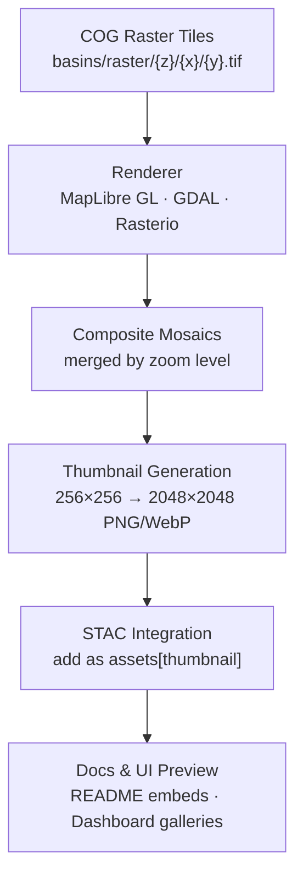

<div align="center">

# 🖼️ Kansas Frontier Matrix — Basins Raster Thumbnails  
`data/tiles/hydrology/basins/raster/thumbnails/`

**Mission:** Provide **thumbnail preview imagery** of Kansas **basin and flow accumulation raster tiles**  
(DEM-derived COG → PNG/WebP snapshots), serving as **visual documentation assets**, **STAC catalog thumbnails**,  
and **AI validation imagery** for hydrological model QA in the **Kansas Frontier Matrix (KFM)**.

[](../../../../../../.github/workflows/site.yml)
[](../../../../../../.github/workflows/stac-validate.yml)
[](../../../../../../.github/workflows/codeql.yml)
[](../../../../../../.github/workflows/trivy.yml)
[](../../../../../../docs/)
[](../../../../../../LICENSE)

</div>

---

## 📚 Overview

The `data/tiles/hydrology/basins/raster/thumbnails/` directory contains **rendered raster snapshots**  
that represent Kansas’s **hydrological basins, flow accumulation grids, and catchment intensity surfaces**.  
These images are auto-generated from raster tile pyramids to serve as:
- 📘 **STAC catalog previews** (`"roles": ["thumbnail", "overview"]`)
- 🧭 **Documentation assets** for READMEs and project dashboards
- 🧠 **AI/QA visualization references** for DEM and HydroAI model validation
- 💾 **Static basemap previews** for internal and external datasets

Each image corresponds to one zoom-level composite or full-state overview of the raster tile layer.

---

## 🧱 Directory Layout

```bash
data/
└── tiles/
    └── hydrology/
        └── basins/
            └── raster/
                └── thumbnails/
                    ├── basins_raster_z3.png
                    ├── basins_raster_z6.png
                    ├── basins_raster_z9.png
                    ├── basins_raster_z12.png
                    ├── overview_full.webp
                    └── metadata.json
````

---

## ⚙️ Thumbnail Rendering Workflow



---

### 🧮 Command Workflow

```bash
# Generate new raster thumbnails
make hydrology-basins-raster-thumbnails

# Validate STAC metadata integration
make stac-validate hydrology-basins
```

Thumbnails are produced using **headless MapLibre GL rendering**, **GDAL WMS snapshot composites**,
or **rio-tiler preview mosaics** with color ramps defined in `../color_ramp.json`.

All outputs are optimized using:

* `oxipng` (lossless PNG compression)
* `cwebp` (for high-efficiency WebP previews)

---

## 🎨 Rendering Parameters

| Parameter      | Description                       | Default                         |
| -------------- | --------------------------------- | ------------------------------- |
| **Projection** | EPSG:3857 (Web Mercator)          | ✓                               |
| **Background** | Transparent RGBA (0,0,0,0)        | ✓                               |
| **Map Style**  | Defined in `../style.raster.json` | ✓                               |
| **Resolution** | 256–2048 px per zoom composite    | Variable                        |
| **Color Ramp** | Blue → Green → Yellow gradient    | Defined in `../color_ramp.json` |
| **Opacity**    | 0.75                              | Default                         |
| **Labels**     | Disabled                          | —                               |

---

## 🧩 STAC Metadata Example

```json
{
  "id": "basins-raster-thumbnails",
  "type": "preview-collection",
  "parent": "basins-raster",
  "created": "2025-10-12T00:00:00Z",
  "assets": {
    "basins_raster_z6": {
      "href": "./basins_raster_z6.png",
      "roles": ["thumbnail"],
      "type": "image/png"
    },
    "overview_full": {
      "href": "./overview_full.webp",
      "roles": ["thumbnail", "overview"],
      "type": "image/webp"
    }
  }
}
```

These assets are automatically registered in
`data/stac/items/hydrology/basins_raster.json` for discovery and provenance.

---

## 🧠 AI & Validation Integration

The raster thumbnails play a critical role in **AI-assisted hydrological QA**, allowing
automated visual comparison between:

* AI-inferred flow accumulation grids
* Ground-truth DEM-based hydrological indices
* Human-labeled watershed reference maps

Each thumbnail generates metadata including:

* `thumbnail_hash`
* `ai_reference_hash`
* `iou_similarity`
* `visual_confidence`

This data supports **model drift detection** and **visual validation** pipelines.

---

## 🔒 Provenance & Integrity

Each thumbnail image is:

* Cryptographically hashed (`.sha256`) under `../checksums/`
* Linked to STAC with `checksum:sha256`
* Generated in a reproducible Dockerized environment
* Tagged with the rendering engine, commit hash, and timestamp

Example integrity record (excerpt from metadata):

```json
{
  "source_commit": "3b19ac9",
  "render_engine": "MapLibre Headless v3.3.1",
  "generated_at": "2025-10-12T03:40:00Z",
  "checksum": "5dc0fa2a8d58a3bdf93af4e21cc4c1cbcd1ef39e8f32a3cc97c8c4f1fa6a9e5a"
}
```

---

## 🧾 Versioning

| Field             | Value                                     |
| ----------------- | ----------------------------------------- |
| **Version**       | `v1.0.0`                                  |
| **STAC Spec**     | `1.0.0`                                   |
| **MCP Schema**    | `v1.2`                                    |
| **Render Engine** | MapLibre GL Headless v3.3.1 / GDAL 3.9    |
| **Last Updated**  | `2025-10-12`                              |
| **Maintainer**    | Kansas Frontier Matrix Visualization Team |

---

## 🪶 Changelog

| Version    | Date       | Changes                                                         |
| ---------- | ---------- | --------------------------------------------------------------- |
| **v1.0.0** | 2025-10-12 | Added z3–z12 raster thumbnails with color ramp and STAC linkage |
| **v0.9.0** | 2025-10-10 | Implemented preview rendering with GDAL + rio-tiler             |
| **v0.8.0** | 2025-10-08 | Created raster thumbnail structure and metadata draft           |

---

## 🖼️ Preview Example


---

## 🔗 Related Documentation

* [Basins Raster Tiles](../README.md)
* [Basins Raster Checksums](../checksums/README.md)
* [Basins Vector Tiles](../../vector/README.md)
* [Hydrology Tiles (Parent)](../../README.md)
* [Processed Hydrology Metadata](../../../../../data/processed/metadata/hydrology/README.md)
* [Web Raster Config](../../../../../web/config/layers/hydrology.json)
* [Architecture Overview](../../../../../docs/architecture.md)

---

<div align="center">

**Kansas Frontier Matrix** · *Time · Terrain · History*
[🌐 Repository](https://github.com/bartytime4life/Kansas-Frontier-Matrix) • [📘 Docs](../../../../../../docs/) • [🧭 STAC](../../../../../../data/stac/)

</div>
```

