<div align="center">

# 🖼️ Kansas Frontier Matrix — Hydrology Basins Thumbnails  
`data/tiles/hydrology/basins/thumbnails/`

**Mission:** Store and document **thumbnail previews** for Kansas **hydrological basin layers** — including both  
vector (HUC boundaries) and raster (flow accumulation, basin index) representations — enabling rapid visual  
identification, documentation embedding, and **STAC-compliant preview integration** within the  
**Kansas Frontier Matrix (KFM)** hydrology tile system.

[](../../../../../.github/workflows/site.yml)
[](../../../../../.github/workflows/stac-validate.yml)
[](../../../../../.github/workflows/codeql.yml)
[](../../../../../.github/workflows/trivy.yml)
[](../../../../../docs/)
[](../../../../../LICENSE)

</div>

---

## 📚 Overview

The `data/tiles/hydrology/basins/thumbnails/` directory consolidates **visual preview images** for  
all **Kansas hydrological basin** tile datasets (vector and raster).  
These static thumbnails allow instant recognition of map content and style in both GitHub docs  
and the **KFM STAC catalog**, while also providing baseline imagery for **AI-assisted QA** and  
**historical comparison dashboards**.

---

## 🧱 Directory Layout

```bash
data/
└── tiles/
    └── hydrology/
        └── basins/
            └── thumbnails/
                ├── basins_vector_z6.png
                ├── basins_raster_z6.png
                ├── basins_composite_overview.webp
                ├── basins_boundary_preview.png
                ├── overview_full.webp
                └── metadata.json
````

**Thumbnail categories:**

* `basins_vector_*`: Vector boundary (HUC2–HUC12) visualizations
* `basins_raster_*`: Rasterized flow accumulation and basin index grids
* `basins_composite_*`: Merged overlays for side-by-side comparison
* `overview_full.webp`: High-resolution Kansas-wide composite (full-scale preview)

---

## ⚙️ Thumbnail Rendering Pipeline

```mermaid
flowchart TD
  A["Vector + Raster Basins Layers<br/>basins/vector + basins/raster"] --> B["Rendering Engine<br/>MapLibre GL · GDAL · Rasterio"]
  B --> C["Composite Preview<br/>merge by zoom level (z3–z12)"]
  C --> D["Thumbnail Export<br/>PNG · WEBP optimized"]
  D --> E["STAC Integration<br/>assets[thumbnail] in basins.json"]
  E --> F["Docs + Dashboards<br/>embedded images and previews"]
%%END OF MERMAID%%
```



---

### 🧮 Command Workflow

```bash
# Generate composite hydrology thumbnails
make hydrology-basins-thumbnails

# Optimize and embed into STAC catalog
make stac-validate hydrology-basins
```

Rendering occurs via **headless MapLibre** or **GDAL WMS** snapshots with predefined color ramps and
styling from both `vector/style.vector.json` and `raster/style.raster.json`.

All outputs are optimized using:

* `oxipng` (lossless PNG optimization)
* `cwebp` (for WebP compression)
* `imagemagick` (for composition and scaling)

---

## 🎨 Rendering Configuration

| Parameter                | Description                                                   | Default                  |
| ------------------------ | ------------------------------------------------------------- | ------------------------ |
| **Projection**           | EPSG:3857 (Web Mercator)                                      | ✓                        |
| **Background**           | Transparent (RGBA 0,0,0,0)                                    | ✓                        |
| **Raster Color Ramp**    | Blue → Green → Yellow                                         | `raster/color_ramp.json` |
| **Vector Stroke Color**  | `#0059b3` (basin outlines)                                    | ✓                        |
| **Composite Resolution** | 512 – 4096 px                                                 | Variable                 |
| **Style Source**         | `../vector/style.vector.json` + `../raster/style.raster.json` | ✓                        |
| **Labels**               | Disabled (clean map previews)                                 | —                        |

---

## 🧩 STAC Metadata Example

```json
{
  "id": "basins-thumbnails",
  "type": "preview-collection",
  "parent": "basins",
  "created": "2025-10-12T00:00:00Z",
  "assets": {
    "basins_vector_z6": {
      "href": "./basins_vector_z6.png",
      "roles": ["thumbnail"],
      "type": "image/png"
    },
    "basins_raster_z6": {
      "href": "./basins_raster_z6.png",
      "roles": ["thumbnail"],
      "type": "image/png"
    },
    "overview_full": {
      "href": "./overview_full.webp",
      "roles": ["thumbnail", "overview"],
      "type": "image/webp"
    }
  }
}
```

Linked within `data/stac/items/hydrology/basins.json`.

---

## 🧠 AI & QA Integration

Thumbnails are used for **AI-based validation** of hydrological features:

* Cross-check HydroAI-generated basins vs. USGS WBD reference
* Detect spatial drift and morphological mismatches
* Generate pixel-level similarity maps and `iou_score` metrics
* Provide image-level dataset fingerprints (`thumbnail_hash`)

These help verify hydrological AI pipelines through visual forensic comparison.

---

## 🔒 Provenance & Integrity

Each image includes:

* Corresponding `.sha256` integrity record in `../checksums/`
* `metadata.json` with:

  * `source_commit`
  * `render_engine`
  * `render_timestamp`
  * `ai_validation_link`

---

## 🧾 Versioning

| Field             | Value                                     |
| ----------------- | ----------------------------------------- |
| **Version**       | `v1.0.0`                                  |
| **STAC Spec**     | `1.0.0`                                   |
| **MCP Schema**    | `v1.2`                                    |
| **Render Engine** | MapLibre GL Headless v3.3.1 / GDAL 3.9    |
| **Last Updated**  | `2025-10-12`                              |
| **Maintainer**    | Kansas Frontier Matrix Visualization Team |

---

## 🪶 Changelog

| Version    | Date       | Updates                                                                  |
| ---------- | ---------- | ------------------------------------------------------------------------ |
| **v1.0.0** | 2025-10-12 | Added unified basins vector + raster composite previews and STAC linkage |
| **v0.9.0** | 2025-10-10 | Implemented MapLibre rendering and WebP optimization                     |
| **v0.8.0** | 2025-10-08 | Created thumbnails directory and metadata schema draft                   |

---

## 🖼️ Preview Example

Composite basin visualization (zoom 6):


---

## 🔗 Related Documentation

* [Basins Tiles (Parent)](../README.md)
* [Basins Vector Thumbnails](../vector/thumbnails/README.md)
* [Basins Raster Thumbnails](../raster/thumbnails/README.md)
* [Hydrology Tiles Root](../../README.md)
* [Processed Hydrology Metadata](../../../../data/processed/metadata/hydrology/README.md)
* [Web Hydrology Layer Config](../../../../web/config/layers/hydrology.json)
* [KFM Architecture Overview](../../../../docs/architecture.md)

---

<div align="center">

**Kansas Frontier Matrix** · *Time · Terrain · History*
[🌐 Repository](https://github.com/bartytime4life/Kansas-Frontier-Matrix) • [📘 Docs](../../../../../docs/) • [🧭 STAC](../../../../../data/stac/)

</div>
```

