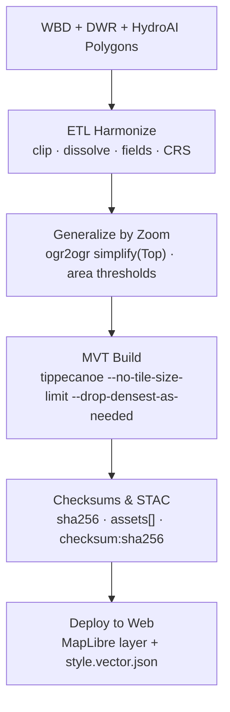

<div align="center">

# 🧱 Kansas Frontier Matrix — Basins Vector Tiles  
`data/tiles/hydrology/basins/vector/`

**Mission:** Publish **multi-scale MVT vector tiles** for Kansas **basins / watersheds** (HUC2–HUC12) with  
clean schema, reproducible provenance, and first-class performance in the KFM web map & Google Earth exports.

[](../../../../../.github/workflows/site.yml)
[](../../../../../.github/workflows/stac-validate.yml)
[](../../../../../.github/workflows/codeql.yml)
[](../../../../../.github/workflows/trivy.yml)
[](../../../../../docs/)
[](../../../../../LICENSE)

</div>

---

## 📚 Overview

This directory contains **Mapbox Vector Tile (MVT, `.pbf`) pyramids** of **basin/watershed polygons**  
optimized for **z3–z12**. It is the authoritative vector source for the **Basins** layer in KFM.

---

## 🧱 Directory Layout

```bash
data/
└── tiles/
    └── hydrology/
        └── basins/
            └── vector/
                ├── z3/ ... z12/          # MVT pyramids
                ├── metadata.json         # STAC+MCP metadata (tile schema, extents, hashes)
                ├── checksums/            # SHA-256 manifests (per zoom + aggregate)
                ├── thumbnails/           # PNG/WEBP previews for docs & STAC
                └── style.vector.json     # Default MapLibre layer style (optional override)
````

> Parent folder docs: **[Basins Tiles](../README.md)**

---

## 🧩 Data Sources & Provenance

| Source           | Type          | Scale          | License       | Notes                                     |
| ---------------- | ------------- | -------------- | ------------- | ----------------------------------------- |
| USGS **WBD**     | Polygon       | HUC2–HUC12     | Public Domain | Canonical watershed boundaries            |
| KS **DWR**       | Polygon       | Basin/Mgmt     | CC-BY 4.0     | State management zones                    |
| **HydroAI v2.1** | Raster→Vector | Sub-watersheds | MIT           | DEM-derived segmentation, `ai_confidence` |

All inputs are harmonized in ETL and referenced by **STAC items**:
`data/stac/items/hydrology/basins.json`

---

## ⚙️ Build Pipeline (Tippecanoe)



**Make targets**

```bash
make hydrology-basins-vector      # end-to-end build for MVT pyramids
make hydrology-basins-checksums   # write .sha256 manifests
make stac-validate hydrology-basins
```

**Typical tippecanoe invocation**

```bash
tippecanoe \
  -o vector.mbtiles \
  -L basins:basins.geojson \
  --layer=basins \
  --minimum-zoom=3 --maximum-zoom=12 \
  --detect-shared-borders --coalesce --coalesce-densest \
  --drop-densest-as-needed --extend-zooms-if-still-dropping \
  --no-tile-size-limit --accumulate-attribute=area_km2:sum
```

---

## 🧭 Layer Specification

| Property         | Value                                                                                   |
| ---------------- | --------------------------------------------------------------------------------------- |
| **Format**       | MVT (`.pbf`)                                                                            |
| **Zooms**        | `3–12`                                                                                  |
| **CRS**          | EPSG:3857 (tiles)                                                                       |
| **Geometry**     | Polygon                                                                                 |
| **Source-layer** | `basins`                                                                                |
| **Fields**       | `huc_code`, `basin_name`, `level`(2/4/6/8/10/12), `area_km2`, `source`, `ai_confidence` |
| **Tiling Rules** | zoom-dependent generalization & attribute thinning                                      |
| **Style**        | `style.vector.json` here (fallback to `../style.json`)                                  |

---

## 🌐 Integration

| Component         | Purpose            | Endpoint / File                                  |
| ----------------- | ------------------ | ------------------------------------------------ |
| **MapLibre GL**   | Basins overlay     | `/tiles/hydrology/basins/vector/{z}/{x}/{y}.pbf` |
| **Web Config**    | Layer registration | `web/config/layers/hydrology.json`               |
| **STAC**          | Provenance         | `data/stac/items/hydrology/basins.json`          |
| **API (FastAPI)** | Metadata           | `/layers/hydrology/basins`                       |
| **Neo4j**         | Knowledge graph    | `Basin`, `Watershed`, `Catchment` nodes          |

**Example (MapLibre)**:

```js
map.addSource('basins', {
  type: 'vector',
  tiles: ['https://kfm.example.org/tiles/hydrology/basins/vector/{z}/{x}/{y}.pbf'],
  minzoom: 3,
  maxzoom: 12
});

map.addLayer({
  id: 'basins-fill',
  type: 'fill',
  source: 'basins',
  'source-layer': 'basins',
  paint: {
    'fill-color': ['interpolate', ['linear'], ['get', 'level'], 2, '#cfe8ff', 12, '#0059b3'],
    'fill-opacity': 0.25
  }
});
```

---

## 🔒 Reproducibility & Integrity

* `.sha256` manifests per zoom under `checksums/`
* `metadata.json` includes `source_commit`, `data_hashes`, `tile_bounds`, `created`
* CI validates hashes + STAC links during deploy

**Verify**

```bash
sha256sum -c checksums/z8.sha256
```

---

## 🖼️ Thumbnails

Auto-generated previews live in `thumbnails/` and are linked with STAC `assets[].roles=["thumbnail"]`.
Example: `thumbnails/basins_z7.png`

---

## 🧠 AI Notes

If present, HydroAI polygons add `ai_confidence` (0–1). Low-confidence features may be dropped above z9,
or outlined with dashed borders per `style.vector.json`.

---

## 🧾 Versioning

| Field            | Value                         |
| ---------------- | ----------------------------- |
| **Version**      | `v1.0.0`                      |
| **STAC Spec**    | `1.0.0`                       |
| **MCP Schema**   | `v1.2`                        |
| **Builder**      | Tippecanoe ≥ 2.43, GDAL ≥ 3.9 |
| **Last Updated** | `2025-10-12`                  |

---

## 🪶 Changelog

* **v1.0.0 — 2025-10-12**: First complete MVT pyramid (z3–z12), STAC+checksums, style override support.
* **v0.9.0 — 2025-10-10**: Zoom-dependent generalization rules; attribute thinning.
* **v0.8.0 — 2025-10-08**: Initial directory scaffold and metadata draft.

---

## 🔗 Related

* **Parent:** [Basins Tiles](../README.md)
* **Raster counterpart:** `../raster/`
* **Hydrology Tiles root:** `../../README.md`
* **Processed Hydrology:** `../../../../data/processed/hydrology/README.md`
* **Web Layer Config:** `../../../../web/config/layers/hydrology.json`

---

<div align="center">

**Kansas Frontier Matrix** · *Time · Terrain · History*
[📘 Docs](../../../../../docs/) • [🧭 STAC](../../../../../data/stac/) • [⚙️ Workflows](../../../../../.github/workflows/)

</div>
```

