<div align="center">

# 🔐 Kansas Frontier Matrix — Hydrology Basins Vector Checksums  
`data/tiles/hydrology/basins/vector/checksums/`

**Mission:** Maintain **SHA-256 integrity manifests** for all **basin and watershed vector tile pyramids**  
(`.pbf` format) to guarantee **reproducibility, authenticity,** and **data provenance** in the  
**Kansas Frontier Matrix (KFM)** hydrology system.

[](../../../../../../.github/workflows/site.yml)
[](../../../../../../.github/workflows/stac-validate.yml)
[](../../../../../../.github/workflows/codeql.yml)
[](../../../../../../.github/workflows/trivy.yml)
[](../../../../../../docs/)
[](../../../../../../LICENSE)

</div>

---

## 📚 Overview

This directory contains **checksum manifests (`.sha256`)** for each zoom level of the  
**Basins Vector Tile Pyramid** (`data/tiles/hydrology/basins/vector/`).  
These ensure that every `.pbf` file remains identical between builds,  
providing **cryptographic validation** for **scientific reproducibility** and **digital provenance tracking**.

Each checksum file verifies one tile layer and is referenced in its associated **STAC item** (`basins.json`).

---

## 🧱 Directory Layout

```bash
data/
└── tiles/
    └── hydrology/
        └── basins/
            └── vector/
                └── checksums/
                    ├── z3.sha256
                    ├── z4.sha256
                    ├── ...
                    └── manifest.sha256    # Aggregated top-level checksum list
````

Each `.sha256` file lists individual hash records as:

```bash
<sha256-hash>  ./zX/{x}/{y}.pbf
```

---

## ⚙️ Checksum Pipeline

```mermaid
flowchart TD
  A["Vector Tiles<br/>(MVT .pbf files)"] --> B["Checksum Generation<br/>sha256sum per zoom"]
  B --> C["Manifest Compilation<br/>combine → manifest.sha256"]
  C --> D["STAC Update<br/>checksum:sha256 fields in basins.json"]
  D --> E["Integrity Verification<br/>make verify-checksums"]
%%END OF MERMAID%%
```



---

### 🧮 Command Workflow

```bash
# Generate individual checksum files per zoom level
make hydrology-basins-checksums

# Combine all layers into manifest.sha256
make hydrology-basins-manifest

# Validate all tiles and cross-check against STAC
make verify-checksums
```

**Automated in CI:**
`stac-validate.yml` runs checksum verification before deployment, ensuring all `.pbf` hashes
match STAC asset entries and prior git commits.

---

## 🧩 Integration Points

| Component                   | Role                                          | Connection                              |
| --------------------------- | --------------------------------------------- | --------------------------------------- |
| **STAC Catalog**            | Records checksum hashes                       | `data/stac/items/hydrology/basins.json` |
| **ETL Workflow**            | Generates hashes after MVT tile build         | `make hydrology-basins-vector`          |
| **CI/CD (GitHub Actions)**  | Verifies hash integrity                       | `.github/workflows/stac-validate.yml`   |
| **Knowledge Graph (Neo4j)** | Links digital signatures to entities          | Node type: `ChecksumRecord`             |
| **AI QA Pipeline**          | Detects data drift or regeneration mismatches | Reports to `ai_audit_log.json`          |

---

## 🔒 Reproducibility & Integrity

* **Immutable:** `.sha256` files stored as text and tracked by Git.
* **Cross-validated:** Each hash recorded in `metadata.json` for basins layer.
* **Transparent:** Manifests linked to CI logs, STAC, and documentation.

Verification command example:

```bash
sha256sum -c z8.sha256
# ./z8/34/56.pbf: OK
# ./z8/34/57.pbf: OK
```

---

## 🧠 AI-Linked Provenance

AI-derived basin boundaries (from HydroAI v2.1) are traceable through checksum linkage:

* Each AI output polygon’s export ID → tile hash
* Stored in `ai_provenance.json` alongside model weights and DEM inputs
* Enables **forensic validation** of hydrology model outputs against reference data

---

## 🧾 Example Manifest (Excerpt)

```bash
# manifest.sha256 — compiled 2025-10-12
f2a1c43c6f7c01a00e52e9dcb8ad6535a36bdf81db9e27b65d5a2fd83324e3a8  ./z3/5/3.pbf
fe9a64d22b4d8b98f3de5e9e1242f271876c4edabc6e60fbb44cde81ff0c94f5  ./z4/9/7.pbf
9ff7cd8b71dc2a0f726a18b748a3fa86ffb1a54dfd2b6a1dc0dfc533cc88d9ba  ./z5/18/14.pbf
...
```

---

## 🧾 Versioning

| Field                  | Value                                 |
| ---------------------- | ------------------------------------- |
| **Version**            | `v1.0.0`                              |
| **STAC Spec**          | `1.0.0`                               |
| **MCP Schema**         | `v1.2`                                |
| **Checksum Algorithm** | `SHA-256`                             |
| **Last Updated**       | `2025-10-12`                          |
| **Maintainer**         | Kansas Frontier Matrix Hydrology Team |

---

## 🪶 Changelog

| Version    | Date       | Changes                                                                       |
| ---------- | ---------- | ----------------------------------------------------------------------------- |
| **v1.0.0** | 2025-10-12 | Initial checksum set for all zoom levels (z3–z12); CI-integrated verification |
| **v0.9.0** | 2025-10-10 | Prototype STAC-hash mapping and validation script                             |
| **v0.8.0** | 2025-10-08 | Directory scaffolding and manifest schema draft                               |

---

## 🔗 Related Documentation

* [Basins Vector Tiles](../README.md)
* [Basins Tiles (Parent)](../../README.md)
* [Hydrology Tiles Root](../../../README.md)
* [Hydrology Metadata (STAC)](../../../../../data/processed/metadata/hydrology/README.md)
* [Architecture Overview](../../../../../docs/architecture.md)

---

<div align="center">

**Kansas Frontier Matrix** · *Time · Terrain · History*
[🌐 Repository](https://github.com/bartytime4life/Kansas-Frontier-Matrix) • [📘 Docs](../../../../../../docs/) • [🧭 STAC](../../../../../../data/stac/)

</div>
```

