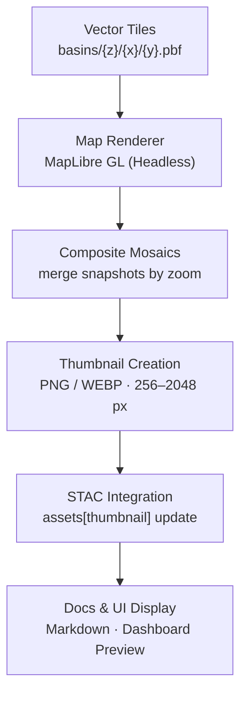

<div align="center">

# 🖼️ Kansas Frontier Matrix — Basins Vector Thumbnails  
`data/tiles/hydrology/basins/vector/thumbnails/`

**Mission:** Store and manage **thumbnail preview images** (`.png`, `.webp`) that visually summarize  
the **Kansas watershed and basin vector tiles** at multiple zoom levels — providing instant visual  
context for documentation, STAC catalogs, and AI validation workflows across the  
**Kansas Frontier Matrix (KFM)** hydrology subsystem.

[](../../../../../../.github/workflows/site.yml)
[](../../../../../../.github/workflows/stac-validate.yml)
[](../../../../../../.github/workflows/codeql.yml)
[](../../../../../../.github/workflows/trivy.yml)
[](../../../../../../docs/)
[](../../../../../../LICENSE)

</div>

---

## 📚 Overview

The `data/tiles/hydrology/basins/vector/thumbnails/` directory contains **automatically generated,  
multi-resolution previews** of Kansas hydrological basin boundaries.  
These are rendered from the MVT tiles under `../` and serve as **lightweight visual indicators** for  
each zoom level used in STAC, documentation, and QA dashboards.

**Key purposes:**
- 📘 Attach visual previews to STAC `assets` with `"roles": ["thumbnail"]`
- 🌍 Display basin outlines in GitHub docs and KFM dashboards
- 🧠 Provide AI systems with consistent visual cues for model training QA
- 🧭 Support interactive previews for end-users and researchers

---

## 🧱 Directory Layout

```bash
data/
└── tiles/
    └── hydrology/
        └── basins/
            └── vector/
                └── thumbnails/
                    ├── basins_z3.png
                    ├── basins_z6.png
                    ├── basins_z9.png
                    ├── basins_z12.png
                    ├── overview_full.webp
                    └── metadata.json
````

---

## ⚙️ Thumbnail Generation Pipeline



---

### 🧮 Command Workflow

```bash
# Generate all basin vector thumbnails
make hydrology-basins-thumbnails

# Validate STAC and metadata linkage
make stac-validate hydrology-basins
```

Thumbnails are auto-generated with **headless MapLibre** or **Chromium snapshot rendering**,
using `web/config/layers/hydrology.json` as the base style configuration.
Images are compressed with `cwebp` and optimized using `oxipng`.

---

## 🎨 Rendering Configuration

| Parameter        | Description                              | Default             |
| ---------------- | ---------------------------------------- | ------------------- |
| **Map Style**    | Basins layer style (`style.vector.json`) | ✓                   |
| **Projection**   | Web Mercator (EPSG:3857)                 | ✓                   |
| **Background**   | Transparent (RGBA 0,0,0,0)               | ✓                   |
| **Resolution**   | 256 – 2048 px                            | Variable            |
| **Labels**       | Disabled for thumbnail export            | —                   |
| **Color Scheme** | Level-dependent gradient                 | Blue-Green Spectrum |

---

## 🧩 STAC Metadata Example

```json
{
  "id": "basins-thumbnails",
  "type": "preview-collection",
  "parent": "basins-vector",
  "created": "2025-10-12T00:00:00Z",
  "assets": {
    "basins_z3": {
      "href": "./basins_z3.png",
      "roles": ["thumbnail"],
      "type": "image/png"
    },
    "overview_full": {
      "href": "./overview_full.webp",
      "roles": ["thumbnail", "overview"],
      "type": "image/webp"
    }
  }
}
```

These entries are linked within
`data/stac/items/hydrology/basins.json` under the `"assets"` section.

---

## 🧠 AI and Forensic QA Integration

Generated thumbnails also feed into KFM’s **HydroAI QA subsystem**, which compares
AI-generated basin delineations with verified human boundaries.

Each comparison run logs:

* `thumbnail_hash`
* `ai_render_hash`
* `iou_score`
* `confidence_delta`
* `review_status`

This allows AI-based **drift detection** and model retraining when discrepancies appear.

---

## 🔒 Provenance & Integrity

Each image includes:

* `.sha256` integrity hashes stored in `../checksums/`
* Metadata (`metadata.json`) with:

  * `source_commit`
  * `render_engine`
  * `generation_timestamp`
  * `render_environment` (Docker tag, node version, renderer version)

---

## 🧾 Versioning

| Field             | Value                                     |
| ----------------- | ----------------------------------------- |
| **Version**       | `v1.0.0`                                  |
| **STAC Spec**     | `1.0.0`                                   |
| **MCP Schema**    | `v1.2`                                    |
| **Render Engine** | `MapLibre Headless v3.3.1`                |
| **Last Updated**  | `2025-10-12`                              |
| **Maintainer**    | Kansas Frontier Matrix Visualization Team |

---

## 🪶 Changelog

| Version    | Date       | Updates                                                                     |
| ---------- | ---------- | --------------------------------------------------------------------------- |
| **v1.0.0** | 2025-10-12 | Added z3–z12 thumbnails, metadata.json, STAC linkage, and AI QA integration |
| **v0.9.0** | 2025-10-10 | Implemented full rendering pipeline for preview composites                  |
| **v0.8.0** | 2025-10-08 | Created thumbnail directory and rendering schema draft                      |

---

## 🧭 Visualization Preview

Example thumbnail (zoom 6):


---

## 🔗 Related Documentation

* [Basins Vector Tiles](../README.md)
* [Basins Vector Checksums](../checksums/README.md)
* [Basins Tiles (Parent)](../../README.md)
* [Processed Hydrology Metadata](../../../../../data/processed/metadata/hydrology/README.md)
* [Web Map Style Config](../../../../../web/config/layers/hydrology.json)
* [Architecture Overview](../../../../../docs/architecture.md)

---

<div align="center">

**Kansas Frontier Matrix** · *Time · Terrain · History*
[🌐 Repository](https://github.com/bartytime4life/Kansas-Frontier-Matrix) • [📘 Docs](../../../../../../docs/) • [🧭 STAC](../../../../../../data/stac/)

</div>
```

