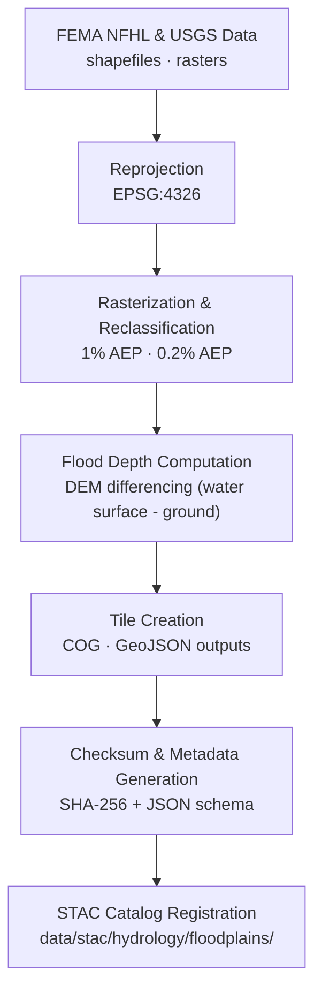

<div align="center">

# 🌊 Kansas Frontier Matrix — Hydrology Floodplains  
`data/tiles/hydrology/floodplains/`

**Mission:** Store and document **floodplain raster and vector datasets** — delineating areas of  
hydrologic inundation risk, river corridor mapping, and historical floodplain change across Kansas.  
These data enable flood risk analysis, infrastructure planning, and hydrologic modeling in the  
**Kansas Frontier Matrix (KFM)** geospatial knowledge system.

[](../../../../.github/workflows/site.yml)
[](../../../../.github/workflows/stac-validate.yml)
[](../../../../.github/workflows/codeql.yml)
[](../../../../.github/workflows/trivy.yml)
[](../../../../docs/)
[](../../../../LICENSE)

</div>

---

## 📚 Overview

This directory contains **floodplain datasets** that map current and historical inundation zones,  
derived from FEMA’s **National Flood Hazard Layer (NFHL)**, **USGS NHDPlus**, and **hydraulic model simulations**.  
They represent **base flood extents (1% AEP)**, **500-year flood zones**, and **floodway boundaries**,  
integrated into Kansas Frontier Matrix’s hydrology layer stack.

**Applications:**
- Flood hazard and mitigation planning  
- Land-use and zoning analysis  
- Infrastructure and transportation resilience  
- Hydrologic model validation (HEC-RAS, SWAT, LISFLOOD)  
- Historical flood event reconstruction  

---

## 📂 Directory Layout

```bash
data/
└── tiles/
    └── hydrology/
        └── floodplains/
            ├── ks_floodplain_100yr.geojson
            ├── ks_floodplain_500yr.geojson
            ├── ks_floodway.geojson
            ├── ks_flood_depth_raster_2020.tif
            ├── thumbnails/
            │   ├── ks_floodplain_100yr_preview.png
            │   ├── ks_floodplain_500yr_preview.png
            │   └── ks_flood_depth_raster_2020_preview.png
            ├── checksums/
            │   ├── ks_floodplain_100yr.geojson.sha256
            │   ├── ks_floodplain_500yr.geojson.sha256
            │   ├── ks_floodway.geojson.sha256
            │   └── ks_flood_depth_raster_2020.tif.sha256
            └── metadata/
                ├── ks_floodplain_100yr.json
                ├── ks_floodplain_500yr.json
                ├── ks_floodway.json
                └── ks_flood_depth_raster_2020.json
````

---

## ⚙️ Processing Workflow



**Example Command:**

```bash
gdal_rasterize -burn 1 -tr 10 10 \
  -a_nodata 0 -te -102.05 36.99 -94.58 40.00 \
  fema_nfhl_floodzone_A.shp data/tiles/hydrology/floodplains/ks_floodplain_100yr.tif
```

---

## 🧩 Data Layers

| File                             | Type   | Description                                            | Source     | Units  |
| -------------------------------- | ------ | ------------------------------------------------------ | ---------- | ------ |
| `ks_floodplain_100yr.geojson`    | Vector | 1% Annual Exceedance Probability (100-year) flood zone | FEMA NFHL  | —      |
| `ks_floodplain_500yr.geojson`    | Vector | 0.2% AEP (500-year) flood zone                         | FEMA NFHL  | —      |
| `ks_floodway.geojson`            | Vector | Regulatory floodway boundaries                         | FEMA NFHL  | —      |
| `ks_flood_depth_raster_2020.tif` | Raster | Depth grid for 2020 flood simulation                   | USGS / KWO | meters |

---

## 🧠 Integration & Analytical Context

Floodplain datasets are used across **multiple analytical domains** within KFM:

* **Hazard modeling:** base flood risk mapping for resilience assessments
* **Historical context:** overlay with **treaty, deed, and settlement datasets** to analyze land exposure
* **AI hydrology models:** predict unmodeled flood zones based on topography and precipitation
* **Knowledge Graph integration:**

  * `FloodplainZone` ↔ `HydrologicUnit`
  * `FloodplainZone` ↔ `Event:HistoricalFlood`
  * `Floodway` ↔ `InfrastructureFeature`

**Example Analysis:**
Correlate FEMA 1% AEP flood zones with **NOAA precipitation extremes** and **DEM-derived flow accumulation**
to infer potential climate-driven flood expansion.

---

## 🧮 Version & Provenance

| Field               | Value                                                        |
| ------------------- | ------------------------------------------------------------ |
| **Version**         | `v1.0.0`                                                     |
| **Last Updated**    | 2025-10-12                                                   |
| **Maintainer**      | `@bartytime4life`                                            |
| **Source Datasets** | FEMA NFHL, USGS NHDPlus HR, NOAA flood records               |
| **Projection**      | EPSG:4326 (WGS84)                                            |
| **License**         | CC-BY 4.0                                                    |
| **MCP Compliance**  | ✅ Documentation · ✅ Provenance · ✅ STAC Linked · ✅ Validated |

---

## 🪵 Changelog

| Date       | Version | Change                                                               | Author          | PR/Issue |
| ---------- | ------- | -------------------------------------------------------------------- | --------------- | -------- |
| 2025-10-12 | v1.0.0  | Initial integration of Kansas floodplain datasets (FEMA, USGS, NOAA) | @bartytime4life | #248     |

---

## ✅ Validation Checklist

* [x] CRS standardized to EPSG:4326
* [x] COG compression verified for rasters
* [x] STAC metadata validated
* [x] Checksums computed and verified
* [x] Thumbnails generated and linked
* [x] README includes badges, versioning, changelog, and closed Mermaid diagram

---

## 🔗 Related Directories

| Path                                                         | Description                                             |
| ------------------------------------------------------------ | ------------------------------------------------------- |
| [`../flow/`](../flow/)                                       | Flow direction, accumulation, and connectivity datasets |
| [`../basins/`](../basins/)                                   | Watershed and hydrologic basin polygons                 |
| [`../aquifers/`](../aquifers/)                               | Groundwater aquifer datasets                            |
| [`../../hazards/`](../../hazards/)                           | Hazard datasets (floods, droughts, wildfire)            |
| [`../../../../stac/hydrology/`](../../../../stac/hydrology/) | STAC catalog for hydrology products                     |

---

## 🧭 Example Metadata Snippet

```json
{
  "id": "ks_floodplain_100yr",
  "type": "vector",
  "description": "Kansas FEMA 1% Annual Exceedance Probability floodplain boundary polygons",
  "source": ["FEMA NFHL", "USGS NHDPlus HR"],
  "projection": "EPSG:4326",
  "spatial_extent": [-102.05, 36.99, -94.58, 40.00],
  "temporal_extent": ["2020-01-01", "2020-12-31"],
  "checksum": "bce8231f9d9a27c3a8a4dc1a73ff7d1c3db0ffb8927c41e9a7b06c4129edaa1e",
  "stac_link": "../../../../stac/hydrology/floodplains/ks_floodplain_100yr.json",
  "license": "CC-BY 4.0",
  "mcp_version": "1.0"
}
```

---

<div align="center">

**Kansas Frontier Matrix — Hydrology Division**
🌧️ *“Charting the waters that rise and fall — floodplains mapped, histories preserved.”*

</div>
```

