<div align="center">

# 🔐 Kansas Frontier Matrix — Hydrology Floodplain Checksums  
`data/tiles/hydrology/floodplains/checksums/`

**Mission:** Maintain **SHA-256 checksum manifests** verifying the integrity and authenticity  
of all **floodplain datasets** — including 100-year and 500-year flood zones, floodway vectors,  
and flood depth rasters — ensuring reproducibility, security, and provenance compliance within  
the **Kansas Frontier Matrix (KFM)** hydrology framework.

[](../../../../../../.github/workflows/site.yml)
[](../../../../../../.github/workflows/stac-validate.yml)
[](../../../../../../.github/workflows/codeql.yml)
[](../../../../../../.github/workflows/trivy.yml)
[](../../../../../../docs/)
[](../../../../../../LICENSE)

</div>

---

## 📚 Overview

This directory contains **checksum (`.sha256`) files** for all floodplain data products  
in `data/tiles/hydrology/floodplains/`.  
Each checksum file guarantees **data integrity** for FEMA- and USGS-derived floodplain products,  
verifying that rasters and vectors have not been altered or corrupted after ETL processing or transfer.

**Purpose:**
- Validate the **authenticity and immutability** of hydrology data  
- Support **reproducible science** across all MCP workflows  
- Embed cryptographic hashes in **STAC metadata** for end-to-end provenance tracking  

---

## 📂 Directory Layout

```bash
data/
└── tiles/
    └── hydrology/
        └── floodplains/
            └── checksums/
                ├── ks_floodplain_100yr.geojson.sha256
                ├── ks_floodplain_500yr.geojson.sha256
                ├── ks_floodway.geojson.sha256
                └── ks_flood_depth_raster_2020.tif.sha256
````

---

## ⚙️ Checksum Workflow

```mermaid
flowchart TD
  A["Floodplain Data<br/>GeoJSON · GeoTIFF"] --> B["Checksum Generation<br/>sha256sum utility"]
  B --> C["Store Hash Files<br/>/checksums/"]
  C --> D["Embed in STAC Items<br/>checksum:sha256 fields"]
  D --> E["Automated Verification<br/>make verify-floodplains"]
%%END OF MERMAID%%
```



**Generate checksums:**

```bash
sha256sum data/tiles/hydrology/floodplains/ks_floodplain_100yr.geojson \
  > data/tiles/hydrology/floodplains/checksums/ks_floodplain_100yr.geojson.sha256
```

**Validate checksums:**

```bash
sha256sum --check data/tiles/hydrology/floodplains/checksums/ks_floodplain_100yr.geojson.sha256
```

---

## 🧾 File Format

Each `.sha256` file contains one line in the format:

```
<hash>  <filename>
```

**Example:**

```
9b5a47a0e1eeb98cb1f2f6d37f59cb45478b91adfc93d16b5b344b6e7276cf56  ks_floodplain_500yr.geojson
```

---

## 🧩 STAC Integration

Checksums are embedded into STAC item metadata for every floodplain dataset
(`data/stac/hydrology/floodplains/*.json`):

```json
"assets": {
  "data": {
    "href": "data/tiles/hydrology/floodplains/ks_floodplain_500yr.geojson",
    "type": "application/geo+json",
    "roles": ["data"],
    "checksum:sha256": "9b5a47a0e1eeb98cb1f2f6d37f59cb45478b91adfc93d16b5b344b6e7276cf56"
  }
}
```

This ensures **checksum alignment** across the local repository, remote STAC catalogs,
and the KFM web data browser.

---

## 🧠 Analytical & AI Context

Checksum manifests provide data validation for:

* **AI-driven change detection** models (floodplain evolution tracking)
* **Federated dataset verification** during distributed processing
* **Integrity monitoring** within KFM’s Neo4j Knowledge Graph
* **Automated provenance chains** between datasets (`Hydrology → Floodplain → STAC → API`)

Checksums also serve as **cryptographic fingerprints** enabling long-term archival verification
across MCP and open-data ecosystems.

---

## 🧮 Version & Provenance

| Field               | Value                                                             |
| ------------------- | ----------------------------------------------------------------- |
| **Version**         | `v1.0.0`                                                          |
| **Last Updated**    | 2025-10-12                                                        |
| **Maintainer**      | `@bartytime4life`                                                 |
| **Algorithm**       | SHA-256                                                           |
| **Source Datasets** | FEMA NFHL, USGS NHDPlus HR, NOAA flood depth grids                |
| **License**         | CC-BY 4.0                                                         |
| **MCP Compliance**  | ✅ Provenance · ✅ Validation · ✅ STAC Linked · ✅ Integrity Assured |

---

## 🪵 Changelog

| Date       | Version | Change                                           | Author          | PR/Issue |
| ---------- | ------- | ------------------------------------------------ | --------------- | -------- |
| 2025-10-12 | v1.0.0  | Initial release of floodplain checksum manifests | @bartytime4life | #250     |

---

## ✅ Validation Checklist

* [x] `.sha256` files exist for all floodplain datasets
* [x] SHA-256 hashes verified successfully
* [x] Embedded `checksum:sha256` values in STAC metadata
* [x] CI pipeline validation: `make verify-floodplains`
* [x] README includes badges, versioning, changelog, and closed Mermaid diagram

---

## 🔗 Related Directories

| Path                                                         | Description                                   |
| ------------------------------------------------------------ | --------------------------------------------- |
| [`../`](../)                                                 | Main floodplain vector and raster datasets    |
| [`../metadata/`](../metadata/)                               | Metadata records describing floodplain assets |
| [`../thumbnails/`](../thumbnails/)                           | Thumbnail image previews                      |
| [`../../flow/`](../../flow/)                                 | Hydrologic flow and drainage products         |
| [`../../basins/`](../../basins/)                             | Watershed and sub-basin vector datasets       |
| [`../../../../stac/hydrology/`](../../../../stac/hydrology/) | STAC catalog for hydrologic datasets          |

---

<div align="center">

**Kansas Frontier Matrix — Hydrology Division**
🌧️ *“Integrity in every layer — flood data secured by cryptographic certainty.”*

</div>
```

