<div align="center">

# 🧾 Kansas Frontier Matrix — Hydrology Floodplain Metadata  
`data/tiles/hydrology/floodplains/metadata/`

**Mission:** Define and maintain detailed **metadata records** describing Kansas floodplain datasets —  
including 100-year, 500-year, and floodway polygons, as well as flood depth rasters — ensuring scientific  
traceability, STAC compliance, and knowledge graph integration within the **Kansas Frontier Matrix (KFM)**  
hydrology subsystem.

[](../../../../../../.github/workflows/site.yml)
[](../../../../../../.github/workflows/stac-validate.yml)
[](../../../../../../.github/workflows/codeql.yml)
[](../../../../../../.github/workflows/trivy.yml)
[](../../../../../../docs/)
[](../../../../../../LICENSE)

</div>

---

## 📚 Overview

This directory contains **JSON metadata records** for floodplain datasets stored in  
`data/tiles/hydrology/floodplains/`.  
Each record follows the **MCP–STAC hybrid metadata schema**, documenting provenance, lineage,  
processing parameters, and integration references for Kansas flood hazard datasets.

Metadata connects surface hydrology data with historical events, climate records,  
and infrastructure exposure datasets, providing a semantic and temporal bridge  
between hydrology, hazard, and planning layers.

---

## 📂 Directory Layout

```bash
data/
└── tiles/
    └── hydrology/
        └── floodplains/
            └── metadata/
                ├── ks_floodplain_100yr.json
                ├── ks_floodplain_500yr.json
                ├── ks_floodway.json
                └── ks_flood_depth_raster_2020.json
````

---

## ⚙️ Metadata Schema

Each JSON file conforms to `hydrology_floodplain_metadata.schema.json`
defined under `/src/kansas_geo_timeline/schemas/`.

| Field             | Description                        | Example                                                                     |
| ----------------- | ---------------------------------- | --------------------------------------------------------------------------- |
| `id`              | Unique dataset identifier          | `"ks_floodplain_100yr"`                                                     |
| `type`            | Data product type                  | `"vector"`                                                                  |
| `description`     | Summary of dataset purpose         | `"1% annual exceedance probability (100-year) floodplain zones for Kansas"` |
| `source`          | Source organizations               | `["FEMA", "USGS", "NOAA"]`                                                  |
| `algorithm`       | ETL method                         | `"QGIS + GDAL Reprojection and Simplification"`                             |
| `projection`      | Coordinate system                  | `"EPSG:4326"`                                                               |
| `spatial_extent`  | Bounding box                       | `[-102.05, 36.99, -94.58, 40.00]`                                           |
| `temporal_extent` | Time period represented            | `["2020-01-01","2020-12-31"]`                                               |
| `checksum`        | SHA-256 hash of the data asset     | `"9b5a47a0e1eeb98cb1f2f6d37f59cb45478b91adfc93d16b5b344b6e7276cf56"`        |
| `stac_link`       | Relative path to STAC item         | `"../../../../../stac/hydrology/floodplains/ks_floodplain_100yr.json"`      |
| `license`         | Data license                       | `"CC-BY 4.0"`                                                               |
| `created`         | Metadata creation date             | `"2025-10-12"`                                                              |
| `mcp_version`     | MCP metadata specification version | `"1.0"`                                                                     |

---

## 🧩 Processing Workflow

```mermaid
flowchart TD
  A["Source Data<br/>FEMA NFHL · USGS NHDPlus · NOAA flood records"] --> B["Reprojection & Harmonization<br/>EPSG:4326 · standard CRS"]
  B --> C["Raster/Vector Derivation<br/>Flood zones, floodway, depth rasters"]
  C --> D["Metadata Extraction<br/>attributes · lineage · parameters"]
  D --> E["Schema Validation<br/>hydrology_floodplain_metadata.schema.json"]
  E --> F["STAC Registration<br/>/data/stac/hydrology/floodplains/"]
%%END OF MERMAID%%
```



---

## 🧠 Integration & Knowledge Graph Mapping

Floodplain metadata is integrated within the **KFM Neo4j Knowledge Graph**
to support hydrologic reasoning, hazard modeling, and time-aware visualizations.

| Graph Node          | Relationship      | Target Entity           |
| ------------------- | ----------------- | ----------------------- |
| `FloodplainZone`    | `DERIVED_FROM`    | `HydrologicUnit`        |
| `FloodplainZone`    | `INTERSECTS`      | `Place:County`          |
| `FloodplainZone`    | `ASSOCIATED_WITH` | `Event:HistoricalFlood` |
| `FloodDepthRaster`  | `HAS_CHECKSUM`    | `SHA256 Hash`           |
| `FloodplainDataset` | `LINKED_TO`       | `STAC Item`             |

**AI & ML Use Cases:**

* Floodplain expansion prediction using terrain & climate drivers
* Flood risk correlation with **settlement history** and **infrastructure density**
* Semantic QA for dataset overlap detection (`Floodplain ∩ Deeds`)

---

## 🧮 Version & Provenance

| Field               | Value                                                        |
| ------------------- | ------------------------------------------------------------ |
| **Version**         | `v1.0.0`                                                     |
| **Last Updated**    | 2025-10-12                                                   |
| **Maintainer**      | `@bartytime4life`                                            |
| **Schema**          | `hydrology_floodplain_metadata.schema.json`                  |
| **Source Datasets** | FEMA NFHL, USGS NHDPlus HR, NOAA flood history               |
| **License**         | CC-BY 4.0                                                    |
| **MCP Compliance**  | ✅ Documentation · ✅ Provenance · ✅ STAC Linked · ✅ Validated |

---

## 🪵 Changelog

| Date       | Version | Change                                                     | Author          | PR/Issue |
| ---------- | ------- | ---------------------------------------------------------- | --------------- | -------- |
| 2025-10-12 | v1.0.0  | Initial creation of floodplain metadata schema and records | @bartytime4life | #251     |

---

## ✅ Validation Checklist

* [x] Metadata conforms to MCP + STAC schema
* [x] Provenance (source, algorithm, checksum) fields complete
* [x] Linked to STAC Items via relative path
* [x] CRS validated (EPSG:4326)
* [x] JSON schema tests passed via `make validate-metadata`
* [x] README includes badges, changelog, and closed Mermaid diagram

---

## 🔗 Related Directories

| Path                                                         | Description                                          |
| ------------------------------------------------------------ | ---------------------------------------------------- |
| [`../`](../)                                                 | Main floodplain vector and raster datasets           |
| [`../checksums/`](../checksums/)                             | SHA-256 integrity verification manifests             |
| [`../thumbnails/`](../thumbnails/)                           | Thumbnail previews for floodplain datasets           |
| [`../../flow/`](../../flow/)                                 | Surface hydrology datasets (direction, accumulation) |
| [`../../../../stac/hydrology/`](../../../../stac/hydrology/) | STAC catalog for hydrology data products             |

---

## 🧭 Example Metadata Record

```json
{
  "id": "ks_flood_depth_raster_2020",
  "type": "raster",
  "description": "Flood depth grid derived from 2020 hydraulic modeling for Kansas river basins.",
  "source": ["FEMA", "USGS", "NOAA"],
  "algorithm": "Raster difference (water surface - DEM)",
  "projection": "EPSG:4326",
  "spatial_extent": [-102.05, 36.99, -94.58, 40.00],
  "temporal_extent": ["2020-01-01", "2020-12-31"],
  "checksum": "d3e91b7129c4a7e3d91905d09ff0a9d9a7734be24eaecc831ac80b493a893d15",
  "stac_link": "../../../../stac/hydrology/floodplains/ks_flood_depth_raster_2020.json",
  "created": "2025-10-12",
  "license": "CC-BY 4.0",
  "mcp_version": "1.0"
}
```

---

<div align="center">

**Kansas Frontier Matrix — Hydrology Division**
🌧️ *“Mapping Kansas’s flood memory — scientifically validated, semantically linked.”*

</div>
```

