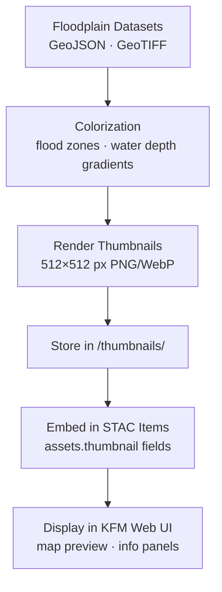

<div align="center">

# 🖼️ Kansas Frontier Matrix — Hydrology Floodplain Thumbnails  
`data/tiles/hydrology/floodplains/thumbnails/`

**Mission:** Store and document **thumbnail preview images** for all **Kansas floodplain datasets** —  
providing lightweight, visual representations of **100-year**, **500-year**, and **floodway** zones  
for use in the Kansas Frontier Matrix (KFM) **STAC catalog**, **web viewer**, and **MCP documentation system**.

[](../../../../../../.github/workflows/site.yml)
[](../../../../../../.github/workflows/stac-validate.yml)
[](../../../../../../.github/workflows/codeql.yml)
[](../../../../../../.github/workflows/trivy.yml)
[](../../../../../../docs/)
[](../../../../../../LICENSE)

</div>

---

## 📚 Overview

This directory contains **thumbnail images (PNG/WebP)** summarizing floodplain datasets from  
`data/tiles/hydrology/floodplains/`.  
Each image provides a simplified visual summary of flood risk extents for the  
Kansas Frontier Matrix’s **hydrology visualization subsystem** and **STAC-integrated documentation**.

**Purpose:**
- Quick visual references for hydrology layers  
- Embedded assets in **STAC Item JSON** metadata (`assets.thumbnail`)  
- Lightweight previews in the **MapLibre web viewer**  
- Visual QA/QC for data validation workflows  

---

## 📂 Directory Layout

```bash
data/
└── tiles/
    └── hydrology/
        └── floodplains/
            └── thumbnails/
                ├── ks_floodplain_100yr_preview.png
                ├── ks_floodplain_500yr_preview.png
                ├── ks_floodway_preview.png
                ├── ks_flood_depth_raster_2020_preview.png
                ├── ks_floodplain_100yr_preview.webp
                └── ks_floodplain_500yr_preview.webp
````

---

## ⚙️ Thumbnail Generation Workflow



**Example Command:**

```bash
gdal_translate -of PNG -outsize 512 512 \
  -scale 0 5 0 255 \
  data/tiles/hydrology/floodplains/ks_flood_depth_raster_2020.tif \
  data/tiles/hydrology/floodplains/thumbnails/ks_flood_depth_raster_2020_preview.png
```

---

## 🎨 Visualization Standards

| Layer               | Style                | Color Scheme | Format                            | Description                       |
| ------------------- | -------------------- | ------------ | --------------------------------- | --------------------------------- |
| 100-Year Floodplain | Polygon fill         | Blue         | PNG/WebP                          | FEMA Zone AE/A — base flood areas |
| 500-Year Floodplain | Polygon fill         | Light Blue   | PNG/WebP                          | Moderate flood hazard areas       |
| Floodway            | Hatch or outline     | Cyan         | PNG/WebP                          | Regulatory floodway zones         |
| Flood Depth Raster  | Grayscale or viridis | PNG/WebP     | Rasterized water depth simulation |                                   |

**Style Guidelines:**

* 512×512 px (PNG & WebP)
* Background: transparent or white
* Consistent symbolization across datasets
* DPI: 200+ for crisp rendering
* Projection: EPSG:4326

---

## 🧩 Integration with STAC Metadata

Each thumbnail is referenced in its **STAC Item JSON** under the `assets.thumbnail` section:

```json
"assets": {
  "thumbnail": {
    "href": "data/tiles/hydrology/floodplains/thumbnails/ks_floodplain_100yr_preview.png",
    "type": "image/png",
    "roles": ["thumbnail"],
    "title": "Floodplain 100-Year Preview"
  }
}
```

This enables interoperability between documentation, metadata catalogs, and visualization layers
within the KFM hydrology subsystem.

---

## 🧠 Analytical & AI Context

Thumbnails contribute to **AI-augmented visualization and QA pipelines**, including:

* Automated **layer differentiation** (100-year vs 500-year vs floodway)
* Model-driven **flood extent recognition** in imagery
* **Visual provenance** in the MCP documentation chain
* Embedding in **knowledge graph visual nodes** (`FloodplainZone` → `ThumbnailAsset`)

---

## 🧮 Version & Provenance

| Field              | Value                                                                                          |
| ------------------ | ---------------------------------------------------------------------------------------------- |
| **Version**        | `v1.0.0`                                                                                       |
| **Last Updated**   | 2025-10-12                                                                                     |
| **Maintainer**     | `@bartytime4life`                                                                              |
| **Parent Dataset** | `ks_floodplain_100yr.geojson`, `ks_floodplain_500yr.geojson`, `ks_flood_depth_raster_2020.tif` |
| **License**        | CC-BY 4.0                                                                                      |
| **Thumbnail Size** | 512×512 px                                                                                     |
| **MCP Compliance** | ✅ Documentation · ✅ Provenance · ✅ STAC Linked · ✅ Reproducible Visuals                        |

---

## 🪵 Changelog

| Date       | Version | Change                                           | Author          | PR/Issue |
| ---------- | ------- | ------------------------------------------------ | --------------- | -------- |
| 2025-10-12 | v1.0.0  | Initial creation of floodplain thumbnail imagery | @bartytime4life | #249     |

---

## ✅ Validation Checklist

* [x] Thumbnails exist for all floodplain datasets
* [x] Files ≤ 512×512 px (PNG/WebP)
* [x] Linked via `assets.thumbnail` in STAC metadata
* [x] Colorized consistently across datasets
* [x] README includes badges, changelog, and closed Mermaid diagram

---

## 🔗 Related Directories

| Path                                                         | Description                                          |
| ------------------------------------------------------------ | ---------------------------------------------------- |
| [`../`](../)                                                 | Main floodplain dataset directory                    |
| [`../metadata/`](../metadata/)                               | Metadata JSON files describing floodplain layers     |
| [`../checksums/`](../checksums/)                             | SHA-256 checksum manifests                           |
| [`../../flow/`](../../flow/)                                 | Surface hydrology flow direction & accumulation data |
| [`../../basins/`](../../basins/)                             | Watershed boundary datasets                          |
| [`../../../../stac/hydrology/`](../../../../stac/hydrology/) | STAC catalog entries for hydrology products          |

---

<div align="center">

**Kansas Frontier Matrix — Hydrology Division**
🌧️ *“Floods remembered, mapped, and rendered — water’s reach, preserved in every pixel.”*

</div>
```

