<div align="center">

# 🌊 Kansas Frontier Matrix — Hydrology Flow Tiles  
`data/tiles/hydrology/flow/`

**Mission:** Deliver **flow direction, accumulation, and connectivity tile pyramids** — both raster and vector —  
that represent the **dynamic hydrological network** of Kansas, derived from **DEM-based flow modeling, AI inference**,  
and **hydrography integration** within the **Kansas Frontier Matrix (KFM)**.

[](../../../../.github/workflows/site.yml)
[](../../../../.github/workflows/stac-validate.yml)
[](../../../../.github/workflows/codeql.yml)
[](../../../../.github/workflows/trivy.yml)
[](../../../../docs/)
[](../../../../LICENSE)

</div>

---

## 📚 Overview

The `data/tiles/hydrology/flow/` directory contains **DEM-derived hydrological flow tiles** used for visualizing  
and analyzing surface water movement across Kansas. These include **flow direction**, **flow accumulation**,  
and **stream connectivity layers** optimized for interactive mapping and AI validation.

**Core Applications:**
- 🧭 Flow routing, watershed delineation, and runoff modeling  
- 🌧️ Surface-water transport and hydrodynamic simulations  
- 🧠 AI-assisted hydrology (HydroAI v2.1) for channel inference  
- 📊 Integration with STAC metadata, vector rivers, and basins tiles  

---

## 🧱 Directory Layout

```bash
data/
└── tiles/
    └── hydrology/
        └── flow/
            ├── direction/            # Raster tiles for D8 flow direction
            ├── accumulation/         # Flow accumulation intensity maps
            ├── connectivity/         # Derived flow networks (vector)
            ├── thumbnails/           # PNG/WEBP previews for docs & STAC
            ├── checksums/            # SHA-256 integrity files
            ├── metadata/             # Tile metadata JSON (STAC-compliant)
            └── style.json            # Default visualization style config
````

---

## ⚙️ Flow Tile Generation Pipeline

```mermaid
flowchart TD
  A["Input DEM (USGS 3DEP 1m)"] --> B["Flow Derivation<br/>D8 · D-Infinity · AI FlowNet"]
  B --> C["Flow Direction Raster<br/>(COG GeoTIFF pyramid)"]
  B --> D["Flow Accumulation Raster<br/>(log-scaled intensity grid)"]
  C --> E["Vectorization<br/>Stream extraction · flow connectivity"]
  E --> F["Tile Pyramid Assembly<br/>gdal2tiles / Tippecanoe"]
  F --> G["STAC Registration<br/>metadata.json · checksums"]
  G --> H["Web Visualization<br/>MapLibre · Google Earth · API"]
%%END OF MERMAID%%
```



---

### 🔧 Build Workflow

```bash
# Generate hydrology flow tiles (raster + vector)
make hydrology-flow

# Validate integrity and metadata
make verify-checksums
make stac-validate hydrology-flow
```

---

## 🧩 Data Sources & Provenance

| Dataset                            | Source                     | License       | Description                                        |
| ---------------------------------- | -------------------------- | ------------- | -------------------------------------------------- |
| **USGS 3DEP DEM (1m)**             | U.S. Geological Survey     | Public Domain | Base elevation for hydrological modeling           |
| **HydroAI v2.1**                   | KFM Machine Learning Model | MIT           | CNN-derived flow and channel prediction            |
| **NHDPlus V2**                     | U.S. EPA / USGS            | Public Domain | Reference stream network validation                |
| **Kansas Geological Survey (KGS)** | KGS                        | CC-BY 4.0     | Supplementary hydrography and groundwater features |

All datasets are harmonized and registered in
`data/stac/items/hydrology/flow/flow_tiles.json`.

---

## 🧠 AI Model Integration

**HydroAI v2.1 — FlowNet (Convolutional Neural Network)**

* Input: Elevation (DEM), slope, curvature, soil data
* Output: Flow probability & direction tensor (8-bit coded)
* Accuracy: R² = 0.92 (vs. NHD streamlines)
* Outputs stored as:

  * `flow_direction_ai.tif`
  * `flow_confidence.tif`
  * `stream_classification.geojson`

AI confidence maps are used to guide **stream extraction** and **basin partitioning**.

---

## 🧭 Layer Specifications

| Property               | Value                                                |
| ---------------------- | ---------------------------------------------------- |
| **Formats**            | COG GeoTIFF (raster), MVT (vector)                   |
| **Zoom Range**         | 3–14                                                 |
| **Projection**         | EPSG:3857                                            |
| **Resolution**         | 256×256 px tiles                                     |
| **Primary Attributes** | `flow_dir`, `accum_value`, `stream_id`, `confidence` |
| **STAC Spec**          | 1.0.0                                                |
| **MCP Schema**         | 1.2                                                  |

---

## 🌐 Integration Points

| Component                   | Role                                 | Endpoint / Path                         |
| --------------------------- | ------------------------------------ | --------------------------------------- |
| **MapLibre GL (Web App)**   | Interactive flow layer visualization | `/tiles/hydrology/flow/{z}/{x}/{y}.png` |
| **Google Earth (KML/KMZ)**  | Global visualization                 | `/overlays/hydrology_flow.kml`          |
| **FastAPI Layer**           | REST/GraphQL metadata access         | `/layers/hydrology/flow`                |
| **STAC Catalog**            | Provenance linkage                   | `data/stac/items/hydrology/flow/`       |
| **Knowledge Graph (Neo4j)** | Entity relationships                 | `FlowCell`, `FlowPath`, `RiverSegment`  |

---

## 🔒 Reproducibility & Checksums

All hydrology flow tiles are verified using **SHA-256 hashes** stored under
`data/tiles/hydrology/flow/checksums/`.
Each STAC item includes:

```json
"checksum:sha256": "7a9d81a12e8e69f448c4f0b8d4ce78562dc7b44f598c81b9b6a2f0deab4729f2"
```

Verification commands:

```bash
make verify-checksums
sha256sum -c z8.sha256
```

---

## 🧾 Versioning

| Field             | Value                                 |
| ----------------- | ------------------------------------- |
| **Version**       | `v1.0.0`                              |
| **STAC Spec**     | `1.0.0`                               |
| **MCP Schema**    | `v1.2`                                |
| **Render Engine** | GDAL 3.9 + Tippecanoe 2.43            |
| **AI Model**      | HydroAI FlowNet v2.1                  |
| **Last Updated**  | `2025-10-12`                          |
| **Maintainer**    | Kansas Frontier Matrix Hydrology Team |

---

## 🪶 Changelog

| Version    | Date       | Description                                                                            |
| ---------- | ---------- | -------------------------------------------------------------------------------------- |
| **v1.0.0** | 2025-10-12 | Initial build: flow direction, accumulation, connectivity tiles; AI + STAC integration |
| **v0.9.0** | 2025-10-10 | DEM preprocessing and AI confidence fusion                                             |
| **v0.8.0** | 2025-10-08 | Directory scaffolding and metadata schema creation                                     |

---

## 🖼️ Preview Thumbnails

Preview images for flow tiles are stored in:

```
data/tiles/hydrology/flow/thumbnails/
```

Example:


---

## 🔗 Related Documentation

* [Hydrology Tiles (Parent)](../README.md)
* [Hydrology Rivers Tiles](../rivers/README.md)
* [Hydrology Basins Tiles](../basins/README.md)
* [Processed Hydrology Metadata](../../../../data/processed/metadata/hydrology/README.md)
* [Hydrology STAC Items](../../../../data/stac/items/hydrology/)
* [KFM Architecture Overview](../../../../docs/architecture.md)
* [Web Layer Config (Flow)](../../../../web/config/layers/hydrology.json)

---

<div align="center">

**Kansas Frontier Matrix** · *Time · Terrain · History*
[🌐 Repository](https://github.com/bartytime4life/Kansas-Frontier-Matrix) • [📘 Docs](../../../../docs/) • [🧭 STAC](../../../../data/stac/)

</div>
```

