<div align="center">

# 💧 Kansas Frontier Matrix — Hydrology Flow Accumulation Tiles  
`data/tiles/hydrology/flow/accumulation/`

**Mission:** Host and document all **flow accumulation raster tiles** for Kansas Frontier Matrix (KFM) —  
quantifying upstream contributing area per cell, essential for hydrologic modeling, watershed delineation,  
and surface runoff simulations across the Kansas landscape.

[](../../../../../.github/workflows/site.yml)
[](../../../../../.github/workflows/stac-validate.yml)
[](../../../../../.github/workflows/codeql.yml)
[](../../../../../.github/workflows/trivy.yml)
[](../../../../../docs/)
[](../../../../../LICENSE)

</div>

---

## 📚 Overview

This directory contains **Cloud-Optimized GeoTIFF (COG)** raster tiles representing **flow accumulation values**  
derived from the Kansas DEM series (`data/tiles/terrain/dem/ks_dem_1m/`). Each pixel encodes the number of  
upstream contributing cells flowing into it, a fundamental metric for stream network generation and hydrologic modeling.

**Applications:**
- Hydrologic network extraction and stream ordering  
- Floodplain and watershed modeling  
- Soil erosion and sediment transport analysis  
- Ecohydrology and habitat modeling

---

## 🧩 Directory Layout

```bash
data/
└── tiles/
    └── hydrology/
        └── flow/
            └── accumulation/
                ├── ks_flowaccum_1m.tif
                ├── ks_flowaccum_10m.tif
                ├── thumbnails/
                │   ├── ks_flowaccum_1m_preview.png
                │   └── ks_flowaccum_10m_preview.png
                ├── checksums/
                │   ├── ks_flowaccum_1m.tif.sha256
                │   └── ks_flowaccum_10m.tif.sha256
                └── metadata/
                    └── ks_flowaccum_1m.json
````

---

## ⚙️ Data Specifications

| Attribute         | Description                            |
| ----------------- | -------------------------------------- |
| **Projection**    | EPSG:4326 (WGS 84)                     |
| **Resolution**    | 1 m and 10 m                           |
| **Format**        | Cloud Optimized GeoTIFF (COG)          |
| **NoData Value**  | 0                                      |
| **Range**         | 0–1e9 (log-scaled in visualizations)   |
| **Source DEM**    | `data/tiles/terrain/dem/ks_dem_1m/`    |
| **Derived Using** | `richdem`, `whitebox_tools`, or `GDAL` |
| **Units**         | Number of upstream cells               |

---

## 🔁 Processing Workflow (ETL)

```mermaid
flowchart TD
  A["DEM Source<br/>data/tiles/terrain/dem/ks_dem_1m/"] --> B["Hydrologic Conditioning<br/>pit filling, sink removal"]
  B --> C["Flow Direction<br/>D8 / D∞"]
  C --> D["Flow Accumulation<br/>raster generation"]
  D --> E["COG Conversion<br/>tiled pyramid · overviews"]
  E --> F["STAC Item Registration<br/>metadata & checksums"]
  F --> G["Web Tile Deployment<br/>MapLibre overlay & timeline"]
%%END OF MERMAID%%
```



**Command Example:**

```bash
whitebox_tools --run=FlowAccumulationFullWorkflow \
  --dem=data/tiles/terrain/dem/ks_dem_1m/ks_dem_1m.tif \
  --output=data/tiles/hydrology/flow/accumulation/ks_flowaccum_1m.tif \
  --out_type="cells"
```

---

## 🛰️ Integration & Usage

**STAC Link:**
`data/stac/hydrology/flow/accumulation/ks_flowaccum_1m.json`

**MapLibre Layer ID:**
`hydrology_flow_accumulation_1m`

**UI Layer Group:**
`Hydrology → Flow → Accumulation`

**Knowledge Graph Links:**

| Entity Type  | Example                                                  | Description                     |
| ------------ | -------------------------------------------------------- | ------------------------------- |
| `Dataset`    | `KS_FLOWACCUM_1M`                                        | STAC item node                  |
| `Process`    | `FlowAccumulationFullWorkflow`                           | ETL provenance                  |
| `RasterTile` | `/tiles/hydrology/flow/accumulation/ks_flowaccum_1m.tif` | Geospatial asset                |
| `Place`      | HUC8 Watershed polygon                                   | Linked via spatial intersection |

---

## 🧠 AI & Analytical Context

These datasets feed directly into:

* **AI-assisted watershed boundary extraction**
* **Predictive modeling of runoff potential**
* **Cross-domain integration** with hazards (floods) and climate (precipitation extremes) layers
* **Graph relations:** `DEM → FlowDir → FlowAccum → Stream → Basin`

---

## 🧾 Version & Provenance

| Field              | Value                                                              |
| ------------------ | ------------------------------------------------------------------ |
| **Version**        | `v1.0.0`                                                           |
| **Last Updated**   | 2025-10-12                                                         |
| **Maintainer**     | `@bartytime4life`                                                  |
| **Source**         | Derived from KS DEM series                                         |
| **License**        | CC-BY 4.0                                                          |
| **MCP Compliance** | ✅ Documentation-First · ✅ Provenance · ✅ Checksums · ✅ STAC-Linked |

---

## 🪵 Changelog

| Date       | Version | Change                                                                                               | Author          | PR/Issue |
| ---------- | ------- | ---------------------------------------------------------------------------------------------------- | --------------- | -------- |
| 2025-10-12 | v1.0.0  | Initial release of hydrology flow accumulation tiles with metadata, STAC, thumbnails, and checksums. | @bartytime4life | #235     |

---

## ✅ Validation Checklist

* [x] Raster tiles stored as **COGs** with overviews
* [x] STAC JSON metadata validated (`make stac-validate`)
* [x] SHA-256 checksums in `/checksums/`
* [x] Thumbnail previews generated in `/thumbnails/`
* [x] License and provenance documented
* [x] README includes badges, version, and changelog
* [x] Mermaid diagram closed with `%%END OF MERMAID%%`

---

## 🧭 Related Directories

| Path                                             | Description                                     |
| ------------------------------------------------ | ----------------------------------------------- |
| [`../direction/`](../direction/)                 | Flow direction rasters (D8/D∞)                  |
| [`../../basins/`](../../basins/)                 | Watershed and basin vector/raster tiles         |
| [`../../../terrain/dem/`](../../../terrain/dem/) | Source DEM tiles used for hydrology derivations |

---

### 📘 References

* **WhiteboxTools** – [Flow Accumulation Documentation](https://www.whiteboxgeo.com/manual/wbt_book/available_tools/hydrological_analysis.html#flow-accumulation-full-workflow)
* **GDAL Docs** – [COG Optimization & Pyramids](https://gdal.org/drivers/raster/cog.html)
* **STAC Spec 1.0.0** – [SpatioTemporal Asset Catalog](https://stacspec.org)

---

<div align="center">

**Kansas Frontier Matrix — Hydrology Division**
🌎 “Documenting every drop — from ridge to river, reproducibly.”

</div>
```

