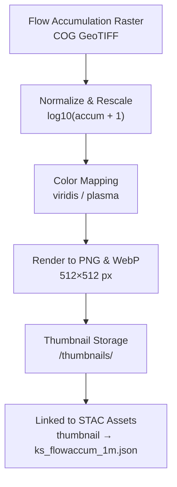

<div align="center">

# 🖼️ Kansas Frontier Matrix — Hydrology Flow Accumulation Thumbnails  
`data/tiles/hydrology/flow/accumulation/thumbnails/`

**Mission:** Store and document **thumbnail preview images** for all **flow accumulation raster tiles** —  
enabling quick visual inspection, web map previews, and STAC-integrated imagery for Kansas Frontier Matrix (KFM)  
hydrology flow products.

[](../../../../../../.github/workflows/site.yml)
[](../../../../../../.github/workflows/stac-validate.yml)
[](../../../../../../.github/workflows/codeql.yml)
[](../../../../../../.github/workflows/trivy.yml)
[](../../../../../../docs/)
[](../../../../../../LICENSE)

</div>

---

## 🖼️ Overview

This directory contains **static PNG thumbnails** derived from hydrologic **flow accumulation raster tiles** located in  
`data/tiles/hydrology/flow/accumulation/`. Each thumbnail represents a **scaled, colorized preview** of the accumulation  
intensity across Kansas — visually conveying drainage density and catchment patterns for web and documentation use.

**Purpose:**
- Provide **fast visual summaries** for documentation and web UI cards  
- Embed **thumbnail URLs** in STAC `assets` and metadata records  
- Support **AI training datasets** (e.g., pattern recognition of hydrologic networks)

---

## 📂 Directory Layout

```bash
data/
└── tiles/
    └── hydrology/
        └── flow/
            └── accumulation/
                └── thumbnails/
                    ├── ks_flowaccum_1m_preview.png
                    ├── ks_flowaccum_10m_preview.png
                    ├── ks_flowaccum_1m_preview.webp
                    └── ks_flowaccum_10m_preview.webp
````

---

## ⚙️ Thumbnail Generation Workflow



**Example Command (GDAL + Python):**

```bash
gdal_translate -of PNG -outsize 512 512 \
  -scale 1 1000000 0 255 \
  data/tiles/hydrology/flow/accumulation/ks_flowaccum_1m.tif \
  data/tiles/hydrology/flow/accumulation/thumbnails/ks_flowaccum_1m_preview.png
```

---

## 🧾 Metadata

| Field                  | Value                                      |
| ---------------------- | ------------------------------------------ |
| **Thumbnail Size**     | 512 × 512 px                               |
| **Formats**            | PNG, WebP                                  |
| **Color Map**          | `viridis` (log10-scaled)                   |
| **Alpha Transparency** | Enabled                                    |
| **Compression**        | PNG (lossless), WebP (80% quality)         |
| **Projection**         | EPSG:4326 (WGS 84)                         |
| **Generated By**       | KFM ETL pipeline (`make hydrology-thumbs`) |

---

## 🧩 Integration & Linkage

**Used In:**

* STAC `assets.thumbnail` fields
* Web viewer layer thumbnails (`/web/config/layers/hydrology.json`)
* MCP documentation panels (in `/docs/`)
* AI visualization datasets (pattern recognition of fluvial systems)

**STAC Example Snippet:**

```json
"assets": {
  "thumbnail": {
    "href": "data/tiles/hydrology/flow/accumulation/thumbnails/ks_flowaccum_1m_preview.png",
    "title": "Flow Accumulation (1m) Thumbnail",
    "type": "image/png",
    "roles": ["thumbnail"]
  }
}
```

---

## 🧠 AI & Visualization Context

These thumbnails assist **machine vision and visual reasoning** models by:

* Offering **compact representations** of fluvial intensity gradients
* Training **pattern detection systems** for drainage networks and watershed delineations
* Feeding **web-based preview systems** in the Kansas Frontier Matrix interface

---

## 🧮 Version & Provenance

| Field              | Value                                                              |
| ------------------ | ------------------------------------------------------------------ |
| **Version**        | `v1.0.0`                                                           |
| **Last Updated**   | 2025-10-12                                                         |
| **Maintainer**     | `@bartytime4life`                                                  |
| **Parent Dataset** | `ks_flowaccum_1m.tif` & `ks_flowaccum_10m.tif`                     |
| **License**        | CC-BY 4.0                                                          |
| **MCP Compliance** | ✅ Documentation · ✅ Reproducibility · ✅ Provenance · ✅ STAC Linked |

---

## 🪵 Changelog

| Date       | Version | Change                                                               | Author          | PR/Issue |
| ---------- | ------- | -------------------------------------------------------------------- | --------------- | -------- |
| 2025-10-12 | v1.0.0  | Initial release of hydrology flow accumulation thumbnails (PNG/WebP) | @bartytime4life | #236     |

---

## ✅ Validation Checklist

* [x] All thumbnails ≤ 512×512 px
* [x] Generated from verified flow accumulation rasters
* [x] Linked in STAC items (`assets.thumbnail`)
* [x] File integrity verified by checksums
* [x] README includes badges, versioning, and changelog
* [x] Mermaid diagram properly closed with `%%END OF MERMAID%%`

---

## 🔗 Related Directories

| Path                                                               | Description                          |
| ------------------------------------------------------------------ | ------------------------------------ |
| [`../`](../)                                                       | Main accumulation raster directory   |
| [`../../direction/`](../../direction/)                             | Flow direction rasters               |
| [`../../../../terrain/dem/`](../../../../terrain/dem/)             | Source elevation models              |
| [`../../../../../stac/hydrology/`](../../../../../stac/hydrology/) | STAC metadata for hydrology products |

---

<div align="center">

**Kansas Frontier Matrix — Hydrology Division**
📸 *“Small images, big insight — flow patterns revealed at a glance.”*

</div>
```

