<div align="center">

# 🔐 Kansas Frontier Matrix — Hydrology Flow Checksums  
`data/tiles/hydrology/flow/checksums/`

**Mission:** Maintain **SHA-256 checksum manifests** verifying the integrity and provenance of all  
hydrology flow-related raster tiles — including **flow direction** and **flow accumulation** datasets.  
These checksum files ensure scientific reproducibility, authenticity, and transparent lineage  
within the Kansas Frontier Matrix (KFM) data ecosystem.

[](../../../../../.github/workflows/site.yml)
[](../../../../../.github/workflows/stac-validate.yml)
[](../../../../../.github/workflows/codeql.yml)
[](../../../../../.github/workflows/trivy.yml)
[](../../../../../docs/)
[](../../../../../LICENSE)

</div>

---

## 🧾 Overview

This directory houses **SHA-256 checksum (`.sha256`) files** corresponding to all hydrology flow raster tiles  
under `data/tiles/hydrology/flow/`.  
These hashes are automatically generated during the ETL pipeline (`make hydrology-flow`) and  
serve as the foundation for **provenance auditing**, **data validation**, and **scientific traceability**.

**Use Cases:**
- Validate file integrity after download or deployment  
- Confirm identical data across distributed systems or collaborators  
- Ensure reproducibility in research or visualization pipelines  

---

## 📂 Directory Layout

```bash
data/
└── tiles/
    └── hydrology/
        └── flow/
            ├── direction/
            ├── accumulation/
            └── checksums/
                ├── ks_flowdir_1m.tif.sha256
                ├── ks_flowdir_10m.tif.sha256
                ├── ks_flowaccum_1m.tif.sha256
                └── ks_flowaccum_10m.tif.sha256
````

---

## ⚙️ Workflow

```mermaid
flowchart TD
  A["Raster Generation<br/>flow direction · accumulation"] --> B["Checksum Creation<br/>SHA-256 hash computation"]
  B --> C["Checksum Storage<br/>data/tiles/hydrology/flow/checksums/"]
  C --> D["ETL Validation<br/>make verify-flow"]
  D --> E["STAC Linkage<br/>checksum fields in metadata"]
%%END OF MERMAID%%
```



**Command Example:**

```bash
sha256sum data/tiles/hydrology/flow/accumulation/ks_flowaccum_1m.tif > \
  data/tiles/hydrology/flow/checksums/ks_flowaccum_1m.tif.sha256
```

**Verification Example:**

```bash
sha256sum --check data/tiles/hydrology/flow/checksums/ks_flowaccum_1m.tif.sha256
```

---

## 📘 Checksum File Structure

Each `.sha256` file contains a single line in the following format:

```
<hash>  <relative_path_to_file>
```

**Example:**

```
8d7b5a12a6c4cbe23d64a45b937c29f4b51208c1a0c2c6b9e30f5b8d7e817cd7  ks_flowaccum_1m.tif
```

---

## 🧩 Integration with STAC Metadata

Checksums are referenced in associated **STAC item JSON files** (see `/data/stac/hydrology/flow/`)
under the `assets` field:

```json
"assets": {
  "data": {
    "href": "data/tiles/hydrology/flow/accumulation/ks_flowaccum_1m.tif",
    "type": "image/tiff; application=geotiff; profile=cloud-optimized",
    "roles": ["data"],
    "checksum:sha256": "8d7b5a12a6c4cbe23d64a45b937c29f4b51208c1a0c2c6b9e30f5b8d7e817cd7"
  }
}
```

---

## 🧠 AI & Data Validation Context

Checksum verification enables:

* Automated **data integrity audits** in CI/CD
* AI models to **detect data drift** or tampering
* Dynamic **version control** for hydrologic tiles in long-term archives
* Provenance tracking across **multi-modal data (raster, vector, tabular)** layers

---

## 🧮 Version & Provenance

| Field                  | Value                                                         |
| ---------------------- | ------------------------------------------------------------- |
| **Version**            | `v1.0.0`                                                      |
| **Last Updated**       | 2025-10-12                                                    |
| **Maintainer**         | `@bartytime4life`                                             |
| **Parent Directories** | `flow/direction/`, `flow/accumulation/`                       |
| **Generated By**       | `make hydrology-flow`                                         |
| **Checksum Algorithm** | SHA-256                                                       |
| **MCP Compliance**     | ✅ Documentation · ✅ Provenance · ✅ Validation · ✅ STAC Linked |

---

## 🪵 Changelog

| Date       | Version | Change                                               | Author          | PR/Issue |
| ---------- | ------- | ---------------------------------------------------- | --------------- | -------- |
| 2025-10-12 | v1.0.0  | Initial release of hydrology flow checksum manifests | @bartytime4life | #237     |

---

## ✅ Validation Checklist

* [x] All `.sha256` files exist for corresponding `.tif` tiles
* [x] Hashes verified against generated rasters
* [x] STAC JSON `checksum:sha256` fields populated
* [x] Automated validation included in CI
* [x] README includes badges, versioning, and changelog
* [x] Mermaid diagram closed with `%%END OF MERMAID%%`

---

## 🔗 Related Directories

| Path                                                         | Description                      |
| ------------------------------------------------------------ | -------------------------------- |
| [`../direction/`](../direction/)                             | Flow direction rasters (D8/D∞)   |
| [`../accumulation/`](../accumulation/)                       | Flow accumulation rasters        |
| [`../../basins/`](../../basins/)                             | Basin and watershed boundaries   |
| [`../../../../stac/hydrology/`](../../../../stac/hydrology/) | STAC metadata and checksum links |

---

<div align="center">

**Kansas Frontier Matrix — Hydrology Division**
🔒 *“Integrity verified — every flow pixel accounted for.”*

</div>
```

