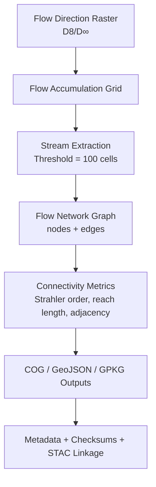

<div align="center">

# 🌊 Kansas Frontier Matrix — Hydrology Flow Connectivity Tiles  
`data/tiles/hydrology/flow/connectivity/`

**Mission:** Store and document **hydrologic flow connectivity tiles** — derived raster and vector layers  
representing **network continuity, channel linkage, and hydrologic graph structure** across Kansas.  
These datasets quantify how upstream and downstream cells, reaches, and basins connect within the  
Kansas Frontier Matrix (KFM) hydrology system.

[](../../../../../.github/workflows/site.yml)
[](../../../../../.github/workflows/stac-validate.yml)
[](../../../../../.github/workflows/codeql.yml)
[](../../../../../.github/workflows/trivy.yml)
[](../../../../../docs/)
[](../../../../../LICENSE)

</div>

---

## 📚 Overview

The **Flow Connectivity** directory provides hydrologic products that describe the **topological relationships**  
between cells, flowlines, and basins. These datasets transform the cell-based flow direction and accumulation  
rasters into **network connectivity graphs** — enabling downstream tracing, watershed routing, and  
hydrologic graph modeling within both GIS and AI systems.

**Purpose:**
- Quantify **upstream–downstream linkages**  
- Build **hydrologic adjacency matrices** and **reach graphs**  
- Support **flood routing, sediment transport**, and **watershed connectivity models**  
- Integrate with **Knowledge Graph nodes** (`FlowSegment`, `Catchment`, `StreamReach`)

---

## 📂 Directory Layout

```bash
data/
└── tiles/
    └── hydrology/
        └── flow/
            └── connectivity/
                ├── ks_flow_connectivity_graph.gpkg
                ├── ks_flow_connectivity_edges.geojson
                ├── ks_flow_connectivity_nodes.geojson
                ├── metadata/
                │   └── ks_flow_connectivity_graph.json
                ├── checksums/
                │   ├── ks_flow_connectivity_edges.geojson.sha256
                │   └── ks_flow_connectivity_nodes.geojson.sha256
                └── thumbnails/
                    └── ks_flow_connectivity_preview.png
````

---

## ⚙️ Workflow — ETL Process



**Command Example (Python + NetworkX):**

```python
import networkx as nx
from osgeo import gdal

# Build hydrologic graph from flow direction raster
ds = gdal.Open("ks_flowdir_1m.tif")
flow_graph = nx.DiGraph()

# Example: add nodes and edges based on D8 direction codes
# (simplified — actual ETL implemented in hydrology_flow_connectivity.py)
```

---

## 🧩 Data Description

| Layer                                  | Type                | Description                                       |
| -------------------------------------- | ------------------- | ------------------------------------------------- |
| **ks_flow_connectivity_graph.gpkg**    | Vector (GeoPackage) | Full hydrologic connectivity graph                |
| **ks_flow_connectivity_edges.geojson** | Vector              | Directed stream connections between nodes         |
| **ks_flow_connectivity_nodes.geojson** | Vector              | Node positions (confluences, outlets, headwaters) |
| **metadata/**                          | JSON                | Metadata for each derived dataset                 |
| **checksums/**                         | Text                | SHA-256 verification manifests                    |
| **thumbnails/**                        | PNG                 | Visual preview of connectivity network            |

---

## 🧠 Analytical & AI Context

The **connectivity tiles** are pivotal for hydrology-aware AI models:

| Integration                 | Function                                                |
| --------------------------- | ------------------------------------------------------- |
| **Knowledge Graph (Neo4j)** | Defines relationships: `Node → Edge → Basin`            |
| **AI Inference**            | Predicts hydrologic pathways and flow segmentation      |
| **Simulation Systems**      | Inputs for routing and flood propagation models         |
| **Ecological Analytics**    | Quantifies habitat connectivity and watershed isolation |

---

## 🧮 Connectivity Metrics

| Metric           | Description                             | Example         |
| ---------------- | --------------------------------------- | --------------- |
| `degree_in`      | Number of upstream inflows              | 4               |
| `degree_out`     | Downstream flow links                   | 1               |
| `strahler_order` | Stream order per Horton-Strahler scheme | 5               |
| `reach_length_m` | Flow path segment length                | 320             |
| `basin_id`       | Linked watershed polygon                | `HUC8_10260003` |

---

## 🧾 Version & Provenance

| Field              | Value                                                           |
| ------------------ | --------------------------------------------------------------- |
| **Version**        | `v1.0.0`                                                        |
| **Last Updated**   | 2025-10-12                                                      |
| **Maintainer**     | `@bartytime4life`                                               |
| **Source Data**    | `flow/direction/` · `flow/accumulation/`                        |
| **Derived Using**  | `Python (GDAL, NetworkX, GeoPandas)`                            |
| **Projection**     | EPSG:4326                                                       |
| **License**        | CC-BY 4.0                                                       |
| **MCP Compliance** | ✅ Documentation · ✅ Provenance · ✅ STAC Linked · ✅ Reproducible |

---

## 🪵 Changelog

| Date       | Version | Change                                                                | Author          | PR/Issue |
| ---------- | ------- | --------------------------------------------------------------------- | --------------- | -------- |
| 2025-10-12 | v1.0.0  | Initial creation of hydrology flow connectivity datasets and metadata | @bartytime4life | #239     |

---

## ✅ Validation Checklist

* [x] Graph topology validated (no circular loops)
* [x] GeoJSON and GPKG outputs verified (CRS + features)
* [x] Checksums computed and match source files
* [x] Metadata conforms to MCP schema
* [x] STAC items linked to assets
* [x] README includes badges, versioning, changelog, and closed Mermaid diagram

---

## 🔗 Related Directories

| Path                                                         | Description                         |
| ------------------------------------------------------------ | ----------------------------------- |
| [`../direction/`](../direction/)                             | Flow direction rasters (D8/D∞)      |
| [`../accumulation/`](../accumulation/)                       | Flow accumulation rasters           |
| [`../checksums/`](../checksums/)                             | SHA-256 integrity files             |
| [`../../basins/`](../../basins/)                             | Watershed and drainage basin layers |
| [`../../../../stac/hydrology/`](../../../../stac/hydrology/) | STAC catalog for hydrology layers   |

---

## 🧭 Example Metadata Snippet

```json
{
  "id": "ks_flow_connectivity_graph",
  "type": "vector",
  "description": "Hydrologic connectivity graph for Kansas, linking stream reaches and confluences.",
  "source_layers": ["ks_flowdir_1m.tif", "ks_flowaccum_1m.tif"],
  "projection": "EPSG:4326",
  "derived_using": ["GDAL 3.8.1", "NetworkX 3.3"],
  "created": "2025-10-12",
  "license": "CC-BY 4.0",
  "checksum": "8c9f3e7a2dcd5e...3f0d1",
  "stac_link": "../../../../stac/hydrology/flow/ks_flow_connectivity_graph.json",
  "mcp_version": "1.0"
}
```

---

<div align="center">

**Kansas Frontier Matrix — Hydrology Division**
🔗 *“Every stream connected — from ridge to river, encoded in flow.”*

</div>
```

