<div align="center">

# 🔐 Kansas Frontier Matrix — Hydrology Flow Connectivity Checksums  
`data/tiles/hydrology/flow/connectivity/checksums/`

**Mission:** Maintain **SHA-256 checksum manifests** for all **hydrologic flow connectivity datasets** —  
ensuring the **integrity**, **authenticity**, and **reproducibility** of Kansas Frontier Matrix (KFM)  
vector and graph-based hydrology layers.  
These checksums guarantee that every edge, node, and graph representation remains verified  
from source generation to web deployment.

[](../../../../../../.github/workflows/site.yml)
[](../../../../../../.github/workflows/stac-validate.yml)
[](../../../../../../.github/workflows/codeql.yml)
[](../../../../../../.github/workflows/trivy.yml)
[](../../../../../../docs/)
[](../../../../../../LICENSE)

</div>

---

## 📚 Overview

This directory stores **checksum verification files (`.sha256`)** for the connectivity datasets  
located in `data/tiles/hydrology/flow/connectivity/`.  
Each checksum file validates the integrity of its associated GeoJSON or GeoPackage output —  
confirming that hydrologic graph data remain identical to their verified originals across  
builds, deployments, and archival environments.

Checksums are created automatically during the **ETL pipeline** (`make hydrology-connectivity`)  
and revalidated during continuous integration workflows.

---

## 📂 Directory Layout

```bash
data/
└── tiles/
    └── hydrology/
        └── flow/
            └── connectivity/
                └── checksums/
                    ├── ks_flow_connectivity_graph.gpkg.sha256
                    ├── ks_flow_connectivity_edges.geojson.sha256
                    └── ks_flow_connectivity_nodes.geojson.sha256
````

---

## ⚙️ Workflow Overview

```mermaid
flowchart TD
  A["Flow Direction & Accumulation Inputs"] --> B["Connectivity Graph Generation<br/>NetworkX · GDAL · GeoPandas"]
  B --> C["Checksum Computation<br/>SHA-256 for GPKG & GeoJSON"]
  C --> D["Storage in<br/>data/tiles/hydrology/flow/connectivity/checksums/"]
  D --> E["STAC Linkage<br/>checksum:sha256 fields embedded"]
  E --> F["Continuous Validation<br/>CI Workflow: make verify-connectivity"]
%%END OF MERMAID%%
```



**Command Example:**

```bash
sha256sum data/tiles/hydrology/flow/connectivity/ks_flow_connectivity_edges.geojson \
  > data/tiles/hydrology/flow/connectivity/checksums/ks_flow_connectivity_edges.geojson.sha256
```

**Verification Example:**

```bash
sha256sum --check data/tiles/hydrology/flow/connectivity/checksums/ks_flow_connectivity_edges.geojson.sha256
```

---

## 🧾 Checksum File Format

Each checksum file contains a single line in standard SHA-256 format:

```
<hash>  <relative_path_to_file>
```

**Example:**

```
6c73c1f2a08f4a7efc02b9c0a4213cb88f0a3b38ed1e3cf0fd5a12e9499e2d9e  ks_flow_connectivity_edges.geojson
```

---

## 🧩 Integration with STAC Metadata

Checksums are embedded in **STAC Item assets** for direct provenance tracking:

```json
"assets": {
  "edges": {
    "href": "data/tiles/hydrology/flow/connectivity/ks_flow_connectivity_edges.geojson",
    "type": "application/geo+json",
    "roles": ["data"],
    "checksum:sha256": "6c73c1f2a08f4a7efc02b9c0a4213cb88f0a3b38ed1e3cf0fd5a12e9499e2d9e"
  }
}
```

This ensures complete alignment between:

* Local file integrity (`.sha256`)
* STAC catalog representation
* Graph database references (`hasChecksum` relationships in Neo4j)

---

## 🧠 AI & Data Integrity Context

Checksums support **AI-integrated provenance validation**:

* Detect file drift or corruption in distributed data pipelines
* Verify alignment between **vector topologies** and **graph representations**
* Enable **self-healing AI audit agents** to identify mismatched datasets
* Provide **trusted hashes** for reproducible scientific workflows

---

## 🧮 Version & Provenance

| Field                  | Value                                                        |
| ---------------------- | ------------------------------------------------------------ |
| **Version**            | `v1.0.0`                                                     |
| **Last Updated**       | 2025-10-12                                                   |
| **Maintainer**         | `@bartytime4life`                                            |
| **Checksum Algorithm** | SHA-256                                                      |
| **Source Data**        | Connectivity GeoJSON / GPKG                                  |
| **License**            | CC-BY 4.0                                                    |
| **MCP Compliance**     | ✅ Provenance · ✅ Validation · ✅ STAC Linked · ✅ Reproducible |

---

## 🪵 Changelog

| Date       | Version | Change                                                  | Author          | PR/Issue |
| ---------- | ------- | ------------------------------------------------------- | --------------- | -------- |
| 2025-10-12 | v1.0.0  | Initial release of flow connectivity checksum manifests | @bartytime4life | #241     |

---

## ✅ Validation Checklist

* [x] `.sha256` files exist for all connectivity datasets
* [x] Hash values verified against local and remote copies
* [x] `checksum:sha256` fields embedded in STAC JSON
* [x] Validation included in GitHub Actions workflow
* [x] README includes badges, versioning, changelog, and closed Mermaid diagram

---

## 🔗 Related Directories

| Path                                                         | Description                                    |
| ------------------------------------------------------------ | ---------------------------------------------- |
| [`../`](../)                                                 | Main flow connectivity datasets                |
| [`../metadata/`](../metadata/)                               | Metadata describing graph topology and lineage |
| [`../thumbnails/`](../thumbnails/)                           | Preview images for connectivity maps           |
| [`../../../direction/`](../../../direction/)                 | Flow direction tiles                           |
| [`../../../accumulation/`](../../../accumulation/)           | Flow accumulation rasters                      |
| [`../../../../stac/hydrology/`](../../../../stac/hydrology/) | STAC catalog for hydrology datasets            |

---

<div align="center">

**Kansas Frontier Matrix — Hydrology Division**
🧮 *“Integrity in every connection — ensuring hydrologic truth through verifiable hashes.”*

</div>
```

