<div align="center">

# 🧾 Kansas Frontier Matrix — Hydrology Flow Connectivity Metadata  
`data/tiles/hydrology/flow/connectivity/metadata/`

**Mission:** Define and maintain **metadata records** for the Kansas Frontier Matrix (KFM)  
**Flow Connectivity** datasets — documenting network structure, provenance, schema validation,  
and links into the hydrologic knowledge graph. These metadata files guarantee transparent lineage  
for every hydrologic connectivity dataset, ensuring reproducibility and semantic traceability  
across the KFM data architecture.

[](../../../../../../.github/workflows/site.yml)
[](../../../../../../.github/workflows/stac-validate.yml)
[](../../../../../../.github/workflows/codeql.yml)
[](../../../../../../.github/workflows/trivy.yml)
[](../../../../../../docs/)
[](../../../../../../LICENSE)

</div>

---

## 📚 Overview

This directory stores **JSON metadata files** that describe hydrologic flow connectivity datasets:  
graph-based representations of **stream networks**, **flow adjacency**, and **watershed linkages**.  
Each metadata record follows the **KFM–MCP hybrid metadata schema** and is cross-linked to a  
**STAC Item** in `/data/stac/hydrology/flow/`.

These metadata documents record:
- Dataset-level **provenance** (derived from flow direction and accumulation layers)
- **Network statistics** (node count, edge count, mean stream order)
- **Geospatial coverage and CRS**
- **Data lineage**, including algorithms and input sources
- **Versioning and STAC references** for reproducibility

---

## 📂 Directory Layout

```bash
data/
└── tiles/
    └── hydrology/
        └── flow/
            └── connectivity/
                └── metadata/
                    ├── ks_flow_connectivity_graph.json
                    ├── ks_flow_connectivity_edges.json
                    └── ks_flow_connectivity_nodes.json
````

---

## ⚙️ Metadata Schema

Metadata conforms to `hydrology_flow_connectivity_metadata.schema.json`
(defined in `/src/kansas_geo_timeline/schemas/`).

| Field            | Description                | Example                                                                |
| ---------------- | -------------------------- | ---------------------------------------------------------------------- |
| `id`             | Unique dataset ID          | `"ks_flow_connectivity_graph"`                                         |
| `type`           | Data type                  | `"vector"`                                                             |
| `description`    | Summary of dataset purpose | `"Hydrologic connectivity graph of Kansas stream network"`             |
| `inputs`         | Source datasets            | `["ks_flowdir_1m", "ks_flowaccum_1m"]`                                 |
| `algorithm`      | Derivation toolset         | `"NetworkX Connectivity Builder"`                                      |
| `spatial_extent` | Bounding box               | `[-102.05, 36.99, -94.58, 40.00]`                                      |
| `projection`     | EPSG code                  | `"EPSG:4326"`                                                          |
| `graph_metrics`  | Summary stats              | `{ "nodes": 148239, "edges": 147901, "avg_degree": 2.01 }`             |
| `stac_link`      | Associated STAC JSON       | `"../../../../../stac/hydrology/flow/ks_flow_connectivity_graph.json"` |
| `checksum`       | SHA-256 of dataset         | `"2cf7e91a...b3a4"`                                                    |
| `created`        | Creation date              | `"2025-10-12"`                                                         |
| `mcp_version`    | Protocol version           | `"MCP v1.0"`                                                           |
| `license`        | Data license               | `"CC-BY 4.0"`                                                          |

---

## 🧩 Metadata Generation Pipeline

```mermaid
flowchart TD
  A["Flow Direction & Accumulation Rasters"] --> B["Hydrologic Graph Builder<br/>NetworkX · GDAL · GeoPandas"]
  B --> C["Connectivity Layers<br/>Edges · Nodes · Graph GPKG"]
  C --> D["Metadata Extraction<br/>stats · provenance · schema"]
  D --> E["STAC Linkage<br/>/data/stac/hydrology/flow/"]
  E --> F["Knowledge Graph Ingestion<br/>Neo4j (CIDOC CRM)"]
%%END OF MERMAID%%
```



**Command Example:**

```bash
make metadata-flow-connectivity
# Auto-generates JSON metadata files for each connectivity dataset
```

---

## 🧠 Integration & Knowledge Graph Mapping

Metadata fields are semantically mapped to the KFM **Neo4j Knowledge Graph** and **AI interpretation pipelines**.

| Graph Node Type | Metadata Source                | Description                                   |
| --------------- | ------------------------------ | --------------------------------------------- |
| `Dataset`       | `id`, `description`, `license` | Identifies the hydrologic data layer          |
| `Process`       | `algorithm`, `inputs`          | ETL provenance                                |
| `GraphMetric`   | `graph_metrics`                | Network topology summary                      |
| `Place`         | `spatial_extent`               | Spatial bounding region (Kansas state extent) |

**AI Applications:**

* Predict **drainage network resilience** or **flow fragmentation**
* Assess **hydrologic connectivity under climate perturbations**
* Link connectivity metrics to **ecosystem and hazard models**

---

## 🧮 Version & Provenance

| Field              | Value                                                        |
| ------------------ | ------------------------------------------------------------ |
| **Version**        | `v1.0.0`                                                     |
| **Last Updated**   | 2025-10-12                                                   |
| **Maintainer**     | `@bartytime4life`                                            |
| **Derived From**   | `flow/direction/` and `flow/accumulation/` datasets          |
| **Algorithm**      | NetworkX 3.3, GDAL 3.8.1, GeoPandas 1.0.1                    |
| **License**        | CC-BY 4.0                                                    |
| **MCP Compliance** | ✅ Documentation · ✅ Provenance · ✅ STAC Linked · ✅ Validated |

---

## 🪵 Changelog

| Date       | Version | Change                                                        | Author          | PR/Issue |
| ---------- | ------- | ------------------------------------------------------------- | --------------- | -------- |
| 2025-10-12 | v1.0.0  | Initial release of hydrology flow connectivity metadata files | @bartytime4life | #240     |

---

## ✅ Validation Checklist

* [x] Metadata conforms to `hydrology_flow_connectivity_metadata.schema.json`
* [x] Each JSON links to a valid STAC Item
* [x] Checksum verified via `sha256sum`
* [x] CRS and extent validated
* [x] Provenance and inputs documented
* [x] README includes badges, versioning, and changelog
* [x] Mermaid diagram properly closed with `%%END OF MERMAID%%`

---

## 🔗 Related Directories

| Path                                                         | Description                                    |
| ------------------------------------------------------------ | ---------------------------------------------- |
| [`../`](../)                                                 | Main flow connectivity datasets (GeoJSON/GPKG) |
| [`../checksums/`](../checksums/)                             | File integrity verification                    |
| [`../thumbnails/`](../thumbnails/)                           | Thumbnail visual previews                      |
| [`../../../direction/`](../../../direction/)                 | Flow direction tiles (D8/D∞)                   |
| [`../../../accumulation/`](../../../accumulation/)           | Flow accumulation tiles                        |
| [`../../../../stac/hydrology/`](../../../../stac/hydrology/) | STAC catalog for hydrology data products       |

---

## 🧭 Example Metadata File

```json
{
  "id": "ks_flow_connectivity_edges",
  "type": "vector",
  "description": "Directed edge representation of Kansas hydrologic connectivity network.",
  "inputs": ["ks_flowdir_1m", "ks_flowaccum_1m"],
  "algorithm": "NetworkX Directed Graph Builder",
  "projection": "EPSG:4326",
  "spatial_extent": [-102.05, 36.99, -94.58, 40.00],
  "graph_metrics": {
    "nodes": 148239,
    "edges": 147901,
    "avg_degree": 2.01,
    "max_strahler_order": 7
  },
  "checksum": "2cf7e91a7f5b61b6efc3b8f2b29e832dfb65b6d93a95fa9d03c7b8c3e3b3a4",
  "stac_link": "../../../../stac/hydrology/flow/ks_flow_connectivity_edges.json",
  "created": "2025-10-12",
  "license": "CC-BY 4.0",
  "mcp_version": "1.0"
}
```

---

<div align="center">

**Kansas Frontier Matrix — Hydrology Division**
🧩 *“Documenting the connections that define the rivers of Kansas — scientifically and semantically.”*

</div>
```

