<div align="center">

# 🖼️ Kansas Frontier Matrix — Hydrology Flow Connectivity Thumbnails  
`data/tiles/hydrology/flow/connectivity/thumbnails/`

**Mission:** Provide **thumbnail visual previews** for all hydrologic **flow connectivity datasets** —  
including graph, node, and edge visualizations — to enable quick inspection, web previews,  
and embedded documentation images for the Kansas Frontier Matrix (KFM) hydrology subsystem.

[](../../../../../../.github/workflows/site.yml)
[](../../../../../../.github/workflows/stac-validate.yml)
[](../../../../../../.github/workflows/codeql.yml)
[](../../../../../../.github/workflows/trivy.yml)
[](../../../../../../docs/)
[](../../../../../../LICENSE)

</div>

---

## 📚 Overview

This directory contains **thumbnail images (PNG & WebP)** representing Kansas’s  
**hydrologic connectivity networks** — including **flow graph**, **edges**, and **nodes** visualizations.  
Thumbnails are generated automatically by the ETL pipeline and linked directly to  
the corresponding **STAC metadata** under `/data/stac/hydrology/flow/`.

These visuals help:
- Document **graph topologies** and **flow structure**  
- Power **MapLibre preview layers** and **AI visual training datasets**  
- Serve as **quick-reference imagery** for metadata and knowledge graph browsing

---

## 📂 Directory Layout

```bash
data/
└── tiles/
    └── hydrology/
        └── flow/
            └── connectivity/
                └── thumbnails/
                    ├── ks_flow_connectivity_graph_preview.png
                    ├── ks_flow_connectivity_edges_preview.png
                    ├── ks_flow_connectivity_nodes_preview.png
                    ├── ks_flow_connectivity_graph_preview.webp
                    └── ks_flow_connectivity_edges_preview.webp
````

---

## ⚙️ Thumbnail Generation Workflow

```mermaid
flowchart TD
  A["Connectivity Data<br/>GeoJSON · GPKG"] --> B["Style & Symbolize<br/>node color, edge thickness, alpha blending"]
  B --> C["Render Static Thumbnails<br/>512×512 px PNG / WebP"]
  C --> D["Store in<br/>/thumbnails/"]
  D --> E["Link to STAC Items<br/>assets.thumbnail"]
  E --> F["Use in Web UI<br/>Map layer preview · Graph cards"]
%%END OF MERMAID%%
```



**Command Example (Python + Matplotlib):**

```python
import geopandas as gpd
import matplotlib.pyplot as plt

edges = gpd.read_file("ks_flow_connectivity_edges.geojson")
nodes = gpd.read_file("ks_flow_connectivity_nodes.geojson")

fig, ax = plt.subplots(figsize=(6,6))
edges.plot(ax=ax, color="blue", linewidth=0.2, alpha=0.6)
nodes.plot(ax=ax, color="red", markersize=2)
plt.axis("off")
plt.savefig("thumbnails/ks_flow_connectivity_graph_preview.png", dpi=200, bbox_inches="tight")
```

---

## 🧩 Metadata Integration

Thumbnails are referenced inside their **STAC Item JSON** files as follows:

```json
"assets": {
  "thumbnail": {
    "href": "data/tiles/hydrology/flow/connectivity/thumbnails/ks_flow_connectivity_graph_preview.png",
    "type": "image/png",
    "roles": ["thumbnail"],
    "title": "Hydrologic Flow Connectivity (Graph Preview)"
  }
}
```

These are automatically linked when generating or validating STAC items
(`make stac-validate` or `make site`).

---

## 🧠 AI & Visualization Context

Flow connectivity thumbnails are used in:

* **AI-assisted hydrologic structure identification**
* **Automated topology classification** (detecting loops, breaks, or anomalies)
* **Web viewer** layer cards (`/web/config/layers/hydrology_connectivity.json`)
* **Neo4j graph UI** nodes for network visual summaries

**Visualization conventions:**

| Feature           | Symbol     | Color      | Meaning                   |
| ----------------- | ---------- | ---------- | ------------------------- |
| Main Channels     | Lines      | Blue       | Primary flow pathways     |
| Secondary Streams | Thin Lines | Light Blue | Tributary systems         |
| Nodes             | Dots       | Red        | Confluences or headwaters |
| Boundaries        | Outlines   | Gray       | Watershed limits          |

---

## 🧾 Version & Provenance

| Field                    | Value                                                                   |
| ------------------------ | ----------------------------------------------------------------------- |
| **Version**              | `v1.0.0`                                                                |
| **Last Updated**         | 2025-10-12                                                              |
| **Maintainer**           | `@bartytime4life`                                                       |
| **Parent Dataset**       | `ks_flow_connectivity_graph.gpkg`, `ks_flow_connectivity_edges.geojson` |
| **License**              | CC-BY 4.0                                                               |
| **Thumbnail Resolution** | 512×512 px                                                              |
| **Color Scheme**         | Blue–Red for edges/nodes                                                |
| **MCP Compliance**       | ✅ Documentation · ✅ Provenance · ✅ STAC Linked · ✅ Visual Provenance    |

---

## 🪵 Changelog

| Date       | Version | Change                                                          | Author          | PR/Issue |
| ---------- | ------- | --------------------------------------------------------------- | --------------- | -------- |
| 2025-10-12 | v1.0.0  | Initial release of hydrology flow connectivity thumbnail assets | @bartytime4life | #242     |

---

## ✅ Validation Checklist

* [x] PNG and WebP thumbnails exist for each connectivity dataset
* [x] Images ≤ 512×512 px
* [x] Embedded in STAC metadata (`assets.thumbnail`)
* [x] Colorized consistently across datasets
* [x] Checksums computed and validated
* [x] README includes badges, versioning, and changelog
* [x] Mermaid diagram properly closed with `%%END OF MERMAID%%`

---

## 🔗 Related Directories

| Path                                                         | Description                                    |
| ------------------------------------------------------------ | ---------------------------------------------- |
| [`../`](../)                                                 | Main flow connectivity datasets (GeoJSON/GPKG) |
| [`../metadata/`](../metadata/)                               | Metadata describing connectivity graphs        |
| [`../checksums/`](../checksums/)                             | SHA-256 checksum files                         |
| [`../../../direction/`](../../../direction/)                 | Flow direction rasters                         |
| [`../../../accumulation/`](../../../accumulation/)           | Flow accumulation rasters                      |
| [`../../../../stac/hydrology/`](../../../../stac/hydrology/) | STAC catalog for hydrology datasets            |

---

<div align="center">

**Kansas Frontier Matrix — Hydrology Division**
📸 *“Visualizing the unseen — the flow of Kansas rendered in networks.”*

</div>
```

