<div align="center">

# 🧾 Kansas Frontier Matrix — Hydrology Flow Metadata  
`data/tiles/hydrology/flow/metadata/`

**Mission:** Curate, document, and validate **metadata records** for all hydrology flow raster tiles —  
including both **flow direction** and **flow accumulation** layers — ensuring scientific transparency,  
traceable provenance, and cross-linkage into the Kansas Frontier Matrix (KFM) **STAC** and **Knowledge Graph** systems.

[](../../../../../.github/workflows/site.yml)
[](../../../../../.github/workflows/stac-validate.yml)
[](../../../../../.github/workflows/codeql.yml)
[](../../../../../.github/workflows/trivy.yml)
[](../../../../../docs/)
[](../../../../../LICENSE)

</div>

---

## 📚 Overview

This directory contains **metadata JSON files** describing the hydrology **flow direction** and **flow accumulation** raster tiles  
stored in `data/tiles/hydrology/flow/`.  
Each file follows the **KFM–MCP hybrid schema**, compatible with **STAC Item** specifications and the project’s  
semantic Knowledge Graph (Neo4j / CIDOC CRM / OWL-Time).

These metadata files:
- Record full **data lineage and provenance** from source DEMs through hydrologic derivation  
- Track **processing parameters**, **software versions**, and **spatial/temporal coverage**  
- Link directly to their **STAC counterparts** in `/data/stac/hydrology/flow/`  
- Enable **AI interpretability**, data reproducibility, and knowledge graph mapping

---

## 📂 Directory Layout

```bash
data/
└── tiles/
    └── hydrology/
        └── flow/
            └── metadata/
                ├── ks_flowdir_1m.json
                ├── ks_flowdir_10m.json
                ├── ks_flowaccum_1m.json
                └── ks_flowaccum_10m.json
````

---

## ⚙️ Metadata Schema

Each JSON file conforms to the `hydrology_flow_metadata.schema.json` (found in `/src/kansas_geo_timeline/schemas/`).

**Core Fields:**

| Field             | Description                  | Example                                                  |
| ----------------- | ---------------------------- | -------------------------------------------------------- |
| `id`              | Unique dataset ID            | `"ks_flowaccum_1m"`                                      |
| `type`            | Data product type            | `"raster"`                                               |
| `description`     | Summary of dataset purpose   | `"1m resolution flow accumulation grid for Kansas"`      |
| `source_dem`      | Input DEM dataset reference  | `"ks_dem_1m"`                                            |
| `algorithm`       | Hydrologic derivation method | `"D8 (deterministic eight)"`                             |
| `parameters`      | ETL parameters used          | `{ "flow_dir": "D8", "fill_sinks": true }`               |
| `projection`      | EPSG code                    | `"EPSG:4326"`                                            |
| `spatial_extent`  | Bounding box                 | `[-102.05,36.99,-94.58,40.00]`                           |
| `temporal_extent` | Time range (if applicable)   | `["2024-01-01","2025-01-01"]`                            |
| `checksum`        | SHA-256 file hash            | `"f4a7b2e12f1a..."`                                      |
| `stac_link`       | Relative path to STAC item   | `"../../../../stac/hydrology/flow/ks_flowaccum_1m.json"` |
| `license`         | Data license                 | `"CC-BY 4.0"`                                            |
| `created`         | Creation date                | `"2025-10-12"`                                           |
| `mcp_version`     | Protocol version             | `"MCP v1.0"`                                             |

---

## 🧩 Workflow Overview

```mermaid
flowchart TD
  A["DEM Source<br/>data/tiles/terrain/dem/ks_dem_1m/"] --> B["Flow Derivation<br/>D8 / D∞ algorithms"]
  B --> C["Flow Direction + Accumulation Rasters<br/>GeoTIFF (COG)"]
  C --> D["Metadata Generation<br/>JSON schema validation"]
  D --> E["STAC Item Linkage<br/>/data/stac/hydrology/flow/*.json"]
  E --> F["Knowledge Graph Ingestion<br/>Neo4j · CIDOC CRM · OWL-Time"]
%%END OF MERMAID%%
```



---

## 🧠 AI & Knowledge Graph Integration

Metadata from this directory populate the **AI reasoning and query layers** within KFM:

| Integration             | Function                                                        |
| ----------------------- | --------------------------------------------------------------- |
| **Neo4j Graph**         | Creates nodes for Dataset, Process, Place, and Provenance       |
| **FastAPI / STAC API**  | Serves metadata to the KFM web viewer                           |
| **AI Agents**           | Use metadata to contextualize hydrologic models and map outputs |
| **Documentation Tools** | Auto-generate provenance diagrams and lineage reports           |

---

## 🧮 Version & Provenance

| Field              | Value                                                         |
| ------------------ | ------------------------------------------------------------- |
| **Version**        | `v1.0.0`                                                      |
| **Last Updated**   | 2025-10-12                                                    |
| **Maintainer**     | `@bartytime4life`                                             |
| **Schema**         | `hydrology_flow_metadata.schema.json`                         |
| **License**        | CC-BY 4.0                                                     |
| **MCP Compliance** | ✅ Documentation · ✅ Provenance · ✅ Validation · ✅ STAC Linked |

---

## 🪵 Changelog

| Date       | Version | Change                                                                | Author          | PR/Issue |
| ---------- | ------- | --------------------------------------------------------------------- | --------------- | -------- |
| 2025-10-12 | v1.0.0  | Initial release of hydrology flow metadata schema and dataset records | @bartytime4life | #238     |

---

## ✅ Validation Checklist

* [x] Each `.json` validated against schema (`make validate-metadata`)
* [x] Linked to corresponding STAC items
* [x] Provenance and checksum fields included
* [x] License specified
* [x] Timestamps conform to ISO 8601
* [x] README includes badges, changelog, and closed Mermaid diagram

---

## 🔗 Related Directories

| Path                                                         | Description                         |
| ------------------------------------------------------------ | ----------------------------------- |
| [`../direction/`](../direction/)                             | Flow direction raster tiles         |
| [`../accumulation/`](../accumulation/)                       | Flow accumulation raster tiles      |
| [`../checksums/`](../checksums/)                             | File integrity manifests            |
| [`../../basins/`](../../basins/)                             | Derived watershed products          |
| [`../../../../stac/hydrology/`](../../../../stac/hydrology/) | STAC metadata catalog for hydrology |

---

## 🧭 Example Metadata File

```json
{
  "id": "ks_flowaccum_1m",
  "type": "raster",
  "description": "1m resolution flow accumulation raster for Kansas",
  "source_dem": "ks_dem_1m",
  "algorithm": "D8",
  "parameters": {
    "fill_sinks": true,
    "out_type": "cells"
  },
  "projection": "EPSG:4326",
  "spatial_extent": [-102.05, 36.99, -94.58, 40.00],
  "checksum": "a81b9f2c34ddee91f74f71fa12cebb1aa9885d11ad13219ec23d6a5213d3fdac",
  "stac_link": "../../../../stac/hydrology/flow/ks_flowaccum_1m.json",
  "created": "2025-10-12",
  "license": "CC-BY 4.0",
  "mcp_version": "1.0"
}
```

---

<div align="center">

**Kansas Frontier Matrix — Hydrology Division**
📄 *“Every layer documented, every process traceable — water science with provenance.”*

</div>
```

