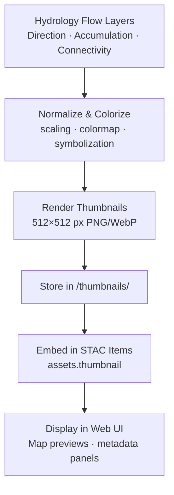

<div align="center">

# 🖼️ Kansas Frontier Matrix — Hydrology Flow Thumbnails  
`data/tiles/hydrology/flow/thumbnails/`

**Mission:** Store and document **thumbnail preview images** for all hydrology flow datasets —  
including **direction**, **accumulation**, and **connectivity** layers — to enable fast visual inspection,  
map previews, and embedded STAC visual assets within the Kansas Frontier Matrix (KFM) hydrology archive.

[](../../../../../.github/workflows/site.yml)
[](../../../../../.github/workflows/stac-validate.yml)
[](../../../../../.github/workflows/codeql.yml)
[](../../../../../.github/workflows/trivy.yml)
[](../../../../../docs/)
[](../../../../../LICENSE)

</div>

---

## 📚 Overview

This directory contains **preview images** summarizing hydrologic flow raster and vector data layers:  
- **Flow Direction** — D8 / D∞ raster directionality visualization  
- **Flow Accumulation** — logarithmic intensity maps showing upstream contributing area  
- **Flow Connectivity** — vector graph previews (edges, nodes, networks)

These thumbnails act as **visual anchors** within KFM’s STAC catalogs, MapLibre map cards,  
and Knowledge Graph UI elements, enabling instant recognition of hydrologic structures  
without loading full-resolution datasets.

---

## 📂 Directory Layout

```bash
data/
└── tiles/
    └── hydrology/
        └── flow/
            └── thumbnails/
                ├── ks_flowdir_1m_preview.png
                ├── ks_flowaccum_1m_preview.png
                ├── ks_flow_connectivity_graph_preview.png
                ├── ks_flow_connectivity_edges_preview.png
                ├── ks_flow_connectivity_nodes_preview.png
                └── README.md
````

---

## ⚙️ Thumbnail Generation Workflow



**Typical Commands:**

```bash
# Raster → Thumbnail (Flow Accumulation)
gdal_translate -of PNG -outsize 512 512 \
  -scale 1 1000000 0 255 \
  data/tiles/hydrology/flow/accumulation/ks_flowaccum_1m.tif \
  data/tiles/hydrology/flow/thumbnails/ks_flowaccum_1m_preview.png

# Vector → Thumbnail (Connectivity Graph)
python scripts/make_connectivity_thumb.py \
  --input data/tiles/hydrology/flow/connectivity/ks_flow_connectivity_edges.geojson \
  --output data/tiles/hydrology/flow/thumbnails/ks_flow_connectivity_graph_preview.png
```

---

## 🧩 Visualization Standards

| Layer              | Color Scheme           | Format     | Resolution | Description                  |
| ------------------ | ---------------------- | ---------- | ---------- | ---------------------------- |
| Flow Direction     | Blue–Cyan Gradient     | PNG        | 512×512    | Encodes drainage orientation |
| Flow Accumulation  | Viridis (log10-scaled) | PNG / WebP | 512×512    | Upstream contributing area   |
| Connectivity Graph | Red Nodes / Blue Edges | PNG / WebP | 512×512    | Hydrologic network topology  |

**File Naming Convention:**
`ks_flow<type>_<resolution>_preview.<ext>`
e.g., `ks_flowaccum_1m_preview.png`, `ks_flow_connectivity_graph_preview.webp`

---

## 🧠 AI & Analytical Context

These thumbnails serve as visual training and validation materials for AI-driven workflows:

* **Computer Vision Models:** detect hydrologic features and network anomalies
* **Knowledge Graph Agents:** generate previews and similarity metrics for linked nodes
* **Documentation Summaries:** embed quick-views into STAC, README, and MCP reports
* **Web UI Optimization:** lightweight image loading for responsive map cards

---

## 🧮 Version & Provenance

| Field               | Value                                                                |
| ------------------- | -------------------------------------------------------------------- |
| **Version**         | `v1.0.0`                                                             |
| **Last Updated**    | 2025-10-12                                                           |
| **Maintainer**      | `@bartytime4life`                                                    |
| **Parent Datasets** | Flow Direction / Flow Accumulation / Connectivity                    |
| **License**         | CC-BY 4.0                                                            |
| **Resolution**      | 512×512 px                                                           |
| **Color Map**       | Viridis (Acc.), Blue (Dir.), Red/Blue (Conn.)                        |
| **MCP Compliance**  | ✅ Documentation · ✅ Provenance · ✅ STAC Linked · ✅ Visual Provenance |

---

## 🪵 Changelog

| Date       | Version | Change                                                                                     | Author          | PR/Issue |
| ---------- | ------- | ------------------------------------------------------------------------------------------ | --------------- | -------- |
| 2025-10-12 | v1.0.0  | Initial release of hydrology flow thumbnails for direction, accumulation, and connectivity | @bartytime4life | #243     |

---

## ✅ Validation Checklist

* [x] Thumbnails exist for all flow layers (direction, accumulation, connectivity)
* [x] Files ≤ 512×512 px (PNG/WebP)
* [x] `assets.thumbnail` fields embedded in STAC items
* [x] Color maps standardized (viridis, blue, red/blue)
* [x] Provenance and licensing documented
* [x] README includes badges, changelog, and closed Mermaid diagram

---

## 🔗 Related Directories

| Path                                                         | Description                                |
| ------------------------------------------------------------ | ------------------------------------------ |
| [`../direction/`](../direction/)                             | Flow direction rasters                     |
| [`../accumulation/`](../accumulation/)                       | Flow accumulation rasters                  |
| [`../connectivity/`](../connectivity/)                       | Connectivity graphs and vector datasets    |
| [`../checksums/`](../checksums/)                             | Hash-based file integrity verification     |
| [`../metadata/`](../metadata/)                               | Metadata records for hydrologic flow       |
| [`../../../../stac/hydrology/`](../../../../stac/hydrology/) | STAC metadata catalog for hydrology layers |

---

<div align="center">

**Kansas Frontier Matrix — Hydrology Division**
📸 *“From direction to network — hydrology rendered, validated, and visualized.”*

</div>
```

