<div align="center">

# 🧾 Kansas Frontier Matrix — Hydrology Metadata  
`data/tiles/hydrology/metadata/`

**Mission:** Curate and validate **metadata records** for all hydrology-related datasets —  
including **flow**, **aquifers**, **basins**, and **floodplains** — ensuring complete provenance,  
STAC compliance, and semantic integration into the **Kansas Frontier Matrix (KFM)**  
knowledge ecosystem.

[](../../../../.github/workflows/site.yml)
[](../../../../.github/workflows/stac-validate.yml)
[](../../../../.github/workflows/codeql.yml)
[](../../../../.github/workflows/trivy.yml)
[](../../../../docs/)
[](../../../../LICENSE)

</div>

---

## 📚 Overview

This directory consolidates **metadata JSON files** describing every hydrology tile and  
subdomain within the KFM repository.  
Each record follows the **MCP–STAC hybrid schema**, documenting lineage, provenance, and  
cross-links to other datasets and STAC collections.

Hydrology metadata connects Kansas’s **surface**, **subsurface**, and **climate-driven**  
water systems into one unified structure — facilitating reproducible analysis and  
AI-supported hydrologic discovery.

**Subdomains:**
- **Flow:** direction, accumulation, connectivity  
- **Aquifers:** extents, saturated thickness, transmissivity  
- **Basins:** watershed and sub-basin boundaries  
- **Floodplains:** flood zones, depth grids, and floodways  

---

## 📂 Directory Layout

```bash
data/
└── tiles/
    └── hydrology/
        └── metadata/
            ├── flow/
            │   ├── ks_flowaccum_1m.json
            │   ├── ks_flowdir_1m.json
            │   └── ks_flow_connectivity_graph.json
            ├── aquifers/
            │   ├── ks_aquifers_extent.json
            │   └── ks_aquifers_transmissivity.json
            ├── basins/
            │   └── ks_basins_huc8.json
            ├── floodplains/
            │   ├── ks_floodplain_100yr.json
            │   └── ks_flood_depth_raster_2020.json
            └── README.md
````

---

## ⚙️ Metadata Workflow

```mermaid
flowchart TD
  A["Hydrology Datasets<br/>flow · basins · aquifers · floodplains"] --> B["Metadata Extraction<br/>sources · parameters · lineage"]
  B --> C["Schema Validation<br/>hydrology_metadata.schema.json"]
  C --> D["Provenance Hashing<br/>SHA-256 linkage"]
  D --> E["STAC Integration<br/>data/stac/hydrology/"]
  E --> F["Knowledge Graph Mapping<br/>Neo4j · CIDOC CRM · OWL-Time"]
%%END OF MERMAID%%
```



**Command Example:**

```bash
make validate-hydrology-metadata
```

---

## 🧩 Schema Details

Metadata conforms to the unified **hydrology_metadata.schema.json**
and includes key MCP fields for traceability and AI linkage.

| Field             | Description          | Example                                                  |
| ----------------- | -------------------- | -------------------------------------------------------- |
| `id`              | Unique dataset ID    | `"ks_flowaccum_1m"`                                      |
| `type`            | Data type            | `"raster"`                                               |
| `description`     | Dataset purpose      | `"Flow accumulation grid derived from 1m DEM"`           |
| `source`          | Data provenance      | `["USGS NHDPlus HR", "KGS DEM 1m"]`                      |
| `algorithm`       | Derivation process   | `"whitebox_tools FlowAccumulation"`                      |
| `projection`      | CRS                  | `"EPSG:4326"`                                            |
| `spatial_extent`  | Bounding box         | `[-102.05, 36.99, -94.58, 40.00]`                        |
| `temporal_extent` | Valid period         | `["2020-01-01", "2020-12-31"]`                           |
| `checksum`        | SHA-256 hash         | `"ae5c29d27f7d4d..."`                                    |
| `stac_link`       | Relative STAC path   | `"../../../../stac/hydrology/flow/ks_flowaccum_1m.json"` |
| `license`         | Data license         | `"CC-BY 4.0"`                                            |
| `mcp_version`     | MCP metadata version | `"1.0"`                                                  |

---

## 🧠 Integration & Knowledge Graph Context

Hydrology metadata records serve as semantic **nodes and edges** within the
**KFM Neo4j Knowledge Graph**, linking datasets across space, time, and theme.

| Node Type         | Relation          | Connected Entity        |
| ----------------- | ----------------- | ----------------------- |
| `Dataset`         | `DERIVED_FROM`    | `Source Dataset`        |
| `Dataset`         | `HAS_CHECKSUM`    | `Hash Value`            |
| `Dataset`         | `LINKED_TO`       | `STAC Item`             |
| `HydrologyDomain` | `PART_OF`         | `Hydrology`             |
| `Dataset`         | `INTERSECTS`      | `Place` or `Watershed`  |
| `Dataset`         | `ASSOCIATED_WITH` | `Event:HistoricalFlood` |

**AI & ML Use Cases:**

* Automated metadata synthesis for new hydrology layers
* Provenance-tracking during data fusion
* Knowledge extraction for hydrologic event detection
* Confidence scoring for derived water models

---

## 🧮 Version & Provenance

| Field              | Value                                                        |
| ------------------ | ------------------------------------------------------------ |
| **Version**        | `v1.0.0`                                                     |
| **Last Updated**   | 2025-10-12                                                   |
| **Maintainer**     | `@bartytime4life`                                            |
| **Schema**         | `hydrology_metadata.schema.json`                             |
| **License**        | CC-BY 4.0                                                    |
| **MCP Compliance** | ✅ Documentation · ✅ Provenance · ✅ STAC Linked · ✅ Validated |

---

## 🪵 Changelog

| Date       | Version | Change                                                              | Author          | PR/Issue |
| ---------- | ------- | ------------------------------------------------------------------- | --------------- | -------- |
| 2025-10-12 | v1.0.0  | Initial creation of hydrology metadata directory and schema linkage | @bartytime4life | #253     |

---

## ✅ Validation Checklist

* [x] All subdomain metadata JSONs validated against schema
* [x] Provenance and source fields complete
* [x] STAC links consistent with `data/stac/hydrology/` paths
* [x] SHA-256 checksums verified
* [x] README includes badges, changelog, and closed Mermaid diagram

---

## 🔗 Related Directories

| Path                                                         | Description                                                 |
| ------------------------------------------------------------ | ----------------------------------------------------------- |
| [`../flow/`](../flow/)                                       | Surface flow layers (direction, accumulation, connectivity) |
| [`../aquifers/`](../aquifers/)                               | Groundwater datasets and transmissivity models              |
| [`../basins/`](../basins/)                                   | Watershed and catchment polygons                            |
| [`../floodplains/`](../floodplains/)                         | Flood hazard datasets and depth rasters                     |
| [`../thumbnails/`](../thumbnails/)                           | Hydrology preview images                                    |
| [`../../../../stac/hydrology/`](../../../../stac/hydrology/) | STAC catalog for hydrology products                         |

---

## 🧭 Example Metadata File

```json
{
  "id": "ks_basins_huc8",
  "type": "vector",
  "description": "HUC8 watershed boundaries for Kansas hydrologic regions",
  "source": ["USGS NHDPlus HR"],
  "algorithm": "Watershed delineation via NHD HR workflow",
  "projection": "EPSG:4326",
  "spatial_extent": [-102.05, 36.99, -94.58, 40.00],
  "temporal_extent": ["2020-01-01", "2025-01-01"],
  "checksum": "a7359df45eeccf5bdcc45f3b885f2c6230e6a889ab09f8f95fbdc4e198fe3e7f",
  "stac_link": "../../../../stac/hydrology/basins/ks_basins_huc8.json",
  "created": "2025-10-12",
  "license": "CC-BY 4.0",
  "mcp_version": "1.0"
}
```

---

<div align="center">

**Kansas Frontier Matrix — Hydrology Division**
💧 *“Every dataset described, every flow documented — hydrology with provenance.”*

</div>
```

