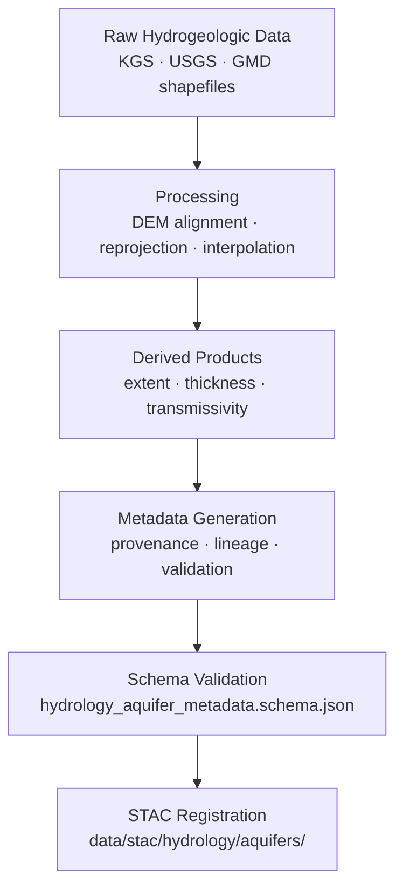

<div align="center">

# 💧 Kansas Frontier Matrix — Hydrology Aquifer Metadata  
`data/tiles/hydrology/metadata/aquifers/`

**Mission:** Maintain, validate, and document **metadata records** for all Kansas aquifer datasets —  
including **extent**, **saturated thickness**, and **transmissivity** layers — ensuring  
reproducibility, traceability, and semantic integration across the **Kansas Frontier Matrix (KFM)**  
hydrologic and geological systems.

[](../../../../../../.github/workflows/site.yml)
[](../../../../../../.github/workflows/stac-validate.yml)
[](../../../../../../.github/workflows/codeql.yml)
[](../../../../../../.github/workflows/trivy.yml)
[](../../../../../../docs/)
[](../../../../../../LICENSE)

</div>

---

## 📚 Overview

This directory contains **metadata JSON files** describing the aquifer datasets stored in  
`data/tiles/hydrology/aquifers/`.  
Each record follows the **MCP–STAC hybrid schema**, ensuring alignment with  
scientific reproducibility standards and KFM’s semantic knowledge graph framework.

**Aquifer Subdomains Covered:**
- **Extent:** spatial boundaries of major and minor aquifers (KGS, USGS)
- **Saturated Thickness:** water-bearing formation depth across Kansas
- **Transmissivity:** hydraulic conductivity and flow potential

---

## 📂 Directory Layout

```bash
data/
└── tiles/
    └── hydrology/
        └── metadata/
            └── aquifers/
                ├── ks_aquifers_extent.json
                ├── ks_aquifers_saturated_thickness_2020.json
                ├── ks_aquifers_transmissivity.json
                └── README.md
````

---

## ⚙️ Metadata Workflow



**Command Example:**

```bash
make metadata-aquifers
# Auto-generates aquifer metadata files and validates against schema
```

---

## 🧩 Metadata Schema (Key Fields)

| Field             | Description               | Example                                                                              |
| ----------------- | ------------------------- | ------------------------------------------------------------------------------------ |
| `id`              | Unique dataset identifier | `"ks_aquifers_saturated_thickness_2020"`                                             |
| `type`            | Data type                 | `"raster"`                                                                           |
| `description`     | Dataset summary           | `"Saturated thickness of principal Kansas aquifers (2020)"`                          |
| `source`          | Origin of input data      | `["KGS", "USGS"]`                                                                    |
| `algorithm`       | Derivation or model used  | `"KGS Aquifer Model v2.3"`                                                           |
| `projection`      | CRS                       | `"EPSG:4326"`                                                                        |
| `spatial_extent`  | Bounding box              | `[-102.05, 36.99, -94.58, 40.00]`                                                    |
| `temporal_extent` | Date or range             | `["2020-01-01","2020-12-31"]`                                                        |
| `checksum`        | SHA-256 integrity hash    | `"7a98bcf5e4a8325ef912a45b43d77e21e3d7f5abbe8cd3d94b95a1ff1a6c0a3b"`                 |
| `stac_link`       | STAC metadata path        | `"../../../../../stac/hydrology/aquifers/ks_aquifers_saturated_thickness_2020.json"` |
| `license`         | License                   | `"CC-BY 4.0"`                                                                        |
| `created`         | Creation date             | `"2025-10-12"`                                                                       |
| `mcp_version`     | Protocol version          | `"1.0"`                                                                              |

---

## 🧠 Knowledge Graph Integration

Aquifer metadata forms **linked entities** in the KFM Knowledge Graph, connecting
geologic, hydrologic, and climate layers via semantic relationships.

| Graph Node              | Relationship    | Target Entity                |
| ----------------------- | --------------- | ---------------------------- |
| `AquiferExtent`         | `INTERSECTS`    | `HydrologicUnit:HUC8`        |
| `AquiferThickness`      | `DERIVED_FROM`  | `BoreholeDataset`            |
| `AquiferTransmissivity` | `HAS_PARAMETER` | `HydraulicConductivityModel` |
| `AquiferDataset`        | `LINKED_TO`     | `STAC Item`                  |
| `AquiferDataset`        | `HAS_CHECKSUM`  | `SHA256 Hash`                |

**AI & ML Use Cases:**

* Predicting groundwater depletion trends
* Identifying recharge zones and aquifer vulnerability
* Estimating aquifer–surface flow coupling
* Supporting semantic retrieval via AI-assisted queries

---

## 🧮 Version & Provenance

| Field              | Value                                                               |
| ------------------ | ------------------------------------------------------------------- |
| **Version**        | `v1.0.0`                                                            |
| **Last Updated**   | 2025-10-12                                                          |
| **Maintainer**     | `@bartytime4life`                                                   |
| **Schema**         | `hydrology_aquifer_metadata.schema.json`                            |
| **License**        | CC-BY 4.0                                                           |
| **MCP Compliance** | ✅ Documentation · ✅ Provenance · ✅ STAC Linked · ✅ Schema Validated |

---

## 🪵 Changelog

| Date       | Version | Change                                      | Author          | PR/Issue |
| ---------- | ------- | ------------------------------------------- | --------------- | -------- |
| 2025-10-12 | v1.0.0  | Initial release of aquifer metadata records | @bartytime4life | #255     |

---

## ✅ Validation Checklist

* [x] JSON files validated against schema
* [x] Provenance, source, and checksum fields complete
* [x] Linked STAC items verified
* [x] CRS and extent correct
* [x] README includes badges, changelog, and closed Mermaid diagram

---

## 🔗 Related Directories

| Path                                                                     | Description                         |
| ------------------------------------------------------------------------ | ----------------------------------- |
| [`../../../aquifers/`](../../../aquifers/)                               | Main aquifer raster/vector datasets |
| [`../`](../)                                                             | Top-level hydrology metadata index  |
| [`../../../flow/`](../../../flow/)                                       | Surface hydrologic flow datasets    |
| [`../../../basins/`](../../../basins/)                                   | Watershed and catchment boundaries  |
| [`../../../../../../stac/hydrology/`](../../../../../../stac/hydrology/) | STAC catalog for hydrology products |

---

## 🧭 Example Metadata File

```json
{
  "id": "ks_aquifers_transmissivity",
  "type": "raster",
  "description": "Hydraulic transmissivity model of Kansas principal aquifers (ft²/day)",
  "source": ["KGS", "USGS"],
  "algorithm": "KGS transmissivity model (log10-scaled interpolation)",
  "projection": "EPSG:4326",
  "spatial_extent": [-102.05, 36.99, -94.58, 40.00],
  "temporal_extent": ["2000-01-01", "2020-12-31"],
  "checksum": "cb419c52e7a17a71b5b3c3e5376adf9511dfbcbf03d0b2dc62e92e0fdf37b481",
  "stac_link": "../../../../../../stac/hydrology/aquifers/ks_aquifers_transmissivity.json",
  "created": "2025-10-12",
  "license": "CC-BY 4.0",
  "mcp_version": "1.0"
}
```

---

<div align="center">

**Kansas Frontier Matrix — Hydrology Division**
🌊 *“Mapping the groundwater beneath — measured, modeled, and made reproducible.”*

</div>
```

