<div align="center">

# 🏞️ Kansas Frontier Matrix — Hydrology Basin Metadata  
`data/tiles/hydrology/metadata/basins/`

**Mission:** Curate and validate **metadata records** for all basin and watershed datasets —  
including **HUC-based delineations**, **sub-basin hydrologic boundaries**, and  
**derived basin attributes** — ensuring transparent lineage, schema validation,  
and integration within the **Kansas Frontier Matrix (KFM)** hydrology and watershed systems.

[](../../../../../../.github/workflows/site.yml)
[](../../../../../../.github/workflows/stac-validate.yml)
[](../../../../../../.github/workflows/codeql.yml)
[](../../../../../../.github/workflows/trivy.yml)
[](../../../../../../docs/)
[](../../../../../../LICENSE)

</div>

---

## 📚 Overview

This directory contains **JSON metadata files** documenting Kansas watershed and basin-level datasets  
in `data/tiles/hydrology/basins/`. Each metadata record follows the **MCP–STAC hybrid schema**, providing  
complete documentation of provenance, lineage, projection, and checksum details.

**Basin Subdomains:**
- **Hydrologic Unit Codes (HUC)** — 2-digit to 12-digit hierarchy (USGS WBD)
- **Watersheds** — natural drainage areas derived from DEM flow grids
- **Catchments** — sub-basin polygons linked to flow accumulation rasters

These metadata files ensure **traceability** between datasets and hydrologic models, linking physical geography  
to data-driven simulation and AI reasoning frameworks within KFM.

---

## 📂 Directory Layout

```bash
data/
└── tiles/
    └── hydrology/
        └── metadata/
            └── basins/
                ├── ks_basins_huc8.json
                ├── ks_basins_huc10.json
                ├── ks_catchments_subwatersheds.json
                └── README.md
````

---

## ⚙️ Metadata Workflow

```mermaid
flowchart TD
  A["USGS WBD / NHD Data"] --> B["Reprojection & Cleanup<br/>EPSG:4326 · dissolve by HUC level"]
  B --> C["Basin Delineation<br/>hydrosheds · DEM flow direction"]
  C --> D["Sub-basin Extraction<br/>catchments · local watersheds"]
  D --> E["Metadata Compilation<br/>schema population · provenance"]
  E --> F["Validation<br/>MCP + STAC schema check"]
  F --> G["STAC Registration<br/>data/stac/hydrology/basins/"]
%%END OF MERMAID%%
```



**Command Example:**

```bash
make metadata-basins
# Automatically generates metadata JSON for HUC8/HUC10 and sub-basin datasets
```

---

## 🧩 Metadata Schema (Key Fields)

| Field             | Description               | Example                                                              |
| ----------------- | ------------------------- | -------------------------------------------------------------------- |
| `id`              | Unique dataset identifier | `"ks_basins_huc8"`                                                   |
| `type`            | Data type                 | `"vector"`                                                           |
| `description`     | Dataset summary           | `"HUC8 hydrologic basin boundaries for Kansas"`                      |
| `source`          | Origin of data            | `["USGS WBD", "NHDPlus HR"]`                                         |
| `algorithm`       | Processing steps          | `"Dissolve by HUC8; reproject EPSG:4326"`                            |
| `projection`      | CRS                       | `"EPSG:4326"`                                                        |
| `spatial_extent`  | Bounding box              | `[-102.05, 36.99, -94.58, 40.00]`                                    |
| `temporal_extent` | Time period               | `["2020-01-01", "2025-01-01"]`                                       |
| `checksum`        | SHA-256 hash              | `"a7359df45eeccf5bdcc45f3b885f2c6230e6a889ab09f8f95fbdc4e198fe3e7f"` |
| `stac_link`       | Path to STAC item         | `"../../../../../stac/hydrology/basins/ks_basins_huc8.json"`         |
| `license`         | Data license              | `"CC-BY 4.0"`                                                        |
| `created`         | Date created              | `"2025-10-12"`                                                       |
| `mcp_version`     | MCP metadata version      | `"1.0"`                                                              |

---

## 🧠 Integration & Knowledge Graph Context

Basin metadata serves as a **core linking layer** within the KFM Knowledge Graph,
connecting terrain, hydrology, climate, and ecological datasets.

| Graph Node     | Relationship | Connected Entity      |
| -------------- | ------------ | --------------------- |
| `Basin`        | `INTERSECTS` | `Place:County`        |
| `Basin`        | `DRAINS_TO`  | `RiverNetwork`        |
| `Catchment`    | `CONTAINS`   | `FlowDirectionRaster` |
| `Watershed`    | `HAS_CHILD`  | `SubBasin`            |
| `BasinDataset` | `LINKED_TO`  | `STAC Item`           |

**AI & ML Applications:**

* Predictive watershed segmentation
* Hydrologic flow path learning from DEM derivatives
* Cross-validation with floodplain risk models
* Training AI to infer water balance and drainage connectivity

---

## 🧮 Version & Provenance

| Field              | Value                                                        |
| ------------------ | ------------------------------------------------------------ |
| **Version**        | `v1.0.0`                                                     |
| **Last Updated**   | 2025-10-12                                                   |
| **Maintainer**     | `@bartytime4life`                                            |
| **Schema**         | `hydrology_basin_metadata.schema.json`                       |
| **License**        | CC-BY 4.0                                                    |
| **MCP Compliance** | ✅ Documentation · ✅ Provenance · ✅ STAC Linked · ✅ Validated |

---

## 🪵 Changelog

| Date       | Version | Change                                               | Author          | PR/Issue |
| ---------- | ------- | ---------------------------------------------------- | --------------- | -------- |
| 2025-10-12 | v1.0.0  | Initial creation of hydrology basin metadata records | @bartytime4life | #256     |

---

## ✅ Validation Checklist

* [x] Metadata conforms to schema
* [x] Provenance, spatial, and temporal fields populated
* [x] Linked STAC items validated
* [x] CRS and extent confirmed (EPSG:4326)
* [x] README includes badges, changelog, and closed Mermaid diagram

---

## 🔗 Related Directories

| Path                                                                     | Description                                 |
| ------------------------------------------------------------------------ | ------------------------------------------- |
| [`../../../basins/`](../../../basins/)                                   | Basin and watershed vector/raster datasets  |
| [`../`](../)                                                             | Hydrology-wide metadata directory           |
| [`../../../flow/`](../../../flow/)                                       | Flow direction and accumulation rasters     |
| [`../../../aquifers/`](../../../aquifers/)                               | Groundwater and aquifer datasets            |
| [`../../../floodplains/`](../../../floodplains/)                         | Flood hazard and inundation products        |
| [`../../../../../../stac/hydrology/`](../../../../../../stac/hydrology/) | STAC catalog entries for hydrology datasets |

---

## 🧭 Example Metadata File

```json
{
  "id": "ks_basins_huc8",
  "type": "vector",
  "description": "Hydrologic Unit Code (HUC8) boundaries defining major Kansas basins derived from USGS WBD dataset.",
  "source": ["USGS WBD", "NHDPlus HR"],
  "algorithm": "Reprojection and boundary generalization for Kansas extent.",
  "projection": "EPSG:4326",
  "spatial_extent": [-102.05, 36.99, -94.58, 40.00],
  "temporal_extent": ["2020-01-01", "2025-01-01"],
  "checksum": "a7359df45eeccf5bdcc45f3b885f2c6230e6a889ab09f8f95fbdc4e198fe3e7f",
  "stac_link": "../../../../../../stac/hydrology/basins/ks_basins_huc8.json",
  "created": "2025-10-12",
  "license": "CC-BY 4.0",
  "mcp_version": "1.0"
}
```

---

<div align="center">

**Kansas Frontier Matrix — Hydrology Division**
🏞️ *“From ridge to river — every basin mapped, modeled, and metadata-defined.”*

</div>
```

