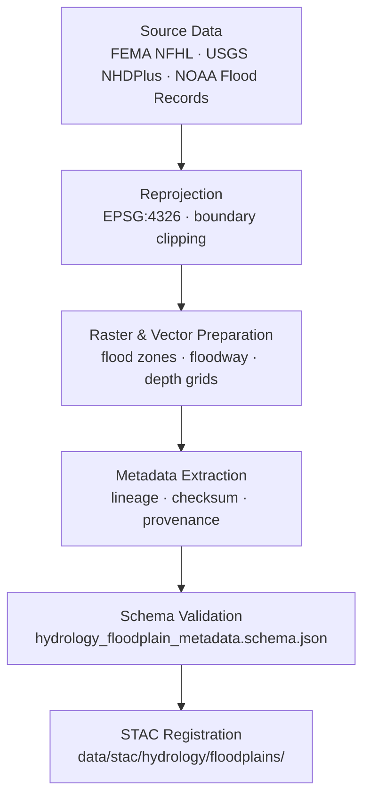

<div align="center">

# 🌊 Kansas Frontier Matrix — Hydrology Floodplain Metadata  
`data/tiles/hydrology/metadata/floodplains/`

**Mission:** Curate and validate **metadata records** for all Kansas floodplain datasets — including  
**1% AEP (100-year)** and **0.2% AEP (500-year)** flood zones, **floodways**, and **flood depth rasters** —  
ensuring full provenance, schema validation, and STAC interoperability within the  
**Kansas Frontier Matrix (KFM)** hydrology system.

[](../../../../../../.github/workflows/site.yml)
[](../../../../../../.github/workflows/stac-validate.yml)
[](../../../../../../.github/workflows/codeql.yml)
[](../../../../../../.github/workflows/trivy.yml)
[](../../../../../../docs/)
[](../../../../../../LICENSE)

</div>

---

## 📚 Overview

This directory houses **metadata JSON files** describing floodplain datasets contained within  
`data/tiles/hydrology/floodplains/`.  
Each record is structured using the **MCP–STAC hybrid schema**, capturing dataset lineage,  
validation, and cross-domain linkages (hydrology, climate, hazard, and terrain).  

These metadata records serve as authoritative descriptors for all floodplain data tiles in KFM,  
enabling transparent, AI-interpretable hydrologic modeling and historical flood event reconstruction.

**Subdomains Covered:**
- `100yr` — FEMA Zone AE/A, 1% Annual Exceedance Probability (AEP) flood zones  
- `500yr` — FEMA 0.2% AEP moderate-risk flood zones  
- `floodway` — Regulatory floodway polygons  
- `flood_depth_raster` — Depth grids from modeled or observed flood events  

---

## 📂 Directory Layout

```bash
data/
└── tiles/
    └── hydrology/
        └── metadata/
            └── floodplains/
                ├── ks_floodplain_100yr.json
                ├── ks_floodplain_500yr.json
                ├── ks_floodway.json
                ├── ks_flood_depth_raster_2020.json
                └── README.md
````

---

## ⚙️ Metadata Generation Workflow



**Command Example:**

```bash
make metadata-floodplains
# Generates metadata for all floodplain datasets and validates schema compliance
```

---

## 🧩 Metadata Schema (Key Fields)

| Field             | Description                 | Example                                                                          |
| ----------------- | --------------------------- | -------------------------------------------------------------------------------- |
| `id`              | Unique dataset identifier   | `"ks_floodplain_100yr"`                                                          |
| `type`            | Dataset type                | `"vector"`                                                                       |
| `description`     | Purpose summary             | `"FEMA 1% annual exceedance probability (100-year) floodplain zones for Kansas"` |
| `source`          | Source datasets             | `["FEMA NFHL", "USGS NHDPlus", "NOAA Flood Archive"]`                            |
| `algorithm`       | Processing workflow         | `"Polygon dissolve, EPSG reprojection, QA validation"`                           |
| `projection`      | Coordinate Reference System | `"EPSG:4326"`                                                                    |
| `spatial_extent`  | Bounding box                | `[-102.05, 36.99, -94.58, 40.00]`                                                |
| `temporal_extent` | Temporal validity           | `["2020-01-01", "2020-12-31"]`                                                   |
| `checksum`        | SHA-256 data hash           | `"9b5a47a0e1eeb98cb1f2f6d37f59cb45478b91adfc93d16b5b344b6e7276cf56"`             |
| `stac_link`       | Relative path to STAC Item  | `"../../../../../stac/hydrology/floodplains/ks_floodplain_100yr.json"`           |
| `license`         | Data license                | `"CC-BY 4.0"`                                                                    |
| `created`         | Metadata creation date      | `"2025-10-12"`                                                                   |
| `mcp_version`     | Protocol version            | `"1.0"`                                                                          |

---

## 🧠 Integration & Knowledge Graph Context

Floodplain metadata records are integrated into the **KFM Knowledge Graph** and support cross-domain
semantic linking with terrain, hydrology, and climate datasets.

| Graph Node          | Relationship   | Connected Entity       |
| ------------------- | -------------- | ---------------------- |
| `FloodplainZone`    | `DERIVED_FROM` | `HydrologyFlowDataset` |
| `Floodway`          | `INTERSECTS`   | `RiverNetwork`         |
| `FloodDepthRaster`  | `CHILD_OF`     | `FloodEvent`           |
| `FloodplainDataset` | `LINKED_TO`    | `STAC Item`            |
| `FloodplainDataset` | `HAS_CHECKSUM` | `SHA256 Hash`          |

**AI & ML Use Cases:**

* Automated flood extent estimation
* Flood risk evolution modeling (2020–future projection)
* Hydrology-aware land use planning simulations
* Cross-validation of FEMA vs. model-predicted flood zones

---

## 🧮 Version & Provenance

| Field              | Value                                                               |
| ------------------ | ------------------------------------------------------------------- |
| **Version**        | `v1.0.0`                                                            |
| **Last Updated**   | 2025-10-12                                                          |
| **Maintainer**     | `@bartytime4life`                                                   |
| **Schema**         | `hydrology_floodplain_metadata.schema.json`                         |
| **Source**         | FEMA NFHL, USGS NHDPlus HR, NOAA Flood Depth Grids                  |
| **License**        | CC-BY 4.0                                                           |
| **MCP Compliance** | ✅ Documentation · ✅ Provenance · ✅ STAC Linked · ✅ Schema Validated |

---

## 🪵 Changelog

| Date       | Version | Change                                                      | Author          | PR/Issue |
| ---------- | ------- | ----------------------------------------------------------- | --------------- | -------- |
| 2025-10-12 | v1.0.0  | Initial creation of hydrology floodplain metadata directory | @bartytime4life | #257     |

---

## ✅ Validation Checklist

* [x] JSON files validated against `hydrology_floodplain_metadata.schema.json`
* [x] Provenance and checksum fields populated
* [x] STAC link paths validated
* [x] EPSG and extent fields correct
* [x] README includes badges, changelog, and closed Mermaid diagram

---

## 🔗 Related Directories

| Path                                                                     | Description                                         |
| ------------------------------------------------------------------------ | --------------------------------------------------- |
| [`../../../floodplains/`](../../../floodplains/)                         | Main floodplain raster/vector datasets              |
| [`../`](../)                                                             | Hydrology-wide metadata collection                  |
| [`../../../flow/`](../../../flow/)                                       | Flow direction, accumulation, and connectivity data |
| [`../../../aquifers/`](../../../aquifers/)                               | Subsurface aquifer datasets                         |
| [`../../../basins/`](../../../basins/)                                   | Watershed and catchment boundaries                  |
| [`../../../../../../stac/hydrology/`](../../../../../../stac/hydrology/) | STAC catalog for hydrology datasets                 |

---

## 🧭 Example Metadata File

```json
{
  "id": "ks_flood_depth_raster_2020",
  "type": "raster",
  "description": "Flood depth grid representing 2020 Kansas statewide flood event modeling results.",
  "source": ["FEMA", "USGS", "NOAA"],
  "algorithm": "Water surface - DEM difference; filtered for positive depths",
  "projection": "EPSG:4326",
  "spatial_extent": [-102.05, 36.99, -94.58, 40.00],
  "temporal_extent": ["2020-01-01", "2020-12-31"],
  "checksum": "d3e91b7129c4a7e3d91905d09ff0a9d9a7734be24eaecc831ac80b493a893d15",
  "stac_link": "../../../../../../stac/hydrology/floodplains/ks_flood_depth_raster_2020.json",
  "created": "2025-10-12",
  "license": "CC-BY 4.0",
  "mcp_version": "1.0"
}
```

---

<div align="center">

**Kansas Frontier Matrix — Hydrology Division**
🌧️ *“Where water meets land — flood histories recorded, validated, and mapped for generations.”*

</div>
```

