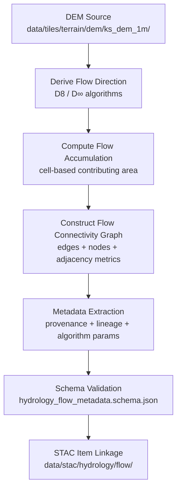

<div align="center">

# 💧 Kansas Frontier Matrix — Hydrology Flow Metadata  
`data/tiles/hydrology/metadata/flow/`

**Mission:** Maintain, validate, and document **metadata records** for all hydrologic flow datasets —  
including **direction**, **accumulation**, **connectivity**, and **derived network products** —  
to ensure scientific transparency, lineage tracking, and STAC interoperability within the  
**Kansas Frontier Matrix (KFM)** hydrology system.

[](../../../../../../.github/workflows/site.yml)
[](../../../../../../.github/workflows/stac-validate.yml)
[](../../../../../../.github/workflows/codeql.yml)
[](../../../../../../.github/workflows/trivy.yml)
[](../../../../../../docs/)
[](../../../../../../LICENSE)

</div>

---

## 📚 Overview

This directory houses **metadata JSON files** describing the hydrologic **flow** datasets under  
`data/tiles/hydrology/flow/`.  
These records conform to the **MCP–STAC hybrid metadata schema** and document dataset provenance,  
derivation parameters, and validation results for each product.

**Hydrologic Flow Subdomains:**
- `direction/` → Flow direction rasters (D8/D∞)
- `accumulation/` → Flow accumulation rasters
- `connectivity/` → Hydrologic graph and connectivity models  

Each metadata file serves as a **semantic anchor** connecting STAC assets, checksums, and AI-derived  
interpretations through the KFM Knowledge Graph.

---

## 📂 Directory Layout

```bash
data/
└── tiles/
    └── hydrology/
        └── metadata/
            └── flow/
                ├── ks_flowdir_1m.json
                ├── ks_flowaccum_1m.json
                ├── ks_flow_connectivity_graph.json
                └── README.md
````

---

## ⚙️ Metadata Generation Workflow



**Command Example:**

```bash
make metadata-flow
# Auto-generates JSON metadata for flow direction, accumulation, and connectivity datasets
```

---

## 🧩 Metadata Schema (Key Fields)

| Field            | Description                | Example                                                              |
| ---------------- | -------------------------- | -------------------------------------------------------------------- |
| `id`             | Unique dataset identifier  | `"ks_flowaccum_1m"`                                                  |
| `type`           | Data type                  | `"raster"`                                                           |
| `description`    | Summary of dataset purpose | `"1m resolution flow accumulation raster for Kansas"`                |
| `source`         | Input data or reference    | `["USGS 3DEP DEM", "KGS LiDAR"]`                                     |
| `algorithm`      | Processing workflow        | `"whitebox_tools FlowAccumulationFullWorkflow"`                      |
| `projection`     | CRS                        | `"EPSG:4326"`                                                        |
| `spatial_extent` | Bounding box               | `[-102.05, 36.99, -94.58, 40.00]`                                    |
| `checksum`       | SHA-256 integrity hash     | `"8d7b5a12a6c4cbe23d64a45b937c29f4b51208c1a0c2c6b9e30f5b8d7e817cd7"` |
| `stac_link`      | Path to STAC Item JSON     | `"../../../../../stac/hydrology/flow/ks_flowaccum_1m.json"`          |
| `license`        | Data license               | `"CC-BY 4.0"`                                                        |
| `created`        | Metadata creation date     | `"2025-10-12"`                                                       |
| `mcp_version`    | Protocol version           | `"1.0"`                                                              |

---

## 🧠 Integration & Knowledge Graph Context

Each metadata file contributes to **semantic reasoning** within the KFM hydrologic graph, enabling
cross-domain connections among **surface flow**, **basins**, **climate**, and **hazards** datasets.

| Graph Node               | Relationship      | Connected Entity      |
| ------------------------ | ----------------- | --------------------- |
| `FlowDirectionRaster`    | `DERIVED_FROM`    | `DEM Dataset`         |
| `FlowAccumulationRaster` | `CHILD_OF`        | `FlowDirectionRaster` |
| `FlowConnectivityGraph`  | `REPRESENTS`      | `HydrologicNetwork`   |
| `FlowDataset`            | `HAS_CHECKSUM`    | `SHA256 Hash`         |
| `FlowDataset`            | `LINKED_TO`       | `STAC Item`           |
| `FlowDataset`            | `ASSOCIATED_WITH` | `Place:Watershed`     |

**AI & ML Use Cases:**

* Automated watershed extraction
* Stream hierarchy classification
* Flow network generation for flood modeling
* Feature linkage with **AI hydrology classifiers**

---

## 🧮 Version & Provenance

| Field              | Value                                                        |
| ------------------ | ------------------------------------------------------------ |
| **Version**        | `v1.0.0`                                                     |
| **Last Updated**   | 2025-10-12                                                   |
| **Maintainer**     | `@bartytime4life`                                            |
| **Schema**         | `hydrology_flow_metadata.schema.json`                        |
| **License**        | CC-BY 4.0                                                    |
| **MCP Compliance** | ✅ Documentation · ✅ Provenance · ✅ STAC Linked · ✅ Validated |

---

## 🪵 Changelog

| Date       | Version | Change                                                | Author          | PR/Issue |
| ---------- | ------- | ----------------------------------------------------- | --------------- | -------- |
| 2025-10-12 | v1.0.0  | Initial creation of hydrology flow metadata directory | @bartytime4life | #254     |

---

## ✅ Validation Checklist

* [x] JSON metadata validated against schema
* [x] Provenance and checksum fields completed
* [x] STAC link paths verified
* [x] CRS field validated (EPSG:4326)
* [x] README includes badges, changelog, and closed Mermaid diagram

---

## 🔗 Related Directories

| Path                                                                     | Description                         |
| ------------------------------------------------------------------------ | ----------------------------------- |
| [`../../../flow/`](../../../flow/)                                       | Hydrologic flow rasters and graphs  |
| [`../`](../)                                                             | Hydrology-wide metadata directory   |
| [`../../../floodplains/`](../../../floodplains/)                         | Floodplain raster/vector products   |
| [`../../../aquifers/`](../../../aquifers/)                               | Groundwater and transmissivity data |
| [`../../../../../../stac/hydrology/`](../../../../../../stac/hydrology/) | STAC catalog for hydrology datasets |

---

## 🧭 Example Metadata File

```json
{
  "id": "ks_flow_connectivity_graph",
  "type": "vector",
  "description": "Hydrologic connectivity graph for Kansas derived from 1m DEM flow direction and accumulation rasters.",
  "source": ["USGS 3DEP DEM", "WhiteboxTools"],
  "algorithm": "NetworkX Directed Graph Builder",
  "projection": "EPSG:4326",
  "spatial_extent": [-102.05, 36.99, -94.58, 40.00],
  "checksum": "4c31b8fa75dbf0b6f94b376c9a6d3f8117ab76fa7f7f20c17b68d2ac0b81c8f5",
  "stac_link": "../../../../../../stac/hydrology/flow/ks_flow_connectivity_graph.json",
  "created": "2025-10-12",
  "license": "CC-BY 4.0",
  "mcp_version": "1.0"
}
```

---

<div align="center">

**Kansas Frontier Matrix — Hydrology Division**
🌊 *“Tracing every drop — flow documented, validated, and connected.”*

</div>
```

