<div align="center">

# 🌊 Kansas Frontier Matrix — Hydrology Rivers Tiles  
`data/tiles/hydrology/rivers/`

**Mission:** Deliver **high-resolution vector map tiles** of Kansas’s river and stream networks — built from  
USGS NHD, KGS Hydrography, and AI-enhanced flow models — optimized for visualization, time-series analysis,  
and interactive exploration in the **Kansas Frontier Matrix (KFM)** platform.

[](../../../../.github/workflows/site.yml)
[](../../../../.github/workflows/stac-validate.yml)
[](../../../../.github/workflows/codeql.yml)
[](../../../../.github/workflows/trivy.yml)
[](../../../../docs/)
[](../../../../LICENSE)

</div>

---

## 📚 Overview

The `data/tiles/hydrology/rivers/` directory contains **vector tile pyramids (`.pbf`)** representing  
Kansas’s hydrological network — rivers, streams, tributaries, and man-made channels — at zoom levels **3–14**.  
These tiles serve as the **primary hydrology visualization layer** in KFM’s MapLibre web application.

**Key Objectives**
- Visualize river geometry at multiple scales (statewide to local).  
- Support AI-linked hydrological analysis and timeline visualizations.  
- Provide consistent style and schema for integration across all hydrology derivatives.  

---

## 🧱 Directory Layout

```bash
data/
└── tiles/
    └── hydrology/
        └── rivers/
            ├── z3/ ... z14/           # Vector tile pyramids (MVT format)
            ├── metadata.json          # Layer metadata (STAC-compliant)
            ├── checksums/             # Integrity hashes (.sha256)
            ├── thumbnails/            # Preview images for docs/UI
            └── style.json             # Default MapLibre/GL style configuration
````

---

## 🧩 Data Sources & Provenance

| Source                       | Description                                            | License       | Conversion Pipeline                           |
| ---------------------------- | ------------------------------------------------------ | ------------- | --------------------------------------------- |
| **USGS NHD**                 | National Hydrography Dataset (streams, rivers, canals) | Public Domain | GeoPackage → GeoJSON → MVT                    |
| **KGS Hydrology**            | Kansas Geological Survey river and lake datasets       | CC-BY 4.0     | GeoTIFF → Vector extraction                   |
| **AI Flow Model (KFM v2.1)** | Deep-learning derived stream segmentation from 1m DEM  | MIT           | DEM → CNN classification → vectorization      |
| **Historical Maps Overlay**  | 1890s–1940s hydrology maps for comparison              | Public Domain | Raster → vector digitization (semi-automated) |

All datasets are **cross-referenced in STAC** under `data/stac/items/hydrology/rivers/`.

---

## ⚙️ Tile Generation Pipeline

```mermaid
flowchart TD
  A["Raw River Data<br/>USGS · KGS · AI Flow Network"] --> B["ETL Process<br/>GDAL · Tippecanoe · ogr2ogr"]
  B --> C["Vector Tiles (MVT)<br/>Zoom Levels 3–14"]
  C --> D["STAC Catalog<br/>Metadata + Provenance"]
  D --> E["KFM Web Map<br/>MapLibre + Timeline Sync"]
%%END OF MERMAID%%
```



Tiles are generated by the automated workflow:

```bash
make hydrology-rivers-tiles
```

This invokes the GDAL/Tippecanoe pipeline to produce zoom-level pyramids, compress them,
and validate outputs against the **STAC item schema**.

---

## 🧭 Layer Specification

| Property           | Description                                                          |
| ------------------ | -------------------------------------------------------------------- |
| **Tile format**    | MVT (`.pbf`)                                                         |
| **Zoom range**     | 3 – 14                                                               |
| **Projection**     | EPSG:3857                                                            |
| **Geometry type**  | `LineString`                                                         |
| **Key attributes** | `river_name`, `flow_class`, `source_id`, `confidence`, `ai_inferred` |
| **Tile schema**    | Stored in `metadata.json`                                            |
| **Style config**   | `style.json` defines colors, width scaling, and hover highlights     |

---

## 🌐 Integration Points

| Component                   | Purpose                      | Endpoint / File                           |
| --------------------------- | ---------------------------- | ----------------------------------------- |
| **MapLibre GL**             | Interactive rendering        | `/tiles/hydrology/rivers/{z}/{x}/{y}.pbf` |
| **Google Earth**            | Global visualization overlay | `/overlays/hydrology_rivers.kml`          |
| **API Layer (FastAPI)**     | Tile manifest & metadata     | `/layers/hydrology/rivers`                |
| **Knowledge Graph (Neo4j)** | Entity linkage               | Nodes: `River`, `Stream`, `FlowSegment`   |
| **STAC Catalog**            | Provenance                   | `data/stac/items/hydrology/rivers.json`   |

---

## 🧠 AI Data Enrichment

**AI-Enhanced Flow Detection**

* Model: `KFM-HydroNet-v2.1`
* Input: 1m DEM (USGS 3DEP)
* Output: Stream centerlines + confidence mask
* Accuracy: 93.2% (validated against NHD segments)

AI-derived streams are merged with authoritative datasets using a spatial-weighted overlay:

```
final_rivers = merge(NHD, KGS, AI_FLOW, weights=[0.6, 0.3, 0.1])
```

Confidence is stored as `ai_confidence` per feature property.

---

## 🔒 Reproducibility & Integrity

Each build produces:

* `.sha256` checksums for every tile pyramid directory
* `metadata.json` with:

  * `source_commit`
  * `processing_environment`
  * `data_hashes`
  * `generation_timestamp`

Validation commands:

```bash
make verify-checksums
make stac-validate hydrology-rivers
```

---

## 🪶 Versioning

| Field            | Value                            |
| ---------------- | -------------------------------- |
| **Version**      | `v1.0.0`                         |
| **STAC Spec**    | `1.0.0`                          |
| **MCP Schema**   | `v1.2`                           |
| **Last Updated** | `2025-10-12`                     |
| **Maintainer**   | Kansas Frontier Matrix Core Team |

---

## 🧾 Changelog

| Version    | Date       | Updates                                                                                              |
| ---------- | ---------- | ---------------------------------------------------------------------------------------------------- |
| **v1.0.0** | 2025-10-12 | Initial release with full STAC integration, AI-enhanced flow merging, and visual style configuration |
| **v0.9.0** | 2025-10-10 | Added preliminary river tile pyramid and checksum verification                                       |
| **v0.8.0** | 2025-10-08 | Drafted metadata and tile schema JSON                                                                |

---

## 🧩 Example Usage (MapLibre)

```js
map.addSource('rivers', {
  type: 'vector',
  tiles: ['https://kfm.example.org/tiles/hydrology/rivers/{z}/{x}/{y}.pbf'],
  minzoom: 3,
  maxzoom: 14
});

map.addLayer({
  id: 'rivers-line',
  type: 'line',
  source: 'rivers',
  'source-layer': 'rivers',
  paint: {
    'line-color': '#0077be',
    'line-width': ['interpolate', ['linear'], ['zoom'], 3, 0.3, 14, 2.8],
    'line-opacity': 0.9
  }
});
```

---

## 🔗 Related Documentation

* [Hydrology Tiles (Parent)](../../README.md)
* [Processed Hydrology Data](../../../../data/processed/hydrology/README.md)
* [Hydrology Metadata](../../../../data/processed/metadata/hydrology/README.md)
* [Web Hydrology Layer Config](../../../../web/config/layers/hydrology.json)
* [KFM Architecture Overview](../../../../docs/architecture.md)

---

<div align="center">

**Kansas Frontier Matrix** · *Time · Terrain · History*
[🌐 Repository](https://github.com/bartytime4life/Kansas-Frontier-Matrix) • [📘 Docs](../../../../docs/) • [🧭 STAC](../../../../data/stac/)

</div>
```

