<div align="center">

# 🔐 Kansas Frontier Matrix — Hydrology Rivers Checksums  
`data/tiles/hydrology/rivers/checksums/`

**Mission:** Maintain verified **SHA-256 integrity manifests** for all **vector river tile pyramids** (`.pbf`)  
within the Hydrology domain — ensuring long-term **authenticity, reproducibility,** and **traceable provenance**  
across the **Kansas Frontier Matrix (KFM)** hydrology data pipeline.

[](../../../../../.github/workflows/site.yml)
[](../../../../../.github/workflows/stac-validate.yml)
[](../../../../../.github/workflows/codeql.yml)
[](../../../../../.github/workflows/trivy.yml)
[](../../../../../docs/)
[](../../../../../LICENSE)

</div>

---

## 📚 Overview

This directory contains the **cryptographic checksums** (`.sha256` files) generated for every vector tile layer  
within `data/tiles/hydrology/rivers/`. These manifests are an essential part of the **Master Coder Protocol (MCP)**  
for ensuring **data integrity**, **auditability**, and **provenance verification**.

Every `.sha256` file provides:
- A **unique digital fingerprint** for each `.pbf` tile  
- A verifiable record linking back to the **STAC metadata** entry  
- Provenance hashes that trace data lineage through the entire hydrology pipeline  

---

## 🧱 Directory Layout

```bash
data/
└── tiles/
    └── hydrology/
        └── rivers/
            └── checksums/
                ├── z3.sha256
                ├── z4.sha256
                ├── z5.sha256
                ├── ...
                └── manifest.sha256    # Aggregated checksum index
````

Each file stores one line per tile, formatted as:

```bash
<sha256-hash>  ./zX/{x}/{y}.pbf
```

---

## ⚙️ Generation Pipeline

```mermaid
flowchart TD
  A["Hydrology Vector Tiles<br/>rivers/{z}/{x}/{y}.pbf"] --> B["Checksum Creation<br/>sha256sum *.pbf > checksums/zX.sha256"]
  B --> C["Manifest Aggregation<br/>combine → manifest.sha256"]
  C --> D["STAC Update<br/>hash links stored in metadata.json"]
  D --> E["Integrity Validation<br/>make verify-checksums"]
%%END OF MERMAID%%
```



**Commands:**

```bash
# Generate individual layer checksums
make hydrology-rivers-checksums

# Validate integrity against manifest
make verify-checksums
```

---

## 🧩 Integration Points

| System                      | Function                                                 | Connection                              |
| --------------------------- | -------------------------------------------------------- | --------------------------------------- |
| **STAC Catalog**            | Records hash digests for provenance                      | `data/stac/items/hydrology/rivers.json` |
| **ETL Workflow**            | Automates checksum generation post-tile build            | `make hydrology-rivers-tiles`           |
| **CI/CD (GitHub Actions)**  | Validates hashes on deploy                               | `.github/workflows/stac-validate.yml`   |
| **Knowledge Graph (Neo4j)** | Stores digital signatures for forensic linking           | Node: `ChecksumRecord`                  |
| **AI Data Pipeline**        | Validates intermediate outputs from AI flow segmentation | Model: `KFM-HydroNet-v2.1`              |

---

## 🔒 Reproducibility & Verification

All checksum files are:

* **Immutable:** stored as plain text under Git LFS or version-controlled as diffs.
* **Reproducible:** regenerating tiles from the same input should reproduce identical SHA-256 values.
* **Linked:** referenced in corresponding STAC `assets` under `checksum:sha256` field.

Example verification:

```bash
sha256sum -c z8.sha256
# Expected output:
# ./z8/132/199.pbf: OK
# ./z8/132/200.pbf: OK
```

---

## 🧾 Example Manifest

```bash
# manifest.sha256 — compiled 2025-10-12
a9a42c53e75c3e4fae41e7b9c35a949bf1cbd3e938a2e4cfb74fa1a2bbf2b23a  ./z3/4/3.pbf
bfc98ed86cb1aa0b59ff86a44c6e2c7b21c3d83cfa7a31de36f7f5c1b6e428b2  ./z3/4/4.pbf
3ef8a8c2d9791fa334df417be2a89b126ed9022d82efbbf35f0a9ef1d4f2b87c  ./z4/8/7.pbf
...
```

---

## 🧾 Versioning

| Field                  | Value                            |
| ---------------------- | -------------------------------- |
| **Version**            | `v1.0.0`                         |
| **STAC Spec**          | `1.0.0`                          |
| **MCP Schema**         | `v1.2`                           |
| **Checksum Algorithm** | `SHA-256`                        |
| **Last Updated**       | `2025-10-12`                     |
| **Maintainer**         | Kansas Frontier Matrix Core Team |

---

## 🪶 Changelog

| Version    | Date       | Changes                                                                                           |
| ---------- | ---------- | ------------------------------------------------------------------------------------------------- |
| **v1.0.0** | 2025-10-12 | Added SHA-256 checksum manifests for river tile pyramid; integrated into STAC validation pipeline |
| **v0.9.0** | 2025-10-10 | Prototype checksum validation for z3–z10 layers                                                   |
| **v0.8.0** | 2025-10-08 | Initial checksum directory structure created                                                      |

---

## 🧠 AI Forensic Metadata

Checksum digests are also cross-linked with the **AI data integrity ledger**, used for forensic reconstruction of
AI-generated hydrology layers. Each AI output (flowline vector) includes:

* `ai_run_id`
* `input_dem_hash`
* `output_vector_hash`
* `checksum_verified_at`

This ensures **end-to-end traceability** between raw data, AI inference, and published tiles.

---

## 🔗 Related Documentation

* [Hydrology Rivers Tiles](../README.md)
* [Hydrology Tiles (Parent)](../../README.md)
* [Processed Hydrology Data](../../../../../data/processed/hydrology/README.md)
* [Hydrology Metadata (STAC)](../../../../../data/processed/metadata/hydrology/README.md)
* [KFM Architecture Overview](../../../../../docs/architecture.md)

---

<div align="center">

**Kansas Frontier Matrix** · *Time · Terrain · History*
[🌐 Repository](https://github.com/bartytime4life/Kansas-Frontier-Matrix) • [📘 Docs](../../../../../docs/) • [🧭 STAC](../../../../../data/stac/)

</div>
```

