<div align="center">

# 🖼️ Kansas Frontier Matrix — Hydrology Rivers Thumbnails  
`data/tiles/hydrology/rivers/thumbnails/`

**Mission:** Store and document **thumbnail preview images** (`.png`, `.jpg`, `.webp`) representing  
Kansas’s river and stream network tile layers — enabling fast visual inspection, automated documentation embedding,  
and **STAC-compatible preview linkage** across the **Kansas Frontier Matrix (KFM)** hydrology data system.

[](../../../../../.github/workflows/site.yml)
[](../../../../../.github/workflows/stac-validate.yml)
[](../../../../../.github/workflows/codeql.yml)
[](../../../../../.github/workflows/trivy.yml)
[](../../../../../docs/)
[](../../../../../LICENSE)

</div>

---

## 📚 Overview

The `data/tiles/hydrology/rivers/thumbnails/` directory contains **automatically generated image previews**  
for each level of the **rivers vector tiles** (`data/tiles/hydrology/rivers/`). These visual summaries are used in:

- 📘 Documentation READMEs (embedded with Markdown image links)  
- 🧭 STAC catalog assets (`"roles": ["thumbnail"]`)  
- 🧮 KFM web dashboards and data browsers (quick-view cards)  
- 🧠 AI model QA comparison workflows (for anomaly detection in flow delineation)

Each thumbnail represents a downsampled or composited visualization of **Kansas river networks** from various zoom levels (z3–z14).

---

## 🧱 Directory Layout

```bash
data/
└── tiles/
    └── hydrology/
        └── rivers/
            └── thumbnails/
                ├── rivers_z3.png
                ├── rivers_z6.png
                ├── rivers_z9.png
                ├── rivers_z12.png
                ├── overview_full.webp
                └── metadata.json
````

---

## 🧩 Generation Workflow

```mermaid
flowchart TD
  A["Vector Tile Pyramids<br/>rivers/{z}/{x}/{y}.pbf"] --> B["Map Render Engine<br/>MapLibre GL · headless Chromium"]
  B --> C["Composite Mosaic<br/>tile snapshots merged by zoom"]
  C --> D["Thumbnail Generation<br/>256×256 to 2048×2048 PNG/WEBP"]
  D --> E["STAC Integration<br/>thumbnail asset link in hydrology_rivers.json"]
  E --> F["Docs & UI Embedding<br/>Markdown · Web Gallery"]
%%END OF MERMAID%%
```



---

### 🧮 Command Workflow

```bash
# Generate new hydrology river thumbnails
make hydrology-rivers-thumbnails

# Validate STAC links and image existence
make stac-validate hydrology-rivers
```

The process uses **headless MapLibre rendering** through Puppeteer or Mapbox GL Native snapshot generation,
and compresses outputs with `cwebp` and `oxipng` for efficiency.

---

## 🎨 Rendering Parameters

| Parameter  | Description                                                      | Default  |
| ---------- | ---------------------------------------------------------------- | -------- |
| Map Style  | Default KFM hydrology style (`web/config/layers/hydrology.json`) | ✓        |
| Background | Transparent (`rgba(0,0,0,0)`)                                    | ✓        |
| Projection | Web Mercator (EPSG:3857)                                         | ✓        |
| Resolution | 256px – 2048px (per zoom composite)                              | Variable |
| Labeling   | Disabled for thumbnail export                                    | —        |

---

## 🧾 Example Metadata (excerpt)

```json
{
  "id": "rivers-thumbnails",
  "type": "preview-collection",
  "parent": "rivers-tiles",
  "created": "2025-10-12T00:00:00Z",
  "assets": {
    "rivers_z3": {
      "href": "./rivers_z3.png",
      "roles": ["thumbnail"],
      "type": "image/png"
    },
    "overview_full": {
      "href": "./overview_full.webp",
      "roles": ["thumbnail", "overview"],
      "type": "image/webp"
    }
  }
}
```

Linked directly in `data/stac/items/hydrology/rivers.json` under `assets`.

---

## 🧠 AI & Visualization Integration

AI systems use thumbnails to visually cross-check **hydrological network inference** against ground truth.
Each AI comparison batch stores:

* `thumbnail_hash`
* `ai_render_hash`
* `confidence_map`
* `overlay_diff_score`

This allows **automated quality assurance** on AI-generated flowlines (KFM HydroNet models).

---

## 🔒 Provenance & Integrity

Each image includes:

* Corresponding `.sha256` checksum stored in `data/tiles/hydrology/rivers/checksums/`
* `source_commit` and `render_timestamp` in `metadata.json`
* Reference to the **render environment manifest** (Docker image ID, renderer version)

---

## 🧾 Versioning

| Field             | Value                                     |
| ----------------- | ----------------------------------------- |
| **Version**       | `v1.0.0`                                  |
| **STAC Spec**     | `1.0.0`                                   |
| **MCP Schema**    | `v1.2`                                    |
| **Render Engine** | `MapLibre Headless v3.3.1`                |
| **Last Updated**  | `2025-10-12`                              |
| **Maintainer**    | Kansas Frontier Matrix Documentation Team |

---

## 🪶 Changelog

| Version    | Date       | Updates                                                                                        |
| ---------- | ---------- | ---------------------------------------------------------------------------------------------- |
| **v1.0.0** | 2025-10-12 | Added full river thumbnail set (z3–z12), STAC-linked metadata, and optimized PNG/WEBP previews |
| **v0.9.0** | 2025-10-10 | Prototype rendered overview composite and checksum linkage                                     |
| **v0.8.0** | 2025-10-08 | Created thumbnail directory and metadata schema draft                                          |

---

## 🔗 Related Documentation

* [Hydrology Rivers Tiles](../README.md)
* [Hydrology Rivers Checksums](../checksums/README.md)
* [Hydrology Tiles (Parent)](../../README.md)
* [Processed Hydrology Metadata](../../../../../data/processed/metadata/hydrology/README.md)
* [KFM Web UI Map Style Config](../../../../../web/config/layers/hydrology.json)
* [KFM Architecture Overview](../../../../../docs/architecture.md)

---

<div align="center">

**Kansas Frontier Matrix** · *Time · Terrain · History*
[🌐 Repository](https://github.com/bartytime4life/Kansas-Frontier-Matrix) • [📘 Docs](../../../../../docs/) • [🧭 STAC](../../../../../data/stac/)

</div>
```

