<div align="center">

# 🖼️ Kansas Frontier Matrix — Hydrology Thumbnails  
`data/tiles/hydrology/thumbnails/`

**Mission:** Provide **thumbnail preview images** summarizing all hydrology subdomains — including  
**flow**, **aquifers**, **basins**, and **floodplains** — to support documentation, STAC visualization,  
and AI-driven map summaries within the **Kansas Frontier Matrix (KFM)** system.

[](../../../../.github/workflows/site.yml)
[](../../../../.github/workflows/stac-validate.yml)
[](../../../../.github/workflows/codeql.yml)
[](../../../../.github/workflows/trivy.yml)
[](../../../../docs/)
[](../../../../LICENSE)

</div>

---

## 📚 Overview

This directory contains **aggregate thumbnail previews** for Kansas hydrology datasets —  
each image designed to summarize the visual characteristics of a hydrologic sub-layer  
for display in the **STAC catalog**, **web UI layer cards**, and **MCP documentation**.

These assets serve as **visual entry points** for understanding water-related geospatial  
datasets at a glance, spanning surface, subsurface, and hazard domains.

**Purpose:**
- Centralize hydrology preview images for all submodules  
- Enable visual indexing of Kansas’s hydrologic datasets  
- Integrate directly into KFM’s **interactive timeline and map UI**  
- Support **AI training** for hydrologic feature recognition  

---

## 📂 Directory Layout

```bash
data/
└── tiles/
    └── hydrology/
        └── thumbnails/
            ├── ks_hydrology_overview_preview.png
            ├── ks_hydrology_overview_preview.webp
            ├── ks_flow_network_preview.png
            ├── ks_aquifer_extent_preview.png
            ├── ks_floodplain_risk_preview.png
            ├── ks_basin_boundaries_preview.png
            └── README.md
````

---

## ⚙️ Thumbnail Generation Workflow

```mermaid
flowchart TD
  A["Hydrology Subdomains<br/>flow · basins · aquifers · floodplains"] --> B["Style and Symbolize<br/>consistent color themes"]
  B --> C["Generate Static Thumbnails<br/>512×512 px PNG/WebP"]
  C --> D["Store in /thumbnails/"]
  D --> E["Reference in STAC Items<br/>assets.thumbnail fields"]
  E --> F["Display in Web UI<br/>map previews · dataset cards"]
%%END OF MERMAID%%
```



**Example Command:**

```bash
python scripts/render_hydrology_thumbnails.py \
  --input data/tiles/hydrology/ \
  --output data/tiles/hydrology/thumbnails/
```

---

## 🎨 Visualization Standards

| Subdomain   | Color Palette            | Format     | Resolution | Description                              |
| ----------- | ------------------------ | ---------- | ---------- | ---------------------------------------- |
| Flow        | Blues (viridis gradient) | PNG / WebP | 512×512    | Direction, accumulation, connectivity    |
| Aquifers    | Browns / Cyan            | PNG / WebP | 512×512    | Subsurface water extent and thickness    |
| Basins      | Greens                   | PNG / WebP | 512×512    | Watershed boundaries and catchment areas |
| Floodplains | Light Blues              | PNG / WebP | 512×512    | FEMA/USGS flood zone visualizations      |
| Composite   | Multi-color              | PNG / WebP | 512×512    | Combined hydrology overlay preview       |

**Rendering Notes:**

* Resolution: 512×512 px
* Background: white or transparent
* Projection: EPSG:4326
* DPI: 200+ for crisp display in documentation

---

## 🧩 STAC Integration

Each thumbnail image is referenced in **STAC Item JSON** files within
`/data/stac/hydrology/` as `assets.thumbnail`:

```json
"assets": {
  "thumbnail": {
    "href": "data/tiles/hydrology/thumbnails/ks_hydrology_overview_preview.png",
    "type": "image/png",
    "roles": ["thumbnail"],
    "title": "Hydrology Overview Thumbnail"
  }
}
```

This ensures **cross-referencing** between static documentation, web map previews,
and semantic metadata assets in the KFM catalog.

---

## 🧠 AI & Analytical Context

These thumbnails act as **semantic visual anchors** in AI-driven hydrologic workflows:

* Used in **AI validation** to confirm STAC/hydrology data consistency
* Train ML classifiers on water feature morphology
* Populate **knowledge graph nodes** with visual signatures (`Dataset → ThumbnailAsset`)
* Enable **automated QA** for geospatial completeness via computer vision

---

## 🧮 Version & Provenance

| Field                    | Value                                                               |
| ------------------------ | ------------------------------------------------------------------- |
| **Version**              | `v1.0.0`                                                            |
| **Last Updated**         | 2025-10-12                                                          |
| **Maintainer**           | `@bartytime4life`                                                   |
| **Source Data**          | Flow, Aquifers, Basins, Floodplains                                 |
| **License**              | CC-BY 4.0                                                           |
| **Thumbnail Resolution** | 512×512 px                                                          |
| **MCP Compliance**       | ✅ Documentation · ✅ Provenance · ✅ STAC Linked · ✅ AI-Ready Visuals |

---

## 🪵 Changelog

| Date       | Version | Change                                                     | Author          | PR/Issue |
| ---------- | ------- | ---------------------------------------------------------- | --------------- | -------- |
| 2025-10-12 | v1.0.0  | Initial release of hydrology composite thumbnail directory | @bartytime4life | #252     |

---

## ✅ Validation Checklist

* [x] One thumbnail per hydrology subdomain
* [x] Linked via `assets.thumbnail` in STAC metadata
* [x] Images ≤ 512×512 px
* [x] Consistent styling across datasets
* [x] README includes badges, changelog, and closed Mermaid diagram

---

## 🔗 Related Directories

| Path                                                         | Description                                      |
| ------------------------------------------------------------ | ------------------------------------------------ |
| [`../flow/`](../flow/)                                       | Hydrologic flow tiles and derivatives            |
| [`../basins/`](../basins/)                                   | Basin boundary datasets                          |
| [`../aquifers/`](../aquifers/)                               | Groundwater layers and subsurface data           |
| [`../floodplains/`](../floodplains/)                         | FEMA/USGS floodplain data                        |
| [`../../../../stac/hydrology/`](../../../../stac/hydrology/) | STAC catalog and metadata registry for hydrology |

---

<div align="center">

**Kansas Frontier Matrix — Hydrology Division**
💧 *“Every drop visualized — hydrology at a glance, across Kansas.”*

</div>
```

