<div align="center">

# 🌿 Kansas Frontier Matrix — Landcover Tiles  
`data/tiles/landcover/`

**Mission:** Store and document **rasterized and vectorized landcover datasets** representing Kansas’s vegetation,  
urban development, agricultural zones, and ecological transitions — serving as core inputs for the  
**Kansas Frontier Matrix (KFM)** environmental, climatic, and historical reconstruction models.

[](../../../.github/workflows/site.yml)
[](../../../.github/workflows/stac-validate.yml)
[](../../../.github/workflows/codeql.yml)
[](../../../.github/workflows/trivy.yml)
[](../../../docs/)
[](../../../LICENSE)

</div>

---

## 📚 Overview

The `data/tiles/landcover/` directory contains **spatially tiled, analysis-ready landcover data**  
derived from **NLCD**, **MODIS**, and **Copernicus Global Land Service** products.  
These layers represent both **current and historical landcover conditions** across Kansas,  
supporting ecological modeling, carbon cycle assessments, and cultural landscape reconstruction.

**Key Applications:**
- Historical vegetation and land use reconstruction (1820s–present)  
- Climate–landcover correlation studies  
- Urbanization and agricultural expansion analysis  
- Integration into AI-driven ecological and environmental simulations  

---

## 📂 Directory Layout

```bash
data/
└── tiles/
    └── landcover/
        ├── nlcd_2021_ks_30m.tif
        ├── modis_vegcover_2020.tif
        ├── landuse_historical_1900_ks.tif
        ├── checksums/
        │   ├── nlcd_2021_ks_30m.tif.sha256
        │   ├── modis_vegcover_2020.tif.sha256
        │   └── landuse_historical_1900_ks.tif.sha256
        ├── metadata/
        │   ├── nlcd_2021_ks_30m.json
        │   ├── modis_vegcover_2020.json
        │   └── landuse_historical_1900_ks.json
        ├── thumbnails/
        │   ├── nlcd_2021_ks_preview.png
        │   ├── modis_vegcover_2020_preview.png
        │   └── landuse_historical_1900_ks_preview.png
        └── README.md
````

---

## ⚙️ Data Processing Workflow

```mermaid
flowchart TD
  A["Raw Landcover Data<br/>NLCD · MODIS · Copernicus"] --> B["Reprojection<br/>EPSG:4326 · Clipped to Kansas"]
  B --> C["Resampling<br/>30m · 250m · historical rasters harmonized"]
  C --> D["Tile Generation<br/>COG creation and pyramiding"]
  D --> E["Metadata + Checksums<br/>MCP-compliant JSON and SHA256 hashes"]
  E --> F["STAC Registration<br/>data/stac/landcover/"]
%%END OF MERMAID%%
```



**Example Command:**

```bash
gdalwarp -t_srs EPSG:4326 -r near -tr 30 30 -co COMPRESS=LZW \
  nlcd_2021_landcover.tif data/tiles/landcover/nlcd_2021_ks_30m.tif
```

---

## 🧩 Dataset Descriptions

| Dataset                          | Type         | Source                | Resolution | Time Period | Description                                                  |
| -------------------------------- | ------------ | --------------------- | ---------- | ----------- | ------------------------------------------------------------ |
| `nlcd_2021_ks_30m.tif`           | Raster (COG) | USGS NLCD 2021        | 30 m       | 2021        | Landcover classification (urban, crop, forest, grass, water) |
| `modis_vegcover_2020.tif`        | Raster (COG) | NASA MODIS (MCD12Q1)  | 250 m      | 2020        | Vegetation fractional cover and NDVI composite               |
| `landuse_historical_1900_ks.tif` | Raster (COG) | Historical Reanalysis | 1 km       | 1900        | Modeled historical land use (agriculture, forest, prairie)   |

---

## 🧠 Analytical Context

Landcover data are central to **climate–ecology–human system modeling** within KFM:

* AI-driven temporal analysis of vegetation change
* Integration with **hydrology** and **climate derivatives** for drought or flood modeling
* Identification of **ecological regime shifts** and **agricultural conversion patterns**
* Semantic linkage to **treaty-era land records** and **oral histories**

**Knowledge Graph Entities:**

| Node               | Relation          | Connected To          |
| ------------------ | ----------------- | --------------------- |
| `LandcoverDataset` | `DERIVED_FROM`    | `SatelliteProduct`    |
| `LandcoverDataset` | `INTERSECTS`      | `HydrologicUnit`      |
| `LandcoverDataset` | `ASSOCIATED_WITH` | `Event:LandUseChange` |
| `LandcoverDataset` | `LINKED_TO`       | `STAC Item`           |

---

## 🧮 Version & Provenance

| Field               | Value                                                                      |
| ------------------- | -------------------------------------------------------------------------- |
| **Version**         | `v1.0.0`                                                                   |
| **Last Updated**    | 2025-10-12                                                                 |
| **Maintainer**      | `@bartytime4life`                                                          |
| **Primary Sources** | USGS NLCD, NASA MODIS, Copernicus GLC, Historical Land Use Reconstructions |
| **Projection**      | EPSG:4326 (WGS84)                                                          |
| **License**         | CC-BY 4.0                                                                  |
| **MCP Compliance**  | ✅ Documentation · ✅ Provenance · ✅ STAC Linked · ✅ Schema Validated        |

---

## 🪵 Changelog

| Date       | Version | Change                                                                    | Author          | PR/Issue |
| ---------- | ------- | ------------------------------------------------------------------------- | --------------- | -------- |
| 2025-10-12 | v1.0.0  | Initial creation of landcover tiles directory with metadata and structure | @bartytime4life | #258     |

---

## ✅ Validation Checklist

* [x] All raster tiles COG-compliant and georeferenced
* [x] Metadata validated against `landcover_metadata.schema.json`
* [x] SHA-256 checksums generated for all tiles
* [x] STAC linkages verified under `/data/stac/landcover/`
* [x] README includes badges, changelog, and closed Mermaid diagram

---

## 🔗 Related Directories

| Path                                                       | Description                                   |
| ---------------------------------------------------------- | --------------------------------------------- |
| [`../terrain/`](../terrain/)                               | Elevation and topographic derivatives         |
| [`../hydrology/`](../hydrology/)                           | Hydrologic flow, basins, and aquifer datasets |
| [`../climate/`](../climate/)                               | Climate indices and weather reanalysis data   |
| [`../../processed/landcover/`](../../processed/landcover/) | Processed landcover analysis-ready products   |
| [`../../../stac/landcover/`](../../../stac/landcover/)     | STAC catalog entries for landcover datasets   |

---

## 🧭 Example Metadata Snippet

```json
{
  "id": "nlcd_2021_ks_30m",
  "type": "raster",
  "description": "2021 NLCD landcover classification for Kansas, 30m resolution.",
  "source": ["USGS NLCD 2021"],
  "algorithm": "GDAL Reprojection and COG Conversion",
  "projection": "EPSG:4326",
  "spatial_extent": [-102.05, 36.99, -94.58, 40.00],
  "temporal_extent": ["2021-01-01", "2021-12-31"],
  "checksum": "fc8a31e145a8b62f2368d7d532c3f0bb0c5fd8c441e5edb51eae7e2893a812e2",
  "stac_link": "../../../stac/landcover/nlcd_2021_ks_30m.json",
  "license": "CC-BY 4.0",
  "created": "2025-10-12",
  "mcp_version": "1.0"
}
```

---

<div align="center">

**Kansas Frontier Matrix — Environmental Systems Division**
🌾 *“Every field, forest, and floodplain — mapped, measured, and remembered.”*

</div>
```

