<div align="center">

# 🔐 Kansas Frontier Matrix — Landcover Checksums  
`data/tiles/landcover/checksums/`

**Mission:** Maintain **SHA-256 checksum manifests** verifying the integrity and authenticity  
of all **landcover raster datasets** — ensuring long-term reproducibility, provenance assurance,  
and secure integration within the **Kansas Frontier Matrix (KFM)** geospatial archive.

[](../../../../../.github/workflows/site.yml)
[](../../../../../.github/workflows/stac-validate.yml)
[](../../../../../.github/workflows/codeql.yml)
[](../../../../../.github/workflows/trivy.yml)
[](../../../../../docs/)
[](../../../../../LICENSE)

</div>

---

## 📚 Overview

This directory contains **checksum (`.sha256`) files** for all landcover datasets located in  
`data/tiles/landcover/`. Each checksum guarantees **file integrity** and **data authenticity**  
for all COG rasters and historical reconstructions used across Kansas Frontier Matrix projects.

Checksums are automatically generated during ETL pipeline operations and used to validate  
files before deployment, ingestion, and publication to the **STAC catalog** and web map viewer.

**Purpose:**
- Verify dataset integrity across environments  
- Ensure reproducibility of data-driven analyses  
- Enable automatic validation during CI/CD workflows  
- Link checksum metadata directly to corresponding **STAC Items**  

---

## 📂 Directory Layout

```bash
data/
└── tiles/
    └── landcover/
        └── checksums/
            ├── nlcd_2021_ks_30m.tif.sha256
            ├── modis_vegcover_2020.tif.sha256
            ├── landuse_historical_1900_ks.tif.sha256
            └── README.md
````

---

## ⚙️ Workflow — Checksum Creation and Validation

```mermaid
flowchart TD
  A["Raster Tiles<br/>NLCD · MODIS · Historical"] --> B["Compute Hashes<br/>SHA-256 algorithm"]
  B --> C["Store in /checksums/<file>.sha256"]
  C --> D["Embed in STAC Items<br/>checksum:sha256 field"]
  D --> E["Automated Verification<br/>make verify-landcover"]
%%END OF MERMAID%%
```



**Generate checksums:**

```bash
sha256sum data/tiles/landcover/nlcd_2021_ks_30m.tif \
  > data/tiles/landcover/checksums/nlcd_2021_ks_30m.tif.sha256
```

**Validate checksums:**

```bash
sha256sum --check data/tiles/landcover/checksums/nlcd_2021_ks_30m.tif.sha256
```

---

## 🧾 Checksum File Format

Each file contains one line per dataset:

```
<hash>  <filename>
```

**Example:**

```
fc8a31e145a8b62f2368d7d532c3f0bb0c5fd8c441e5edb51eae7e2893a812e2  nlcd_2021_ks_30m.tif
```

---

## 🧩 Integration with STAC Metadata

Checksums are embedded in **STAC Item JSON** metadata to provide cryptographic proof of integrity
and reproducibility across distributed repositories:

```json
"assets": {
  "data": {
    "href": "data/tiles/landcover/nlcd_2021_ks_30m.tif",
    "type": "image/tiff; application=geotiff; profile=cloud-optimized",
    "roles": ["data"],
    "checksum:sha256": "fc8a31e145a8b62f2368d7d532c3f0bb0c5fd8c441e5edb51eae7e2893a812e2"
  }
}
```

This field ensures alignment between:

* Local COG files
* Remote STAC references
* KFM validation pipelines

---

## 🧠 Analytical & Security Context

Checksum validation supports both **scientific** and **cybersecurity** objectives:

* Detects accidental or malicious data modification
* Supports **AI model reproducibility** and dataset version control
* Validates external STAC synchronization via **hash matching**
* Enables **immutable provenance chains** under the **MCP protocol**

**AI & Graph Integration:**

| Node Type          | Relation       | Connected Entity |
| ------------------ | -------------- | ---------------- |
| `LandcoverDataset` | `HAS_CHECKSUM` | `SHA256 Hash`    |
| `LandcoverDataset` | `LINKED_TO`    | `STAC Item`      |
| `Checksum`         | `VERIFIES`     | `RasterAsset`    |

---

## 🧮 Version & Provenance

| Field              | Value                                                              |
| ------------------ | ------------------------------------------------------------------ |
| **Version**        | `v1.0.0`                                                           |
| **Last Updated**   | 2025-10-12                                                         |
| **Maintainer**     | `@bartytime4life`                                                  |
| **Algorithm**      | SHA-256                                                            |
| **Scope**          | Landcover raster datasets (NLCD, MODIS, Historical)                |
| **License**        | CC-BY 4.0                                                          |
| **MCP Compliance** | ✅ Provenance · ✅ Validation · ✅ STAC Linked · ✅ Integrity Verified |

---

## 🪵 Changelog

| Date       | Version | Change                                                                 | Author          | PR/Issue |
| ---------- | ------- | ---------------------------------------------------------------------- | --------------- | -------- |
| 2025-10-12 | v1.0.0  | Initial creation of checksum manifest directory for landcover datasets | @bartytime4life | #259     |

---

## ✅ Validation Checklist

* [x] `.sha256` files generated for every raster
* [x] Checksum hashes verified successfully
* [x] `checksum:sha256` embedded in STAC items
* [x] CI/CD validation pipeline active (`make verify-landcover`)
* [x] README includes badges, changelog, and closed Mermaid diagram

---

## 🔗 Related Directories

| Path                                                         | Description                                        |
| ------------------------------------------------------------ | -------------------------------------------------- |
| [`../`](../)                                                 | Main landcover raster datasets                     |
| [`../metadata/`](../metadata/)                               | Dataset metadata and provenance files              |
| [`../thumbnails/`](../thumbnails/)                           | Visual previews for landcover datasets             |
| [`../../climate/`](../../climate/)                           | Climate data products for land–climate correlation |
| [`../../../../stac/landcover/`](../../../../stac/landcover/) | STAC catalog for landcover datasets                |

---

<div align="center">

**Kansas Frontier Matrix — Environmental Systems Division**
🌾 *“Integrity in every pixel — verified landscapes for a reproducible Kansas.”*

</div>
```

