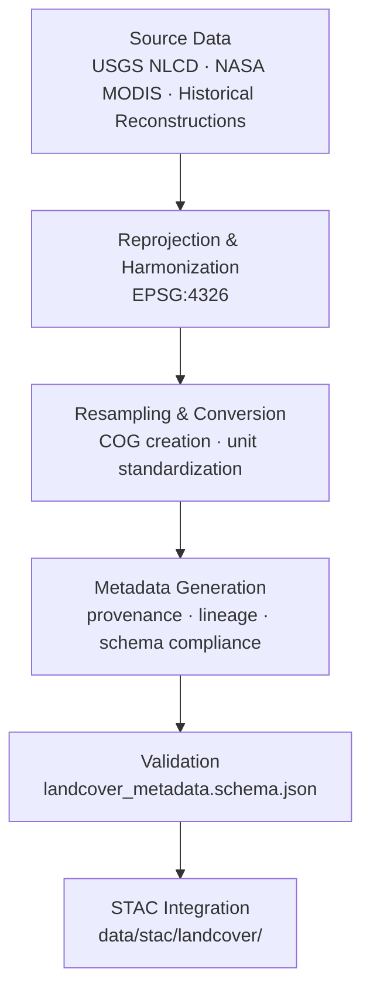

<div align="center">

# 🧾 Kansas Frontier Matrix — Landcover Metadata  
`data/tiles/landcover/metadata/`

**Mission:** Curate and validate **metadata records** for all Kansas landcover datasets — including  
**NLCD**, **MODIS vegetation indices**, and **historical land-use reconstructions** — ensuring complete  
provenance, schema validation, and STAC interoperability within the **Kansas Frontier Matrix (KFM)**  
environmental data architecture.

[](../../../../../.github/workflows/site.yml)
[](../../../../../.github/workflows/stac-validate.yml)
[](../../../../../.github/workflows/codeql.yml)
[](../../../../../.github/workflows/trivy.yml)
[](../../../../../docs/)
[](../../../../../LICENSE)

</div>

---

## 📚 Overview

This directory contains **metadata JSON files** describing all landcover datasets stored in  
`data/tiles/landcover/`. Each record follows the **MCP–STAC hybrid schema**, documenting  
dataset lineage, processing parameters, and validation results for landcover and vegetation layers.

These metadata entries connect environmental and ecological datasets to Kansas’s  
historical and modern land-use evolution, linking spatial data to temporal, climatic,  
and anthropogenic processes.

---

## 📂 Directory Layout

```bash
data/
└── tiles/
    └── landcover/
        └── metadata/
            ├── nlcd_2021_ks_30m.json
            ├── modis_vegcover_2020.json
            ├── landuse_historical_1900_ks.json
            └── README.md
````

---

## ⚙️ Metadata Workflow



**Command Example:**

```bash
make metadata-landcover
# Auto-generates metadata JSONs and validates schema compliance
```

---

## 🧩 Metadata Schema (Key Fields)

| Field             | Description                 | Example                                                              |
| ----------------- | --------------------------- | -------------------------------------------------------------------- |
| `id`              | Unique dataset identifier   | `"nlcd_2021_ks_30m"`                                                 |
| `type`            | Data type                   | `"raster"`                                                           |
| `description`     | Summary of dataset content  | `"USGS NLCD 2021 Kansas landcover classification"`                   |
| `source`          | Data origin                 | `["USGS", "NASA MODIS", "Copernicus GLC"]`                           |
| `algorithm`       | ETL process used            | `"GDAL Reprojection + COG Conversion"`                               |
| `projection`      | Coordinate reference system | `"EPSG:4326"`                                                        |
| `spatial_extent`  | Bounding box                | `[-102.05, 36.99, -94.58, 40.00]`                                    |
| `temporal_extent` | Coverage period             | `["2020-01-01","2021-12-31"]`                                        |
| `checksum`        | SHA-256 file integrity hash | `"fc8a31e145a8b62f2368d7d532c3f0bb0c5fd8c441e5edb51eae7e2893a812e2"` |
| `stac_link`       | Path to STAC item           | `"../../../../../stac/landcover/nlcd_2021_ks_30m.json"`              |
| `license`         | Usage license               | `"CC-BY 4.0"`                                                        |
| `created`         | Metadata creation date      | `"2025-10-12"`                                                       |
| `mcp_version`     | MCP compliance version      | `"1.0"`                                                              |

---

## 🧠 Integration & Knowledge Graph Context

Landcover metadata is linked within the **KFM Knowledge Graph**, enabling semantic reasoning
and temporal exploration across environmental and anthropogenic datasets.

| Graph Node         | Relationship      | Connected Entity      |
| ------------------ | ----------------- | --------------------- |
| `LandcoverDataset` | `DERIVED_FROM`    | `SatelliteProduct`    |
| `LandcoverDataset` | `INTERSECTS`      | `HydrologicUnit`      |
| `LandcoverDataset` | `ASSOCIATED_WITH` | `Event:LandUseChange` |
| `LandcoverDataset` | `LINKED_TO`       | `STAC Item`           |
| `LandcoverDataset` | `HAS_CHECKSUM`    | `SHA256 Hash`         |

**AI & ML Applications:**

* Landcover change detection and classification refinement
* Climate–landcover coupling models (vegetation response to drought/flood)
* Historical land-use reconstruction through temporal interpolation
* Semantic mapping between human settlement and ecological transitions

---

## 🧮 Version & Provenance

| Field              | Value                                                        |
| ------------------ | ------------------------------------------------------------ |
| **Version**        | `v1.0.0`                                                     |
| **Last Updated**   | 2025-10-12                                                   |
| **Maintainer**     | `@bartytime4life`                                            |
| **Schema**         | `landcover_metadata.schema.json`                             |
| **License**        | CC-BY 4.0                                                    |
| **MCP Compliance** | ✅ Documentation · ✅ Provenance · ✅ STAC Linked · ✅ Validated |

---

## 🪵 Changelog

| Date       | Version | Change                                           | Author          | PR/Issue |
| ---------- | ------- | ------------------------------------------------ | --------------- | -------- |
| 2025-10-12 | v1.0.0  | Initial creation of landcover metadata directory | @bartytime4life | #260     |

---

## ✅ Validation Checklist

* [x] Metadata validated against `landcover_metadata.schema.json`
* [x] Provenance and checksum fields populated
* [x] Linked STAC items verified under `/data/stac/landcover/`
* [x] Coordinate system consistent with EPSG:4326
* [x] README includes badges, changelog, and closed Mermaid diagram

---

## 🔗 Related Directories

| Path                                                         | Description                                  |
| ------------------------------------------------------------ | -------------------------------------------- |
| [`../`](../)                                                 | Main landcover raster dataset directory      |
| [`../checksums/`](../checksums/)                             | File integrity manifests                     |
| [`../thumbnails/`](../thumbnails/)                           | Landcover thumbnail previews                 |
| [`../../climate/`](../../climate/)                           | Climate and vegetation correlation datasets  |
| [`../../../../stac/landcover/`](../../../../stac/landcover/) | STAC catalog metadata for landcover datasets |

---

## 🧭 Example Metadata Record

```json
{
  "id": "modis_vegcover_2020",
  "type": "raster",
  "description": "MODIS-derived vegetation fractional cover for Kansas, 2020.",
  "source": ["NASA MODIS (MCD12Q1)"],
  "algorithm": "NDVI compositing and resampling to EPSG:4326 grid.",
  "projection": "EPSG:4326",
  "spatial_extent": [-102.05, 36.99, -94.58, 40.00],
  "temporal_extent": ["2020-01-01", "2020-12-31"],
  "checksum": "29b96d12f02c2a80b2de4b69f3ea09bb73da0b324e7c41cfc8f7b5aa4b97ff20",
  "stac_link": "../../../../stac/landcover/modis_vegcover_2020.json",
  "created": "2025-10-12",
  "license": "CC-BY 4.0",
  "mcp_version": "1.0"
}
```

---

<div align="center">

**Kansas Frontier Matrix — Environmental Systems Division**
🌎 *“Mapping Kansas from grassland to grid — every field documented, every era connected.”*

</div>
```

